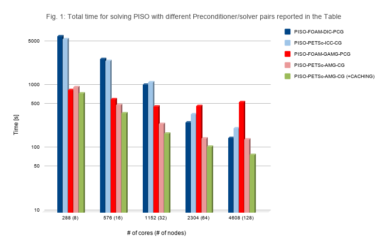

**Code repository for the High Performance Computing Technical Committee**

[[_TOC_]]

## OpenFOAM HPC Benchmark suite

The repository is intended to be a shared repository with relevant data-sets and information created in order to:

- Provide user guides and initial scripts to set-up and run different data-sets on different HPC architectures
- Provide the community an homogeneous term of reference to compare different hardware architectures, software environments, configurations, etc.
- Define a common set of metrics/KPI (Key Performance Indicators) to measure performances


## 3-D Lid Driven cavity flow

[//]: <>  (**3-D Lid Driven cavity flow**)


The first test-case chosen is the 3-D version of the [Lid-driven cavity flow tutorial](https://www.openfoam.com/documentation/tutorial-guide/tutorialse2.php).

This test-case has a simple geometry and boundary conditions, involving transient, isothermal, incompressible laminar flow in a three-dimensional box domain. The *icoFoam* solver is used in such test-case.

It is intended to stress test the linear algebra solver, most of the time being spent in the pressure equation.

***Definition of geometrical and physical properties***

In this simple geometry, all the boundaries of the box are walls. The top wall moves in the x-direction at the speed of 1 m/s while the other five are stationary.
Three different sizes have been selected:

- Small (S)
- Medium (M)
- Extra-Large (XL)
- Extra-extra Large (XXL)

The following table shows the geometrical and physical properties of the different test-cases, which have an increasing number of cells: 1 million (m) (S), 8 m (M) and 64 m (XL) of cells, obtained by halving ∆x when moving from the smaller to the bigger test-case.
The Courant number Co=(U ∆t)/∆x is kept under the stability limit, and it is halved when moving to bigger test-cases.
The time step ∆t is reduced proportionally to Co and ∆x, by 4 times. The physical time to reach steady-state in laminar flow is T= 0.5.


| Parameters / Test-case     |    **S**  | **M** | **XL** |
|----------------------------|-----------|-------|--------|
|   ∆x (m.)                  |  0.001    | 0.0005| 0.00025|
| N. of cells tot. (m)       | 1         | 8     |  64    |
| N. of cells lin. (m)       | 100       | 200   | 400    |
| kinematic viscosity ν (m^2/s)| 0.01    | 0.01  | 0.01   |
| d (m)                      | 0.1       | 0.1   | 0.1    |
| Co                         | 1         | 0.5   | 0.25   |
| ∆t (s)                     | 0.001     |0.00025|0.0000625|
| Reynolds number            | 10        | 10    | 10     |
| U (m/s)                    | 1         | 1     | 1      |
| n. of iter.                | 500       | 2000  | 8000 (100) |
| End physical Time (s.)   | 0.5       | 0.5   | 0.5 (0.00625)|

The test-case XL is used with a number of iteration equal to 100 to reduce the computational time.

***Set-up of linear algebra solvers***

The set-up for the linear algebra solvers comprises the following:

Pressure:
- FOAM-DIC-PCG: is an OpenFOAM iterative solver that combines a Diagonal-based Incomplete-Cholesky (DIC) preconditioner with a Conjugate Gradient (PCG) solver. DIC is a common preconditioner in OpenFOAM for its easy configuration and high efficiency
- FOAM-GAMG-PCG: is an OpenFOAM iterative solver that uses a Conjugate Gradient (CG) accelerated by a generalized geometric-algebraic  multigrid (GAMG) method that supports both geometrical and algebraic multigrid.
- PETSc-ICC-CG(*):  is the PETSc counterpart of the FOAM-DIC-PCG method. ICC is the Incomplete Cholesky factorization implementation of PETSc
- PETSc-AMG-CG(*):  is the PETSc counterpart of the FOAM-GAMG-PCG method.  In this solver we use an algebraic multigrid method (***BoomerAMG***), provided by the third-party library of PETSc named Hypre.
- PETSc-AMG-CG(*) + caching: as above but the matrix is converted only at the beginning and cached together with the preconditioner for all the time-steps. In this particular case of constant-coefficients matrix, the numerical solution is equivalent to the case without caching.

(*) For the PETSc solvers, the [PETSc4FOAM library][readme petscfoam]
is used for embedding PETSc and its external dependencies (i.e. Hypre) into arbitrary OpenFOAM simulations.

Velocity:
- The solver/preconditioner pair for the momentum equation is keeping fixed by using a DILU-PBiCGStab that is a combination of Diagonal Incomplete LU (asymmetric) factorization for the preconditioner with a Stabilized Preconditioned (bi-)conjugate gradient solver.

The following Table summarizes the different preconditioner/solver pairs used to solve the pressure equation

| Method        | Preconditioner                         | Solver
| ------        | ------                                 | -----
| FOAM-DIC-PCG  | Diagonal-based incomplete-Cholesky     | Conjugate Gradient
| FOAM-GAMG-PCG | Geometric-algebraic multigrid          | Conjugate Gradient
| PETSc-ICC-CG  | Incomplete-Cholesky                    | Conjugate Gradient
| PETSc-AMG-CG  | Classic algebraic multigrid (BoomerAMG)| Conjugate Gradient

The iterative method can be run using two different convergence criteria:

1. `fixedITER`: In this case the computational load is fixed, when running with the given solver.
   This case is useful for comparing different hardware configurations by keeping constant the computational load.
2. `fixedNORM`: in this case the exit norm is fixed.

The two different options are selected by choosing one of the two configurations files, where <Method> keyword is selected according to the previous Table:

1. `system/fvSolution.<Method>.fixedITER`, with a constant number of iteration per time step for the pressure solver, different according to the test-case size. The velocity solver is set to 5 iteration per time step for the different test-cases.
2. `system/fvSolution.<Method>.fixedNORM`, with a fixed exit norm value of 10^{-4} for the pressure solver.

To use one of the selected method copy/rename the chosen file in
`fvSolution` or use the symbolic link of the unix envoroment.
For example,
```
cd system
ln -s fvSolution.<Method>.fixedITER fvSolution
```



This figure shows the total time for solving PISO with different preconditioner/solver pairs reported in the Table above, for the XL test-case

## HPC motorbike


## References

[1] S. Bnà, I. Spisso, M. Olesen, G. Rossi *PETSc4FOAM: A Library to plug-in PETSc into the OpenFOAM
Framework* [PRACE White paper](https://prace-ri.eu/wp-content/uploads/WP294-PETSc4FOAM-A-Library-to-plug-in-PETSc-into-the-OpenFOAM-Framework.pdf)

----

[repo petscfoam]: https://develop.openfoam.com/modules/external-solver/
[readme petscfoam]: https://develop.openfoam.com/modules/external-solver/-/blob/develop/README.md
