# OpenFOAM HPC Benchmark Suite

The repository is intended to be a shared repository with relevant data-sets and information created in order to:
- Provide user guides and initial scripts to set-up and run different data-sets on different HPC architectures.
- Provide the community a homogeneous term of reference to compare different hardware architectures, software environments, configurations, etc.
- Define a common set of metrics/KPI (Key Performance Indicators) to measure performances.

Structure of the Suite / Adding New Benchmarks

## Structure of the Suite
- The file structure of the repository is aligned to the file structure of OpenFOAM tutorials (specifying type of the flow, particular solver, turbulence model etc.).
- The table structure within this overview is mainly organised according to the outline defined within the exaFOAM project (see the corresponding description).

## Adding New Benchmarks
- Within this README, new benchmarks may be put in any of the provided (or newly defined) categories suitable for the case.
- Within the file structure, new benchmarks should be located according to the OpenFOAM tutorials pattern.
- Each benchmark case should provide a README.md file with a description and a thumbnail image to be included within this overview.
  These files should be located in the root directory of the case.
- The thumbnail image has to be 50 pixels high, the width is not constrained.
- The case should provide an Allrun script for execution of the complete run (with meshing, mapping etc.) and an Allclean script for cleaning of the case in order to bring it to the original state.
- If the case uses a custom solver or a functionality (e.g. boundary condition) that is not available within any of public OpenFOAM releases, all the custom source code should be provided in a 'src' subdirectory within the case folder.
  An additional README.md in the 'src' subdirectory should specify clear compilation instructions and indicate which OpenFOAM version the source code is compatible with.

exaFOAM Project

## exaFOAM Project
Many of the benchmark cases were contributed by the EU-funded [exaFOAM project](https://exafoam.eu). For background information, an overview of the project is given.

## Motivation
Computational Fluid Dynamics performance on HPC is notably worse than idealised algorithms, due to inherent bandwidth needs, three-dimensional and time-accurate handling with non-sparse matrix dependencies, spatial domain decomposition requirements, I/O challenges.
Independent software vendors (ISVs) have rightly concentrated their efforts on different customer demands such as complex physics modelling (turbulence, multi-phase, combustion/reactions, particulates, heat transfer).
However, we see increasingly now that there is a commercial need to improve performance of industrial software and codes.
There is an increasingly stated need to redress the balance between performance and functionality, perhaps even to re-learn the lessons of parallelism and vectorisation explored during the 1980s, due to the approaching of the hybrid pre-exascale era in HPC.

The ambitious exaFOAM project (2021-2024) aimed to overcome these limitations through the development and validation of a range of algorithmic improvements.
Improvements across the entire CFD process chain (pre-processing, simulation, I/O, post- processing) were developed.

## Benchmarks
The developments of the exaFOAM project are showcased by
- *Grand Challenges* (GC) that are designed to push available HPC systems to their limits and showcase the performance gains achieved over the duration of the project,
- *Industrial Applications* (B) that are primarily driven by the expectations of the project's industrial observer partners,
- *Microbenchmarks* (MB) that are derived from the Grand Challenges and Industrial and can be used for the continuous assessment of the software components during development.

The cases related to each other are identified via a separate column in the tables below.
For some of the benchmarks, grid and restart files are available in the DaRUS data repository of the University of Stuttgart.

Key Performance Indicators

## Key Performance Indicators
### Quantitative KPIs
For measuring the success of the various enhancements, the following quantitative KPIs were defined as improvement factors such that improvements always correspond to numbers greater than one.
Consequently, a KPI smaller than one indicates a degradation relatively to the state before the enhancement.
The name of a KPI consists of abbreviated name of the metric (e.g. TTS standing for Time-To-Solution) and an 'F' standing for 'Factor'.
This allows to distinguish between dimensioned metrics and non-dimensioned KPIs.
An example: TTS of a case are 20s and 10s before and after the improvement, respectively.
The corresponding KPI indication is TTSF = 2 meaning that the case runs two times faster after the improvement than before.

| KPI  | Metric                  | Description of KPI                                         |
| :--- | ----------------------- | ---------------------------------------------------------- |
| TTSF | Time-To-Solution        | Ratio of clock time before and after the improvement       |
| CTSF | Cost-To-Solution        | Ratio of costs before and after the improvement            |
| ETSF | Energy-To-Solution      | Ratio of energy consumed before and after the improvement  |
| PMCF | Peak Memory Consumption | Ratio of peak memory used before and after the improvement |
| SDUF | Scratch Disk-space Used | Ratio of disk space usage before and after the improvement |

### Qualitative KPIs
Some results cannot be quantified with respect to the state before because they were not possible before and are thus termed as quantitative KPIs.

| Name | Description                                                                                                                  |
| :--- | ---------------------------------------------------------------------------------------------------------------------------- |
| ET   | Enabling Technology: something that was impossible                                                                           |
| EA   | Extending Applicability: something that worked but was not usable for e.g. larger cases, HPC or depending on specific setups |

# Grand Challenges

[comment]: # (The no-break-space &nbsp is used in tables to fix the width of the column for images. Otherwise the image size depends on the amount of text in other columns and the full resolution of the thumbnail may be unsused.)

| &nbsp;&nbsp;&nbsp;&nbsp;&nbsp;&nbsp;&nbsp;&nbsp;&nbsp;&nbsp;&nbsp;&nbsp;&nbsp;&nbsp;&nbsp;&nbsp;&nbsp;&nbsp;&nbsp;&nbsp; | Case Study                            | Related Cases | Description                                                     | Links                                                                                |
| :----------------------------------------------------------------------------------------------------------------------: | ------------------------------------- | ------------- | --------------------------------------------------------------- | ------------------------------------------------------------------------------------ |
|             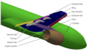              | GC1 – High-lift Common Research Model | MB9           | rhoPimpleFoam – 3D compressible flow, WMLES turbulence modeling | [Case](compressible/rhoPimpleFoam/LES/highLiftCommonResearchModelONERA_LRM-LDG-HV)   |
|                                                                             | GC2 – DLR-CJH Combustor               | MB11          | XiFoam – turbulent combustion, LES turbulence modeling          | [Case](combustion/XiFoam/DLRCJH) [RestartFiles](https://doi.org/10.18419/darus-3699) |

# Industrial Applications
| &nbsp;&nbsp;&nbsp;&nbsp;&nbsp;&nbsp;&nbsp;&nbsp;&nbsp;&nbsp;&nbsp;&nbsp;&nbsp;&nbsp;&nbsp;&nbsp;&nbsp;&nbsp;&nbsp;&nbsp; | Case Study                            | Related Cases | Description                                                                                                                                                              | Links                                                                                                                  |
| :----------------------------------------------------------------------------------------------------------------------: | ------------------------------------- | ------------- | ------------------------------------------------------------------------------------------------------------------------------------------------------------------------ | ---------------------------------------------------------------------------------------------------------------------- |
|                                 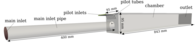                                  | B1 – FLOX® Gas Turbine (DLR-CJH)      | MB3 MB4       | reactingFoam – turbulent combustion with detailed chemistry and LES turbulence modeling                                                                                  | [Case](combustion/reactingFoam/LES/DLRCJH)                                                                             |
|                            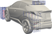                            | B2 – TME Car                          | MB6           | adjointOptimisationFoam – unsteady adjoint optimization, external flow, DDES turbulence modeling                                                                         | [Case](incompressible/adjointOptimisationFoam/TMECar) [RestartFiles](https://doi.org/10.18419/darus-3714)              |
|                     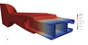                      | B4 – Complex Profile Extrusion        | MB7 MB19      | viscoelasticFluidFoam (customized) – 3D laminar, viscoelastic flow                                                                                                       | [Case](viscoelastic/viscoelasticFluidFoam/complexProfileExtrusion) [RestartFiles](https://doi.org/10.18419/darus-3797) |
|                                                      | B5 – DrivAer-rot                      | MB8           | pimpleFoam – incompressible, external flow with rotating wheels using ACMI, DDES turbulence modeling                                                                     | [Case](incompressible/pimpleFoam/LES/occDrivAerRotMesh)                                                                |
|                           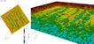                            | B6 – Offshore Wind Park               | MB12          | pimpleFoam – incompressible flow, wind turbines using actuator line model, LES turbulence modeling with synthetic turbulence inlet condition turbulentDigitalFilterInlet | [Case](incompressible/pimpleFoam/LES/offshorewindpark) [RestartFiles](https://doi.org/10.18419/darus-3975)             |
|                         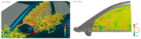                          | B7 – Aeroacoustics DrivAer derivative | MB16 MB17     | rhoPimpleFoam – compressible external flow, acoustic impact on the driver’s side-class, SA-IDDES                                                                         | [Case](compressible/rhoPimpleFoam/LES/aeroacousticDrivAer) [RestartFiles](https://doi.org/10.18419/darus-3736)         |
|                              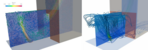                              | B8 – Modified “Steckler” fire         | MB18          | fireFoam – turbulent combustion with RANS or LES turbulence modeling                                                                                                     | [Case](combustion/fireFoam/RAS/stecklerWithSpray)                                                                      |
|                          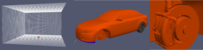                          | B9 – DrivAer ExtAero Derivative       |               | pimpleFoam – incompressible external flow, MRF for wheel rotation, SA-DDES                                                                                               | [Case](incompressible/pimpleFoam/LES/aerodynamicsDrivAer) [RestartFiles](https://doi.org/10.18419/darus-3737)          |

# Microbenchmarks
| &nbsp;&nbsp;&nbsp;&nbsp;&nbsp;&nbsp;&nbsp;&nbsp;&nbsp;&nbsp;&nbsp;&nbsp;&nbsp;&nbsp;&nbsp;&nbsp;&nbsp;&nbsp;&nbsp;&nbsp; | Case Study                                 | Related Cases | Description                                                                                          | Links                                                                                                                        |
| :----------------------------------------------------------------------------------------------------------------------: | ------------------------------------------ | ------------- | ---------------------------------------------------------------------------------------------------- | ---------------------------------------------------------------------------------------------------------------------------- |
|                                   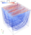                                   | MB1 – Cavity 3D                            |               | icoFoam – incompressible laminar flow                                                                | [Case](incompressible/icoFoam/cavity3D)                                                                                      |
|                                                           none                                                           | MB2 – Compressible starting square jet     |               | rhoPimpleFoam – compressible flow, LES turbulence modeling                                           | [Case](compressible/rhoPimpleFoam/LES/forcedPlume)                                                                           |
|                          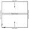                           | MB3 – Laminar Diffusion Counter-Flow Flame | B1            | reactingFoam – laminar combustion with detailed chemistry                                            | [Case](combustion/reactingFoam/laminar/counterFlowFlame)                                                                     |
|                                 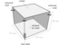                                  | MB4 – DLR-JHC burner                       | B1            | reactingFoam – turbulent combustion with detailed chemistry and LES turbulence modeling              | [Case](combustion/reactingFoam/LES/DLRJHC)                                                                                   |
|                              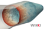                              | MB5 – ERCOFTAC Conical diffuser            |               | simpleFoam – incompressible flow, RANS turbulence modeling                                           | [Case](incompressible/simpleFoam/conicalDiffuser)                                                                            |
|                                            | MB6 – Two cylinders in line                | B2            | adjointOptimisationFoam – unsteady adjoint optimization, 2D laminar flow                             | [Case](incompressible/adjointOptimisationFoam/twoCylindersInLine)                                                            |
|                                                   | MB7 – Viscoelastic Lid-driven Cavity       | B4            | viscoelasticFluidFoam – 2D laminar, viscoelastic flow                                                | [Case](viscoelastic/viscoelasticFluidFoam/lidDrivenCavity) [RestartFiles](https://doi.org/10.18419/darus-3798)               |
|                                                           | MB8 – Rotating Wheel                       | B5            | pimpleFoam – incompressible, external flow with rotating wheels using ACMI, DDES turbulence modeling | [Case](incompressible/pimpleFoam/LES/wheelRotMesh)                                                                           |
|                        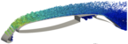                         | MB9 – High-lift airfoil                    | GC1           | rhoPimpleFoam – 2D compressible flow, DDES turbulence modeling                                       | [Case](compressible/rhoPimpleFoam/LES/highLiftConfiguration)                                                                 |
|                                                        | MB10 – ERCOFTAC Conical diffuser LES       |               | pimpleFoam – incompressible flow, LES turbulence modeling                                            | [Case](incompressible/pimpleFoam/LES/conicalDiffuser) [RestartFiles](https://doi.org/10.18419/darus-3745)                    |
|                                                                        | MB11 – Pitz&Daily Combustor                | GC2           | XiFoam – turbulent combustion, LES turbulence modeling                                               | [Case](combustion/XiFoam/pitzDaily3D) [RestartFiles](https://doi.org/10.18419/darus-3744)                                    |
|                             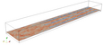                             | MB12 – Model Wind Farm                     | B6            | pimpleFoam – incompressible flow, wind turbines using actuator disk model, LES turbulence modeling   | [Case](incompressible/pimpleFoam/LES/modelwindfarm)                                                                          |
|                                                       | MB13 – Marine Propeller                    |               | rhoPimpleFoam – compressible flow, LES turbulence modelling                                          | [Case](compressible/rhoPimpleFoam/LES/marinePropeller)                                                                       |
|                    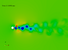                     | MB14 – Hydroacoustic Shedding Cylinder     |               | rhoPimpleFoam – 2D compressible flow, LES turbulence modelling                                       | [Case](compressible/rhoPimpleFoam/LES/hydroacousticSheddingCylinder)                                                         |
|                      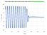                      | MB15 – 1D Hydroacoustic Wave Train         |               | rhoPimpleFoam – 1D compressible laminar flow                                                         | [Case](compressible/rhoPimpleFoam/laminar/hydroacousticWaveTrain)                                                            |
|                  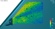                   | MB16 – Simplified HMC Aeroacoustic Vehicle | B7            | rhoPimpleFoam – compressible flow, LES turbulence modelling                                          | [Case](compressible/rhoPimpleFoam/LES/simplifiedHMCAeroacousticVechicle) [RestartFiles](https://doi.org/10.18419/darus-3735) |
|                      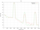                       | MB17 – 1D Aeroacoustic Wave Train          | B7            | rhoPimpleFoam – 1D compressible laminar flow                                                         | [Case](compressible/rhoPimpleFoam/laminar/aeroacousticWaveTrain)                                                             |
|                              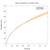                               | MB18 – Gas / Spray Penetration             | B8            | sprayFoam – compressible multiphase flow with Lagrangian spray                                       | [Case](lagrangian/sprayFoam/gasSprayPenetration)                                                                             |
|                         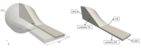                         | MB19 – Profile Extrusion                   | B4            | viscoelasticFluidFoam (customized) – 3D laminar, viscoelastic flow                                   | [Case](viscoelastic/viscoelasticFluidFoam/profileExtrusion) [RestartFiles](https://doi.org/10.18419/darus-3799)              |

# Other Benchmarks
| &nbsp;&nbsp;&nbsp;&nbsp;&nbsp;&nbsp;&nbsp;&nbsp;&nbsp;&nbsp;&nbsp;&nbsp;&nbsp;&nbsp;&nbsp;&nbsp;&nbsp;&nbsp;&nbsp;&nbsp; | Case Study                    | Description                                                | Links                                                   |
| :----------------------------------------------------------------------------------------------------------------------: | ----------------------------- | ---------------------------------------------------------- | ------------------------------------------------------- |
|                           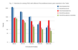                           | Cavity 3D (PRACE White paper) | icoFoam – incompressible laminar flow                      | [Case](incompressible/icoFoam/old/Lid_driven_cavity-3d) |
|                                                              | Motorbike                     | simpleFoam – incompressible flow, RANS turbulence modeling | [Case](incompressible/simpleFoam/HPC_motorbike)         |

