# DLR Confined Jet High Pressure Combustor
## Authors
Sergey Lesnik and Henrik Rusche, Wikki GmbH, Germany

## Copyright
Copyright (c) 2022-2024 Wikki GmbH

<a rel="license" href="http://creativecommons.org/licenses/by-sa/4.0/"></a><br />

Except where otherwise noted, this work is licensed under a <a rel="license" href="http://creativecommons.org/licenses/by-sa/4.0/">Creative Commons Attribution-ShareAlike 4.0 International License</a>.

## Introduction
The considered combustor stems from an experimental setup constructed by Severin[^SeverinPhD] at the Institute of Combustion Technology of the German Aerospace Center (abbreviated as DLR in German). The burner is based on the Recirculation-Stabilized Jet Flame (RSJF) concept, which is better known as FLOX. Initially developed for the industrial furnaces, this technology has a great potential in the application to the gas turbines. Compared to widespread swirl burners, RSJF combustors feature low NOx emissions, homogeneous temperature distribution, and operate with a wide range of fuels and loads. The main goal of the experimental work was to clarify how the recirculation contributes to the flow stabilization. Apart from the experiments, a number of numerical investigations with the same geometry was performed, e.g. by Ax et. al.[^Ax2020] and Gruhlke et. al.[^Gruhlke2020][^Gruhlke2021]. The investigations presented here were partially published by Galeazzo[^Galeazzo2024].

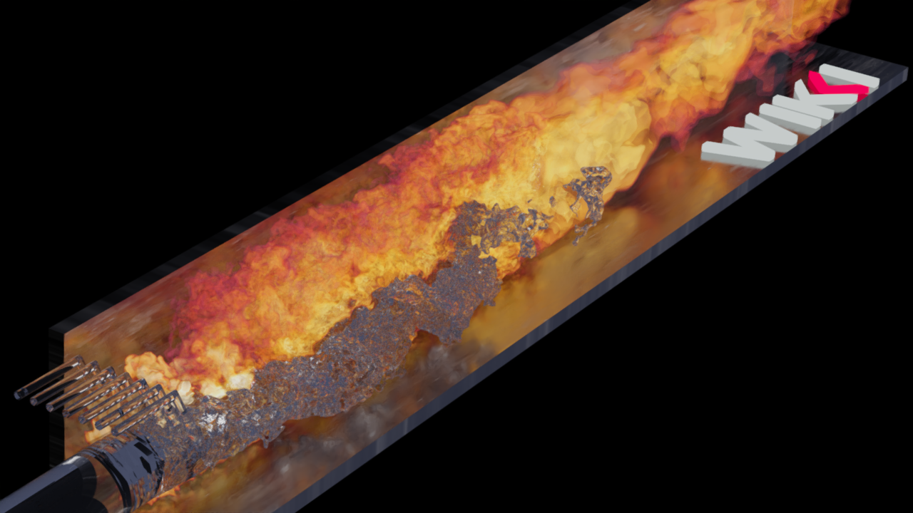

Figure: Rendering of the DLRCJH combustor flame with fuel.

## Experimental Setup
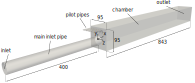

Figure: Geometry of the combustor DLRCJH. The dimensions are in mm.

A typical RSJF combustor consists of several nozzles arranged in a ring around a central pilot swirl-burner. The test rig considered here represents a segment of such an RSJF combustor with a single nozzle[^SeverinPhD]. It consists of a rectangular chamber with the dimensions of 95 x 95 x 843 mm³, a cylindrical inlet with 40 mm diameter, a fuel injector placed 400 mm upstream of the chamber and an outlet at the end of the chamber. The main inlet pipe axis is offset to the chamber center line by 10 mm in order to allow for the recirculation zone to develop. The effect of the swirl-burner is simulated by seven pilot burners inclined to the main inlet axis and placed above the main inlet pipe. In this way, the impact of the swirl flow on the jet can be reproduced, whereby the tangential component is ignored. A premixed mixture of air and natural gas is injected through the main and the pilot nozzles, whereby the overall mass flow of the pilots corresponds to 10 % of the main nozzle.

## Measurements
Severin[^SeverinPhD] applied following measurement techniques: OH*-chemiluminescence (identification of the flame position), Particle Image Velocimetry (PIV, flow speed determination), Laser Induced Fluorescence of the OH radical (LIF, temperature determination). The temperature and velocity fields from the middle slice (x-y plane) of the chamber were evaluated and are used here for validation.

## Flow parameters
- Reynolds number: 497 000
- Average velocity at the main inlet: $U_i$ = 113 m/s
- Chamber pressure: 8 bar
- Air-fuel ratio: 1.7
- Inlet temperature of the mixture: $T_i$ = 725 K
- Adiabatic flame temperature: 1950 K


# Numerical Setup
## Geometry
The geometry parameters shown in the table below are taken from Severin[^SeverinPhD].

| Dimension            | Description                                                     |
| -------------------- | --------------------------------------------------------------- |
| $d_i$ = 40 mm        | Inlet nozzle diameter                                           |
| $y_i$ = -10 mm       | Vertical offset of the nozzle mounting point                    |
| $a$ = 95 mm          | Lateral, top and bottom wall width of the chamber               |
| $l$ = 843 mm         | Chamber length                                                  |
| $x_{inj}$ = -400 mm  | Location of the fuel injection                                  |
| $d_o$ = 58.8 mm      | Outlet nozzle diameter                                          |
| $d_p$ = 4.7 mm       | Pilot nozzle diameter                                           |
| $\alpha$ = 60°       | Inclination angle of the pilot nozzles to the inlet nozzle axis |
| $\Delta z_p$ = 10 mm | Distance between the neighboring pilot nozzles                  |
| $y_p$ = 25 mm        | Vertical offset of the pilot nozzles mounts                     |

Several dimensions regarding the inlet and outlet pipes could not be found in the literature and approximations based on the available description and figures are introduced. The original outlet is not reproduced. The outlet in the numerical setup is represented by the complete cross-section of the chamber. Primarily, this is done to avoid the wave reflection (mostly originating from the flow initialization or mapping from a mesh of lower resolution) at the walls. The boundary condition for pressure at the outlet is non-reflective. The length of the main inlet pipe is chosen to be 10 times the diameter in order for the flow to develop until the entry into the chamber. The final dimensions are given in x-y and y-z cross-sections below in addition to figure from section [Experimental Setup](#experimental-setup).

| Plane y-z                                   | Plane x-y                                                 |
| ------------------------------------------- | --------------------------------------------------------- |
| 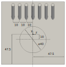 | 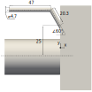 |

Figure: Geometry of the DLRCJH combustor for the numerical setup. The dimensions are in mm.

## Initialization
The flow is initialized either by means of *setFields* or *mapFieldsPar* tool. The former is used when no field data from a run of lower resolution is available. In this case, the velocity, temperature and regress variable fields of the complete inlet duct and an additional cylindrical volume formed by extrapolating the duct into the chamber are set to the conditions of the main inlet, see section [Boundary Conditions](boundary-conditions). Similar conditions are applied to the pilots. The rest of the domain is initialized to zero velocity, burnt state and the temperature is set to 1900 K to allow the reactants to ignite. In this way, no artificial ignition applied to the energy equation (*ignitionSites*) is needed.

Utility *mapFieldsPar* is used for propagation of the developed flow from the cases with lower mesh resolution to higher one lowering the cost-to-solution.

## Models
- Solver: **XiFoam** is used as the top-level solver. It handles an unsteady compressible flow, incorporates combustion relevant models and is controlled by a PIMPLE loop allowing CFL number to be higher than 1.
- Turbulence: LES kinetic energy equation model (*kEqn*) with van Driest damping function for the treatment of the near-wall regions.
- Combustion: the fuel mixture is inhomogeneous since the main and pilot nozzles are operated with the different air-to-fuel ratios. The laminar flame speed Su is assumed to be unstrained and a transport equation is solved for the flame wrinkling Xi.

## Numerics
LES modeling relies on high accuracy of the discretization and thus higher order schemes are utilized. These are *linear*, *limitedLinear*, *limitedLinear01* etc. For the velocity convection *filteredLinear* is used. For the temporal discretization a blending between Euler and Crank-Nicolson with a ratio 30:70 (*crankNicolson 0.7*) is utilized.  In the case of non-initialized fields, the calculation needs further stabilization and thus the Euler scheme should be used at the beginning and then transitioned by a linear ramp during a certain time period to the final blending value of 0.7. Pure second order time schemes such as *crankNicolson 1* and *backward* proved to be unstable in the present case.

Linear solvers utilized are based on the conjugate gradients method. The PIMPLE loop has 2 outer and 1 inner corrections with 0 non-orthogonal corrections. Utility *renumberMesh* is used to reduce the bandwidth of the resulting matrix and accelerate the linear solver execution.

## Surface Mesh
Surface mesh is created from scratch using CAD software FreeCAD 0.20[^freecad]. The resulting mesh is water proof meaning that vertices of different regions coincide at the region boundaries.

## Mesh
The meshing has been accomplished with tool snappyHexMesh (sHM), which allows semi-automatic meshing of complex geometries with refinement zones. Four surface meshes are provided:
- an .obj file with the complete geometry with regions corresponding to the boundaries - used by sHM to define regions;
- an .stl file with the complete geometry without regions - used by surfaceFeatureExtract to extract features and provide them to sHM for snapping;
- two additional .stl files with the surface meshes of the inlet pipe and pilots - used by sHM for distance based regions refinements.
This configuration is due to limited capabilities of FreeCAD export and sHM import. The number of files may be reduced further by manual editing.

During the definition of the mesh topology, the focus has lied on ensuring a high resolution in the upstream half of the chamber, where the main jet mixes with those from the pilots and a recirculation occurs. Furthermore, a high mesh resolution has been prescribed in the shear and boundary layers of the inlet and pilot pipes. A particular attention has been paid to ensure that none of the mesh parts results in a locally high Courant number which would limit the time step. For instance, the Courant number in the chamber is targeted to be under 0.25, whereas in a pilot pipe it is allowed to be as high as 1.5 due to the fact the the pilot flow is of minor interest with the respect to the final results and the validation. Four meshes with resolutions of 3, 24, 189, 489 million cells have been produced successively. For each resolution, the quality of the mesh has been assessed and a calculation with XiFoam has been performed. The results have been validated by comparing time-averaged velocity and temperature fields between the calculation and the experiment.

## Boundary Conditions
| Quantity | Description                    | Units     |
| -------- | ------------------------------ | --------- |
| alphat   | Turbulence thermal diffusivity | kg/(m s)  |
| b        | Regress variable               | -         |
| k        | Turbulence kinetic energy      | m²/s²     |
| ft       | Fuel fraction                  | -         |
| nut      | Turbulence viscosity           | m²/s      |
| p        | Pressure                       | kg/(m s²) |
| Su       | Laminar flame speed            | m/s       |
| T        | Temperature                    | K         |
| Tu       | Unburnt Temperature            | K         |
| U        | Velocity                       | m/s       |
| Xi       | Flame-wrinkling St/Su          | -         |

The set of variables from the table above need to be defined at the boundaries in order to start the case. The values for the corresponding boundary conditions (BC) are taken from Severin's piloted case CJH2[^SeverinPhD]. Gruhlke et. al.[^Gruhlke2020] estimated the wall temperatures for a numerical setup.

| Quantity | Main inlet  | Pilot inlet | Walls                             | Outlet     |
| -------- | ----------- | ----------- | --------------------------------- | ---------- |
| alphat   | zG          | zG          | wF                                | c          |
| b        | fV 1        | fV 1        | zG                                | iO 0       |
| ft       | fV 0.03344  | fV 0.06084  | zG                                | iO 0.03344 |
| k        | fV 1e-5     | fV 1e-5     | wF                                | iO 1e-5    |
| nut      | c           | c           | zG                                | c          |
| p        | zG          | zG          | zG                                | wT 8e5 5   |
| Su       | c           | c           | zG                                | c          |
| T        | fV 725      | fV 633      | CF: fV 600; CL: fV 800; other: zG | iO 1000    |
| Tu       | fV 725      | fV 633      | CF: fV 600; CL: fV 800; other: zG | iO 1000    |
| U        | fRIV 0.5563 | fRIV 0.0558 | fV (0 0 0)                        | iO (0 0 0) |
| Xi       | fV 1        | fV 1        | zG                                | iO 20      |

The abbreviations used above are:

| Abbreviation         | Meaning                   |
| -------------------- | ------------------------- |
| c                    | calculated BC             |
| CF                   | Chamber Front (baseplate) |
| CL                   | Chamber Lateral walls     |
| fRIV *massFlowRate*  | flowRateInletVelocity BC  |
| fV *value*           | fixedValue BC             |
| iO *inletValue*      | inletOutlet BC            |
| wF                   | wallFunction BC           |
| wT *fieldInf* *lInf* | waveTransmissive BC       |
| zG                   | zeroGradient BC           |

Due to high turbulence in the chamber, the flow at the outlet may reverse. Therefore, "inletOutlet" BC is chosen for the affected quantities. The corresponding inlet values, which are applied in the case of a flow reversal, are chosen to be close to the actual state of the flow at the outlet apart from the velocity, which is set to zero.


# Validation
A validation was performed with the results from Severin[^SeverinPhD] using the case with 24 million cells. Temperature and velocity profiles were averaged for 0.05 s of physical time and are provided below. Both, side and top view slices, contain the center axis of the main inlet pipe. The velocity distribution and the position of the recirculation zone from the calculation are in good agreement with the experiment. Temperature in the range above 1700 K is depicted correctly by the calculation. The region with temperature below 1400 K in the center of the chamber is larger than the one from the experiment. This is probably caused by the insufficient turbulence intensity in the computation.

## Velocity
|                                      | Side View                                                                             | Top View                                                                              |
| ------------------------------------ | ------------------------------------------------------------------------------------- | ------------------------------------------------------------------------------------- |
| Computation                          | 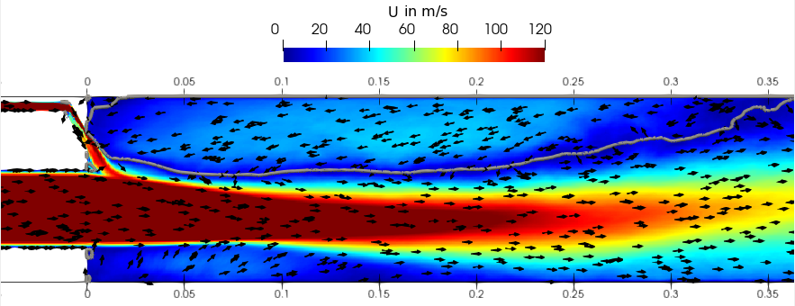 | 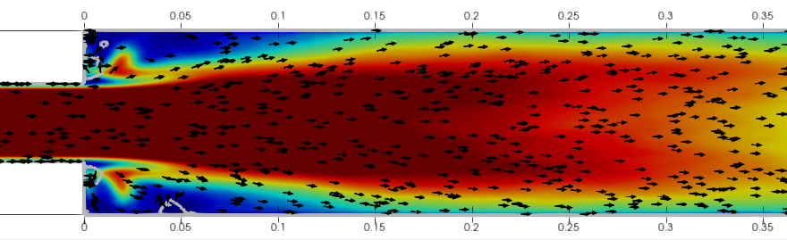 |
| Experiment from Severin[^SeverinPhD] | 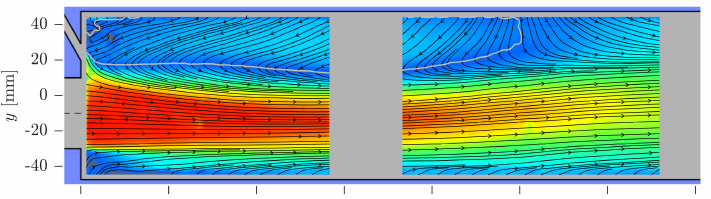 | 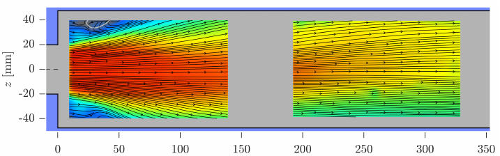 |

## Temperature
|                                      | Side View                                                                             | Top View                                                                              |
| ------------------------------------ | ------------------------------------------------------------------------------------- | ------------------------------------------------------------------------------------- |
| Computation                          | 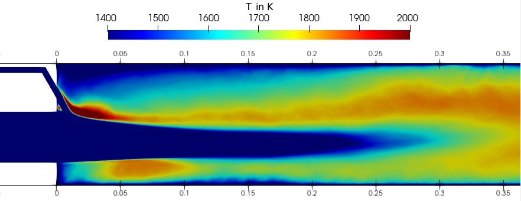 | 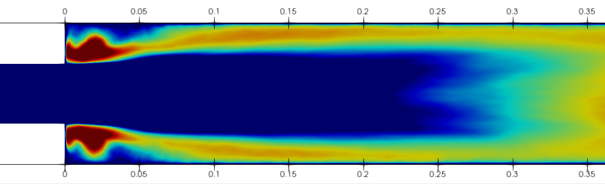 |
| Experiment from Severin[^SeverinPhD] | 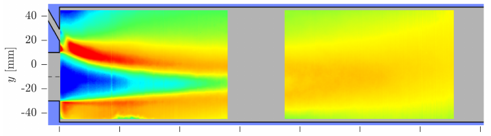 | 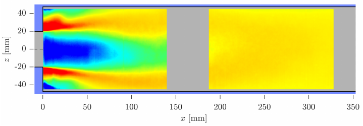 |

## 489M Case Impressions
|             |                                                                                       |
| ----------- | ------------------------------------------------------------------------------------- |
| Pressure    |  |
| Velocity    | 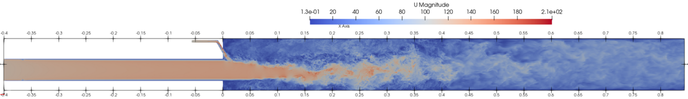 |
| Temperature | 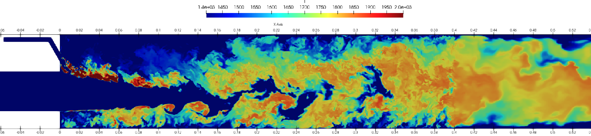 |

Figures: pressure, velocity and temperature slices from the case with 489 million cells.


# Grand Challenge
- Known to run with OpenFOAM-v2106, -v2112, -v2306 compiled with double precision (WM_PRECISION_OPTION=DP).
- Three cases are provided: 3M, 24M and 489M, where the number describes the cell count in millions (an additional setup with 189 million cells may be shipped upon request).
- Two setups for each mesh size are provided
	- *fixedTol*: the tolerances of the linear solvers are fixed. This is a usual setup for a production run. The execution time fluctuations between the time steps are large and are not only dependent on the mesh size but also on the decomposition (e.g. number of processors). In the context of the benchmarking, it is used to provide mean iteration numbers for the *fixedIter* setup.
	- *fixedIter*: the iteration numbers of the linear solvers are fixed. The execution time fluctuations between the time steps are due to hardware load (e.g. MPI communication). This setup is meant to be used for benchmarking.
- Utility *renumberMesh* is utilized to reduce the bandwidth of the resulting matrix and speed up the sparse matrix-vector multiplication.
- Decomposition is performed with the *multiLevel* method and the *scotch* decomposer.

## Recommendations
- The larger meshes (189M, 489M) require single thread utilities such as *decomposePar*, *reconstructPar* to be compiled with the 64-bit integer (WM_LABEL_SIZE=64).
- Experience with *decomposePar* for the 489M case and only required fields with *multiLevel scotch* method:
	- decomposing both mesh and fields: min. 4 h wall time (strongly depends on the number of partitions); 450 GB RAM
    - decomposing fields only: min. 3 h wall time; 200 GB RAM

### File Formats
- Use the *coherent* file format if available that solves many issues connected to the IO (see [Coherent File Format](#coherent-file-format))
- Otherwise use *collated* file format to reduce the number of files for runs with a large number of MPI ranks.
  - When using collated format, try to switch on threading in order to enable writing in a separate thread, e.g.
  ```
  decomposePar -opt-switch maxThreadFileBufferSize=2000000000 \
      -opt-switch maxMasterFileBufferSize=2000000000 -fileHandler collated
  ```
  - Collated format produces a single `processorsXX` folder by default, which is then read by a single IO rank. This may be problematic for read performance when running benchmarks with a large number of ranks. Use `ioRanks` option in order to increase number of folders (reading ranks), e.g. by using bash command substitution and brace expansion to enable 32 IO ranks (evenly spaced apart) for a decomposition with 32768 partitions:
  ```
  decomposePar -opt-switch maxThreadFileBufferSize=2000000000 \
      -opt-switch maxMasterFileBufferSize=2000000000 -fileHandler collated \
      -ioRanks "( $(echo {0..32767..1024}) )"
  ```
  - A decomposition of the largest case (489M) onto high number of partitions (> 10,000) may take a lot of time (> 48h). Thus, it is expedient first to decompose only the fields required for a restart (see list of quantities from section [Boundary Conditions](#boundary-conditions)).

  - Utility *mapFieldsPar* failed to map from 189M to 489M while using collated fileHandler in several attempts. Problems were also observed when mapping on several nodes. Thus, it is recommended
	- to use the utility on the decomposed case with the uncollated fileHandler
	- to map on a single node
	- to fulfill the memory requirement of total 1.5 TB RAM for the 489M case

## Instructions
Most of the setups contain symbolic links in order to reduce file duplication. Thus, preferably copy cases by using "rsync -L" or "cp -R -L".

### Surface Mesh Generation
A FreeCAD script is given in order to reproduce the geometry construction and surface mesh export. Unfortunately, the python interface does not provide the complete functionality of the GUI. Therefore, additional manual steps are needed to obtain the surface meshes. The complete steps are:
- Run the macro as an argument to the FreeCAD executable, e.g.:
  `freecad DLRCJH_onlyGeom.FCMacro`
  The FreeCAD GUI should open displaying the combustor geometry.
- Export DLRCJH mesh as an .obj file in the "Mesh Design" workbench (NOT File->Export).
- Export DLRCJH mesh as an ASCII .stl file in "Mesh Design" workbench (NOT File->Export). Needed for edge mesh extraction.
- Load the .obj file and view which "patch*" correspond to which boundary.
- Rename the patches in the .obj file with the correct boundary names in a text editor.
- Export meshes of the pipe and pilot walls separately as ASCII .stl via "Mesh Design". Needed for region refinement.

### Mesh and Restart Files
In order to enable restarts, meshes and corresponding developed fields are provided on the DaRUS data repository under:
https://doi.org/10.18419/darus-3699

All the data is written in ASCII format with a precision of 10. Binary format is not used in order to avoid problems with different endianness on HPC systems.

If a new mesh is desired, the meshing setups including surface meshes are provided.
- Choose a case with the cell number closest to the targeted one and alter it (blockMeshDict, snappyHexMeshDict).
- Follow the procedure documented in the Allrun script.

### Preparation
- *fixedIter* is meant to be used for profiling. The mesh and the restart fields need to be downloaded, extracted and placed into the "constant" and "0" folders. Iteration numbers are set according to *fixedTol* runs with the following properties:
	- 3M, run on 64 cores, 2 nodes;
	- 24M, run on 512 cores, 4 nodes;
	- 489M, run on 4096 cores, 32 nodes.
- *fixedTol* setup is needed to determine iteration numbers for the *fixedIter* setup, if the number of cores or mesh size significantly differs from the provided above.
	- Restart files may be used if only the decomposition is changed (significantly).
	- If a new mesh is generated, the case should be mapped using the restart fields and it needs to be run for at least 0.05 s of physical time in order to obtain characteristic iteration numbers.
	- Included script "calcIterTimeStats.py" analyzes the solver log file and provides a recommendation for the *fixedIter* setup.

### Case run
- In *system/decomposeParDict* alter "numberOfSubdomains" and "multiLevelCoeffs" according to your setup.
- Run *Allpre* bash script or setup an HPC job.
- Run *Allrun* or setup an HPC job using the procedure from the script.
- Consider to use function object *FOwallClockTimeStatistics* to check the statistics of the run printed at the end. Note that the coded function object may cause problems at start-up (see [Known Issues](#known-issues)).


# Known Issues
- During the meshing a bug has been encountered. The meshing process for higher number of cells is stuck at the same stage and does not advance further. The presence of the issue depends on the compilation options. In fact, the problem is correlated to FMA instructions (Fused Multiply-Accumulate). See the corresponding [bug report](https://develop.openfoam.com/Development/openfoam/-/issues/2537) and [proposed patch](https://develop.openfoam.com/Development/openfoam/-/commit/cf818a653b9c4b5c4d7a2c17872c662eee5db566).
- Utility *mapFieldsPar* failed to map from 189M to 489M while using collated fileHandler (see [Recommendations](#recommendations)).
- Provided coded function object *FOwallClockTimeStatistics* needs a compilation to be executed on the first run. Sometimes on large cases with many nodes (responsible for IO), this leads to an error "No such file or directory". This can be fixed by executing a single rank run with a small mesh in order to compile the function object, which is stored in *dynamicCode* folder.


# Benchmark Results
Two supercomputers were used for benchmarking of the Combustor Grand Challenge:
- An HLRS supercomputer from Germany named HAWK is equipped with 5632 nodes each consisting of two AMD EPYC 7742 (“Rome”, Zen2 architecture) CPUs. In total, each node provides 128 CPU cores and 256GB of operating memory.
- The fastest European supercomputer LUMI is located in Finland. Its CPU partition consists of 2048 nodes. Each of the nodes is populated by two AMD EPYC 7763 (“Milan”, Zen3 architecture) and 256GB memory.

Strong and weak scaling benchmarks were performed on HAWK. Other results stem from LUMI.

Normalized time to solution given in tables below is calculated as $T_i^* = t_i N_c / N_e$ with $t_i$ the time per iteration, $N_c$ the number of cores and $N_e$ the number of cells.

During the benchmarks an inefficiency was identified in a part of the turbulence modelling, namely the vanDriest damping, which triggered expensive MPI communication every time step. An [algorithmic improvement](https://develop.openfoam.com/Development/openfoam/-/issues/2648) drastically reduced the amount of the MPI communication.


## Strong Scaling
Four mesh sizes were considered for the scaling tests: 3M, 24M, 189M and 489M. These consist of 3, 24, 189 and 489 million cells, respectively. The cases are setup such that a certain precision of the solution is reached. From the statistical viewpoint, the total number of time steps per each run ensures that the resulting metric lies within 1% error at 95% confidence level. The metric used is wall-clock time per time step, whereby I/O and initialization (i.e. the first time step) were not accounted for. The time step differs between the cases because the Courant number is kept constant.

### 3M
In the case of 3M, the MPI ranks were pinned in a uniform manner over a node for the runs allocating one node or less. The resulting speedup is close to ideal for 2, 4 and 8 cores. Presumably, the behaviour is due to memory bandwidth being not fully saturated. For higher core numbers up to occupying the whole node, the performance decreases. Due to our analysis, decomposing the problem onto two and more nodes allows the data to fit into the L3 cache, which improves the performance compared to a single node run (see normalized time to solution).

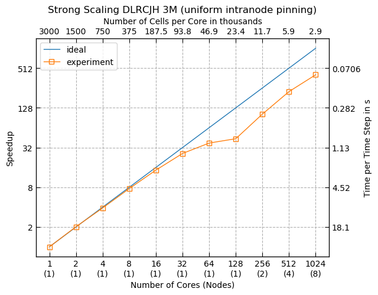

| nCores | nNodes | Ideal speedup | Speedup | Time per time step  in s | Normalized time to solution in µs | Relative Standard Deviation in % |
| :----: | :----: | :-----------: | :-----: | :----------------------: | :-------------------------------: | :------------------------------: |
|   1    |   1    |       1       |    1    |           36.1           |                12                 |               1.16               |
|   2    |   1    |       2       |  2.02   |           17.9           |               11.9                |              0.0563              |
|   4    |   1    |       4       |  3.88   |           9.31           |               12.4                |              0.063               |
|   8    |   1    |       8       |  7.65   |           4.73           |               12.6                |              0.0852              |
|   16   |   1    |      16       |  14.6   |           2.48           |               13.2                |               0.15               |
|   32   |   1    |      32       |   26    |           1.39           |               14.8                |              0.102               |
|   64   |   1    |      64       |  37.4   |          0.965           |               20.6                |              0.143               |
|  128   |   1    |      128      |  43.6   |           0.83           |               35.4                |              0.374               |
|  256   |   2    |      256      |   103   |          0.351           |                30                 |              0.497               |
|  512   |   4    |      512      |   226   |           0.16           |               27.3                |              0.957               |
|  1024  |   8    |     1024      |   406   |          0.0891          |               30.4                |               1.05               |

### 24M
The 24M case behaviour is similar to the 3M case with multiple-node decomposition: with higher number of nodes, larger parts of the problem fit into the cache, resulting in the superlinear scaling.

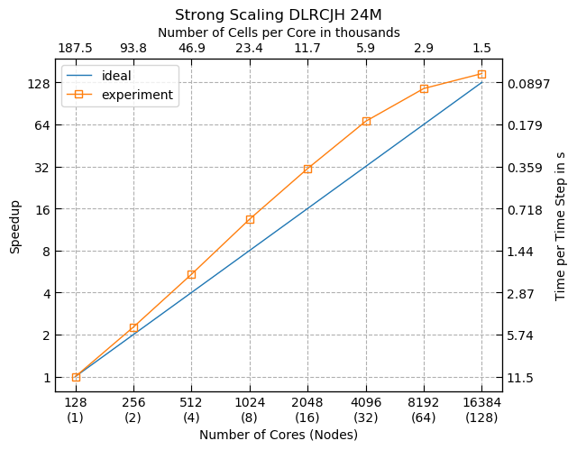

| nCores | nNodes | Ideal speedup | Speedup | Time per time step  in s | Normalized time to solution in µs | Relative Standard Deviation in % |
| :----: | :----: | :-----------: | :-----: | :----------------------: | :-------------------------------: | :------------------------------: |
|  128   |   1    |       1       |    1    |           11.5           |               61.2                |              0.134               |
|  256   |   2    |       2       |  2.26   |           5.07           |               54.1                |              0.148               |
|  512   |   4    |       4       |   5.4   |           2.12           |               45.3                |              0.164               |
|  1024  |   8    |       8       |  13.4   |          0.857           |               36.6                |              0.241               |
|  2048  |   16   |      16       |  30.9   |          0.372           |               31.7                |              0.963               |
|  4096  |   32   |      32       |  67.4   |           0.17           |               29.1                |               2.3                |
|  8192  |   64   |      64       |   116   |          0.0993          |               33.9                |               2.64               |
| 16384  |  128   |      128      |   148   |          0.0776          |                53                 |              0.689               |

### 489M

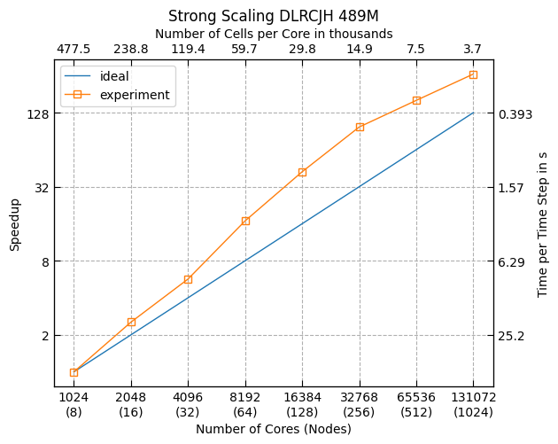

| nCores | nNodes | Ideal speedup | Speedup | Time per time step  in s | Normalized time to solution in µs | Relative Standard Deviation in % |
| :----: | :----: | :-----------: | :-----: | :----------------------: | :-------------------------------: | :------------------------------: |
|  1024  |   8    |       1       |    1    |           50.3           |                105                |              0.158               |
|  2048  |   16   |       2       |  2.54   |           19.8           |               83.1                |              0.208               |
|  4096  |   32   |       4       |  5.68   |           8.86           |               74.2                |               1.62               |
|  8192  |   64   |       8       |  16.9   |           2.98           |                50                 |              0.246               |
| 16384  |  128   |      16       |  42.3   |           1.19           |               39.8                |              0.451               |
| 32768  |  256   |      32       |  97.8   |          0.515           |               34.5                |               1.1                |
| 65536  |  512   |      64       |   161   |          0.313           |               41.9                |               3.36               |
| 131072 |  1024  |      128      |   264   |          0.191           |               51.2                |               4.95               |

### Superlinear speedup
The benchmark cases show higly superlinear speedup. A profiling analysis during the exaFOAM project identified the relevant cause of these findings to be the large amount of L3 memory cache on the modern CPUs. With the increasing number of partitions, the number of cells and thus the amount of data per core decreases. This results in a larger portion of data, which is consumed for calculations, to be in cache for the complete duration of the computation. Since the memory access to cache is orders of magnitude faster than the access to RAM, the performance increases dramatically.

## Weak Scaling
Weak scaling benchmarks were performed for the loads of 60, 30, 15, 7.5 thousand cells per core. The obtained efficiency is for all cases higher than 90%.

### 7500 Cell per Core

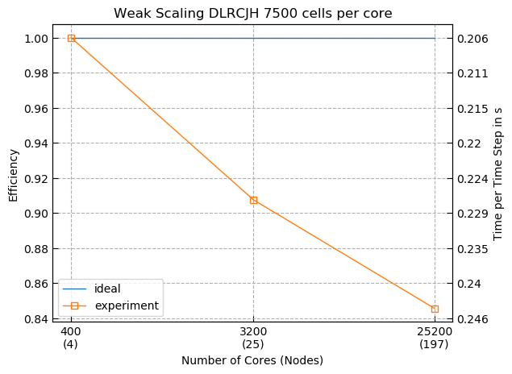

| nCores | nNodes | Efficiency | Time per time step  in s | Normalized time to solution in µs |
| :----: | :----: | :--------: | :----------------------: | :-------------------------------: |
|  400   |   4    |     1      |          0.206           |               27.5                |
|  3200  |   25   |   0.908    |          0.227           |               30.3                |
| 25200  |  197   |   0.846    |          0.244           |               32.5                |

### 15K Cell per Core

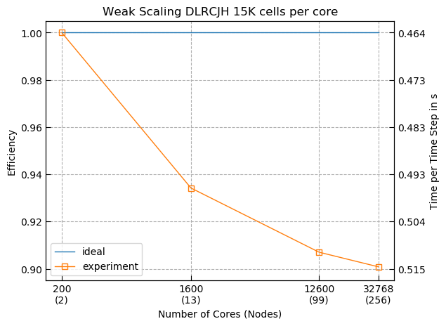

| nCores | nNodes | Efficiency | Time per time step  in s | Normalized time to solution in µs |
| :----: | :----: | :--------: | :----------------------: | :-------------------------------: |
|  200   |   2    |     1      |          0.464           |               30.9                |
|  1600  |   13   |   0.934    |          0.496           |               33.1                |
| 12600  |   99   |   0.907    |          0.511           |               34.1                |
| 32768  |  256   |   0.901    |          0.515           |               34.3                |

### 30K Cell per Core

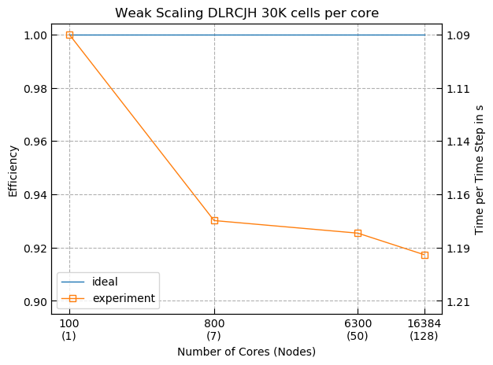

| nCores | nNodes | Efficiency | Time per time step  in s | Normalized time to solution in µs |
| :----: | :----: | :--------: | :----------------------: | :-------------------------------: |
|  100   |   1    |     1      |           1.09           |               36.4                |
|  800   |   7    |    0.93    |           1.17           |               39.1                |
|  6300  |   50   |   0.925    |           1.18           |               39.3                |
| 16384  |  128   |   0.917    |           1.19           |               39.6                |

### 60K Cell per Core

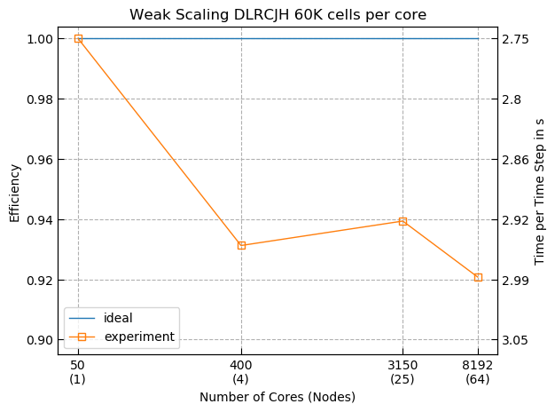

| nCores | nNodes | Efficiency | Time per time step  in s | Normalized time to solution in µs |
| :----: | :----: | :--------: | :----------------------: | :-------------------------------: |
|   50   |   1    |     1      |           2.75           |               45.8                |
|  400   |   4    |   0.931    |           2.95           |               49.2                |
|  3150  |   25   |   0.939    |           2.92           |               48.7                |
|  8192  |   64   |   0.921    |           2.98           |               49.7                |

## Coherent File Format
The major bottleneck experienced during the pre-processing of the case is IO. Modern file systems in the HPC area store data on multiple object server targets to increase performance and thus have a complex system to store meta data for every file. This is also a reason why the number of files is strictly limited to a supercomputer user. Therefore, for large decompositions, the only acceptable and available IO format in OpenFOAM is collated, which enables aggregation of data to a small number of files. The format has several inefficiencies, whereby the most problematic one is the write speed during the serial decomposition. The duration of a decomposition onto 32,768 partitions is approximately 19 hours. A decomposition onto 65,536 partitions is not possible because of the job duration limit of 24 hours imposed by the administrations of LUMI and HAWK supercomputers.
The coherent format developed within the exaFOAM project addresses this and many other issues of the current IO formats [^Weiss2024].

### Decomposition
A pre-processing benchmark was setup in order to measure the improvements of the coherent format. The goal was to prepare several decompositions for the 489M mesh running on a single core with decomposition method hierarchical. The results from Figure below demonstrate up to two orders of magnitude improvement in Time-To-Solution (TTS) compared to the collated format, e.g. 60 times faster decomposition onto 32,678 partitions. Further insight into the timings reveals that with the coherent file format the read and write duration stays the same for all the decompositions. As a side note, the run time of the hierarchical decomposition itself is independent of the number of partitions, which is not true for most decomposition methods available in OpenFOAM.

Another milestone was achieved by enabling decompositions, which were not possible before and are thus considered as enabling technology. Decompositions up to 262,144 partitions were obtained. No bottlenecks were identified that could prevent even larger decompositions.

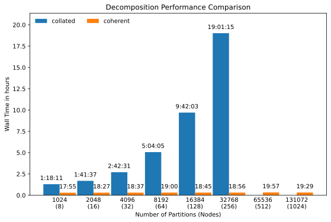

### Pre- and Post-Processing
The coherent format enables further improvements that are analysed here using an example of common workflow: decompose, renumber, run and reconstruct the case.
Here, we chose the 489M case with a decomposition of 32,768 partitions and compare the total Cost-To-Solution (CTS) of the pre- and post-processing between the collated and coherent format. The corresponding calculations are carried out on the LUMI supercomputer. First, we describe how the renumber and reconstruct steps are improved using the coherent format. Afterwards, we define a workflow and perform the analysis.

OpenFOAM offers a tool renumberMesh that enables permutation of the cell ordering within the mesh such that the matrix resulting from the Finite Volume discretisation has a low bandwidth. According to the experience with the combustor GC, renumbering with the Cuthill-McKee method results in 5% to 15% lower run time. All the benchmarks presented here are produced with renumbered meshes. Note that every decomposition needs new renumbering. The current implementation in OpenFOAM allows the renumbering of decomposed cases only in parallel. The renumbering with the coherent format may be performed on a single core independent of the number of partitions. Furthermore, it may be carried out together with the decomposition procedure saving unnecessary writing and reading of the mesh.

An analysis of the data written in the collated format requires a reconstruction step when the analysis is not carried out on the same number of cores as the solver run. Corresponding utility reconstructPar runs in serial, reading the fields from the time steps of interest and reassembling these to the serial mesh conforming representation. This step is unnecessary when using the coherent format since the original and decomposed meshes are indistinguishable regarding their structure. The two meshes differ only in the cell ordering. Therefore, every decomposed mesh in the coherent format may be processed by a serial utility without further treatment. As a result, the reconstruction step is not needed and thus absent in the workflow with the coherent format.

The analysed workflow consists of the following pre- and one post-processing steps:
- decompose the mesh and the fields (fields with uniform distribution),
- renumber the mesh and the fields to increase the performance during the run,
- after the run, reconstruct time steps of interest: only a single time step is reconstructed within this benchmark.

The resulting cost-to-solution is presented in the table below. The cost is given in core-hours according to the LUMI billing policy:
- Standard nodes:
  ```
  cpu-core-hours-billed = cpu-cores-allocated x runtime-of-job
  ```
- Large memory nodes. The serial operations such as decompose and reconstruct were carried out on a shared node with large memory. The accounting here is calculated based on the allocated memory:
  ```
  cpu-core-hours-billed = max(CPU-cores-allocated, ceil(memory-allocated / 2GB)) x runtime-of-job
  ```

|             | Resources collated | Resources coherent | CTS in core-hours collated    | CTS in core-hours coherent                  |
| :---------- | :----------------- | :----------------- | :---------------------------- | :------------------------------------------ |
| Decompose   | 1; 600GB           | 1; 900GB           | 19.95h x 600GB / 2GB = 5985   | 0.56h x 900GB / 2GB =  252 (incl. Renumber) |
| Renumber    | 32,768; 8.4TB      | 1; 900GB           | 0.0167h x 32,768 cores =  547 | –                                           |
| Reconstruct | 1; 600GB           | –                  | 4.37h x 600GB / 2GB = 1311    | –                                           |
| Total       | –                  | –                  | 7843                          | 252                                         |

The total cost of the pre- and post-processing of collated and coherent formats are 7843 and 252 core-hours, respectively, leading to a factor 31 improvement in cost-to-solution. Note that often reconstruction is performed for more than one time step, which would provide the coherent format a larger benefit.

### Write Performance
A measurement campaign was setup to ensure that the write performance during the XiFoam run is not degraded when using the coherent format. The cases were setup in a such way that the writing of fields is triggered within an interval of at least 10s of wall clock time in order to keep the stress to LUMI’s Lustre system low and thus eliminate any impact of the file system on the measurements. Each time step written to storage consists of 32 volume fields (writing of the 3 surface fields was not supported by the implementation available at the time of benchmarking) and amounts to 148GB of data.

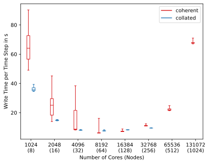

Figure above shows the results for collated and coherent formats of writing 20 time steps during each run. The timings are represented as a boxplot that enables better insight into statistics. For the lower node counts (8 to 32), the coherent format is between 3% and 50% slower than the collated format. Presumably, at these node counts the nodes are not allocated within a single rack but may be spread over the whole machine. This can lead to a poor communication performance that is required for the data aggregation during writing and is indicated by high standard deviation of the corresponding timings. Another reason for this behaviour may be connected to the current implementation of the coherent format that ensures that each field is written to storage after the writing function exits. This can be done more efficiently by staging all fields of a time step in memory and triggering the actual writing to storage only once for all fields at end of the time step.

For the node counts between 64 and 256, the performance of both formats is comparable. For the cases with 512 and 1024 nodes, no data is available for the collated format due to decomposition problems mentioned above. The performance of the coherent format decreases probably due to a high number of aggregators. The backend of the coherent format uses ADIOS2 library, which by default aggregates data to one file per node leading to a total of 1024 files for the run on 1024 nodes. This setting may be changed to a lower value.

In conclusion, the writing performance of the coherent format is on par with the collated one. Further improvements may be achieved by refining the implementation and tuning the settings of the ADIOS2 backend.

## Decomposition method
An investigation was conducted to determine the role of the decomposition method on the performance of the XiFoam solver. In addition to the multilevel scotch decomposition measured on the HAWK supercomputer, runs with hierarchical and multilevel hierarchical decompositions were analysed on LUMI. Figure below shows that the differences in performance for higher core counts remain within a single-digit percentage range.

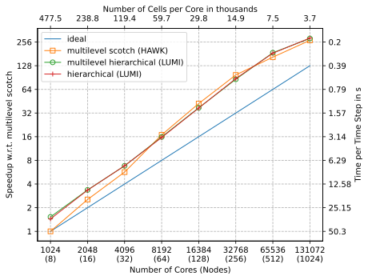

The decomposition procedure itself with the hierarchical method takes by far less time than the other methods. For example, the times for decomposition to 131,072 partitions including renumbering with the Cuthill-McKee method and using the coherent format:
- Hierarchical: 0.92h
- Multilevel hierarchical: 4.6h
- Multilevel scotch: 5.1h

Therefore, the hierarchical decomposition method is recommended in this case.

## Summary
The enhancements in the turbulence modelling algorithm and in the IO revealed efficient performance up to 131,072 cores. At high core counts, the multi-level decomposition method emerged as promising, reducing the inter-node communication bandwidth. Particularly noteworthy was the introduction of the coherent file format, which effectively addressed major pre- and post-processing bottlenecks, resulting in significantly faster decomposition times and notable cost reductions. Write performance analyses showcased comparable results between collated and coherent formats, hinting at further potential for optimization and refinement in the future for the coherent format. The following improvements were demonstrated:
- Case decomposition: up to 60 times lower time-to-solution
- Overall pre- and post-processing: 31 times lower cost-to-solution
- Solver execution: 30 times lower time-to-solution

# Acknowledgment
This application has been developed as part of the exaFOAM Project https://www.exafoam.eu, which has received funding from the European High-Performance Computing Joint Undertaking (JU) under grant agreement No 956416. The JU receives support from the European Union's Horizon 2020 research and innovation programme and France, Germany, Italy, Croatia, Spain, Greece, and Portugal.


# References
When referring to the case in publications please cite the following reference: [^Galeazzo2024]

[^SeverinPhD]: Severin, M., 2019. Analyse der Flammenstabilisierung intensiv mischender Jetflammen für Gasturbinenbrennkammern (PhD Thesis). Universität Stuttgart.
[^Ax2020]: Ax, H., Lammel, O., Lückerath, R., Severin, M., 2020. High-Momentum Jet Flames at Elevated Pressure, C: Statistical Distribution of Thermochemical States Obtained From Laser-Raman Measurements. Journal of Engineering for Gas Turbines and Power 142, 071011.  https://doi.org/10.1115/1.4045483
[^Gruhlke2020]: Gruhlke, P., Janbazi, H., Wlokas, I., Beck, C., Kempf, A.M., 2020. Investigation of a High Karlovitz, High Pressure Premixed Jet Flame with Heat Losses by LES. Combustion Science and Technology 192, 2138–2170. https://doi.org/10.1080/00102202.2020.1781101
[^Gruhlke2021]: Gruhlke, P., Janbazi, H., Wollny, P., Wlokas, I., Beck, C., Janus, B., Kempf, A.M., 2021. Large-Eddy Simulation of a Lifted High-Pressure Jet-Flame with Direct Chemistry. Combustion Science and Technology 1–25. https://doi.org/10.1080/00102202.2021.1903886
[^Galeazzo2024]: Galeazzo, F.C.C., Garcia-Gasulla, M., Boella, E., Pocurull, J., Lesnik, S., Rusche, H., Bnà, S., Cerminara, M., Brogi, F., Marchetti, F., Gregori, D., Weiß, R.G., Ruopp, A., 2024. Performance Comparison of CFD Microbenchmarks on Diverse HPC Architectures. https://doi.org/10.20944/preprints202403.0307.v1
[^freecad]: https://wiki.freecad.org/Release_notes_0.20
[^Weiss2024]: Weiß, R.G., Rusche, H., Lesnik, S., Galeazzo, F.C.C., Ruopp, A., 2024. Coherent Mesh Representation for Parallel I/O of Unstructured Polyhedral Meshes. https://doi.org/10.21203/rs.3.rs-3897818/v1
