# Pitz&Daily Combustor
## Authors
Sergey Lesnik and Henrik Rusche, Wikki GmbH, Germany

## Copyright
Copyright (c) 2022-2024 Wikki GmbH

 

This work is licensed under a <a rel="license" href="http://creativecommons.org/licenses/by-sa/4.0/">Creative Commons Attribution-ShareAlike 4.0 International License</a>.

## Introduction
The case is based on the experiment carried out by Pitz and Daily[^PitzDaily], who measured a combustion flow formed at a backward facing step. The goal of the work was to study the turbulent shear layer during a combustion process in conditions similar to those of the industrial and aircraft gas turbine combustors. The premixed combustion is stabilized by recirculation of hot products which are mixed with cold reactants in a turbulent shear layer. The setup with a backward facing step is one of the simplest configurations reproducing these conditions.

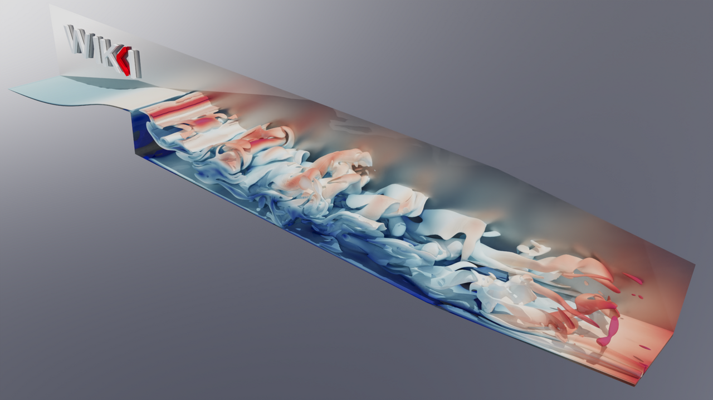

## Experimental Configuration
The combustor is quasi two-dimensional because of the rectangular cross-section. The air and propane are mixed in a premix channel of 1 m length filled with stainless steel wool for turbulence reduction. The premix channel is $H=$ 51 mm high (y-direction) and 173 mm wide (z-direction). The flow cross-section converges over the backside of the step by a factor of 2 in y-direction keeping the same width. Downstream of the step, the stream enters the test section, which is 220 mm long (x-direction) and has the same cross-section as the premix channel. The outlet section introduces a contraction with a 2:1 area ratio.

## Measurements
The lateral sides (back and front) of the test section are two quartz windows. The transparent walls allow measurements with a laser anemometer. These rely on dried alumina particles with an average diameter of 2e-7 m, which are added to the flow.

The measurements are performed at the planes $x/H=$ 0.5, 1, 2, 3, 4, 5, 6, 7, where x is a coordinate perpendicular to the cross-section of the test section and directed downstream. The starting point x = 0 mm is located at the step edge. The measuring planes are normal to the walls.

## Flow parameters
- Air/propane mixture: $\nu=1 \cdot 10^{−5}$ m²/s.
- Average axial velocity at the inlet: $U_i=$  6.65 m/s and at the step edge $U_0=$ 13.3 m/s.
- Reynolds number: $Re_H=U_0 H / \nu=$ 22000.
- Atmospheric pressure at the outlet.

# Numerical Setup
## Geometry

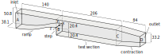

Figure: Geometry of the numerical setup. The dimensions are in mm.

The dimensions used in the numerical setup, which are presented in the figure above, are kept the same as in the OpenFOAM tutorial cases. These deviate from the geometry described in the [experimental configuration](#experimental-configuration) by several mm. Furthermore, there are no dimensions of the contraction section available in the original paper[^PitzDaily]. It is assumed that these deviations do not introduce a significant influence on the final results. An additional geometry feature which matters is the ramp upstream of the test section. Calculations with a short straight inlet section resulted in a stable flow demonstrating no fluctuations. This is probably due to the insufficient development of the boundary layer up to the edge of the step. Thus, the inclusion of the ramp is essential for the results.

The case is 3D. The backside of the step is adjacent to the inlet (plane A) and forms a ramp. The latter is designed according to the approach of Libby&Reiss[^LibbyReiss], which was used during the setup construction as stated by Ganji[^Ganji]. The test section between the planes B and C is 206 mm long. The length of the contraction part is 84 mm (C-D) and its cross-section is reduced by symmetrically decreasing the height of the channel while the width (in z-direction) remains constant. A cyclic boundary condition is introduced at the back and the front patches.

## Models
- Solver: **XiFoam** is used as the top-level solver. It handles an unsteady compressible flow, incorporates combustion relevant models and is controlled by a PIMPLE loop.
- Turbulence: LES kinetic energy equation model (*kEqn*) with van Driest damping function for the treatment of the near-wall regions.
- Combustion: the fuel mixture is assumed to be homogeneous and conforming to the perfect gas law. The ignition site is placed behind the step in the corner formed by the step and the lower channel wall. The laminar flame speed Su is assumed to be unstrained and a transport equation is solved for the flame wrinkling Xi.

## Numerics
LES modeling relies on high accuracy of the discretization and thus higher order schemes are used. For the spatial coordinates these are *linear*, *limitedLinear*, *limitedLinear01* etc. For the temporal discretization a blending between Euler and Crank-Nicolson with a ratio 20:80 (*crankNicolson 0.8*) is utilized. Pure second order time schemes such as *crankNicolson 1* and *backward* proved to be unstable in the present case.

Linear solvers utilized are based on the *conjugate gradients* method. The PIMPLE loop has 2 outer and 1 inner corrections with 0 non-orthogonal corrections. The time step interval is fixed and set to a value such that the maximum Courant number is lower than 0.5. Utility *renumberMesh* is used to reduce the bandwidth of the resulting matrix and accelerate the linear solvers.

## Mesh
The mesh consists of hexahedra. It is generated using *pyhton3*, *m4*, *perl* and *blockMesh*. The file with the geometry properties is *system/blockMeshDict.m4*. The lengths of all parts may be varied by altering few variables. The two most important input values are the thickness of the 1st cell in y-direction starting at a wall $l_\text{wall}$ and the characteristic cell size in the core region in x-, y- and z-direction $l_\text{core}$. *Perl* scripts are introduced to allow a convenient mesh refinement. Therein, the number of block cells in y-direction is calculated based on the inputs using iterative procedures to produce a good quality mesh without jumps in the cell sizes between the blocks. $l_\text{wall}=$ 0.02 mm is sufficient to obtain a mesh with y+<1. The vertical wall of the step is not important for the turbulence modeling since the flow is fully detached at this location and therefore the y+ constraint is not applied here.

## Boundary Conditions
| Variable | Description                    | Units    |
| -------- | ------------------------------ | -------- |
| alphat   | Turbulence thermal diffusivity | kg/(ms)  |
| b        | Regress variable               | -        |
| k        | Turbulence kinetic energy      | m²/s²    |
| nut      | Turbulence viscosity           | m²/s     |
| p        | Pressure                       | kg/(ms²) |
| Su       | Laminar flame speed            | m/s      |
| T        | Temperature                    | K        |
| Tu       | Unburnt Temperature            | K        |
| U        | Velocity                       | m/s      |
| Xi       | Flame-wrinking St/Su           | -        |

As may be seen in the table above the combustion modeling adds a substantial amount of variables to the setup. Therefore, for the sake of brevity, a description is provided only for the most relevant quantities and boundary conditions (BC), which are setup according to Weller[^Weller].

The velocity is prescribed via *fixedValue* at the inlet patch with 6.65 m/s in x-direction. The outlet patch is of type *pressureInletOutletVelocity* with a (0 0 0) inlet value to prevent flow reversal. For the pressure, a *zeroGradient* BC is set at the inlet and *waveTansmissive* at the outlet in order to suppress reflections of the pressure waves at this boundary. Regress variable b, which describes the combustion state (1 - unburnt, 0 - burnt), is set to 1 as *fixedValue* at the inlet and is prescribed with *inletOutlet* at the outlet. Temperatures T and Tu are set to *zeroGradient* at walls, to *fixedValue* with 293 K at the inlet, to *inletOutlet* at the outlet. The front and back patches are set to cyclic for all quantities.

# Validation
Several fields at the cross-section normal to the z-direction are provided for the case with 62 million cells.

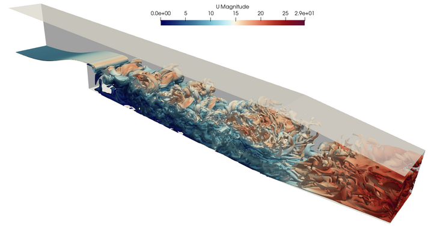

Figure: Isovolume of the vorticity magnitude colored by velocity magnitude.

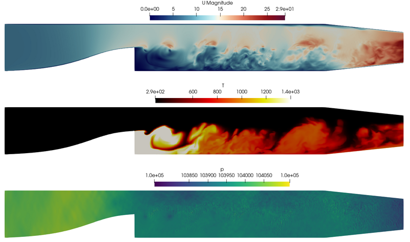

Figure: Velocity, temperature and pressure in the mid-plane.

The validation is performed using 3 million cells case by comparing the mean velocity and turbulent intensity profiles in x- and y-directions at x-normal planes described in section [measurements](#measurements). The evaluation planes are situated at several distances downstream of the step, whereby x = 0 mm is the step edge.

| x in mm | U mean                    | V mean                    |
| ------- | ------------------------- | ------------------------- |
| 0       | 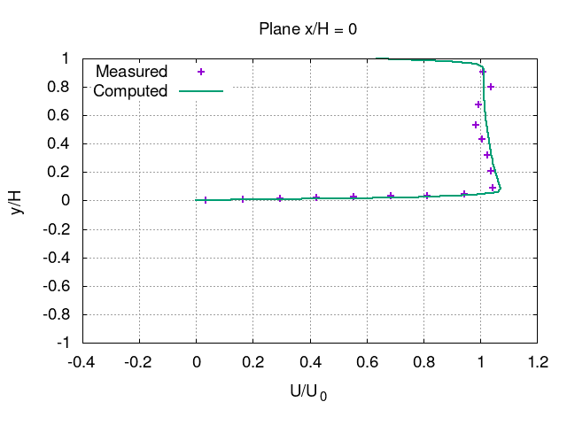 |                           |
| 25      | 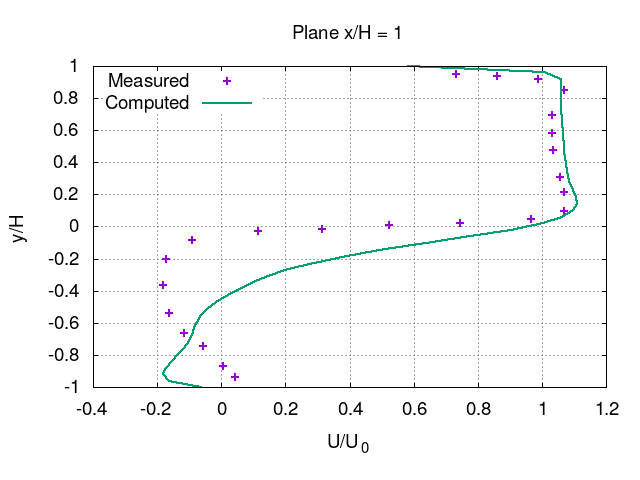 | 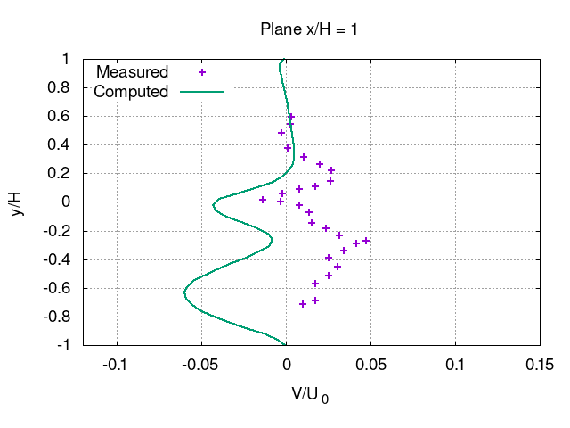 |
| 50      | 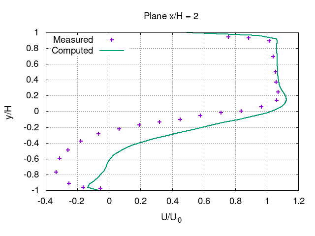 | 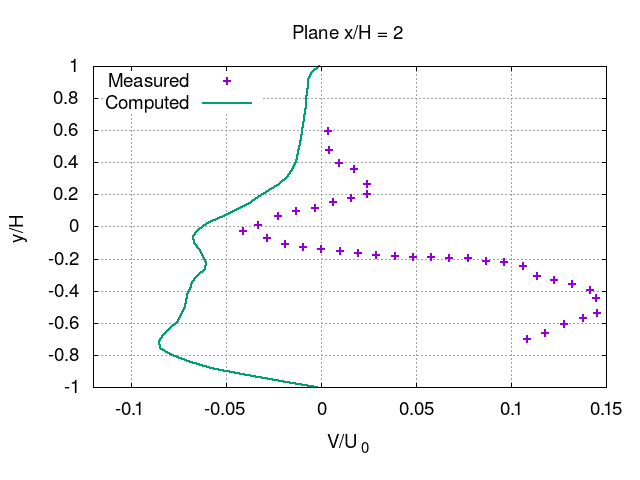 |
| 125     | 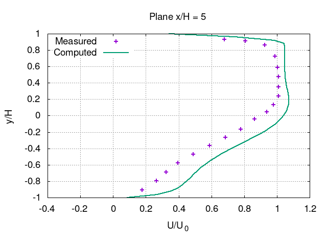 | 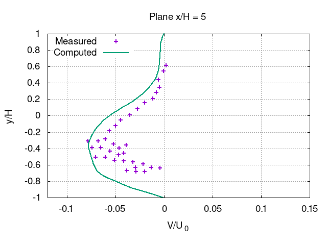 |

| x in mm | $u_{rms}$                       | $v_{rms}$                       |
| ------- | ------------------------------- | ------------------------------- |
| 25      | 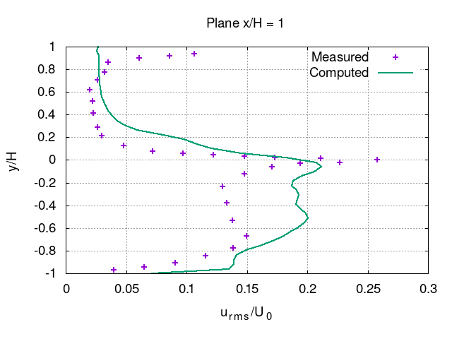 | 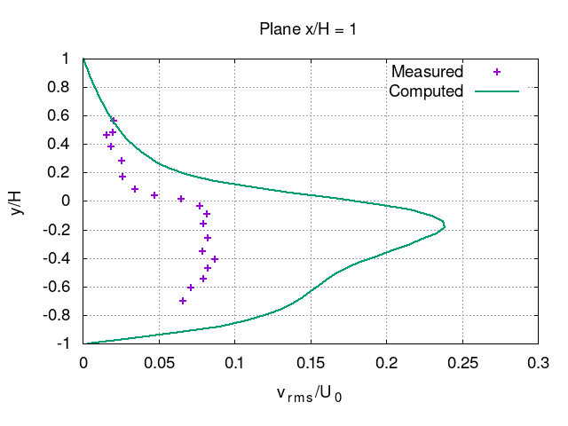 |
| 50      | 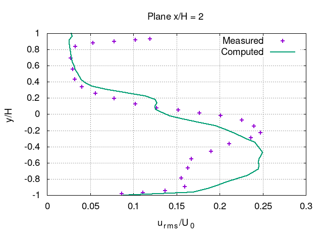 | 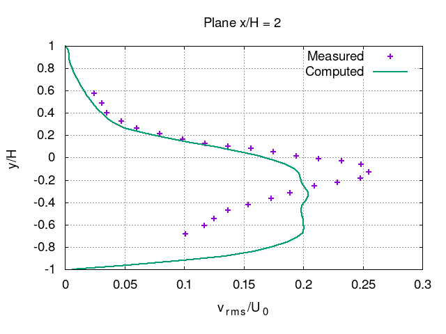 |
| 125     | 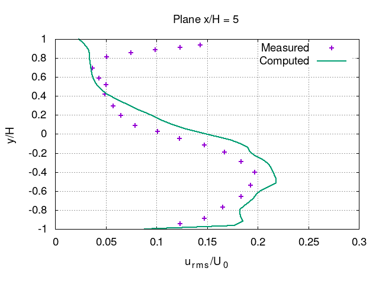 | 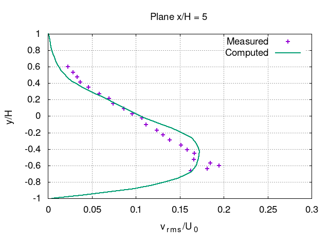 |

The comparison shows that the mean velocity agrees well with the experimental results. Whereas the streamwise velocity component U shows good agreement, the transverse component V exhibits some deviations. At x = 50 mm, the mean of V from the experiment points mainly upwards with a maximum of 0.15 m/s whereas the calculation predicts downward orientation of the velocity. The comparison of the Reynolds normal stresses $u_{rms}$ and $v_{rms}$ shows good agreement whereby the shear layer seems to be wider in the calculations results, which can be seen from the profiles at x = 25 mm and 50 mm.

One of the reasons for the discrepancies may be the turbulence boundary condition at the inlet. The velocity is set to a fixed value. An alternative approach may be usage of a synthetic turbulence model for the BC. None of such models available in OpenFOAM is included in the setup since all of them are relatively new and therefore poorly tested. Furthermore, the walls are considered to be adiabatic (Neumann temperature BC) according to the setup from Weller[^Weller], whereas the walls in the experiment do certainly conduct heat. A fixed temperature BC would be more appropriate but no information on the experimental wall temperature is available.

# Microbenchmark
- Known to run with OpenFOAM-v2106 compiled with double precision (WM_PRECISION_OPTION=DP).
- For meshing and postprocessing additional software is needed: m4, perl, python3, gnuplot.
- Two cases are provided: 3M, 62M with approx. 3 and 62 million cells.
- Two setups for each mesh size are provided
	- *fixedTol*: the tolerances of the linear solvers are fixed, that is a usual setup for a production run. The execution time fluctuations between the time steps are large and are not only dependent on the mesh size but also on the decomposition (e.g. number of processors). In the context of the microbenchmark, it is used to provide mean iteration numbers for the *fixedIter* setup.
	- *fixedIter*: the iteration numbers of the linear solvers are fixed. The execution time fluctuations between the time steps are due to hardware load (e.g. MPI communication). This setup is meant to be used for benchmarking.
- Utility *renumberMesh* is utilized to reduce the bandwidth of the resulting matrix and speed up the sparse matrix-vector multiplication.

## Instructions
### Restart files
In order to enable restarts, meshes and corresponding developed fields are provided on the DaRUS data repository under:
https://doi.org/10.18419/darus-3744

### Preparation
- *fixedIter* run does not need to be executed as a restart. The time step is set to be 1000 times smaller than the numerically and physically reasonable one (compare to *fixedTol* settings). This allows to start from the non-initialized fields ("0_orig" folder). Nevertheless, such a run may fail and restart fields should be downloaded and placed into the "0" folder instead. Iteration numbers are set according to *fixedTol* runs for the two mesh sizes:
	- 3M, run on 28 cores, 1 node;
	- 62M, run on 960 cores, 10 nodes.
- *fixedTol* setup is needed to determine iteration numbers for the *fixedIter* setup, if the number of cores or mesh size significantly differs from the provided above.
	- Restart files may be used if only the decomposition is changed (significantly).
	- If a new mesh is generated, the case should be mapped using the restart fields and it needs to be run for at least 0.05 s of physical time in order to obtain characteristic iteration numbers. If the case is run from non-initialized fields the ignition start should be altered accordingly (e.g. to 0) and the case should run for 0.25 s of physical time.
	- Script "calcIterTimeStats.py" analyzes the solver log file and provides a recommendation for the *fixedIter* setup.

### Case run
- The setups contain symbolic links in order to reduce repetitions. Thus, preferably copy cases by using "rsync -L" or "cp -R -L"
- Mesh. There are two alternatives:
	- Choose one of the provided mesh sizes and consider to use restart files (see [Preparation](#preparation)). The *fixedIter* setups may be used directly.
	- Prepare a different mesh, e.g., by altering the "lCore" parameter in *system/blockMeshDict.m4*. In this case, *fixedTol* setup with mapping and log analysis should be used to provide settings for *fixedIter* setup.
- In *system/decomposeParDict*
    - Alter "numberOfSubdomains" to the number of MPI ranks the case is planned to run with.
    - Alter the last entry of the 3-tuple "domains" in the subdictionary "multiLevelCoeffs" such that the multiplication of all three entries equals "numberOfSubdomains" and the entries should correspond to
		- 1st: number of nodes
		- 2nd: number of socket per node
		- 3rd: number of used threads per socket
- Run *Allpre* bash script, which contains the meshing and decomposing. Be aware that *blockMesh* is single-threaded and will require a substantial amount of memory and time for large meshes.
- Run *Allrun* or setup an HPC job script using the procedure from the script.
- Check the statistics printed at the end of the solver output.

### Postprocessing
An *Allpost* script and a folder with measurements data needed for the evaluation purposes only is provided for the sake of completeness.

# Acknowledgment
This application has been developed as part of the exaFOAM Project https://www.exafoam.eu, which has received funding from the European High-Performance Computing Joint Undertaking (JU) under grant agreement No 956416. The JU receives support from the European Union's Horizon 2020 research and innovation programme and France, Germany, Italy, Croatia, Spain, Greece, and Portugal.

# References
[^PitzDaily]: Pitz, R. W., & Daily, J. W. (1983). Combustion in a turbulent mixing layer formed at a rearward-facing step. AIAA journal, 21(11), 1565-1570.
[^LibbyReiss]: Libby, P. A., & Reiss, H. R. (1951). The design of two-dimensional contraction sections. Quarterly of Applied Mathematics, 9(1), 95-98.
[^Ganji]: Ganji, A. R., & Sawyer, R. F. (1980). Experimental study of the flowfield of a two-dimensional premixed turbulent flame. AIAA Journal, 18(7), 817-824.
[^Weller]: Weller, H.G., Tabor, G.R., Gosman, A.D., & Fureby, C. (1998). Application of a flame-wrinkling les combustion model to a turbulent mixing layer.