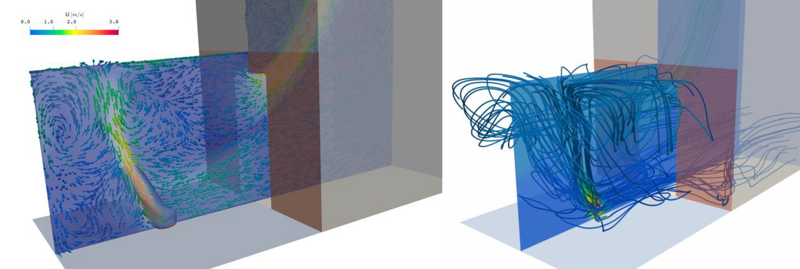
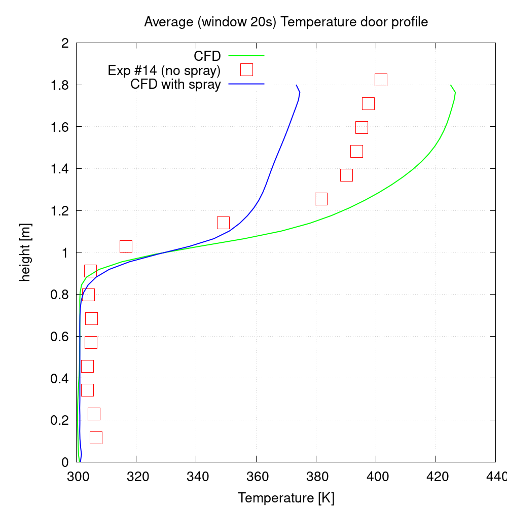
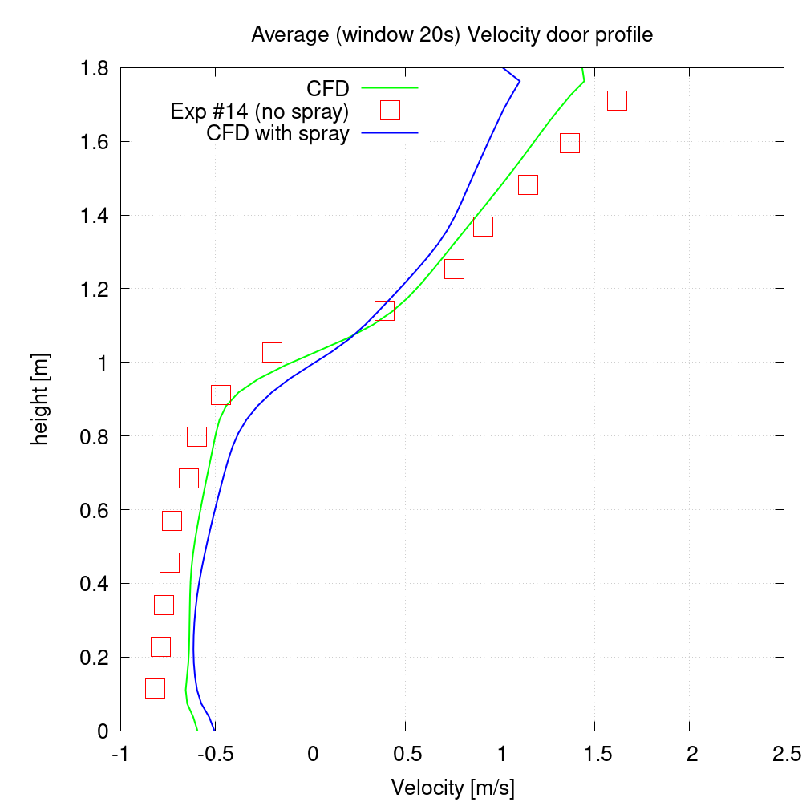

# I8 Fire Suppression: Modified "Steckler" fire

## Authors
ESI-Group, 2023
Stakeholder : FM Global

## Copyright
Copyright (c) 2022-2023 ESI-Group

 This work is licensed under a <a rel="license" href="http://creativecommons.org/licenses/by-sa/4.0/">Creative Commons Attribution-ShareAlike 4.0 International License</a>.

## Description
This Benchmark case represents a fire source within an enclosure, thermal stratification and venting from an open aperture (door), shown in Figure1. The experimentally configured case is described in the publication by The US National Bureau of Standards (<a href="https://www.fire.tc.faa.gov/pdf/nbsir82-2520.pdf">Flow induced by fire in a compartment</a>). The modelling contains several physics for transient execution, including optionally RANS (selected) or LES turbulence modelling, heat source (selected) or combustion modelling, wall heat transfer, radiation and in this case with lagrangian spary added for execution performance profiling.

Figure 1: Steckler room fire: heat-source and thermal plume (left) with streamlines (right) of cold-flow entering the lower part of the doorway being entrained into the fire, rising and exiting the top of the doorway

Results are illustrated in the form of predicted versus measured temperature (Figure 2) and velocity profiles (Figure 3) along a vertical line along the center of the doorway. Both profiles are sensitive to modelling of the heat source mechanism, representation of wall heat-transfer, and radiation exchange within the enclosure. The velocity profile is less sensitive, being simply a function of the stratified thermal layer exiting the doorway through buoyant convection.

This base-configuration has been modified on the recommendation for the exaFOAM Stakeholder, FM Global, to include fire-suppression using the additional modelling features for Lagrangian particle tracking and droplet spray mass, momentum and energy exchange. The cone injection model is used at roof-center of the room at solid cone angle 60-80deg with velocity of 0.4m/s with RosinRammler distribution of size 5e-4 to 1.2e-3m.

Figure 2: Doorway stratified temperature w/ and w/o spray

Figure 3: Dorway velocity profile w/ and w/o spray

## Bottlenecks
The bottlenecks and HPC challenges towards exascale computing are stated below:
  - Scalability of flow solver in a large variety of physics combinations, as follows;
    - Thermal solver (fireFoam)
    - With Radiation; Surface-to-surface or discrete-ordinate-method (DOM)
    - RANS (steady) or LES-based (unsteady) turbulence
    - Heat source (volumetric or combustion model)
    - spray cloud
  - Potential inclusion of particle physics, including mass, momentum and heat transfer with the surroundings, and implications on processor load balancing

## Run acceptance criteria
  - Scalability tests measured against the quantitative comparisons stated above.
  - Improved scalability for the several combined physics stated above, compared to the baseline case executed in an OpenFOAM version available prior to this Workpackage (e.g. OpenFOAM-v2106)

## Instructions to run the case
The setup is tested in OpenFOAM v2306 in 120 cores.
Please change core count as needed. Execution is typically a call to Allrun script. e.g. ./Allrun

The graphs shown in Figures 2 and 3 are indicative, and based on the Steckler reference. It is not intended as a validation and can be tuned further.
There is no reference result with spray switched on.

## References
Steckler, K. D.; Quintiere, J. G.; Rinkinen, W. J.; (<a href="https://www.fire.tc.faa.gov/pdf/nbsir82-2520.pdf">Flow induced by fire in a compartment</a>), National Bureau of Standards

## Acknowledgment
This application has been developed as part of the exaFOAM Project https://www.exafoam.eu, which has received funding from the European High-Performance Computing Joint Undertaking (JU) under grant agreement No 956416. The JU receives support from the European Union's Horizon 2020 research and innovation programme and France, Germany, Italy, Croatia, Spain, Greece, and Portugal.

