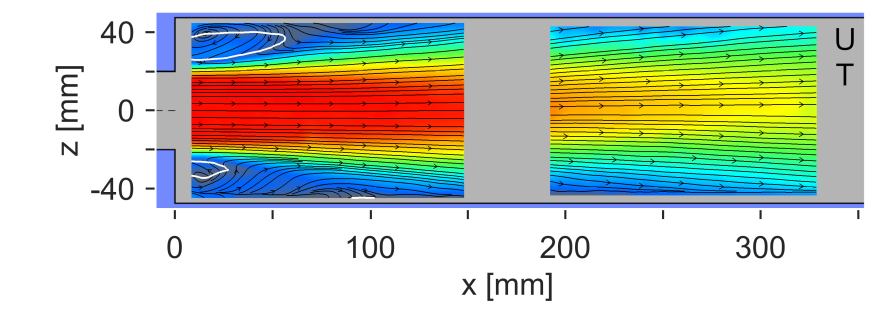

# DLR Confined Jet High Pressure Combustor

## Authors
Federico Piscaglia and Federico Ghioldi, Politecnico di Milano, Department of Aerospace Science and Technology, Italy

## Copyright
Copyright (c) 2022-2023 Politecnico di Milano

<a rel="license" href="http://creativecommons.org/licenses/by-sa/4.0/"></a><br />

This work is licensed under a <a rel="license" href="http://creativecommons.org/licenses/by-sa/4.0/">Creative Commons Attribution-ShareAlike 4.0 International License</a>.

## Introduction
The solution of stiff ordinary differential equations (ODEs) systems is of key importance in advanced multiphysics CFD simulations; in reactive flow simulations the fluid transport is coupled to the solution of finite-rate chemistry problems. In these scenarios, the computational effort connected to the integration of the detailed chemical kinetics ODEs systems largely contributes to limit the solver speed. A possible solution to overcome this inconvenience consists of integrating the chemical ODEs systems via an adaptive multi-block explicit solver running on a Graphical Processing Unit (GPU). The idea is to dynamically redistribute the ODE system over the resources available from the GPU architecture, while the Navier-Stokes equations are solved by a multi-core CPU algorithm. The hybrid CPU/GPU solver is expected to provide a significant speed-up in reactive calculations. The performance gain is expected to increase with large-scale mechanisms, that are characterized by large workloads.

## Configuration


Figure: the three-dimensional geometry is based on the information provided in the literature [^Ax2020].

The considered domain is structured on an experimental rig investigated at the Institute of Combustion Technology of the German Aerospace Center (DLR - in German). The burner is based on the Recirculation-Stabilized Jet Flame (RSJF) concept, better known as FLOX whose great potential is largely exploited for gas turbines applications. Compared to widespread swirl burners, RSJF combustors feature low NOx emissions, homogeneous temperature distribution, and operate with a wide range of fuels and loads. The FLOX combustor consists of several nozzles arranged in a ring around a central pilot swirl-burner. The test rig considered here represents a portion of such a configuration as it only accounts for one nozzle. The L$\times$W$\times$H rectangular-shaped chamber has dimensions 95 mm $\times$ 95 mm $\times$ 843 mm; a cylindrical inlet having diameter D = 40 mm is off-centered at the base of the chamber whose top is open. The fuel injector is placed 400 mm upstream of the chamber. At the outlet, a striction exists; however, only partial information is available for the striction; thus, the rounded outlet is here neglected; at its place, a flat rectangular outlet is considered. The overall effects on the numerical results produced by this simplifications should be further investigated. The main inlet pipe axis is offset to the chamber center line by 10 mm in order to allow for the recirculation zone to develop. The effect of the swirl-burner is simulated by the presence of seven inclined pilot burners; their inclination ($60^o$) toward the main inlet axis impacts the flow swirl. A premixed mixture of air and natural gas is injected through the main nozzle; natural gas enters from the pilots when active. The overall mass flow injected from the seven pilots corresponds to 10% of that of the main nozzle.

## Measurements
Experiments are available from the literature for code validation[^Ax2020][^SeverinPhD][^Gruhlke2020]. For the analyses, the following measurement techniques have been applied[^SeverinPhD]: OH*-chemiluminescence (identification of the flame position), Particle Image Velocimetry (PIV, flow speed determination), Laser Induced Fluorescence of the OH radical (LIF, temperature determination). The temperature and velocity fields from the middle slice (x-y plane) of the chamber were evaluated and are used here for validation.

## Flow parameters
- Turbulent flow (high Reynolds number);
- Premixed flow at main inlet;
- High velocity for the premixed flow at the main inlet: $\left| U \right|​ =$ 113 m/s;
- High pressure in the chamber: 8 bar;
- Air-fuel ratio: 1.7;
- Mildly-high inlet temperature of the mixture: T​ = 725 K;
- Dual fuel (when pilots are active);

# Numerical setup
The numerical setup follows the main characteristics of other tutorials available in OpenFoam-v2206 for reactive combustion problems. A detailed description of the numerics is available on the OpenFOAM wiki[^OFWiki]. Some changes are introduced to allow the treatment of the considered case via GPU chemistry model. Details are proposed subsequent sections, and include the modification of the *chemistryProperties* and *controlDict* files, contained in the *constant* and *system* folder respectively. No changes are required to the numerical schemes, or to the settings of the numerical solvers when switching from native CPU to heterogeneous CPU/GPU simulations.

- The case is three-dimensional, with a main flow inlet and a second fuel inlet that can be activated to simulate dual fuel ignition. The BC and the initial conditions are set accordingly;
- at the main inlet the oxidant and fuel are premixed. The mass fractions of the chemical species are set according to the information provided in the literature[^Ax2020];
- the flow is unsteady;
- the flow is turbulent, and a *LES* turbulence model is used for the simulation;
- the selected numerical solver is **reactingFoam**.

## Geometry and mesh

| Plane x-y | Plane y-z |
|-----------|-----------|
|  |  |

Figure: Geometry of the DLRCJH combustor for the numerical setup. The dimensions are in mm.

The proposed geometrical parameters come from the literature[^SeverinPhD]; a collection of the data is reported in the table below. Several dimensions regarding the inlet and outlet pipes could not be found in the literature and approximations based on the available description and figures are introduced. The problem is three-dimensional. The combustion chamber has a squared-shaped cross section, and $L \times W$ = $95$ mm $\times$ $95$ mm. The original outlet is not reproduced; in the current setup, the outlet is represented by the complete cross-section of the chamber.  The main duct has a diameter of $40$ mm, and it is eccentric with respect to the center of the combustion chamber. In particular, the shift is of $10$ mm along the Y-direction. No shift is present in the Z-direction. The length of the duct is chosen to simulate the real industrial configuration. Seven pilot ducts are present above the main flow duct and their activation is optional. The final part of the pilot ducts has an inclination of $60$ deg with respect to the main duct. All pilot ducts have the same diameter d = 4.7 mm, and the same overall length. The initial background mesh is generated using the *blockMesh* application. The file receives as input an average mesh size and generates the main duct and the combustion chamber. Next, a *topoSet* is launched to extract a set of faces. Those faces define a new patch (*"fuel_inlet"*) that is used by *extrudeMesh* to create a small box extrusion to contain the pilot ducts. Then, *snappyHexMesh* is launched. The pilot ducts are generated within the box, and two refinement regions are produced in the combustion chamber. The duct is refined as well. Additional layers are generated on the pilot tubes. Mesh regularity is preserved. The entire meshing procedure is automatic and performed by means of the provided *Allrun* script. Thanks to this approach, and to the selection of the initial average mesh size in the *blockMeshDict* file it is possible to simulate various mesh refinements. In the case of the default settings, the number of cells of the mesh is 12 millions. The mesh is predominantly hexahedrical.

| Variable     | Value       | Description                                                     |
|--------------|-------------|-----------------------------------------------------------------|
| $D$          |40 mm        | Inlet nozzle diameter                                           |
| $y_f$        |-10 mm       | Vertical offset of the nozzle mounting point                    |
| $L$          |95 mm        | Lateral, top and bottom wall width of the chamber               |
| $H$          |843 mm       | Chamber length                                                  |
| $x_{inj}$    | -400 mm     | Location of the fuel injection                                  |
| $d_p$        | 4.7 mm      | Pilot nozzle diameter                                           |
| $\alpha$     | 60°         | Inclination angle of the pilot nozzles to the inlet nozzle axis |
| $\Delta z_p$ | 10 mm       | Distance between the neighboring pilot nozzles                  |
| $y_p$        | 25 mm       | Vertical offset of the pilot nozzles mounts                     |


## Initialization
The flow is initialized either by means of *setFields* or *mapFieldsPar* tool. The former is used when no field data from a run of lower resolution is available. In this case, the velocity, temperature and other variable fields are initialized for the complete inlet duct and an additional cylindrical volume formed by extrapolating the duct into the chamber. Similar conditions are applied to the pilots, when pilots are active. The rest of the domain is initialized to zero velocity; plus, a temperature value T = 1900 K is set to allow the reactants to ignite. In this way, no artificial ignition is required as external power source (hot spot) in the energy equation.

The utility *mapFieldsPar* can be used for propagation of the developed flow from the cases with lower mesh resolution to higher one lowering the cost-to-solution.

## Models
- Solver: **reactingFoam** is used as the top-level solver.
- Turbulence: LES kinetic energy equation model (*kEqn*).
- Combustion: the fuel mixture is inhomogeneous since the main and pilot nozzles are operated with the different air-to-fuel ratios (when pilots are active). The *PaSR* combustion model is employed (further information is reported in the *known issues* section).

## Numerics
LES modeling relies on high accuracy of the discretization; the following schemes are utilized: linear, limitedLinear, limitedLinear01. For the velocity convection limitedLinearV is used. For the temporal discretization, the first-order implicit Euler scheme is adopted (particularly in the case of non-initialized fields). Pure second order time schemes such as crankNicolson 1 and backward proved to be unstable in the present case. Linear solvers utilized are based on the conjugate gradients method. The PIMPLE loop has 2 outer and 1 inner corrections with 0 non-orthogonal corrections. Maximum acceptable Courant number is 0.3 but can be extended up to 0.6. Utility renumberMesh can be used to reduce the bandwidth of the resulting matrix and accelerate the linear solver execution.

## Boundary conditions
The following is a list of boundary conditions (BC) set for the proposed case. Two scenarios are possible[^SeverinPhD]: the a) unpiloted and b) piloted tests. The following conditions are adequate for the handling of the piloted test. To address the unpiloted configuration, it is sufficient to define the *"fuel_inlet"* patch as wall, and modify the boundary conditions following the example of the remaining walls. For sake of completeness, the boundary conditions for all cases are anyway reported in this section.

|Variable  |Description                                 |Units    |
|----------|--------------------------------------------|---------|
|$U$       |Velocity                                    |m/s      |
|$p$       |Chamber pressure                            |Pa       |
|$T$       |Temperature                                 |K        |
|$\alpha_t$|Turbulence thermal diffusivity              |kg/m.s   |
|$\nu_t$   |Turbulence viscosity                        |m2/s     |
|$k$       |Turbulence kinetic energy                   |m2/s2    |
|$Y_i$     |Mass fraction of the *i*-th chemical specie |-        |

### Internal field
The chamber pressure is $p =$ 800000 Pa; for the unpiloted flame, the adiabatic flame temperature is $T_{ad} =$ 1900 K; for the pilot flame, the adiabatic flame temperature is $T_{ad} =$ 1970 K; To trigger the combustion a high initial internalField temperature is selected. Air is initially present in the chamber, hence the mass fraction of $N_2 =$ 0.77, while the one of $O_2 =$ 0.23. The internal field value of the turbulent kinetic energy $k =$ 1e-5 $m^2/s^2$. Internal field of the remaining quantities is set to zero.

### Main Inlet
The following are the BC applied at the inlet of the main duct. The two available scenarios are: a) unpiloted flame (U); b) piloted flame (P).

|Variable  |Type           | Value (U) | Value (P) |
|----------|---------------|-----------|-----------|
|$U$       |fixedValue     | 111       | 111       |
|$p$       |zeroGradient   | -         | -         |
|$T$       |fixedValue     | 725       | 725       |
|$Y_{O_2}$ |fixedValue     | 0.223     | 0.223     |
|$Y_{N_2}$ |fixedValue     | 0.7465    | 0.7465    |
|$Y_{CH_4}$|fixedValue     | 0.0305    | 0.0305    |

Other values not reported in this table are set equal to internalField values.

### Pilot Inlet
The following are the BC applied at the inlet of the pilot ducts. The two available scenarios are: a) unpiloted flame (U); b) piloted flame (P).

In the unpiloted flame (U) case, the pilot inlets are closed, thus no fuel is entering in the domain from the pilot inlet patch, which is instead treated as wall (see below). Hence, only the piloted flame (P) conditions are reported for this patch.

|Variable  |Type           | Value (P) |
|----------|---------------|-----------|
|$U$       |fixedValue     | 109       |
|$p$       |zeroGradient   | -         |
|$T$       |fixedValue     | 633       |
|$Y_{O_2}$ |fixedValue     | 0.21745   |
|$Y_{N_2}$ |fixedValue     | 0.728035  |
|$Y_{CH_4}$|fixedValue     | 0.0545    |

### Outlet
The following are the BC applied at the outlet of the domain.

|Variable  |Type             | Value (U) | Value (P) |
|----------|-----------------|-----------|-----------|
|$U$       |zeroGradient     | -         | -         |
|$p$       |waveTransmissive | 800000    | 800000    |
|$T$       |inletOutlet      | 1000      | 1000      |
|$Y_{O_2}$ |inletOutlet      | 0         | 0         |
|$Y_{N_2}$ |inletOutlet      | 0         | 0         |
|$Y_{CH_4}$|inletOutlet      | 0         | 0         |

### Walls
No slip condition is enforced for the velocity at the walls; zeroGradient is applied for pressure; zeroGradient is imposed for temperature at the walls, for exception of those of the combustion chamber, where a fixedValue of $T =$ 700 K is applied.

# Validation
To validate the simulation, a comparison is done against experimental results available from the literature[^SeverinPhD][^Ax2020]. Results can further be improved by developing an adequate combustion model to treat the ignition and the combustion of premixed dual fuel flows. Nonetheless, the results contained in the following figures guarantee that the combustion process can be triggered thanks to the higher internal field of temperature selected as initial condition.
Temperature and velocity profiles were averaged for 0.05 s of physical time and are provided below. Both side and top view slices contain the center axis of the main inlet pipe. The velocity distribution and the position of the recirculation zone from the calculation are in good agreement with the experiment. Temperature in the range of 1700 K is depicted correctly by the calculation. The results of temperature are affected by the imposition of the selected internal field value ($T_{if} =$ 1900 K); further investigations are ongoing adopting an internalField temperature $T_{if} =$ = 1400 K; a fine tuning of the combustion model constants is currently undergoing.

## Unpiloted

### Velocity
|  | Side plane | Top plane |
|--|--|--|
| Numerical results                   |        |        |
| Experimental results[^SeverinPhD]   |  |  |

### Temperature
|  | Side plane | Top plane |
|--|--|--|
| Numerical results                   |        |        |
| Experimental results[^SeverinPhD]   |  |  |

## Piloted

### Velocity
|  | Side plane | Top plane |
|--|--|--|
| Numerical results                   |        |        |
| Experimental results[^SeverinPhD]   |  |  |

### Temperature
|  | Side plane | Top plane |
|--|--|--|
| Numerical results                   |        |        |
| Experimental results[^SeverinPhD]   |  |  |


The validation is performed by comparing the available experimental results[^Ax2020] against those produced numerically and saved in the *postProcessing* folder. In particular, throughout the simulation slices are saved across the chamber and saved in the *postProcessing* folder.

# Benchmark
- Known to run with OpenFOAM-v2206;
- Allmesh file to produce the mesh based on average mesh size;
- Two scenarios can be simulated: a) unpiloted flame; b) piloted flame;
- Post processing is available for comparison against experimental solutions[^SeverinPhD][^Ax2020].

## Run time statistics
For the proposed configuration the entire simulation can be completed both using the hybrid CPU/GPU mode and the native CPU mode.
However, the available computational power doesn't allow to complete the simulation in a short amount of time. This is due to the large number of ODE equations, the additional PDEs in reactive flow problems, the small time steps enforced by the strict Courant number, and the vast amount of cells required to obtain an accurate result. That severely limits the repeatability of the simulation for a variable set of internal field values and Combustion model constants. A different setup would be required to have an acceptable value of overall executionTime; nonetheless, the setup would require a reduction of the number of cells in the computational domain. Validation is automatically performed at endTime, by means of the post processing files created thanks to the proposed function objects.

**Bottlenecks:**
Detailed finite-rate chemical kinetics is required to accurately describe combustion physics and flame front propagation. However, this implies the presence of large and stiff ODE systems. In reactive flow problems, their solution represents one of the main bottlenecks and contributes to limit the obtainment of high computational speed-ups of the entire simulation. CFL constraints typical of reactive flow simulations seriously limit the time step advancement. A large number of integration steps is necessary to solve the chemistry problem.

## Instructions

### Preliminary
- Compile the model *GPUChemistryModel* via the *Allwmake* file contained in the folder *thermophysicalModels* (under development for OpenFOAM-v2212)
    - first, the Allwmake automatically compiles the NVIDIA CUDA scripts
    - then, the Allwmake compiles the CPU scripts to add the GPUChemistryModel to the runTime selection table
- Set the *constant/chemistryProperties* file to develop the simulation with the new model
    ```c++
    chemistryType
    {
        method          GPU;
        solver          gpu;
    }

    chemistry                   on;
    initialChemicalTimeStep     1e-07;

    gpuCoeffs
    {
        solver          RKCK45;
        absTol          1e-12;
        relTol          1e-1;
    }
    ```
- Add the two compiled libraries to the *system/controlDict* file
     ```c++
    libs("libcudaPoliMi libchemistryModelPoliMi")
    ```

### Case run
The main folder of the case contains an *Allrun* script. The *Allrun* script calls at first the *makeMesh* script, which builds the mesh starting from a *blockMeshDict* file. In the *blockMeshDict* file the average mesh size can be changed in order to vary the number of cells in the domain. In this way, various simulations at different mesh resolutions can be developed in these test cases. The mesh is built as follows: first, the *blockMesh* application creates the chamber portion of the background mesh. Next, a topoSet application is launched to define two faceSets: one for the main pipe, the other for the pilot tubes. After that, the mesh is extruded to create two boxes: one for the main pipe, the other for the pilot tubes. Then, a *snappyHexMesh* operation is performed to snap both main and pilot ducts. At the same time, refinements and additional layering are built. When this operation is concluded (in parallel, depending on the computational availability), a *setFields* operation is conducted. 
The setFields application initializes the flow; it modifies the initial temperature value of the *internalField*, as well as the mixture properties in the chamber and the main duct. This operation is performed considering a region which fully includes the main inlet duct and further extends into the chamber for a short, yet non negligible, portion of space. Finally, the simulation is launched. 
Boundary Conditions are prescribed by means of a *caseSettings* file contained in the *constant* folder. 
Please observe that in the cases, upon mesh construction, the domain is decomposed into a certain number of processors based on the computational availability. Since simple decomposition is used, please update the number of processors in the *decomposeParDict* file contained in the system folder. 

### Postprocessing
At the end of the simulation a postProcessing folder is automatically created to extract the most relevant quantities for case comparison against experimental solutions provided in the literature[^SeverinPhD][^Ax2020].

# Known Issues
- Although the geometry resembles the experimental rig from DLR, the actual STLs of the configuration are not publicly available; the differences between the geometry used for the numerical simulations and the experimental tests can produce non-negligible effects on the flow behavior and the development of the combustion.
- A more accurate combustion model for premixed combustion with finite-rate chemistry should be used to improve the agreement between simulations and experiments. 

# Acknowledgment
This application has been developed as part of the exaFOAM Project https://www.exafoam.eu, which has received funding from the European High-Performance Computing Joint Undertaking (JU) under grant agreement No 956416. The JU receives support from the European Union's Horizon 2020 research and innovation programme and France, Germany, Italy, Croatia, Spain, Greece, and Portugal.


# Footnotes
[^OFWiki]: https://openfoamwiki.net/index.php/Main_Page
[^SeverinPhD]: Severin, M., 2019. Analyse der Flammenstabilisierung intensiv mischender Jetflammen für Gasturbinenbrennkammern (PhD Thesis). Universität Stuttgart.
[^Ax2020]: Ax, H., Lammel, O., Lückerath, R., Severin, M., 2020. High-Momentum Jet Flames at Elevated Pressure, C: Statistical Distribution of Thermochemical States Obtained From Laser-Raman Measurements. Journal of Engineering for Gas Turbines and Power 142, 071011.  https://doi.org/10.1115/1.4045483
[^Gruhlke2020]: Gruhlke, P., Janbazi, H., Wlokas, I., Beck, C., Kempf, A.M., 2020. Investigation of a High Karlovitz, High Pressure Premixed Jet Flame with Heat Losses by LES. Combustion Science and Technology 192, 2138–2170. https://doi.org/10.1080/00102202.2020.1781101
[^Gruhlke2021]: Gruhlke, P., Janbazi, H., Wollny, P., Wlokas, I., Beck, C., Janus, B., Kempf, A.M., 2021. Large-Eddy Simulation of a Lifted High-Pressure Jet-Flame with Direct Chemistry. Combustion Science and Technology 1–25. https://doi.org/10.1080/00102202.2021.1903886
