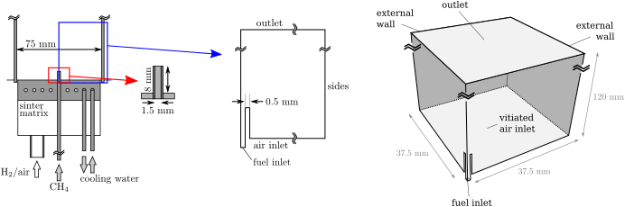
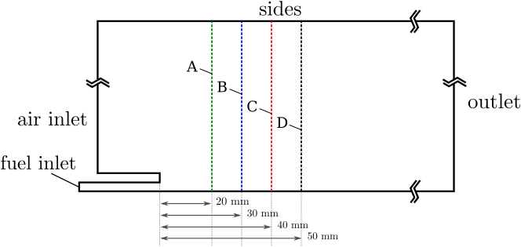
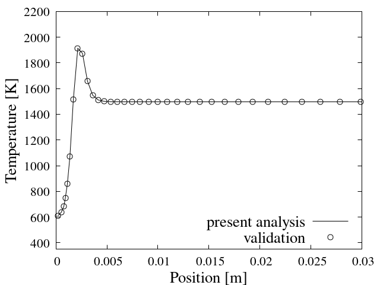
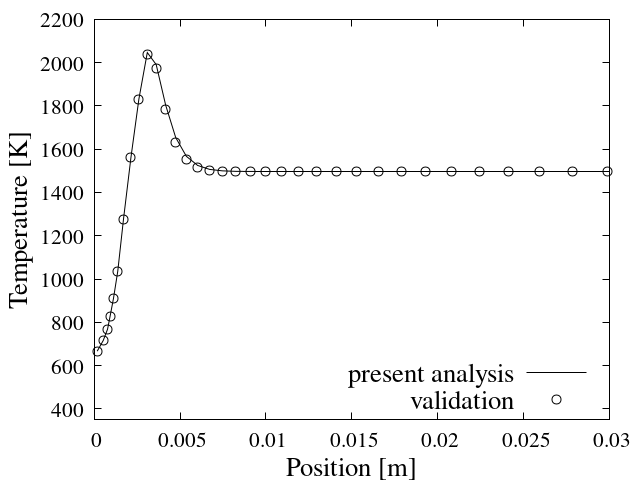

# DLR Jet-in-Hot-Coflow Burner

## Authors
Federico Piscaglia and Federico Ghioldi, Politecnico di Milano, Department of Aerospace Science and Technology, Italy

## Copyright
Copyright (c) 2022-2023 Politecnico di Milano

<a rel="license" href="http://creativecommons.org/licenses/by-sa/4.0/"></a><br />

This work is licensed under a <a rel="license" href="http://creativecommons.org/licenses/by-sa/4.0/">Creative Commons Attribution-ShareAlike 4.0 International License</a>.

## Introduction
The solution of stiff ordinary differential equations (ODEs) systems is of key importance in advanced multiphysics CFD simulations; in reactive flow simulations the fluid transport is coupled to the solution of finite-rate chemistry problems. In these scenarios, the computational effort connected to the integration of the detailed chemical kinetics ODEs systems largely contributes to limit the solver speed. A possible solution to overcome this inconvenience consists of integrating the chemical ODEs systems via an adaptive multi-block explicit solver running on a Graphical Processing Unit (GPU). The idea is to dynamically redistribute the ODE system over the resources available from the GPU architecture, while the Navier-Stokes equations are solved by a multi-core CPU algorithm. The hybrid CPU/GPU solver is expected to provide a significant speed-up in reactive calculations. The performance gain is expected to increase with large-scale mechanisms, that are characterized by large workloads.

## Configuration


Figure: the three-dimensional geometry is based on the information available from the literature. Simplifications are introduced to account for one quarter of the entire top construction due symmetry planes.

Figure 1 (left) presents the entire structure; detailed information is reported in the literature[^Reference1]. A pre-chamber exists below a top vessel. The top vessel is considered in the current analysis (see Fig. 2); the pre-chamber is neglected. The top of the considered chamber is open. A jet of fuel is introduced in the vessel; the region is initially filled with vitiated air coming from a preliminary combustion process between air and H2 which takes place in the pre-chamber. The vitiated air is accounted as an homogeneous mixture because of the perfect mixing occurring in the pre-chamber. In the top vessel, the hot vitiated air reacts with the injected methane and generates a steady lift flame. Experiments are publicly available from the DLR Institute of Combustion Technology. The L×W×H rectangular-shaped region is three-dimensional. Due to the introduced simplification, a quarter of the domain can be considered; symmetry planes are identified on two of the resulting sides. A small centered nozzle injects the fuel, while air with lean premixed hydrogen combustion products is introduced at the bottom of the mesh in the surrounding region. The walls of the fuel injector have thickness $t_w =$ 0.5 mm. The injector diameter is $d =$ 2 mm. The chamber has real dimensions $L \times W =$ 80 mm $\times$ 80 mm. The top is used as outlet for combustion products, thus an inlet-outlet boundary condition is applied. The temperature of the jets is $T_f =$ 600 K and $T_{air} =$ 1490 K; the internal field temperature is $T_{if} =$ 600 K. Atmospheric pressure is imposed initially. Air is used as oxidizer, but it contains a mixture of hydrogen combustion products: the mixture is composed by 72\% of $N_2$, 10\% of $O_2$, 0.2% of $OH$, and finally 18\% of $H_2O$. The Courant number is preserved low.

## Measurements
Experiments are available from the literature for code validation[^Reference1].

## Flow parameters
- The fuel jet enters with high velocity: $\left| U \right| =$ 163.18 m/s;
- The surrounding air (vitiated) at high temperature: $T_{air} =$ 1490 K;
- Premixed lean hydrogen-air mixture from the below chamber;
- Premixed lean hydrogen-air mixture assumed homogeneous and reacting with methane (in top channel).

# Numerical setup
The numerical setup is based on the DLR tutorial available in OpenFoam-v2206. A detailed description is available on the OpenFOAM wiki[^OFWiki]. The changes that allow the treatment of the considered case via GPU chemistry model are proposed subsequent sections, and include the modification of the *chemistryProperties* and *controlDict* files, contained in the *constant* and *system* folder respectively. They are consistent with the modifications proposed for the microbenchmark test case (counterFlowFlame2D). No changes are required to the numerical schemes, or to the settings of the numerical solvers. Mesh- and BC-related modifications to the problem are made to adequately treat the DLR-JHC test case.

- The case is three-dimensional; simplifications are introduced to reduce the domain complexity; 
- BC and initial conditions are set according to the case configuration;
- the flow is unsteady;
- the flow is turbulent, hence a *LES* model is imposed;

## Geometry and mesh
The problem is three-dimensional. The L$\times$W$\times$H rectangular-shaped region has internal dimensions 75 mm $\times$ 75 mm $\times$ 120 mm. The problem is reduced by considering one-quarter of the chamber; for this reason, while two external boundaries are set as walls, the remaining two are marked as symmetry planes. A single round injector of fuel is present at the center of the burner in the full construction; because of the simplification, the problem is reduced to the investigation of a quarter of the injector. Conversely to a similar tutorial available in OpenFOAM-v2206[^OFWiki] (which is anyway used as starting point for the current configuration), the domain cannot be represented by means of a wedge structure: the surrounding casing (which defines the burner geometry) has a squared footprint. An extensive set of details about the geometry are reported in Fig. 1 and in the literature[^JHCBurnerGeom]. The mesh is generated via the *blockMesh* meshing utility: this allows high-levels of mesh regularity, and the possibility to extensively control the size and the features of the mesh. At mesh creation, the file receives as input the average mesh size provided by the user via the *Allrun* script so that an adequate number of cells can be set to study the test case at different refinement levels (this produces the common S, M, L, XL scenarios encountered in other test cases). If no input is provided, the *blockMeshDict* uses a default preset refinement level. The number of cells in y-direction is automatically adjusted to preserve the cells aspect ratio at various refinements. The mesh is fully hexahedrical.

## Models
- Solver: **reactingFoam** is used as the top-level solver.
- Turbulence: the problem is turbulent, hence a *LES* turbulence model is used.
- Combustion: a Partially Stirred Reactor (PaSR) combustion model is adopted.

## Numerics
First order, bounded, implicit time scheme; first/second order unbounded limitedLinear divergence schemes; the PIMPLE loop has 1 outer and 2 inner corrections with 0 non-orthogonal corrections. Momentum predictor is active. The fluid dynamic time step interval is initially set to 1e-6 with an endtime of 1e-3; the time advancement is regulated via the settings of a maxDeltaT and a maximum acceptable Courant number.

## Boundary conditions
The following is a list of boundary conditions (BC) set for the proposed case.
The name of the files, and the chemical species concentrations at start time are subjected to changes when different chemical reactions are considered. If a different turbulence model is used, there is the chance that other variables have to be defined in the folder containing the initial/boundary conditions. Adjustments should also be done to numerical schemes and criteria for variable solution in the fvSchemes and fvSolution files respectively.

|Variable  |Description                                 |Units     |
|----------|--------------------------------------------|----------|
|$U$       |Axial velocity                              |$m/s$     |
|$p$       |Pressure                                    |$Pa$      |
|$T$       |Temperature                                 |$K$       |
|$Y_i$     |Mass fraction of the *i*-th chemical specie |-         |
|$k$       |Turbulent kinetic energy                    |$m^2/s^2$ |
|$\nu_t$   |Turbulent viscosity                         |$m^2/s$   |
|$\alpha_t$|Turbulent thermal diffusivity               |$kg/(m.s)$|

### Internal field
Pressure $p =$ 1e5 Pa; temperature $T_{air} =$ 1490 K; The methane concentration is 0. $Y_{N_2} =$ 0.7554, $Y_{O_2} =$ 0.1229, $Y_{OH} =$ 0.001, and finally $Y_{H2O} =$ 0.1207. The internal field of the velocity is set to $\left| U \right| =$ 4.1 along the chamber elongation (toward the outlet).

### Fuel Inlet
The following are the BC applied at the fuel inlet. It is reminded that fuel might change based on the considered reaction mechanism.

|Variable  |Type                                      |Value     |
|----------|------------------------------------------|----------|
|$U$       |fixedValue                                |163.18    |
|$p$       |zeroGradient                              |-         |
|$T$       |fixedValue                                |600       |
|$\alpha_t$|calculated                                |0         |
|$\nu_t$   |calculated                                |0         |
|$k$       |fixedValue                                |0.375     |
|$Y_{O_2}$ |fixedValue                                |0         |
|$Y_{N_2}$ |fixedValue                                |0         |
|$Y_{OH}$  |fixedValue                                |0         |
|$Y_{H_2O}$|fixedValue                                |0         |
|$Y_{CH_4}$|fixedValue                                |1         |

For U, the value comes from the imposition of a mass flow rate, considering a density value $\rho_{f} =$ 0.71682 kg/m3.

### Air Inlet
The following are the BC applied at the air inlet. It is reminded that oxidizer might change based on the considered reaction mechanism.

|Variable  |Type                                      |Value     |
|----------|------------------------------------------|----------|
|$U$       |fixedValue                                |4.1       |
|$p$       |zeroGradient                              |-         |
|$T$       |fixedValue                                |1490      |
|$\alpha_t$|calculated                                |0         |
|$\nu_t$   |calculated                                |0         |
|$k$       |turbulentIntensityKineticEnergyInlet      |0.02      |
|$Y_{O_2}$ |fixedValue                                |0.1207    |
|$Y_{N_2}$ |fixedValue                                |0.7554    |
|$Y_{OH}$  |fixedValue                                |0.001     |
|$Y_{H_2O}$|fixedValue                                |0.1229    |
|$Y_{CH_4}$|fixedValue                                |0         |

For k, the value defines the turbulent intensity.

### Outlet
The following are the BC applied at the two side outlets.

|Variable  |Type                             |Value         |
|----------|---------------------------------|--------------|
|$U$       |pressureInletOutletVelocity      |internalField |
|$p$       |totalPressure                    |internalField |
|$T$       |inletOutlet                      |internalField |
|$\alpha_t$|calculated                       |internalField |
|$\nu_t$   |calculated                       |internalField |
|$k$       |inletOutlet                      |internalField |
|$Y_{O_2}$ |inletOutlet                      |internalField |
|$Y_{N_2}$ |inletOutlet                      |internalField |
|$Y_{OH}$  |inletOutlet                      |internalField |
|$Y_{H_2O}$|inletOutlet                      |internalField |
|$Y_{CH_4}$|inletOutlet                      |internalField |

### Sides
As symmetry planes are used to simplify the domain, a correspondent type is applied to the variables definition for those patches.

### Walls
At the walls, a no-slip BC is applied for U; zero gradient is set for p and T; wall functions are imposed according to the selected LES turbulence model for the turbulent kinetic energy k.

# Validation
The GRI-Mech 3.0 chemical chain is added to the *constant* folder. A preliminary set of results is available in the *validation* state. The results contained in the postProcessing folder must be consistent with those available in the *validation/CPU* folder, obtained at endTime (hot simulation). The solutions are extracted along multiple axial lines across the real three-dimensional domain (more information is available in the *validation* state). A *cuttingPlane* file containing information about the most relevant quantities over a slice across the domain is also saved throughout the simulation.



The code validation is performed by comparing the results produced by the developed run against those available in the literature. Throughout the simulation a postProcessing folder is generated containing the data saved on axialLines across the domain. The data at the last-time (contained in *postProcessing/axialLines*) is accessed by an *Allvalidation* script to automatically compare and validate the results. The *Allvalidation* script returns 4 figures produced via *gnuplot*. The figures for a successful run are proposed below.

|lineA|lineB|lineC|lineD|
|-----|-----|-----|-----|
||||


# Benchmark
- Known to run with OpenFOAM-v2206;
- A single folder case is provided;
- Multiple tests can be performed by varying the number of cells;
- The time taken to perform code validation and complete the simulation with the proposed setup depends on the computational hardware and the multi-core availability;
- Automatic light post processing for code validation via *gnuplot* eases code development and debug;
- Heterogeneous CPU/GPU solution can be obtained by following the instruction provided for the microbenchmark counterFlowFlame2D.

## Run time statistics
For the proposed configuration the entire simulation can be completed both using the hybrid CPU/GPU mode and the native CPU mode.
However, the available computational power doesn't allow to complete the simulation in a short amount of time. This is due to the large number of ODE equations, the additional PDEs in reactive flow problems, the small time steps enforced by the strict Courant number, and the vast amount of cells required to obtain an accurate result. That severely limits the repeatability of the simulation for a variable set of internal field values and Combustion model constants. A different setup would be required to have an acceptable value of overall executionTime; nonetheless, the setup would require a reduction of the number of cells in the computational domain. Validation is automatically performed at endTime, by means of the post processing files created thanks to the proposed function objects.

**Bottlenecks:**
Detailed finite-rate chemical kinetics is required to accurately describe combustion physics and flame front propagation. However, this implies the presence of large and stiff ODE systems. In reactive flow problems, their solution represents one of the main bottlenecks and contributes to limit the obtainment of high computational speed-ups of the entire simulation. CFL constraints typical of reactive flow simulations seriously limit the time step advancement. A large number of integration steps is necessary to solve the chemistry problem.

## Instructions

### Preliminary
- Compile the model *GPUChemistryModel* via the *Allwmake* file contained in the folder *thermophysicalModels* (under development for OpenFOAM-v2212)
    - first, the Allwmake automatically compiles the NVIDIA CUDA scripts
    - then, the Allwmake compiles the CPU scripts to add the GPUChemistryModel to the runTime selection table
- Set the *constant/chemistryProperties* file to develop the simulation with the new model
    ```c++
    chemistryType
    {
        method          GPU;
        solver          gpu;
    }

    chemistry                   on;
    initialChemicalTimeStep     1e-07;

    gpuCoeffs
    {
        solver          RKCK45;
        absTol          1e-12;
        relTol          1e-1;
    }
    ```
- Add the two compiled libraries to the *system/controlDict* file
     ```c++
    libs("libcudaPoliMi libchemistryModelPoliMi")
    ```

### Case run
The main folder of the case contains an *Allrun* script.
The first operation performed in the script is the generation of the mesh, which in turn is based on an averageMeshSize parameter. Settings are specifically set to preserve regularity and build a mesh with a number of cells consistent with the name of the case. A variation of the average mesh size value contained in *system/blockMeshDict* file produces a change of the number of cells in the domain. This allows to easily regulate the mesh dimension and various simulations at different mesh resolutions can be developed. Chemistry and combustion models are activated, and a hot fully reactive simulation begins upon mesh decomposition. Decomposition can be regulated by varying the number of cores in the *system/decomposeParDict* file depending on the available computational capability. The actual simulation contains combustion of methane with the surrounding air. The *Allrun* scripts follows.

```sh
cp -r 0.orig 0

# Meshing
runApplication blockMesh

# Decomposing
runApplication decomposePar

# Simulating
runParallel $(getApplication)

# Validating
./validation/Allvalidate
```

### Postprocessing
A paraview state is provided for the rapid evaluation of the results. A *validation* folder is available. It contains an *Allvalidate* script which is automatically launched at the end of the run. In the *validation* folder there are postProcessing files which provide a reference solution. The plots are automatically generated via *gnuplot* and saved in the folder.

# Acknowledgment
This application has been developed as part of the exaFOAM Project https://www.exafoam.eu, which has received funding from the European High-Performance Computing Joint Undertaking (JU) under grant agreement No 956416. The JU receives support from the European Union's Horizon 2020 research and innovation programme and France, Germany, Italy, Croatia, Spain, Greece, and Portugal.


# Footnotes
[^OFWiki]: https://openfoamwiki.net/index.php/Main_Page
[^Reference1]: A. Fiolitakis and C. M. Arndt. Transported PDF simulation of auto-ignition of a turbulent methane jet in a hot,
vitiated coflow. Combustion Theory and Modelling, 24(2):326–361, March 2020.
