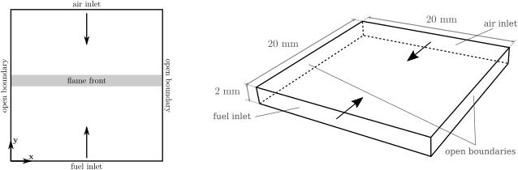
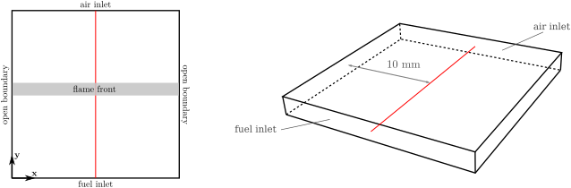
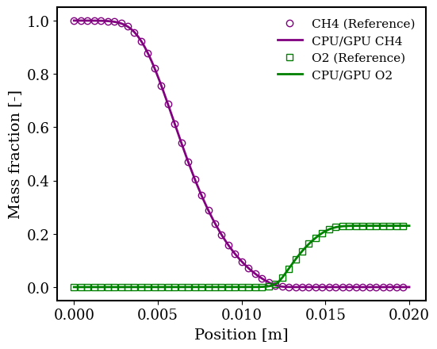
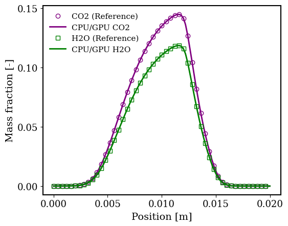
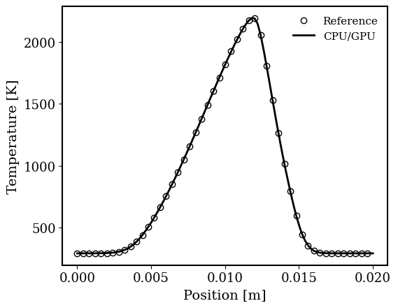
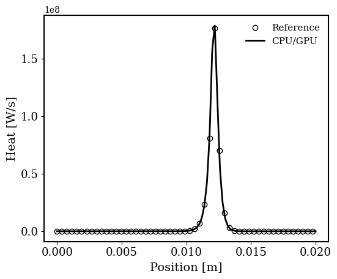

# Laminar Diffusion Counter-Flow Flame
## Authors
Federico Piscaglia and Federico Ghioldi, Politecnico di Milano, Department of Aerospace Science and Technology, Italy

## Copyright
Copyright (c) 2022-2023 Politecnico di Milano

<a rel="license" href="http://creativecommons.org/licenses/by-sa/4.0/"></a><br />

This work is licensed under a <a rel="license" href="http://creativecommons.org/licenses/by-sa/4.0/">Creative Commons Attribution-ShareAlike 4.0 International License</a>.

## Introduction
The solution of stiff ordinary differential equations (ODEs) systems is of key importance in advanced multiphysics CFD simulations; in reactive flow simulations the fluid transport is coupled to the solution of finite-rate chemistry problems. In these scenarios, the computational effort connected to the integration of the detailed chemical kinetics ODEs systems largely contributes to limit the solver speed. A possible solution to overcome this inconvenience consists of integrating the chemical ODEs systems via an adaptive multi-block explicit solver running on a Graphical Processing Unit (GPU). The idea is to dynamically redistribute the ODE system over the resources available from the GPU architecture, while the Navier-Stokes equations are solved by a multi-core CPU algorithm. The hybrid CPU/GPU solver is expected to provide a significant speed-up in reactive calculations. The performance gain is expected to increase with large-scale mechanisms, that are characterized by large workloads.

## Configuration


Figure: the two-dimensional geometry is based on the tutorial available in OpenFOAM-v2212.

The L×W squared-shaped region is two-dimensional; each side measures 0.02 m; the front and back sides (normal to the third direction) are empty. In the two-dimensional squared plane, two opposite sides are used as inlets: they introduce the fuel and the oxidizer respectively; both flows enter the domain with a velocity magnitude $\left|U\right| =$ 0.1 m/s. The remaining two sides are used as outlets for the combustion products; a freestream boundary condition is applied on them. The temperature of the jets is $T_f = T_o =$ 298 K; the internal field temperature is $T_{if} =$ 2000 K to facilitate the development of the chemical reaction chain. Atmospheric pressure is imposed initially. Air is used as oxidizer; the mixture is composed by 77\% of $N_2$ and 23\% of $O_2$. The Courant number is $Co =$ 0.25; the end time $t_f = 10^{-3}$. Further details are provided in the following sections.

## Measurements
Experiments are available from the literature for code validation[^Fernandez2016][^Reference2][^Reference3]. To compare the reference numerical solutions (legacy code of OpenFOAM) and the results obtained via the heterogeneous approach exploiting the use of GPUs, axial lines have been included as post-processing function objects; their purpose is to return values of: temperature, pressure, mass fraction, and heat released because of the occurring combustion phenomena.

## Flow parameters
- Both fuel and air: $\left|U\right| =$ 0.1 m/s, $T =$ 298 K;
- High internal field temperature: $T_{if} =$ 2000 K;
- Atmospheric pressure: $p =$ 1e5 Pa; 
- Turbulence model: laminar;
- Combustion model: laminar.

# Numerical setup
The numerical setup is based on the tutorial available in OpenFoam-v2212. A detailed description is available on the OpenFOAM wiki[^OFWiki]. The modifications to the setup which allow the treatment of the considered case via GPU chemistry model are proposed in the subsequent sections, and include the modification of the *chemistryProperties* and *controlDict* files, contained in the *constant* and *system* folder respectively. No changes are required to the numerical schemes nor the settings of the numerical solvers. Other precautions include:

- The case is two-dimensional: boundary and initial conditions are set accordingly;
- the flow is unsteady;
- the flow is laminar.

## Geometry and mesh
The problem is two-dimensional. The $L\times W$ squared-shaped region has dimensions $20$ mm $\times 20$ mm. L and W are referred to the in-plane directions. The front and back patches are normal to the third body direction, and their type is *empty*; one single cell is present along the third direction. Conversely to the setup from OpenFoam-v2212[^OFWiki],  the thickness of the geometry is reduced to facilitate the visual representation of the two-dimensional domain.
This deviation doesn't introduce a significant influence on the final results. The mesh is generated using the *blockMesh* application. The file receives as input the number of cells in x-direction, provided by the *Allrun* script. If no input is provided, the *blockMeshDict* uses the default refinement of the OpenFoam-v2212[^OFWiki] tutorial case.
Thanks to this approach it is possible to simulate various mesh refinements. The number of cells in y-direction is automatically adjusted to preserve the cells aspect ratio at various refinements.
By default the case considers 4 thousands cells. The mesh is fully hexahedrical.

## Models
- Solver: **reactingFoam** is used as the top-level solver.
- Turbulence: laminar turbulence model.
- Combustion: laminar combustion model.

## Numerics
First order, bounded, implicit time scheme; first/second order unbounded limitedLinear divergence schemes; the PIMPLE loop has 1 outer and 2 inner corrections with 0 non-orthogonal corrections. The time step interval is adjusted runtime to satisfy the imposition on the maximum acceptable Courant number (lower than 0.4).

## Boundary conditions
The following is a list of boundary conditions (BC) set for the proposed preliminary case.
The name of the files, and the chemical species concentrations at start time are subjected to changes when different chemical reactions are considered.

|Variable  |Description                   |Units    |
|----------|------------------------------|---------|
|$U$       |Axial velocity                |m/s      |
|$p$       |Pressure                      |Pa       |
|$T$       |Temperature                   |K        |
|$Y_i$     |Mass fraction of the *i*-th chemical specie |-|

### Internal field
Pressure $p =$ 1e5 Pa; temperature $T =$ 2000 K; the mass fraction of $N_2 =$ 1.
Internal field of the remaining quantities is set to zero.

### Fuel Inlet
The following are the BC applied at the fuel inlet. It is reminded that fuel might change based on the considered reaction mechanism.

|Variable  |Type                                 |Value     |
|----------|-------------------------------------|----------|
|$U$       |fixedValue                             |0.1 (ingoing)    |
|$p$       |zeroGradient                           |-       |
|$T$       |fixedValue                             |293     |
|$Y_{O_2}$ |fixedValue                             |0       |
|$Y_{N_2}$ |fixedValue                             |0       |
|$Y_{CH_4}$|fixedValue                             |1       |

### Air Inlet
The following are the BC applied at the air inlet. It is reminded that oxidizer might change based on the considered reaction mechanism.

|Variable  |Type                                 |Value     |
|----------|-------------------------------------|----------|
|$U$       |fixedValue                             |0.1 (ingoing)    |
|$p$       |zeroGradient                           |-       |
|$T$       |fixedValue                             |293     |
|$Y_{O_2}$ |fixedValue                             |0.77    |
|$Y_{N_2}$ |fixedValue                             |0.23    |
|$Y_{CH_4}$|fixedValue                             |0       |

### Outlet
The following are the BC applied at the two side outlets.

|Variable  |Type                                 |Value     |
|----------|-------------------------------------|----------|
|$U$       |pressureInletOutletVelocity      |internalField |
|$p$       |totalPressure                    |internalField |
|$T$       |inletOutlet                      |internalField |
|$Y_{O_2}$ |inletOutlet                      |internalField |
|$Y_{N_2}$ |inletOutlet                      |internalField |
|$Y_{CH_4}$|inletOutlet                      |internalField |

### Front and Back
The quantities connected to front and back patches are set to empty as the case is two-dimensional.

# Validation
A preliminary simple chain is investigated in the proposed test to validate the code and the setup. Even though the chain is composed by a single non-stiff reaction, a computational speedup can already be appreciated when using modern hardware architectures and fine meshes. Subsequent investigations are performed considering more complex chains, which are added to the *constant* folder. A preliminary set of results is available in the *validation* folder. The results contained in *validation/CPU* consider the single reaction mechanism proposed in the microbenchmark and an entTime of 0.5 s. The solutions are extracted along an axial line passing through the center of the two-dimensional domain, along the axis which connects the fuel and the oxidiser inlets (see the figure below).



The code validation is performed by comparing the results produced by the developed run against those contained in the *validation* folder. At the end of the run, the *Allvalidate* script automatically uses the solution contained in the last-time folder of *postProcessing/axialLines*. The post processing is developed thanks to the file *Allvalidation*, which returns 4 figures prduced via *gnuplot*. The figures for a successful run are proposed below.

|Reactants|Combustion products|Temperature|Heat released|
|-|-|-|-|
||||


# Microbenchmark
- Known to run with OpenFOAM-v2212;
- A single folder case is provided;
- Multiple tests can be performed by varying the number of cells and chemical reactions;
- An entire run for code validation with the proposed setup lasts less than 3 minutes in single core;
- Automatic light post processing for code validation via *gnuplot* eases code development and debug.

## Run time statistics
By using the proposed settings the entire simulation runs in less than 5 minutes using both the native CPU mode and the hybrid CPU/GPU heterogeneous approach. This is mainly due to the small reaction mechanism initially used to compare CPU native and hybrid CPU/GPU solutions. A different setup might be needed to satisfy the runtime constraint of 5 minutes for more complex cases involving stiffer mechanisms with higher number of species and reactions. Validation of the results is automatically performed at *endTime* by exploiting: the post-processing functions objects contained in the *controlDict* file; the files generated automatically because of the active function objects.

**Bottlenecks:**
Detailed finite-rate chemical kinetics is required to accurately describe combustion physics and flame front propagation. However, this implies the presence of large and stiff ODE systems. In reactive flow problems, their solution represents one of the main bottlenecks and contributes to limit the obtainment of high computational speed-ups of the entire simulation. CFL constraints typical of reactive flow simulations seriously limit the time step advancement. A large number of integration steps is necessary to solve the chemistry problem.

## Instructions

### Preliminary
- Compile the model *GPUChemistryModel* via the *Allwmake* file contained in the folder *thermophysicalModels*
    - first, the Allwmake automatically compiles the NVIDIA CUDA scripts
    - then, the Allwmake compiles the CPU scripts to add the GPUChemistryModel to the runTime selection table
- Set the *constant/chemistryProperties* file to develop the simulation with the new model
    ```c++
    chemistryType
    {
        method          GPU;
        solver          gpu;
    }

    chemistry                   on;
    initialChemicalTimeStep     1e-07;

    gpuCoeffs
    {
        solver          RKCK45;
        absTol          1e-12;
        relTol          1e-1;
    }
    ```
- Add the two compiled libraries to the *system/controlDict* file
     ```c++
    libs("libcudaPoliMi libchemistryModelPoliMi")
    ```

### Case run
The main folder of the case contains an *Allrun* script. The *Allrun* script accepts a parameter (integer) at launch.
The accepted parameter represents the number of cells in x-direction for the mesh generation which is automatically loaded in the *system/blockMeshDict* file. In this way, various simulations at different mesh resolutions can be developed in this single test case. If no parameter is provided to the *Allrun* execution, a default one $N =$ 100 is used. The same number is also applied to the postProcessing script. The procedure is perfomed as follows:
```sh
foamDictionary system/blockMeshDict -entry nCellsX -set $nCellsX
foamDictionary system/flameFront -entry nCellsX -set $nCellsX

runApplication blockMesh
runApplication $(getApplication)

./validation/Allvalidate
```

### Postprocessing
A *validation* folder is available. It contains an *Allvalidate* script which is automatically launched at the end of the run. In the *validation* folder there are postProcessing files which provide a reference solution that should be used to compare the result against the newly developed GPU chemistry model. The plots are generated via *gnuplot* and saved in PDF format.

# Acknowledgment
This application has been developed as part of the exaFOAM Project https://www.exafoam.eu, which has received funding from the European High-Performance Computing Joint Undertaking (JU) under grant agreement No 956416. The JU receives support from the European Union's Horizon 2020 research and innovation programme and France, Germany, Italy, Croatia, Spain, Greece, and Portugal.


# Footnotes
[^Fernandez2016]: Eduardo Fernández-Tarrazo, Mario Sanchez-Sanz, Antonio Sánchez, and Forman Williams. A multipurpose reduced chemical-kinetic mechanism for methanol combustion. Combustion Theory and Modelling, 20:1–19, 05 2016.
[^OFWiki]: https://openfoamwiki.net/index.php/Main_Page
[^Reference2]: Fusheng Xu, Stephen D. Tse, Jafar F. Al-Sharab, and Bernard H. Kear. Flame synthesis of aligned tungsten oxide nanowires. Applied Physics Letters, 88(24):243115, 2006.
[^Reference3]: S. Yokoi, S. Mikami, Yoshiya Matsukawa, Yasuhiro Saito, Y. Matsushita, H. Aoki, and W. Malalasekera. Improvement of the prediction accuracy of no emissions in counter-flow diffusion flames on using no mass fraction as a progress variable. 2017.
