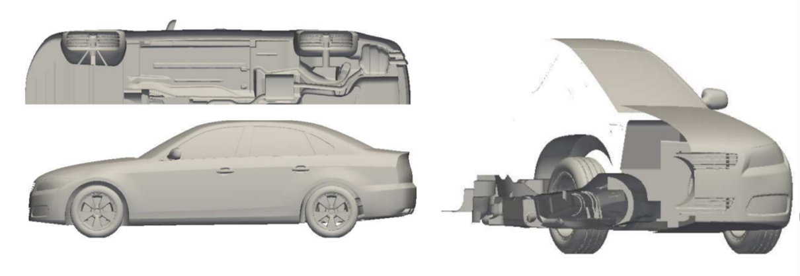
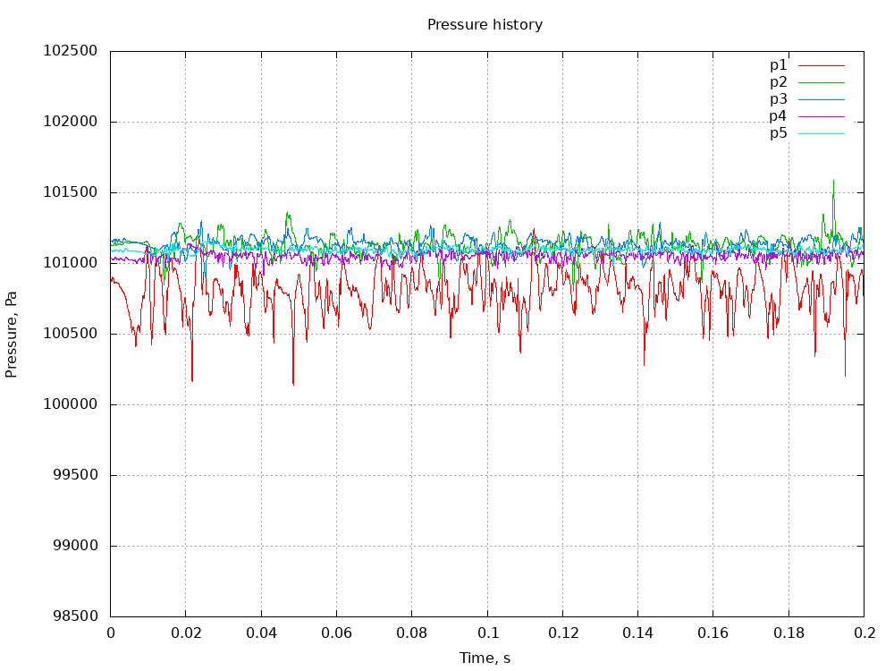
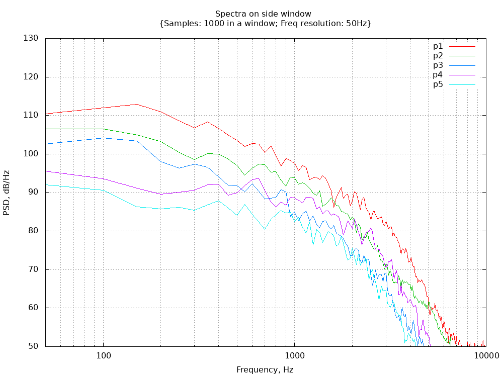
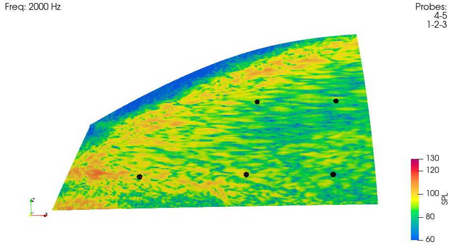

# I7 AEROACOUSTICS DRIVAER DERIVATIVE

## Authors
ESI-Group, 2023

## Copyright
Copyright (c) 2022-2023 ESI-Group

 This work is licensed under a <a rel="license" href="http://creativecommons.org/licenses/by-sa/4.0/">Creative Commons Attribution-ShareAlike 4.0 International License</a>.

## Description
This industrial test case is supported by the micro benchmarks MB16: Simplified HMC Aeroacoustics Vehicle, and MB17: 1D Aeroacoustics Wave Train, and is of direct interest to Stakeholders GM and Audi (VW Group).

It comprises the now ubiquitous DrivAer geometries which combine the front and rear portions of production vehicles. This derivative originates from Ford Motor Company and is modified in computation setup only (not geometry) to be compatible with the requirements of aeroacoustics simulation in OpenFOAM, consistent with the best-practices enumerated in MB16 and MB17. The geometry is shown in Figure 1 below, comprising static wheels, suspension and break assembly, detailed underbody, and simplified under-hood. 

Figure 1: DrivAer Aeroacoustic derivative geometry.

The meshing criteria applied to the A pillar and side-mirror are consistent with the practices used in MB16, namely a minimum requirement for the A-pillar and side-mirror to be meshed to 1mm or lower, and side-glass in the wake of these two components to 2mm or lower.

Figure 2: Instantaneous Iso-surface of Q-criterion (with mapped velocity magnitude) and fluctuating pressure (Pa)

The images above in Figure 2 show the key mechanisms of aeroacoustic noise generation especially around the A-pillar side-glass impingement, and mirror wake.

Arising from these aeroacoustics mechanisms are unsteady pressures impinging on the side-glass. The effects may be summarised by instantaneous pressure at various points on the glass (Figure 3.a), Power Spectra (Figure 3.b) , and Spatial distributions at several frequencies between 1-5kHz (Figure 4)

Figure 3: a) Pressure(Pa) at various probes b) PSD (dB/Hz) at five probe location for time duration of 0.1-0.2s

Figure 4: Surface Pressure (dB) spectral distribution on the side-glass at 2000Hz

## Bottlenecks
The bottlenecks and HPC challenges towards exa-scale computing are restated below:
  - Scalability of the mesher using volume and surface-layer refinement.
    - I/O
    - Re-composition and decomposition
  - Acoustic data I/O written our nominally every time-step or fixed integer time-step frequency. Checkpoint files needed for surface and volume data analysis can overwhelm storage subsystem
    - Point information output for point-spectral data analysis
    - Surface information output for surface-spectral data analysis
    - Volume information output for volume-spectral data analysis
    - Checkpoint files needed by the analysis can overwhelm storage subsystem

## Case Details
Notwithstanding the fundamental requirements stated in the Description section, the case can be scaled to any level of HPC requirement to demonstrate applicability towards exa-scale computing. The baseline case contains 96 million cells (symmetry model), near-wall meshing resolution down below y+ =1 on all key components (windshield, A-pillar, mirror and side-glass) relative to a vehicle speed of 140kph.

## Run acceptance criteria
Qualitative comparisons equivalent to the baseline case shown in Figures 3 and 4. Experimental data is not available; nevertheless, quantitative comparisons are demonstrated in MB16 using exactly the same OpenFOAM methodologies.

## Improvement targets:
  - Improved scalability compared to the baseline case executed in an OpenFOAM version available prior to this Workpackage (e.g. OpenFOAM-v2306)
  - Improved I/O performance for point, surface or volume data output

## Instructions to run the case
The setup is tested in OpenFOAM v2306.

Allrun script has instructions to copy geometry constant/triSurface.
However, if they are missing in "$FOAM_TUTORIALS/resources/geometry/I7_aeroacoustics_DrivAer" please fetch them first from the DaRUS data repository under: https://doi.org/10.18419/darus-3736

Execution is typically a call to Allrun script with required number of processors as argument. e.g. ./Allrun 256

Any post-processing (like gnuplot) could be evaluated separately.

## References
ESI Aeroacoustics Training Course Material 2016-2023, Applications: Aeroacoustics (<a href="https://www.openfoam.com">openfoam.com</a>)

## Acknowledgment
This application has been developed as part of the exaFOAM Project https://www.exafoam.eu, which has received funding from the European High-Performance Computing Joint Undertaking (JU) under grant agreement No 956416. The JU receives support from the European Union's Horizon 2020 research and innovation programme and France, Germany, Italy, Croatia, Spain, Greece, and Portugal.

