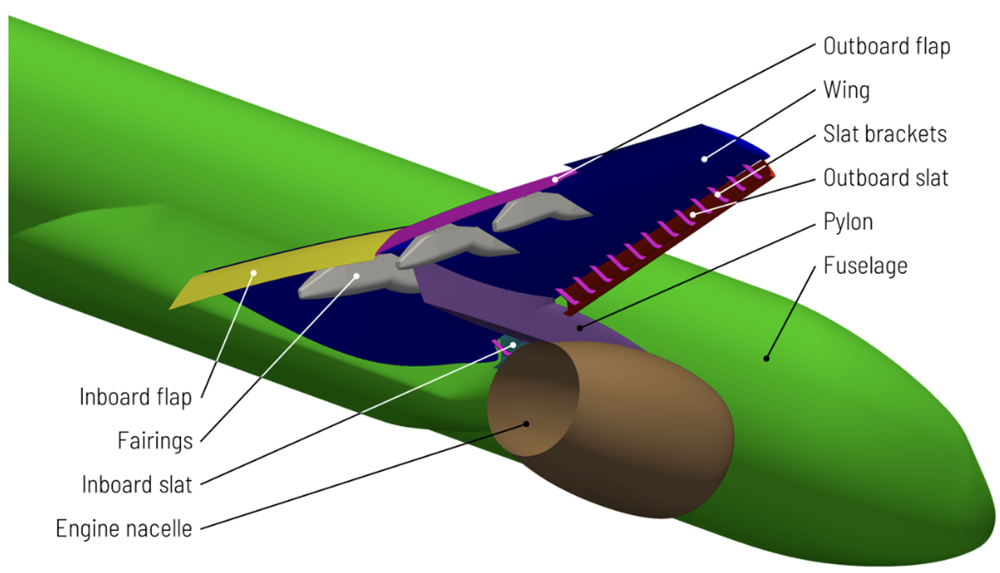
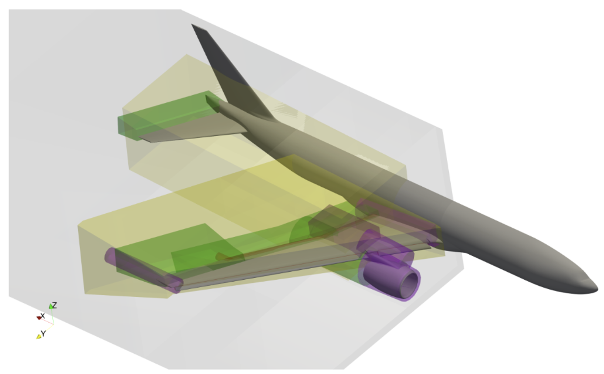
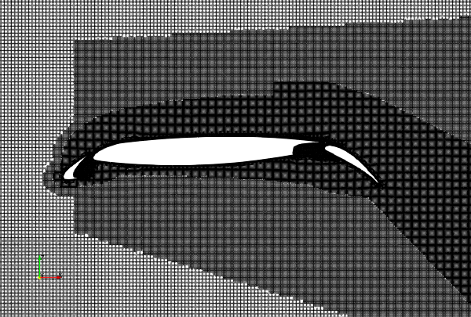
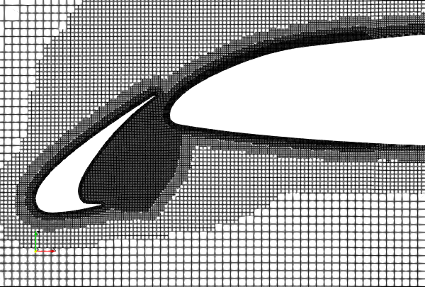
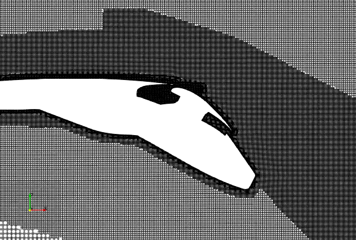
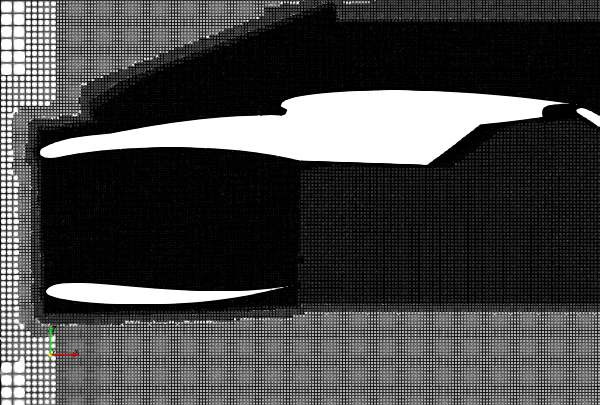
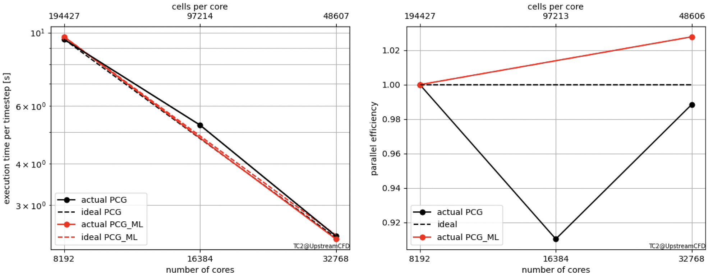

# A WMLES benchmark of the High-Lift Common Research Model 
## Authors
Charles Mockett, Felix Kramer, and Julius Bergmann, Upstream CFD GmbH, 2022-2024

## Copyright
Copyright (c) 2022-2024 Upstream CFD GmbH

 This work is licensed under a <a rel="license" href="http://creativecommons.org/licenses/by-sa/4.0/">Creative Commons Attribution-ShareAlike 4.0 International License</a>.

## Configuration
The NASA Common Research Model builds a link between complex (and often proprietary) industry-relevant geometries, and simpler public-domain geometries. First designs were settled in 2008 for the high-speed case [^rivers2020] before later in 2016 the high-lift configuration was released[^lacy2016]. This geometry acts as a solid foundation for public high-lift research with available experimental results. An image depicting the different parts of the geometry can be found in Figure 1.

From the various variants of the CRM-HL being compared in the 5th AIAA CFD High Lift Prediction Workshop[^HLPW5] (HLPW5), the case 2.4 (ONERA_LRM-LDG-HV) offered by ONERA is used here. 

In this configuration the airflow around the airplane is to be computed in a landing configuration. For that, the geometry includes inboard and outboard leading-edge slats and inboard and outboard single-slotted flaps to increase the effective camber and therefore lift. These high lift devices are attached by brackets to the main wing, which increases the geometric complexity and meshing challenge. The flow-through engine nacelle is a simplification to facilitate wind tunnel measurements and eliminate the need to include propulsion effects in the simulations. Furthermore, the fuselage was kept simplistic without additional details.

Figure 1: Geometric parts of the CRM-HL model.
## Flow Parameters
- Reference aerodynamic chord $c=7.00532$m
- Reynolds number based on chord length $Re_c=5.9\cdot10^6$
- Freestream Mach number $Ma=0.2$
- Angle of attack $\alpha=19.7?$
- Ambient conditions $p_\infty=18314$ Pa and $T_\infty=288.15$K

## Numerical Setup
The wall-modelled LES functionality is provided by the libWallModelledLES[^libwmles] based on [^mukha2019]. The mesh expands in the x- and z-directions from $-2000$m to $2000$m, and in the y-direction from $0$m to $2000$m. At $y=0$m, a symmetry plane is applied cutting the model at its symmetry plane. The angle of attack is realised by turning the inflow velocity vector.

## Mesh
The mesh used for this benchmark consists of 1.79 billion cells. It is generated using snappyHexMesh in parallel on 8192 cores, and commences from a background blockMesh resolution at cell level zero of $L_0=74$m. The dominant refinement level of the final mesh is 13 (500 million cells) with $L_{13}=9$mm, followed by levels 14 and 15 (both 330 million cells) and $L_{14}=4.5$mm and $L_{15}=2.25$mm respectively. An overview of the volumetric refinement regions is given in Figure 2.

Figure 2: Volumetric refinement regions.

Figures 3 show some slices of the mesh at key details of the model. The meshing achieves a coverage of more than 99% with 2 surface layers.

 

 

Figure 3: Mesh details. top left: wing, top right: slat, bottom left: flap track fairing, bottom right: nacelle.

## Instructions
### Prerequisites and additional information
- Known to run with OpenFOAM-v2312, gcc12.2.0, Cray MPICH 8.1.27, Cray Programming Environment 8.1.27 on  2x AMD EPYC 7763 (2.45 GHz base, 3.5 GHz boost)
- Mesh generation designed and tested with decomposition on 8192 cores and 1.79 billion cells, takes approx. 1.5h
- Workflow designed to store mesh entirely in parallel 
- Fixed number of PIMPLE iterations
- Currently predefined partitioner for solving: hierarchical
- hSampler is set here to 0 for robustness. The benchmark results shown below used 2 instead.

### Meshing and Running
- Adapt the script Allrun.hpc to your MPI run executable (e.g. parEx=srun (on slurm) or parEx="mpirun -n 8192")
- Run the script Allrun.hpc
- The script produces the mesh and starts a simulation for 200 timesteps using rhoPimpleFoam

## Benchmark Results
In the course of the exaFOAM project, a slightly different mesh with 1.6 billion cells was benchmarked. The scalability results are shown in Figure 4 for two decomposition strategies. Simple hierarchical is slighly faster than multi-level hierarchical (indicated by "_ML") at low core counts. Multi-level is applied here on the node, the socket and the core level. At high core counts, the multi-level decomposition is slightly faster leading to a parallel efficiency above 1. These results were produced with OpenFOAM-v2312 (gcc12.2.0, Cray MPICH 8.1.27, Cray Programming Environment 8.1.27) on LUMI-C consisting of Epyc Milan nodes (2x AMD EPYC 7763). Due to insufficient computational resources, the simulations started from scratch (initialized only with applyBoundaryLayer) for 200. From inspection of the execution time per timestep, it was inferred that evaluating the last 100 timesteps is sufficiently representative.

Figure 4: Scalability and parallel efficiency comparing hierarchical to multi-level hierarchical.

## Acknowledgment
This application has been developed as part of the exaFOAM Project https://www.exafoam.eu, which has received funding from the European High-Performance Computing Joint Undertaking (JU) under grant agreement No 956416. The JU receives support from the European Union's Horizon 2020 research and innovation programme and France, Germany, Italy, Croatia, Spain, Greece, and Portugal.

The geometric files here are taken (and partially derived) from case 2.4 of the 5th AIAA CFD High Lift Prediction Workshop (HLPW5). The Creative Commons license does not apply to these files. Please refer to https://hiliftpw.larc.nasa.gov/Workshop5/geometries.html for details. The authors wish to express their sincere thanks to all organizers and contributors for sharing the data and knowledge, and putting so much effort into the workshop.

We acknowledge the EuroHPC Joint Undertaking for awarding this project access to the EuroHPC supercomputer LUMI, hosted by CSC (Finland) and the LUMI consortium through a EuroHPC Development Access call.

Some simulations were performed on the national supercomputer HPE Apollo Hawk at the High Performance Computing Center Stuttgart (HLRS) under a test account.

The authors gratefully acknowledge the HPC RIVR consortium (www.hpc-rivr.si) and EuroHPC JU (eurohpc-ju.europa.eu) for funding this research by providing computing resources of the HPC system Vega at the Institute of Information Science (www.izum.si).

## Footnotes
[^rivers2020]: M.B. Rivers (2020):  _NASA Common Research Model: A History and Future Plans_. AIAA Paper 2019-3725, [https://doi.org/10.2514/6.2019-3725](https://doi.org/10.2514/6.2019-3725).
[^lacy2016]: D.S. Lacy and A.J. Sclafani (2016): Development of the High Lift Common Research Model (HL-CRM): A Representative High Lift Configuration for Transonic Transports. AIAA Paper 2016-0308, [https://doi.org/10.2514/6.2016-0308](https://doi.org/10.2514/6.2016-0308).
[^HLPW5]: https://hiliftpw.larc.nasa.gov
[^mukha2019]: T. Mukha, S. Rezaeiravesh, M. Liefvendahl, A library for wall-modelled large-eddy simulation based on OpenFOAM technology, Computer Physics Communications, Volume 239, 2019, Pages 204-224, ISSN 0010-4655, https://doi.org/10.1016/j.cpc.2019.01.016
[^libwmles]: https://github.com/timofeymukha/libWallModelledLES
