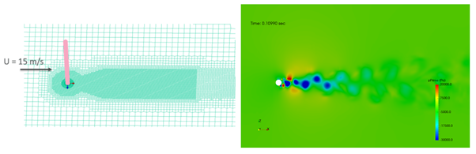
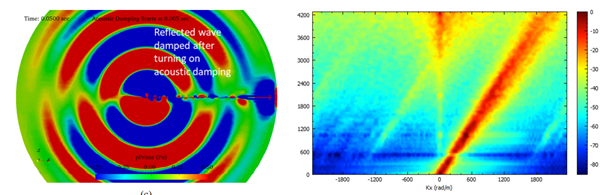
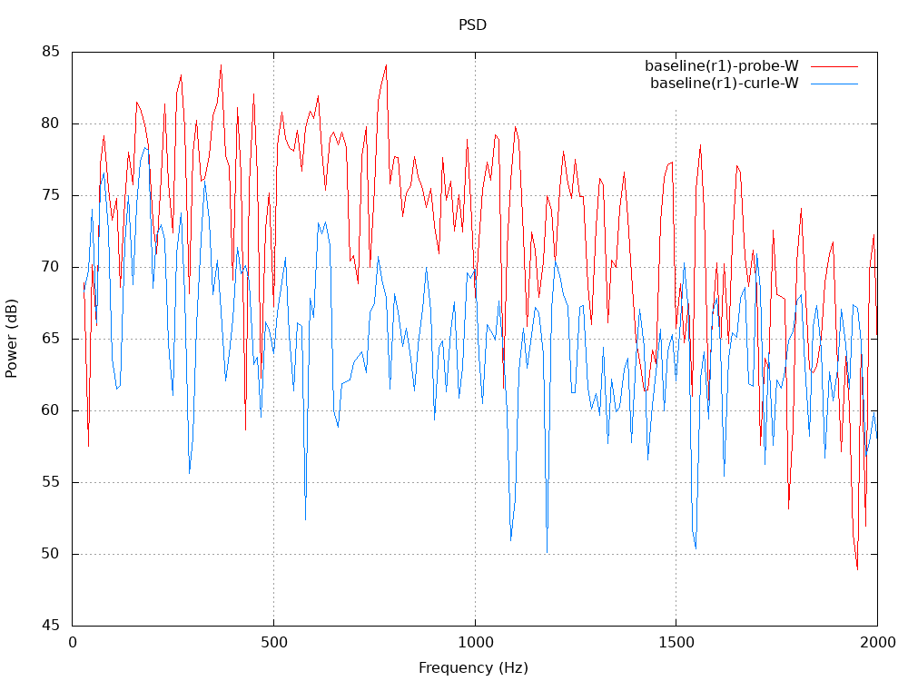
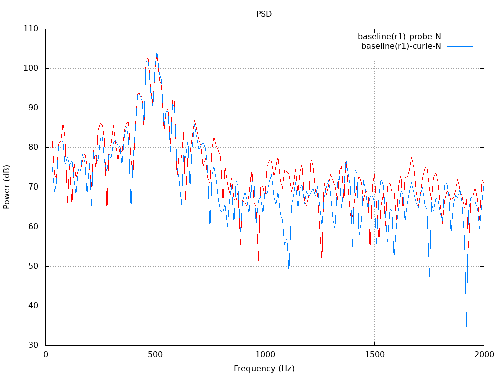
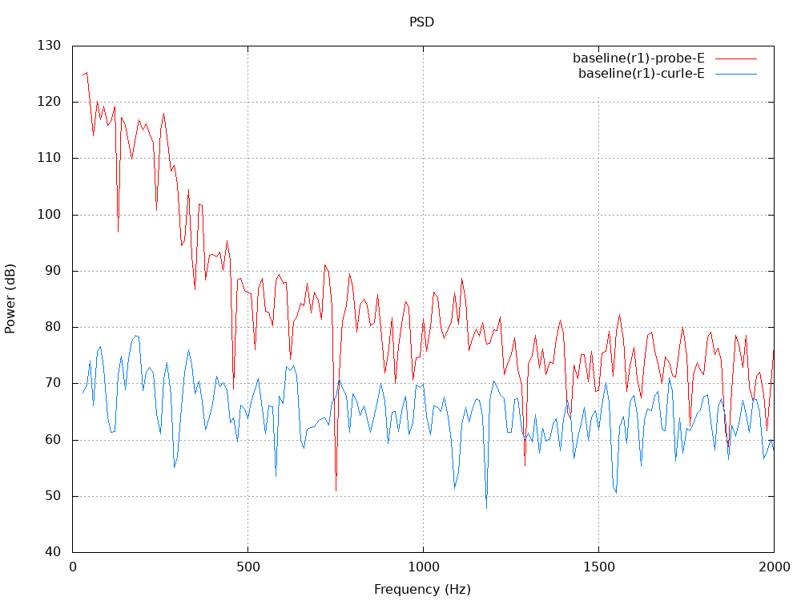
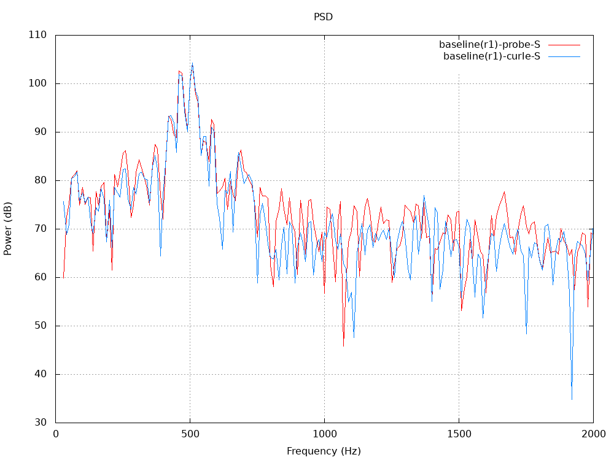

## MB14 HYDROACOUSTIC SHEDDING CYLINDER

## Authors
ESI-Group, 2023

## Copyright
Copyright (c) 2022-2023 ESI-Group

 This work is licensed under a <a rel="license" href="http://creativecommons.org/licenses/by-sa/4.0/">Creative Commons Attribution-ShareAlike 4.0 International License</a>.

## Motivation
This case is a subset of MB13 in respect of a two-dimensional geometry solved in 3D and periodic flow using the OpenFOAM transient compressible solvers. It deals with multiple scales arising in small scale from turbulent viscous flows (boundary-layer, separated and wake) and large scales in respect of hydroacoustic waves of very long wavelengths propagating to the far-field.
The interest in HPC towards exascale is to provide a subset of physics which can be quickly profiled and tested for scaling. It is also connected with the MB15: 1D hydroacoustic wave train, which is a further micro-benchmark scaling, useful for validation in the fine-mesh limit.

Figure 1: 2D cylinder meshed in 3D (left) and instantaneous representation of hydroacoustic pressure propagation due to von Karman vortex shedding in the cylinder wake (right)

## Case Description
A 3D cylinder case (0.1m length with cylic boundaries) simulated at Re = 1.058 x 105 exhibits Strouhal shedding at St ~ 0.2 . This study also demonstrates the effects of applying hydroacoustics damping to eliminate reflections from spurious mesh effects and reflecting boundaries. The cylinder diameter is D = 6 mm and its span is 100mm resulting into the span to diameter ratio of 16.67. The cylinder is located in the centre of a spherical domain, driven by freestream velocity boundary.Both cross-sectional patches are cyclicAMI. The inlet flow velocity is 15 m/s. These conditions correspond to typical turbulence generation mechanisms around 500 Hz for a ship hull at typical dimensions and cruise speed. Diameter of the semi-spherical domain is 17.2 m which is equal to 2866.67D.
The acousticDampingSource has been used to damp spurious pressure waves for acoustic analyses [Mendonca, 2016]. It provides a test for the use of spatially varying sources applied via fvOptions.

## Preliminary results and Validation
After Mendonca (2013), an efficient post-processing method to analyse the acoustic and hydrodynamic content of one and 2D pressure fields using wavenumber-frequency analysis can be applied. This double spatial-temporal Fourier analysis identifies convective and acoustic mechanisms in the flow-field. Figure 2 shows, by analysing the region of the near wake of the cylinder, that the Ky and Kx content of the wavenumber frequency spectrum is dominated by a right-traveling convective stream at velocity 15 m/s calculable directly from the Kx-Hz curve gradient. Correspondingly, it also shows left and right traveling acoustic waves, Ky-Hz gradient in the positive and negative directions clearly indicating the acoustical wave-speed of 1500 m/s

  

Figure 2: 2D cylinder meshed in 3D (left) and instantaneous representation of hydroacoustic pressure propagation due to von Karman vortex shedding in the cylinder wake (right)

Four probes at 0.5m from axis of cylinder were used to monitor pressure fluctuation during transient simulation. A FFT analysis of the signal is plotted below (for nref=1 case). We can clearly observe peak at 500Hz in North and South probes. Intensity on West side is bounded due to cancellation effect while on East side we have additional influence from wake turbulence.
These data will form the basis of all HPC comparisons in the HPC scaling studies performed during this project.
  |||
  |----|----|----|
  | || |

Figure 2: SPL spectra (nref = 1) at given probe points and mesh section showing probe location

## Bottlenecks
The bottlenecks to be addressed in exaFOAM using the release code series OpenFOAM-vYYMM are:
  - Scalability of the mesher using volume and surface-layer refinement.
  - Scalability of flow solver to a large number of processor cores, using a simple methods of mesh scaling from above as follows;
    - Volume mesh refined on a 2x2x2, nomically increasing the hex-volume mesh count by factor 8
    - Surface extruded mesh after castellation and snapping refined 2x2 snapped on to the surface, nominally increasing the extruded-layer mesh count by factor 4
  - Scalability test for the use of spatially varying sources applied via fvOptions (acousticDampingSource).

## Instructions to run the case
The setup for nref=1 (baseline) is tested in OpenFOAM v2206.
As this case needs of a custom library for extrusion, ensure we can compile code on hardware where we run the case. The compilation itself is on-the-fly driven inside Allrun.

We have flexibility to scale the mesh simply by changing this (nref) parameter inside file parameters, and for each increment, the mesh might scale upto 8^(nref-1) than previous level.

Execution is typically a call to Allrun script with required number of processors as argument. e.g. ./Allrun 16

Selecting both nref and the number of cores gives flexibility to compare scalability. For example, one could use lower nref (1-3) to study scalability with lower core number, and go higher if larger hardware is available.

The case should build automatically according to 'nref' and number of processors requested. Any post-processing (like gnuplot) could be evaluated separately.

## References
Mendonça, Fred, <a href="https://www.openfoam.com/news/main-news/openfoam-v1606/solvers-and-physics#solvers-and-physics-acoustic-damping">Technical Note on Acoustic Damping Implementation in OpenFOAM </a> 2016

Mendonca, F. G., Shaw, T., Mueller, A., Bremner, P., and Clifton, S., 2013. ?CDF-based wave-number analysis of side-view mirror aeroacoustics towards aero-vibroacoustic interior noise transmission?. SAE Technical Paper, 04.

## Acknowledgment
This application has been developed as part of the exaFOAM Project https://www.exafoam.eu, which has received funding from the European High-Performance Computing Joint Undertaking (JU) under grant agreement No 956416. The JU receives support from the European Union's Horizon 2020 research and innovation programme and France, Germany, Italy, Croatia, Spain, Greece, and Portugal.

