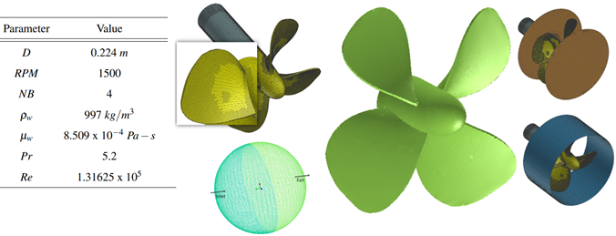
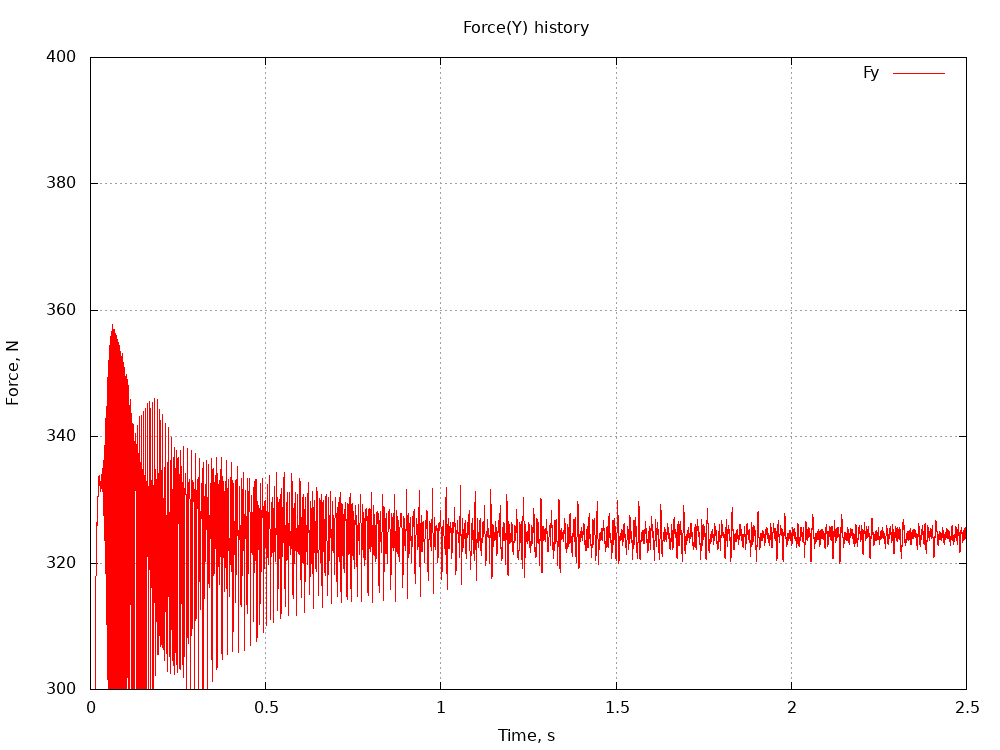
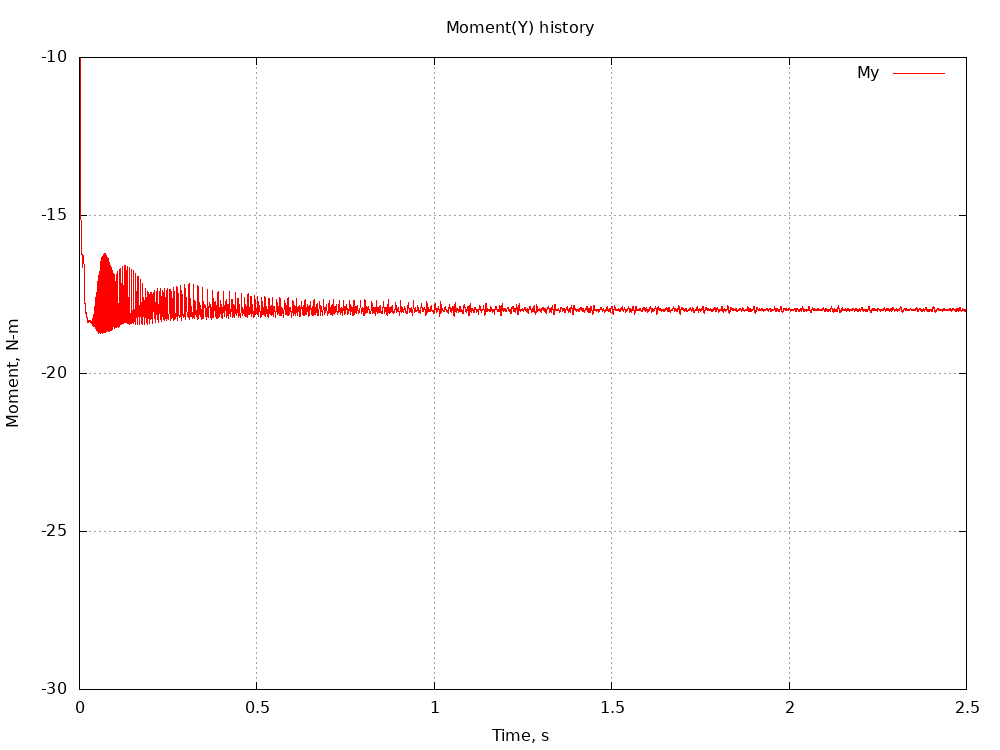
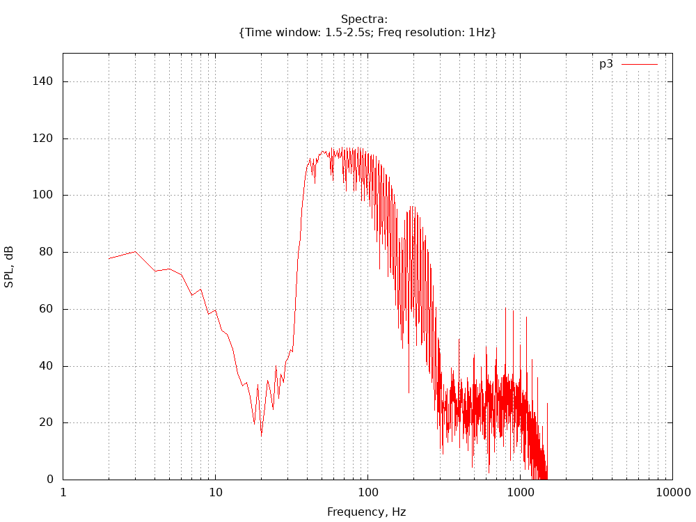
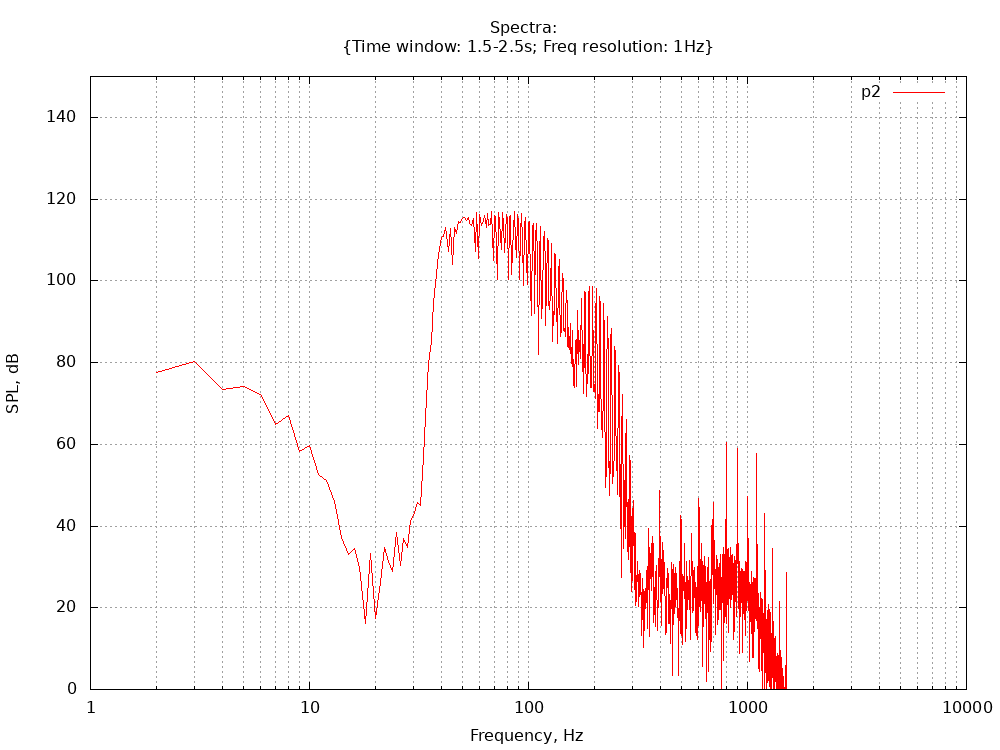
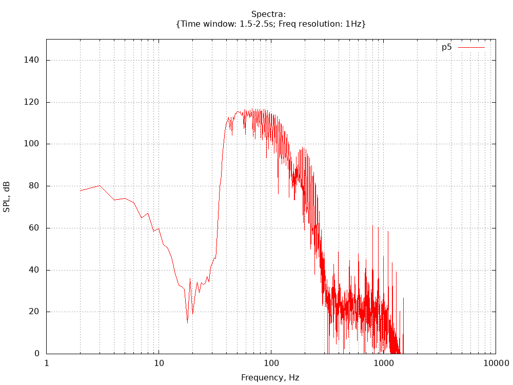
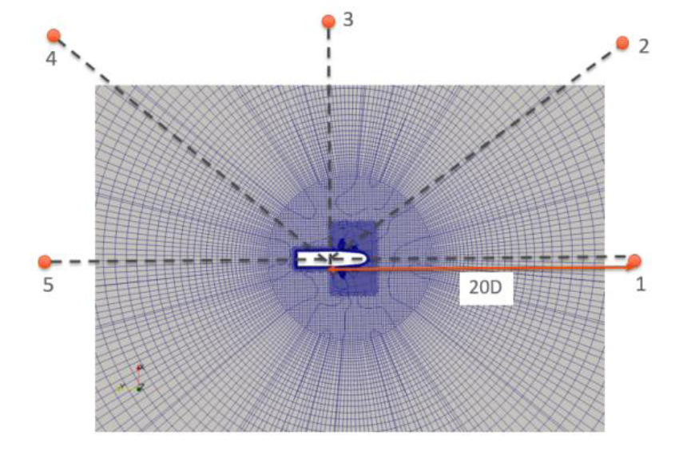

## MB13 MARINE PROPELLER

## Authors
ESI-Group, 2023

## Copyright
Copyright (c) 2022-2023 ESI-Group

 This work is licensed under a <a rel="license" href="http://creativecommons.org/licenses/by-sa/4.0/">Creative Commons Attribution-ShareAlike 4.0 International License</a>.

## Motivation
This case deals with application to the Marine Transportation sector and also has relevance to Aerospace Propulsion. The computational setup can include single or multiple rotating frames of reference, steady-state or transient. It permits the further option of assessing the turbomachinery rotating system in overset meshing mode to be profiled and optimized in HPC towards exascale.
The primary purpose of this microbenchmark is for turbomachinery sub-models. Nevertheless, the physics covers a wide range from boundary-layer and turbulence, attached and separated flows, incompressible and compressible flow (the latter in the formally low-speed incompressible regime), as well as high speed towards transonic Mach numbers and compressible in the form of pressure wave/acoustic wave propagation), single or multiphase (the latter in respect of phase change in marine cavitation).
It is also connected with the Microbenchmarks MB14: Hydroacoustic Shedding Cylinder and MB15: 1D hydroacoustic wave train, which also deal with multi-dimensional turbulence and hydroacoustic wave propagation.
Herein is reserved the possibility to add a new Benchmark case for Marine Propeller, selected from the Pi-Aquo project. PIAQUO - Protect marine life from noise pollution (<a href="http://lifepiaquo-urn.eu/">lifepiaquo-urn.eu</a>)

## Case Description
The marine propeller used in the present study has four blades and the diameter (D) of 0.224m. Geometry and flow parameters are listed in the table inset below in Figure 1. 

Figure 1: Propeller geometry and mesh

Hexahedral-dominant polyhedra mesh is generated using OpenFOAM SnappyHexMesh. As baseline, mesh about 4M cells is generated. The first cell height is frozen to keep it unchanged during next refinement levels (nref > 1) and still obtain similar quality mesh at properller. There are 5 layers in the boundary layer with expansion ratio of 1.2. The figure shows the mesh on the propeller blade and on the shaft along the inset showing the mesh clustering near the edges of the blade. The figure also shows the spherical computational domain which has a radius of 600 m in the far-field direction. In order to model the rotation of the propeller, the volume is divided into two regions: the rotating region close to the propeller and the outer region, coupled via the standard sliding mesh implementation in OpenFOAM. The data across the regions are interpolated through the AMI boundary in OpenFOAM. The figure shows the cylindrical interfaces which separate the rotating and non-rotating regions.

The feature referred to as numerical 'Acoustic Damping' is turned on at the radius of 300m and is gradually increased with the maximum value at the radius of 450m and beyond. The optimal target frequency to be damped is the BPF, 100 Hz. For turbulence modelling, k-Omega SST Delayed Detached Eddy Simulation (DDES), is used. This turbulence model has been used and proved effective previously by others in the past. For baseline (nref=1) The time step is 1e-4 sec and the unsteady simulation is run for 2.5 seconds corresponding to 62.5 propeller revolutions. The inlet flow velocity U is equal to 5 m/s. Nominal advance coefficient is set to be equal to J = 0.892 as defined as: J = U /(nD), where, U is the inlet velocity, n is the revolution per second and D is the impeller diameter. Constant velocity boundary condition at the inlet and outlet pressure is specified at the far-field. Grid and time-step dependency studies are usually necessary for reliable numerical results. A benchmark case with a sinusoidal pressure pulse was run to check the information transfer between rotating and non-rotating mesh interface.

## Preliminary results and Validation
Steady-state simulation is performed as pre-cursors to the transient analysis, using MRF (moving reference frame). We monitor forces and moments acting on propeller and for baseline (nref=1) case the convergence can look as shown below.
  - 
  - 

In the transient simulation, for far-field hydroacoustics calculations, pressure is sampled at five points lying at a distance of 4.48 m (20D) from the propeller as shown in Figure2 (bottom center). The instantaneous pressure is saved at each time step, and we can sample required points in noise analysis, here we use 10000 points from 1.5 to 2.5 seconds.

Transient FFT analysis of the signal is plotted below (for nref=1 case). Narrowband features can be seen at multiples of 100 Hz which correspond to the harmonics of blade passage frequency (BPF). The peak at 100 Hz at location (1) in the propeller wake is contaminated by the turbulence in the wake flow. This analysis clearly demonstrates the presence of two noise sources in the flow field: dipole source due to motion of propeller blade-passing, and quadrupole like noise source due to turbulent flow in the wake. These data will form the basis of all HPC comparisons in the HPC scaling studies performed during this project.
  |||
  |----|----|----|
  ||||

Figure 2: SPL spectra (nref = 1) at given probe points and mesh section showing probe location

## Bottlenecks
The bottlenecks to be addressed in exaFOAM using the release code series OpenFOAM-vYYMM are:
  - Scalability of the mesher using volume and surface-layer refinement.
    - I/O
    - Re-composition and decomposition
  - Scalability of flow solver to a large number of processor cores, using a simple methods of mesh scaling from above as follows;
    - Volume mesh refined on a 2x2x2, nomically increasing the hex-volume mesh count by factor 8
    - Surface extruded mesh after castellation and snapping refined 2x2 snapped on to the surface, nominally increasing the extruded-layer mesh count by factor 4
  - Acoustic data I/O written our nominally every time-step or fixed integer time-step frequency. Checkpoint files needed for surface and volume data analysis can overwhelm storage subsystem
    - Point information output for point-spectral data analysis
    - Surface information output for surface-spectral data analysis
    - Volume information output for volume-spectral data analysis
    - Checkpoint files needed by the analysis can overwhelm storage subsystem

## Instructions to run the case
The setup for nref=1 (baseline) is tested in OpenFOAM v2206.

We have flexibility to scale the mesh simply by changing this (nref) parameter inside file system/parameters, and for each increment, the mesh might scale upto 8^(nref-1) than previous level.

Execution is typically a call to Allrun script with required number of processors as argument. e.g. ./Allrun 16

Selecting both nref and the number of cores gives flexibility to compare scalability. For example, one could use lower nref (1-3) to study scalability with lower core number, and go higher if larger hardware is available.

The case should build automatically according to 'nref' and number of processors requested. Any post-processing (like gnuplot) could be evaluated separately.

## References
Koushik Sengupta, Swati Saxena, Fred Mendonça, "NUMERICAL SIMULATION FOR MARINE PROPELLER HYDROACOUSTICS USING OPENFOAM" GT2018-76932

PIAQUO - Protect marine life from noise pollution (<a href="http://lifepiaquo-urn.eu/">lifepiaquo-urn.eu</a>)

## Acknowledgment
This application has been developed as part of the exaFOAM Project https://www.exafoam.eu, which has received funding from the European High-Performance Computing Joint Undertaking (JU) under grant agreement No 956416. The JU receives support from the European Union's Horizon 2020 research and innovation programme and France, Germany, Italy, Croatia, Spain, Greece, and Portugal.

