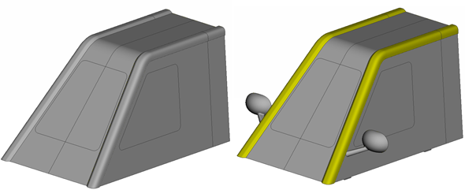
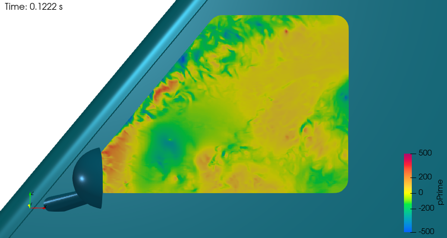
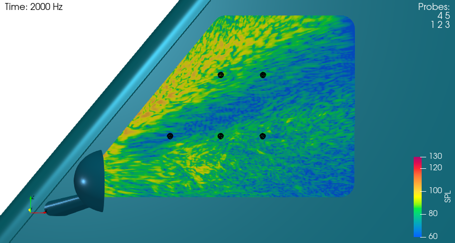
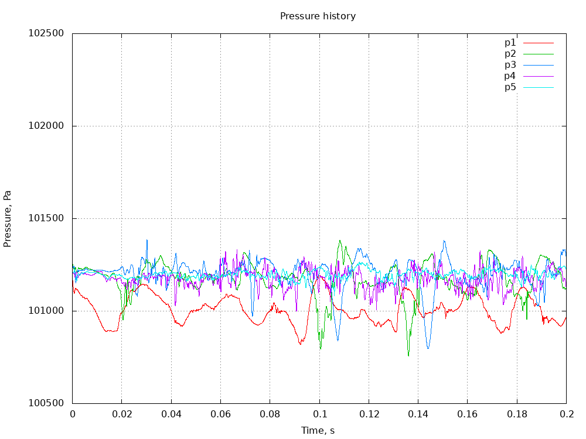
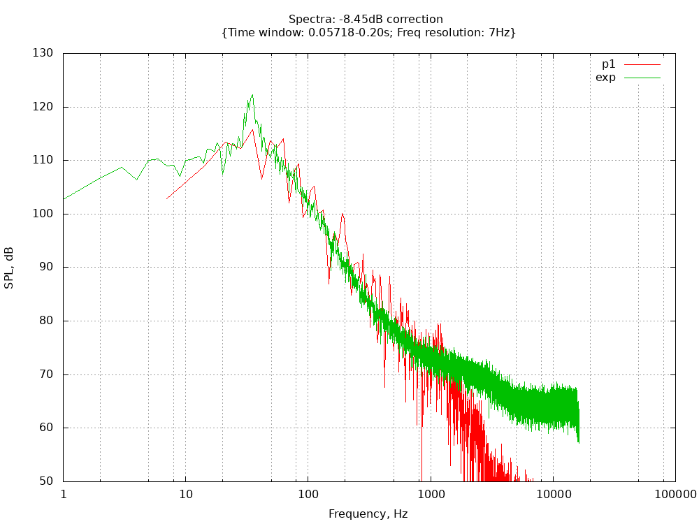
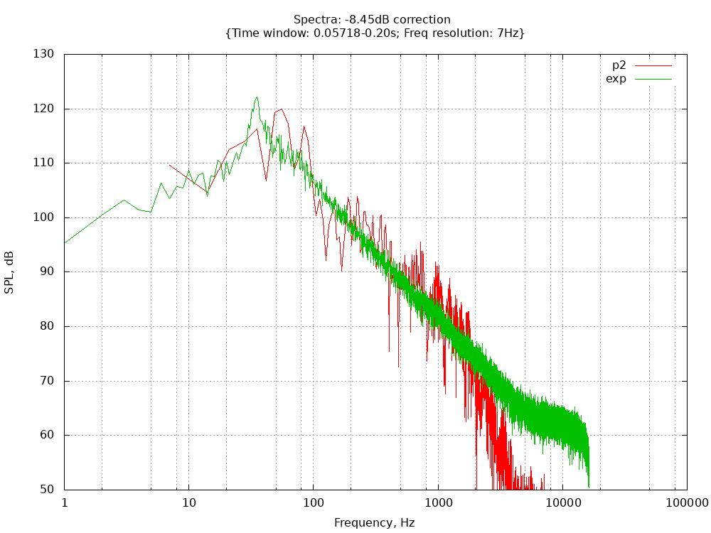
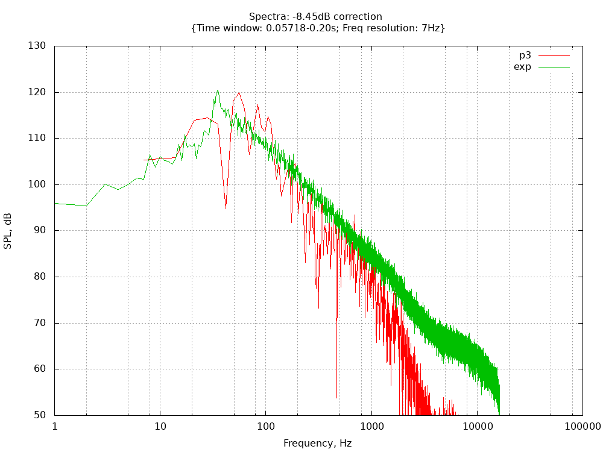
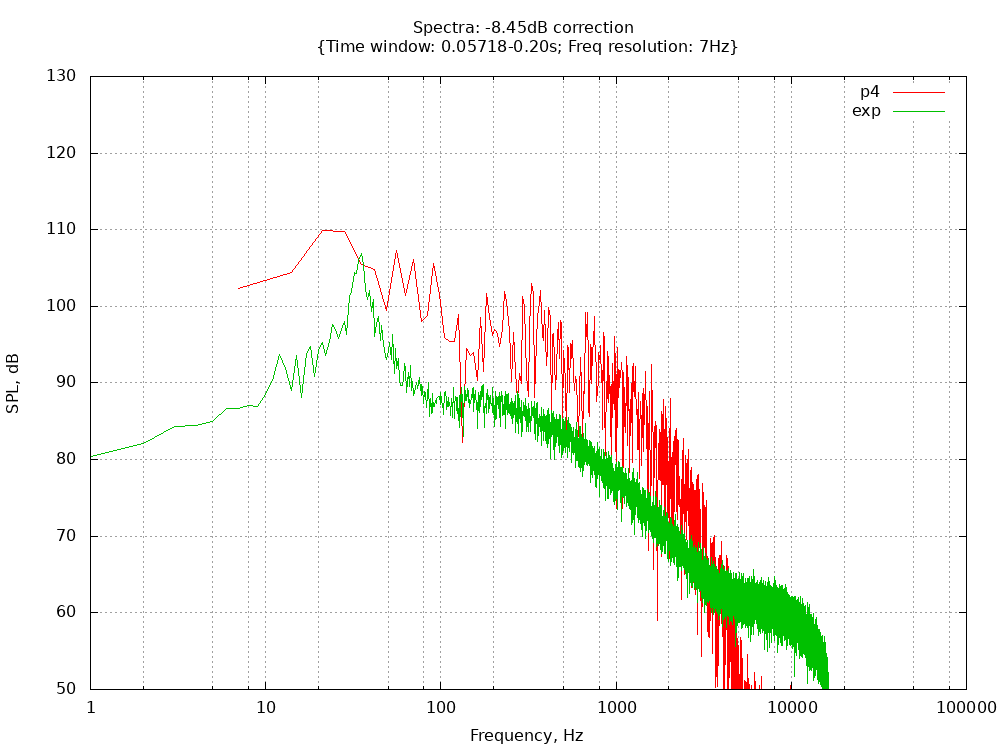
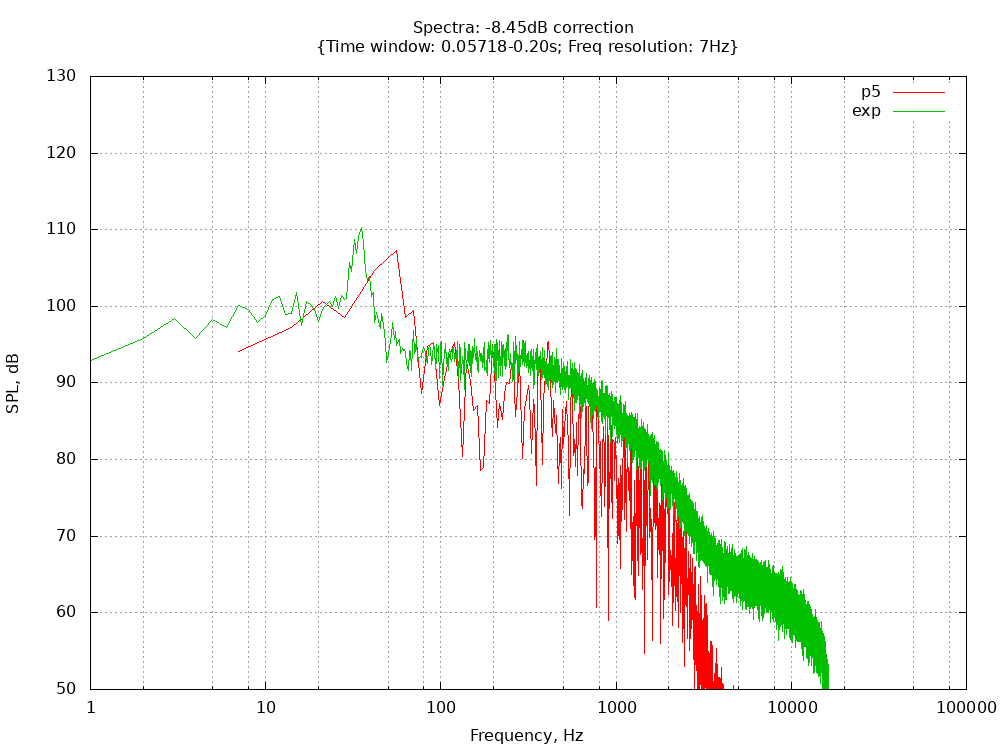

# MB16 SIMPLIFIED HMC AEROACOUSTICS VEHICLE

## Authors
ESI-Group, 2023

## Copyright
Copyright (c) 2022-2023 ESI-Group

 This work is licensed under a <a rel="license" href="http://creativecommons.org/licenses/by-sa/4.0/">Creative Commons Attribution-ShareAlike 4.0 International License</a>.

## Motivation
This case is a subset of the Benchmark B7: DrivAer Aeroacoustics derivative, being a simplified vehicle at nominally 1/3rd scale, with non-complex geometry: stub wheels, smooth underbody, generically inclined vehicle front, and with flat roof, sides and rear. The only geometric complexity comprises the side-view mirror and rounded A-Pillar, which are taken from production vehicles in order to measure the realistic aerodynamic and acoustic perturbations in the wake of these components (nominally the vehicle side-glass).
It is also connected with the Microbenchmarks MB17: 1D aeroacoustic wave train, which deals with acoustic wave propagation in air using OpenFOAM's compressible solver, refinement tests exercisable in DNS (Direct Numerical Simulation) to the fine-mesh limit.
Only the modified configuration (with A-pillar and mirror geometric modifications) will be used in this microbenchmark.

## Case Description
Figure 1 shows the geometry configurations for this microbenchmark, derived from the simulation challenge put out by Hyundai Motor Company in 2016, and measured in the acoustic wind-tunnel at 110kph.

Figure 1: Simplified HMC Aeroacoustic vehicle, baseline (left), and with A-pillar and mirror modifications (right)

Figure 2 show the key mechanisms of aeroacoustic noise generation especially around the A-pillar side-glass impingement, and mirror wake (current variant)

Figure 2: Fluctuating pressure at side window

Five microphone probe points located in the position shown in Figure 3 allow for comparison between measured and predicted acoustic spectra at locations nominally in the side (glass) surface wake of the mirror and A-pillar, with and without the geometric modification.

Figure 3: Five microphone probe locations on the side (glass) surface with Surface Pressure (dB) spectral distribution at 2000Hz

The unsteady instantaneous pressure fluctuations at various points on the glass is shown in Figure 4.

Figure 4: Pressure history at five probe locations

The total mesh count for the (symmetrical) half vehicle comprises 68 Million cells with surface refinement of 1mm on the critical parts and 2mm in their wake, and y+ down to less than 1 on all the critical aerodynamic surfaces (front, windshield rounding, roof and sides).
Run-times correspond to approximately one day on several hundreds of processors. This mesh is configurable to allow for HPC scaling to several thousands of cores as necessary.

Both steady-state and transient results are recordable, though for this microbenchmark, we will concentrate on the point-spectra resulting from the transient results.

## Preliminary results and Validation
Microphone probe prediction versus measurements for the modified configuration are shown below (for nref=1). Points P1/2 are front and rear on the top row, P3/4/5 are from front to rear on the bottom row.
  - 
  - 
  - 
  - 
  - 

## Bottlenecks
The bottlenecks to be addressed in exaFOAM using the release code series OpenFOAM-vYYMM are:
  - Scalability of the mesher using volume and surface-layer refinement.
    - I/O
    - Re-composition and decomposition
  - Scalability of flow solver to a large number of processor cores, using a simple methods of mesh scaling from above as follows;
    - Volume mesh refined on a 2x2x2, nomically increasing the hex-volume mesh count by factor 8
    - Surface extruded mesh after castellation and snapping refined 2x2 snapped on to the surface, nominally increasing the extruded-layer mesh count by factor 4
  - Acoustic data I/O written our nominally every time-step or fixed integer time-step frequency. Checkpoint files needed for surface and volume data analysis can overwhelm storage subsystem
    - Point information output for point-spectral data analysis
    - Surface information output for surface-spectral data analysis
    - Volume information output for volume-spectral data analysis
    - Checkpoint files needed by the analysis can overwhelm storage subsystem

## Instructions to run the case
The setup for nref=1 (baseline) is tested in OpenFOAM v2212.

Allrun script has instructions to use the geometry files on constant/triSurface. However, if they are missing, please fetch them first from the DaRUS data repository under: https://doi.org/10.18419/darus-3735

We have flexibility to scale the mesh simply by changing this (nref) parameter inside file system/parameters, and for each increment, the mesh might scale upto 8^(nref-1) than previous level.

Execution is typically a call to Allrun script with required number of processors as argument. e.g. ./Allrun 16

Selecting both nref and the number of cores gives flexibility to compare scalability. For example, one could use lower nref (1-3) to study scalability with lower core number, and go higher if larger hardware is available.

The case should build automatically according to 'nref' and number of processors requested. Any post-processing (like gnuplot) could be evaluated separately.

## Mesh and Restart Files

In order to enable restarts, meshes and corresponding developed fields are provided on the DaRUS data repository under:
https://doi.org/10.18419/darus-3735

## References
ESI Aeroacoustics Training Course Material 2016-2023, Applications: Aeroacoustics (<a href="https://www.openfoam.com">openfoam.com</a>)

## Acknowledgment
This application has been developed as part of the exaFOAM Project https://www.exafoam.eu, which has received funding from the European High-Performance Computing Joint Undertaking (JU) under grant agreement No 956416. The JU receives support from the European Union's Horizon 2020 research and innovation programme and France, Germany, Italy, Croatia, Spain, Greece, and Portugal.

