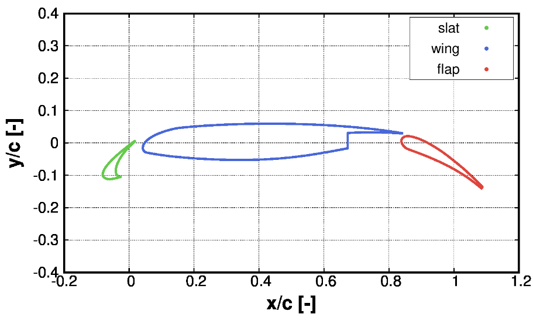
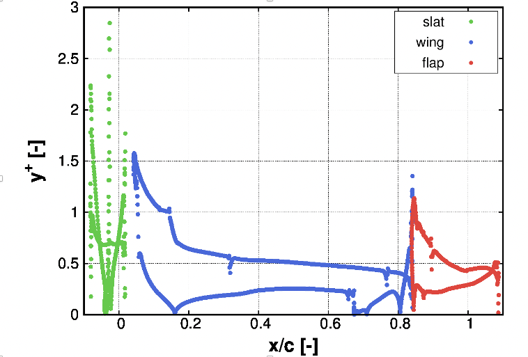
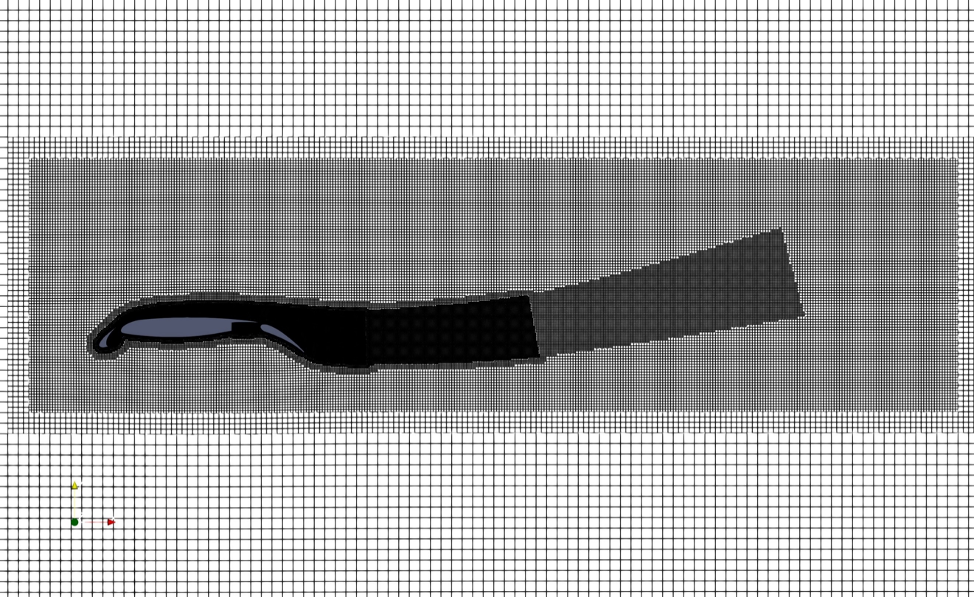
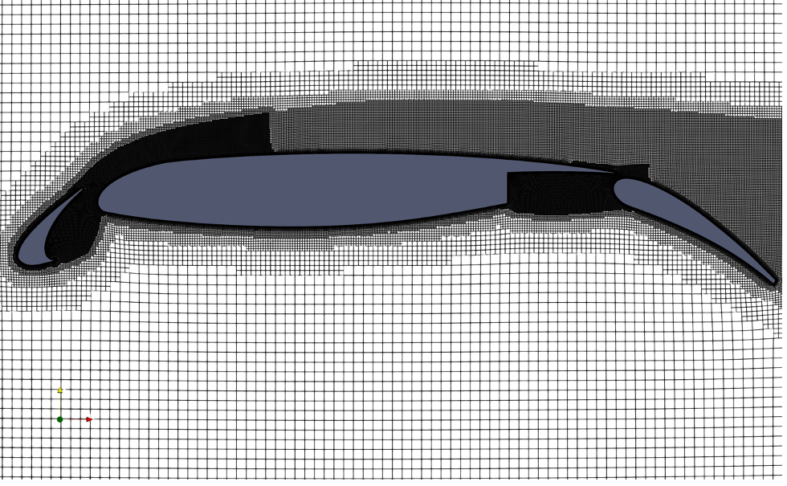
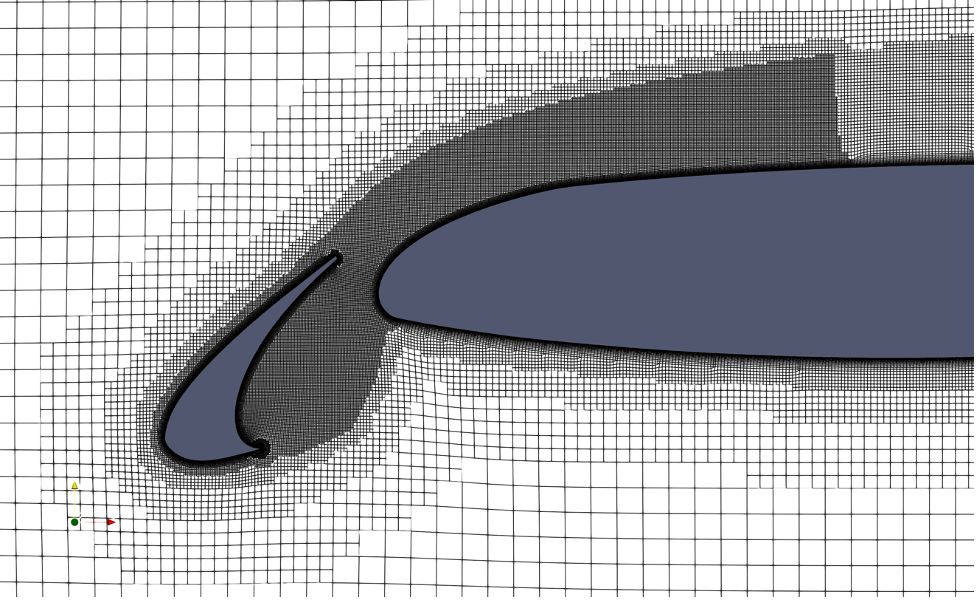
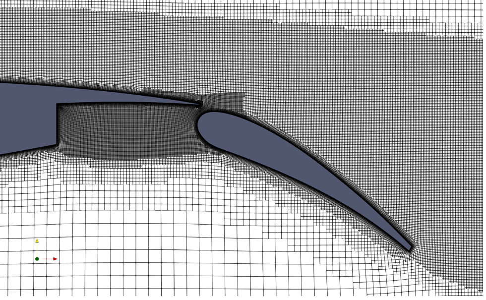
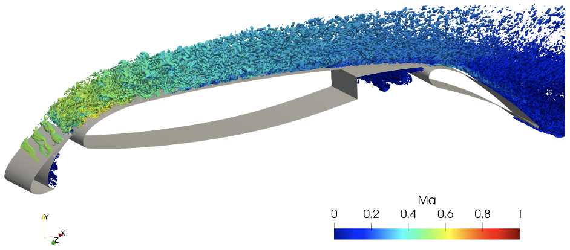
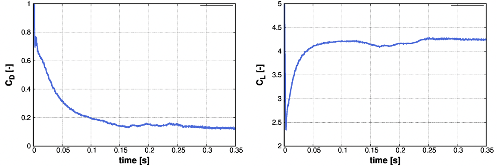
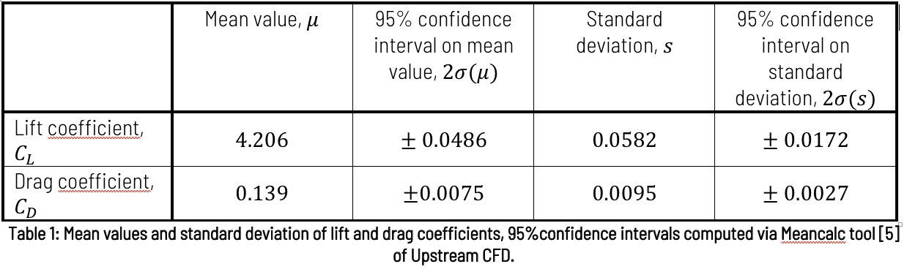

# WMLES of three-element high-lift configuration 30P30N

## Authors
Julius Bergmann, Marian Fuchs, Charles Mockett, Louis Fliessbach, Felix Kramer, Upstream CFD GmbH, 2022

## Copyright
Copyright (c) 2022-2023 Upstream CFD GmbH

 This work is licensed under a <a rel="license" href="http://creativecommons.org/licenses/by-sa/4.0/">Creative Commons Attribution-ShareAlike 4.0 International License</a>.

## Configuration
The MB9 micro-benchmark is intended for preparatory work building up to the simulation of the HPC Grand Challenge test case of the High Lift Common Research Model (CRM-HL) [3], a full aircraft configuration with deployed high-lift devices, which is to be simulated with wall-modelled LES (WMLES). The corresponding micro-benchmark should capture the salient characteristics (flow physics, simulation approach) of the Grand Challenge, whilst requiring a fraction of the computational resources. To this end, a two-dimensional, three-element high-lift wing configuration is chosen. The configuration is simulated with the scale-resolving IDDES model [7], which exhibits WMLES functionality in regions of resolved near-wall turbulence (e.g. on the suction side of the main element). After a review of various public-domain test cases, the 30P30N case was selected, since it was studied extensively with WMLES in the recent 4th AIAA CFD High Lift Prediction Workshop (HLPW-4)  and due to the availability of experimental data [1]. The geometry of the test case is shown in Figure 1.

Figure 1: Geometry of the 30P30N three-element configuration.

The 30P30N case exhibits 30° deflection angles of the slat and flap, and a reference chord length (with slat and flap stowed) of c=18"=0.4572 m. The slat chord length is $c_\text{slat} ~ 0.15c$, whereas the flap features a chord length of $c_\text{flap} ~ 0.3c$. Three of the four trailing edges of the geometry feature a finite thickness, where only the lower slat trailing edge exhibits a sharp edge.

Note that in the current version, the test case was accidentally computed with an incorrect Reynolds number of 2.08e6. An update to the test case setup, initialisation field and reference CFD results with the correct Reynolds number of 9e6 will be provided in a future update. Nevertheless, the Reynolds number is sufficiently high for a representative aerodynamical benchmark.

## Flow parameters
- The nominal flow conditions are:
- Intended Reynolds number based on chord length: $\text{Re}_c=9 \cdot 10^6$ (current setup with 2.08e6, see note above)
- Freestream Mach number: $M_\infty=0.2$
- Angle of attack: $\alpha=21.34^\circ$ (corresponding to measured maximum lift condition)
- Ambient conditions: $p_\infty=101325$ Pa, $T_\infty=293.15$ K
- Constants for Sutherland's law: $T_s=110.4$ K, $A_s=1.458\cdot 10^{-6}  \text{kg}/(\text{ms}\sqrt{K})$

## Numerical setup
The fully compressible Navier-Stokes equations are solved via the rhoPimpleFoam solver of OpenFOAM. Although the freestream Mach number of $M_\infty=0.2$ is relatively low, the flow strongly accelerates especially in the slat region, which causes high local Mach numbers approaching sonic velocity that violate the incompressible flow assumption. The fluid is modelled as an ideal gas (i.e. perfectGas class for the equation of state in OpenFOAM) and a temperature-dependent molecular viscosity is assumed, which is computed via Sutherland's law (i.e. sutherland transport model). In addition, a constant heat capacity of $C_P=1004.5$  kJ/(kg K) is prescribed. Finally, the energy equation for sensible enthalpy is solved to close the equation system.

The scale-resolving SST-IDDES model [2] was utilised to generate the reference solution, which is denoted kOmegaSSTIDDES in OpenFOAM (i.e. ESI release version). For the LES filter width definition, the $\Delta_\text{"IDDES"}$  formulation was selected (denoted IDDESDelta in OpenFOAM), which is the recommended best practice in conjunction with the IDDES turbulence model [7]. Both routines are available in the ESI OpenFOAM version v2012 and later releases. Unfortunately, the SST-based IDDES model is not implemented in the release version of the OpenFOAM Foundation (latest release that was checked is v10), so that we recommend using the SA-IDDES model (denoted SpalartAllmarasIDDES in OpenFOAM-v10) instead if this OpenFOAM base version is employed.

A free field CFD setup is chosen for the test case, meaning the geometry is placed in free air (no wind tunnel walls) and fully periodic conditions are applied in the spanwise direction. Static boundary conditions are employed at the farfield patches, where the freestream velocity and angle of attack are fixed at the farfield inlet patches, whereas the static reference pressure $p_\infty$ is set at the farfield outlet patches (the uniformFixedValue boundary condition is used here to allow some variation of the pressure over the outlet patches). The reference static temperature $T_\infty$ is additionally prescribed at the farfield inlet patches. For the turbulence variables, a turbulence intensity of Tu=0.01 and a turbulent viscosity ratio of $ν_t/ν_\infty=3$ are assumed at the farfield inlets. In general, the IDDES model is not very sensitive with regard to the chosen turbulence inflow conditions. The prescribed values ensure that all boundary layers are fully turbulent in the simulation.

The simulation is initialised with a uniform flow field. In the near-wall regions, the flow is subsequently modified via the applyBoundaryLayer utility of OpenFOAM. A time step size of $\Delta t=2 \cdot 10^{-6} s=3 \cdot 10^{-4}  c/U_\infty$  is applied to ensure a local Courant number of CFL < 1 in all regions featuring resolved turbulence. An initial transient phase of $T_\text{ini}=0.15s=22.5 \cdot c/U_\infty$ is bridged before flow statistics are collected over a time interval of $T_\text{stat}=0.20s=30.0\cdot c/U_\infty$. The total simulation time is hence $T_\text{sim}=0.35s=52.5 \cdot c/U_\infty$ , which corresponds to 175000 computed time steps for the prescribed time step size.

## Mesh
The mesh is generated automatically by the provided workflow using snappyHexMesh. It consists of 19.5M cells. The farfield boundaries of the computational domain were placed 100c away from the airfoil to minimise their influence on the flow prediction. The spanwise domain extent is $L_\text{span}=0.125c$. The mesh features 31 prism layers and achieves a near-wall resolution of $y_\text{max}^+\approx 1$, which was tuned using precursor RANS simulations (see Figure 2). In general, the layer extrusion algorithm of snappyHexMesh proves to be very stable for the test case, with the exception of the lower slat trailing edge where all layers locally vanish due to the sharp edge at the slat cusp.

Figure 2: Distribution of non-dimensional wall distance $y^+$ from steady-state RANS on a precursor grid.

Different views of the productive grid are shown in Figure 3. A set of tailored volumetric refinement regions was designed to capture the separation regions. Special care was taken to capture the trajectory of the shear layer emanating from the upper slat trailing which is subsequently convected over the suction side of the main element. Likewise, refinement boxes were customised in the wake region downstream of the flap. The shapes of the refinement boxes were informed by a precursor RANS solution that was conducted on a draft grid. All custom refinement boxes are stored in STL format (naming convention is: refBox_*.stl) and are provided as part of the setup.

Figure 3: Visualisations of the reference grid for the 30P30N case, magnified views of different regions are shown.

##	Instructions
###	Prerequisites and additional information
The following points should be considered when running the setup:
- The setup was prepared and tested for OpenFOAM-v2012, however it should run with more recent ESI release versions as well. More extensive changes might be necessary to run the setup with other OpenFOAM base versions, such as the release version of the OpenFOAM Foundation.
- Mesh generation is executed in parallel and was tested for a decomposition with a fixed number of 128 processors: Generating the grid with 19.5M cells took approximately 6 minutes on HPC hardware of Upstream CFD (see Section 7).
- The final 3D mesh was created by mirroring the snappyHexMesh grid that was generated for a domain featuring only the half span width. This procedure ensures that the spanwise patches fully match and that fully periodic boundary conditions can be imposed, thus avoiding the need to interpolate over the spanwise patches. After the grid generation stage of the workflow, the mesh is reconstructed so that it can be decomposed again for a different number of CPUs.
- A fixed number of 10 sub-iterations per time step was prescribed in the rhoPimpleFoam solver settings. When introducing setup changes that are impacting the numerical stability of the simulation, it might be necessary to increase this parameter.

### Case run
The workflow is separated into different simulation stages such as meshing or the execution of the flow solver, which are all implemented in the central control script Allrun. The different stages of the workflow can be selectively run by using the following switches in the control script:

- "meshing=true/false": If true, meshing process is executed.
- "decompose=true/false": If true, decomposes the grid and initialises the flow field.
- "solving=true/false": If true, simulation process is executed.
  - "run_initial_SRS=true/false": If true, initial transient phase is simulated until t = initTime. The solver is hereby restarted from the latest time step present in the processor folders.
  - "run_productive_SRS=true/false": If true, simulation is run until t = finalTime, including the collection of flow statistics. The solver is hereby restarted from the latest time step present in the processor folders.

In the provided setup, all switches are set to "true", so that the complete workflow is run when the control script is executed. The control script most likely will need some adjustments (e.g. name of the parallel execution command, environment variables that have to be set, etc.) in order to run correctly on your HPC system.

The file system/include/caseDefinition contains important case and setup parameters. Some of the parameters, which are most likely to be modified by the user, are:

- nCores: User has to prescribe the number of CPU-cores that should be utilised to run the case.
- initTime and finalTime: The two variables control the physical simulation time for both the initial transient phase as well as the simulation phase during which flow statistics are collected. For the initial transient, a minimum sample length of 0.15s should be simulated (i.e. initTime = 0.15). Note that this value might increase if a different initialisation method is used. For obtaining reliable flow statistics, we recommend simulating at least 0.2s of physical time following the initial transient (i.e. finalTime = 0.35).
- dt: Defines the time step size used in the scale-resolving simulation. This value might have to be decreased in case the grid is aggressively refined.

In addition to the central control script Allrun, a second control script Allclean is provided with the setup, which resets the case directory to its initial stage, meaning all simulation results including the computational grid will be deleted (so execute this script with caution).

## Known issues
Because a scale-resolving simulation is conducted, results of the test case are generally more sensitive to different aspects of the simulation setup than e.g. steady-state RANS workflows. The following known issues relate to aspects of the turbulence modelling, and in particular the applied IDDES model:

- Spurious eddies are resolved in the boundary layer on the suction side of the slat (see e.g. Figure 4), which should be modelled entirely using RANS. This is a consequence of the established boundary-layer shielding deficiency of the IDDES model [4], triggered by the fine local mesh.
- Slow development of resolved turbulence in the free shear layer over the slat cove, which is a consequence of the "grey area" problem of the standard DES formulations [6].

Once the provided base grid is further refined, both issues may be affected. With finer local mesh around the slat, the boundary-layer shielding deficiency becomes further prominent and even more spurious eddies are expected to be resolved. For the slow development of the resolved turbulence in the free shear layer over the slat cove, further refinement should speed up the development leading to more resolved turbulence. However, judging the solution quality regarding these effects becomes more challenging, as it is still an ongoing topic of research.

Refining the grid can also lead to additional numerical stability problems. Although the current solver settings are based on an implicit procedure, meaning the momentum and pressure equations are solved multiple times within one time step, increasing the grid resolution whilst maintaining the current time step size will lead to higher Courant numbers in the simulation. In the reference setup, maximum Courant number values in the domain can temporarily exceed 50 and are around 20 on average. When refining the grid, it might become necessary to either a) refine the time step size or b) increase the number of sub-iterations that is performed in one time step (i.e. parameter nOuterCorrectors in files system/fvSolution*). From the two options, option a) is clearly preferable, since it maintains local CFL number lower than 1 in the LES regions (if the time step size is refined by the same factor as the grid is).

The test case was accidentally computed with an incorrect Reynolds number of 2.08e6. An update to the test case setup, initialisation field and reference CFD results with the correct Reynolds number of 9e6 will be provided in a future update.

If you encounter problems with the used dynamicCode Features, please check your settings of fileModificationSkew and maxFileModificationPolls in your controlDict or in the etc/controlDict.

## Reference results
Reference results for an SST-IDDES run using OpenFOAM-v2012 are provided in digital form to enable partners to verify that the developed HPC improvements do not modify the simulation results. Time-averaged fields from the statistical sample $0.15s \lt t \leq 0.35s$ are provided for this purpose and are summarised in this section. An instantaneous snapshot of the resolved turbulence is visualised by iso-surfaces of the Q criterion in Figure 4. It should be verified that enhanced code versions reproduce the fine-grained turbulence resolution that is seen in the reference simulation.

Figure 4: Instantaneous snapshot of iso-surfaces of the Q criterion (with $Q =5\cdot 10^6  s^{-2}$) coloured by local Mach number for the 30P30N test case.

Time histories of the drag and lift coefficients from the reference simulation are shown in Figure 5. In Table 1, mean values of the signals are stated (where averaging started at $t = 0.15s$), and statistical confidence intervals are given, which were post-processed with the statistical analysis tool Meancalc [5] of Upstream CFD. Although no concise validation of the results is conducted for this micro-benchmark case, the time-averaged value of the lift coefficient agrees reasonably well with the experimental value of $C_{\text{L,exp}}=4.278$ from Chin et al. [1], thus indicating that there are no fundamental flaws in the setup. Due to the stochastic nature of turbulence, setup changes in new simulations can lead to slightly different mean force coefficient values than seen in the reference solution. However, we expect these values to still fall into the 95% confidence intervals that are given in Table 1 unless no fundamental changes in the global flow behaviour occurs.

Figure 5: Time series of drag and lift coefficients from SST-IDDES reference simulation of the 30P30N test case.

In Figure 6, selected mean flow quantities of the reference simulation are shown. When running new simulations, it should be checked that the aerodynamic characteristics of the high-lift configuration as seen in the reference solution are more or less reproduced. This concerns the local distribution of the time-averaged pressure coefficient  C_p as well as the time-averaged skin friction coefficient C_f on the airfoil surfaces (additional spanwise-averaging was conducted for both quantities in Figure 7). When assessing the solution quality, it is also recommended to look at more sensitive quantities such as surface pressure fluctuations or resolved kinetic energy. Both quantities can provide helpful red flag indications about spurious oscillations in the flow field that can potentially arise when default case settings are changed. It is important to reiterate that the solution can change significantly even when the conducted setup changes are well intended and executed. The boundary layer shielding deficiency of the IDDES model that was briefly discussed in Section 6 will most likely trigger stronger surface fluctuations especially on the slat suction side if the current base grid is further refined. Likewise, a finer grid naturally leads to an increase of resolved kinetic energy, as the part of the turbulent spectrum that is modelled via the LES branch of IDDES decreases. It is therefore important to document the flow field results of new simulations, so that external partners can judge whether the conducted setup changes introduce any malignant artefacts into the CFD solution.

Figure 8: Selected mean flow statistics from SST-IDDES reference simulation of the 30P30N configuration.

The reference simulation was conducted on the HPC in-house cluster of Upstream CFD. The cluster is equipped with AMD EPYC 7302 processors (clock speed of 3.0 GHz) which feature 2x16 cores per node. 128 CPU-cores were used in total for the reference simulation. The solver execution time for one full run (i.e. initial transient and averaging time) was roughly 421h, which translates to 53830 CPU-hrs. To compute one convective time unit (CTU), i.e. "CTU"=$c/U_\infty$ =0.0067s, approximately 1025 CPU-hrs are required with equivalent hardware.

## References
1. V. Chin, D. Peters, F. Spaid, R. McGhee (1993): Flowfield measurements about a multi-element airfoil at high Reynolds numbers. AIAA Paper 1993-3137, https://doi.org/10.2514/6.1993-3137
2. M. Gritskevich, A. Garbaruk, J. Schütze, F. Menter (2012): Development of DDES and IDDES Formulations for the $\text{k}-\omega$ Shear Stress Transport Model. Flow, Turbulence and Combustion, vol. 88, issue 3, pp. 431-449, https://doi.org/s10494-011-9378-4.
3. D. Lacy, A. Clark (2020): Definition of Initial Landing and Takeoff Reference Configurations for the High Lift Common Research Model (CRM-HL). AIAA Paper 2020-2771, https://doi.org/10.2514/6.2020-2771
4. F. Menter (2016): Stress-Blended Eddy Simulation (SBES) - A New Paradigm in Hybrid RANS-LES Modeling. In: Hoarau, Y., Peng, SH., Schwamborn, D., Revell, A. (eds) Progress in Hybrid RANS-LES Modelling. HRLM 2016. Notes on Numerical Fluid Mechanics and Multidisciplinary Design, vol 137. Springer, Cham. https://doi.org/10.1007/978-3-319-70031-1_3
5. C. Mockett, T. Knacke, F. Thiele (2010): Detection of Initial Transient and Estimation of Statistical Error in Time-Resolved Turbulent Flow Data. 8th International Symposium on Engineering Turbulence Modelling and Measurements (ETMM8), Marseille, France, June 9-11.
6. C. Mockett, M. Fuchs, A. Garbaruk, M. Shur, P. Spalart, M. Strelets, A. Travin, F. Thiele (2015): Two Non-zonal Approaches to Accelerate RANS to LES Transition of Free Shear Layers in DES. In: Girimaji, S., Haase, W., Peng, SH., Schwamborn, D. (eds) Progress in Hybrid RANS-LES Modelling, Notes on Numerical Fluid Mechanics and Multidisciplinary Design, vol 130. Springer, Cham. https://doi.org/10.1007/978-3-319-15141-0_15
7. M. Shur, P. Spalart, M. Strelets, A. Travin (2008): A hybrid RANS-LES approach with delayed-DES and wall-modelled LES capabilities. International Journal of Heat and Fluid Flow. 29. 1638-1649. https://doi.org/10.1016/j.ijheatfluidflow.2008.07.001

## Acknowledgment
This application has been developed as part of the exaFOAM Project https://www.exafoam.eu, which has received funding from the European High-Performance Computing Joint Undertaking (JU) under grant agreement No 956416. The JU receives support from the European Union's Horizon 2020 research and innovation programme and France, Germany, Italy, Croatia, Spain, Greece, and Portugal.
