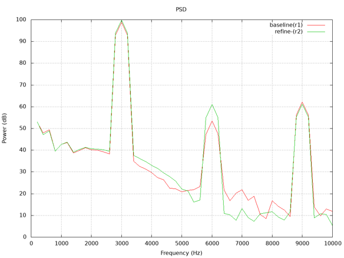

# MB17 1D AEROACOUSTIC WAVE TRAIN

## Authors
ESI-Group, 2023

## Copyright
Copyright (c) 2022-2023 ESI-Group

 This work is licensed under a <a rel="license" href="http://creativecommons.org/licenses/by-sa/4.0/">Creative Commons Attribution-ShareAlike 4.0 International License</a>.

## Motivation
This is the exact compliment to MB15: 1D Hydroacoustics wave train, here being applied to the aerodynamics industry-base, and relevant to the automotive, aerospace, energy and environmental industry sectors. The important distinction with MB15 is the difference in scales (frequency and wavelength of aeroacoustics versus hydroacoustics) which determine the domain extent, and OpenFOAM solver in respect of Equation of State (ideal gas instead of liquid compressibility).

The interest in HPC towards exascale is to provide a further subset of physics which can be quickly profiled and tested for scaling. As in MB15, it can also be used to assess the solver capabilities towards DNS and the 'fine mesh limit'.

## Case Description
A 2.5m length one-dimensional domain is used for wave propagation at 3000 Hz (also corresponding to a typical frequency of aeroacoustics excitation in Microbenchmark MB16 and Benchmark B7, and within the peak human hearing range). The working fluid is air and the compressible ideal-gas EOS is solved to simulate wave propagation. Acoustics damping is used to suppress spurious numerical artefacts and boundary wave reflection.

## Preliminary results and Validation
Preliminary results are as per reference [Mendonca, 2016]. Validation within this microbenchmark will be attested by scaling comparison of the results presented above, for successively finer meshes in the far-field between the cylinder and outer-boundary.

## Bottlenecks
The bottlenecks to be addressed in exaFOAM using the release code series OpenFOAM-vYYMM are:
    - Scalability of flow solver to a large number of processor cores, using OpenFOAM in DNS mode (compressible, laminar) and assessment of direct simulation of noise propagation in the fine-mesh limit.
    - Scalability test for the use of spatially varying sources applied via fvOptions (acousticDampingSource).

## Instructions to run the case
The setup for nref=1 (baseline) is tested in OpenFOAM v2206.

We have flexibility to scale the mesh simply by changing this (nref) parameter inside file system/parameters, and for each increment, the mesh might scale upto 8^(nref-1) than previous level.

Execution is typically a call to Allrun script with required number of processors as argument. e.g. ./Allrun 16

Selecting both nref and the number of cores gives flexibility to compare scalability. For example, one could use lower nref (1-3) to study scalability with lower core number, and go higher if larger hardware is available.

The case should build automatically according to 'nref' and number of processors requested. Any post-processing (like gnuplot) could be evaluated separately.

## Example evaluation
- Time for computation : This could be obtained using log file of solver
- Quality of result :
  - Here we aim to compare intensity and frequency of power spectrum (file: postProcessing/noise/pointNoise/input0/p/PSD_dB_Hz_f.xy)
  - The dominant frequency is 3000 Hz with its harmonics having lower power
  - The result could be plotted using gnuplot as below example for comparison for baseliner (nref=1) and next refinement (nref=2).
  - 

## References
Mendonça, Fred, <a href="https://www.openfoam.com/news/main-news/openfoam-v1606/solvers-and-physics#solvers-and-physics-acoustic-damping">Technical Note on Acoustic Damping Implementation in OpenFOAM </a> 2016

## Acknowledgment
This application has been developed as part of the exaFOAM Project https://www.exafoam.eu, which has received funding from the European High-Performance Computing Joint Undertaking (JU) under grant agreement No 956416. The JU receives support from the European Union's Horizon 2020 research and innovation programme and France, Germany, Italy, Croatia, Spain, Greece, and Portugal.

