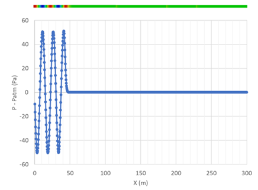
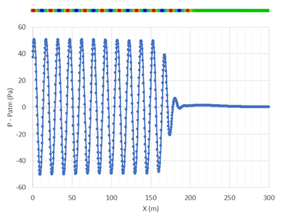
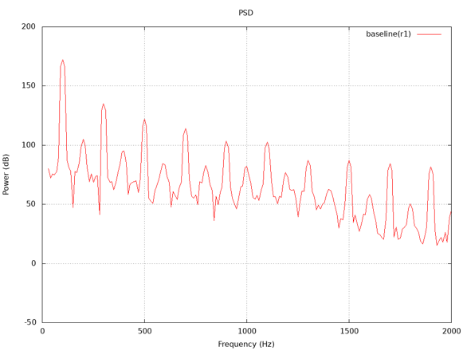

# MB15 1D HYDROACOUSTIC WAVE TRAIN

## Authors
ESI-Group, 2023

## Copyright
Copyright (c) 2022-2023 ESI-Group

 This work is licensed under a <a rel="license" href="http://creativecommons.org/licenses/by-sa/4.0/">Creative Commons Attribution-ShareAlike 4.0 International License</a>.

## Motivation
This case is a subset of MB13 and MB14 in respect of a one-dimensional phenomenon solved in 1D and of a periodic flow emanating from a boundary (pressure oscillation) using the OpenFOAM transient liquid compressible equation of state in laminar flow, and can therefore also be termed direct simulation of noise propagation. It deals with the single scale of a hydroacoustic wave propagating in space, solved using Direct Numerical Simulation (DNS).
The interest in HPC towards exascale is to provide a further subset of physics which can be quickly profiled and tested for scaling. It is also connected with the MB14: Hydroacoustic shedding Cylinder, can be used to assess the solver capabilities towards the 'fine mesh limit'.

## Case Description
A 300 m one-dimensional pipe is used for 1D wave propagation at 100 Hz (also corresponding to the BPF in MB13) as shown in Figure 1.

Figure 1: 1D Wave train with sinusoidal wave at frequency = 100 Hz and amplitude = 100 Pa - initial condition

The domain has a few cells in y- and z-directions (to have 3D effect) along with symmetry boundaries. The inlet boundary is driven by pressure fluctuation at the desired frequency of 100 Hz and amplitude of 100 Pa. The exit boundary condition can be any arbitrary CFD boundary which might reflect pressure waves, but in this case, it is irrelevant because acoustic damping is applied at 150 m from the inlet boundary. The damping zone is ramped as a cosine function from 150 m to 165 m (one wavelength) and retained at the maximum damping at the end of the domain at 300 m. The working fluid is water and the compressible EOS is solved to simulate wave propagation.
The equation below shows the governing equation with the damping source term implemented in OpenFOAM:

$`{\partial u}/ {\partial t} = L(u)-v(u-u0)`$

where u is the conservative quantity, L(u) is the flux term, v is the damping coefficient and u0 is the reference value.
The acousticDampingSource is designed to be used to damp spurious pressure waves for acoustic analyses [Mendonca, 2016]. It provides a test for the use of spatially varying sources applied via fvOptions.

## Preliminary results and Validation
Figure 2 shows the 1D domain with pressure pulse at a time beyond which wave train enters the damping zone. It can be seen that the damping scheme efficiently damps the wave train within one wavelength for an optimal choice of damping coefficient discussed in [Mendonca, 2016]. Validation within this microbenchmark will be attested by scaling comparison of the results presented above, for successively finer meshes in the far-field between the cylinder and outer-boundary.

Figure 2: 1D wave propagation after 0.1184sec with acoustic damping active beyond 150m

## Bottlenecks
The bottlenecks to be addressed in exaFOAM using the release code series OpenFOAM-vYYMM are:
  - Scalability of flow solver to a large number of processor cores, using OpenFOAM in DNS mode (compressible, laminar) and assessment of direct simulation of noise propagation in the fine-mesh limit.
  - Scalability test for the use of spatially varying sources applied via fvOptions (acousticDampingSource).

## Instructions to run the case
The setup for nref=1 (baseline) is tested in OpenFOAM v2206.

We have flexibility to scale the mesh simply by changing this (nref) parameter inside file system/parameters, and for each increment, the mesh might scale upto 8^(nref-1) than previous level.

Execution is typically a call to Allrun script with required number of processors as argument. e.g. ./Allrun 16

Selecting both nref and the number of cores gives flexibility to compare scalability. For example, one could use lower nref (1-3) to study scalability with lower core number, and go higher if larger hardware is available.

The case should build automatically according to 'nref' and number of processors requested. Any post-processing (like gnuplot) could be evaluated separately.

## Example evaluation
Plots from Figure 2 (pressure along axis) could be plotted easily in ParaView for last time step. However, we have provided another qualitative measure of frequency spectra coming from noise tool.
- Time for computation : This could be obtained using log file of solver
- Quality of result :
  - Here we aim to compare intensity and frequency of power spectrum (file: postProcessing/noise/pointNoise/input0/p/PSD_dB_Hz_f.xy)
  - The dominant frequency is 100 Hz with its harmonics having lower power
  - The result could be plotted using gnuplot as below example for comparison for baseliner (nref=1)
  - 

## References
Mendonça, Fred, <a href="https://www.openfoam.com/news/main-news/openfoam-v1606/solvers-and-physics#solvers-and-physics-acoustic-damping">Technical Note on Acoustic Damping Implementation in OpenFOAM </a> 2016

## Acknowledgment
This application has been developed as part of the exaFOAM Project https://www.exafoam.eu, which has received funding from the European High-Performance Computing Joint Undertaking (JU) under grant agreement No 956416. The JU receives support from the European Union's Horizon 2020 research and innovation programme and France, Germany, Italy, Croatia, Spain, Greece, and Portugal.

