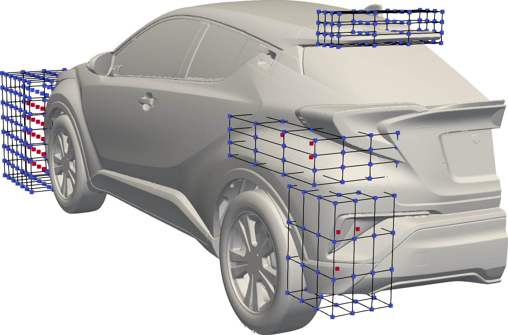

# Unsteady primal and adjoint solution around the TME CHR car

## Authors
Andreas-Stefanos Margetis, Evangelos Papoutsis-Kiachagias and Kyriakos Giannakoglou 

Parallel CFD & Optimization Unit, National Technical University of Athens (PCOpt/NTUA)

## Copyright
Copyright (c) 2022-2023 PCOpt/NTUA

 This work is licensed under a <a rel="license" href="http://creativecommons.org/licenses/by-sa/4.0/">Creative Commons Attribution-ShareAlike 4.0 International License</a>.

## Introduction and scope
This microbenchmark aims to represent an industrial application of the unsteady
optimization infrastructure of OpenFOAM, in small scale, using the Toyota CHR
car geometry, see Figure 1.

Figure 1: TME CHR geometry 

When used with unsteady flows, the adjoint equations are integrated backwards
in time, requiring the instantaneous flow fields to be available at each
time-step of the adjoint solver, which noticeably increases storage
requirements in large-scale problems. To avoid extreme treatments, such as the
full storage of the computed flow fields or their recomputations from scratch
during the solution of the adjoint equations and to reduce the re-evaluation
overhead incured by the widely used check-pointing technique [^Griewank2000], lossy
compression techniques will be implemented into the adjointOptimisation library of OpenFOAM, during the within exaFOAM project.
The re-computation cost is expected to be reduced by
efficiently compressing the check-points, so that more can fit within the
available memory, or even eliminate the need of check-pointing (and flow
re-computations) altogether, if the entire compressed flow series can be stored
in memory. The compression strategies will be assessed based on their
effectiveness in data reduction, computational overhead and accuracy of the
computed sensitivity derivatives. The current microbenchmark mainly focuses on the cost of solving the primal and adjoint equations themselves, without accounting for flow re-computations or compression, to be evaluated later within the project, when the compression algorithms are implemented.

## Configuration

Half the CHR geometry is modelled using a symmetry plane, in order to reduce
the CPU cost.  The flow model consists of the unsteady Navier-Stokes equations,
coupled with a DDES turbulence model.  To obtain the starting flow fields used
in this setup, the steady-state flow equations were solved for 500 iterations
and, subsequently,  the DDES-based model was integrated for 1sec, to discard
(part of) the transient phase of the flow phenomenon.

### Flow parameters
- Air with a kinematic viscosity: $`\nu=1.51037\cdot 10^{−5}`$ m²/s.
- Wind tunnel and road velocity: $`U=`$  30 m/s.
- Rotating velocity of the front and rear wheels: 87.16 rad/s and 89.825 rad/s, respectively.
- Reynolds number: $`Re=U L_{ref} / \nu=`$ 100, where $`L_{ref}`$ is the wheelbase.
- Fixed reference pressure at the outlet.

### Numerical setup

Figure 2: Morphing boxes parameterising various parts of the car. The coordinates
of the red-coloured control points act as the design variables of the
optimisation problem.

- The turbulent flow is modeled using the DDES variant of the the
  Spalart-Allmaras turbulence model, using a time-step of $`1\times10^{-4}`$ sec.
- In the current setup, used as a microbenchmark, only 4 primal and adjoint
  time-steps are executed, to confine the overall run-time at about 10 min when
  ran on 40 AMD EPYC 7452 cores. 
  The overall run-time can be adjusted by changing the number of cores (system/decomposeParDict.numberOfSubdomains) 
  and the overall duration of the simulation  (system/controlDict.endTime).
- An uncompressed full storage approach is used to manage the storage and
  retrieval of the primal flow fields during the solution of the adjoint
  equations. Each time-step takes up $`\sim`$ 2.3 GB of memory. This should be
  kept under consideration when increasing the endTime (see previous bullet).
- Various parts of the car are parameterized using the morphing boxes of the above figure. The active and non-active
  control points are colored in red and blue, respectively. The design variables of the optimisation problem
  are the $`x, y`$ and $`z`$ coordinates of the active control points of the morphing box, denoted as $`b_i, 
  i\in[1,N]`$.
- The objective function is the time-averaged drag coefficient $`J_{D}`$
  exerted on the car; $`J_{D}`$ is integrated based on the
  integration{Start,End}Time defined in
  system/optimisationDict.adjointManagers.am1.adjointSolvers.as1.objectives.objectiveNames.drag.
  If the endTime is changed in controlDict, the objective integrationEndTime should change as well (taken care of by the Allrun script, see also (see [Instructions](#instructions))).

### Mesh
The mesh was generated using *ANSA* and consists of $`\sim 37`$M cells, which
are divided into 11M prismatic boundary layers and 26M tetrahedra for the rest
of the domain. 

### Boundary conditions
Boundary conditions (BC) for the following quantities are set:

|Quantity       |Dimension|Description                      |
|---------------|---------|---------------------------------|
|$`\vec U`$     |m/s      |Primal velocity                  |
|$`p`$          |m²/s²    |Primal pressure                  |
|$`nut`$        |m²/s     |Primal turbulent viscocity       |
|$`nuTilda`$    |m²/s     |Primal turbulence model variable |
|$`\vec Ua`$    |m/s      |Adjoint velocity                 |
|$`pa`$         |m²/s²    |Adjoint pressure                 |

## Validation
From the accuracy point of view, the sensitivity derivatives computed using the
*full storage* approach employed herein will be used as the reference data
against which the corresponding gradient computed using lossy compression, to
be available at later stages of the project, will be compared to. The CPU time
and memory requirements of the two methods will be compared too, to quantify
the gains of using lossly compressed primal fields for the solution of the
adjoint equations.

## Microbenchmark
- Should be run with the *adjointOptimisationFoam* solver from the
  'feature-unsteady-adjoint' branch, located in the OpenCFD gitlab
  [repository](https://develop.openfoam.com/Development/openfoam/-/tree/feature-unsteady-adjoint).
  This branch is based on OpenFOAM v2206 and additionally includes unsteady
  adjoint infrastructure. 
- Currently, the full storage variant is attached, to be used as the reference
  case for future validation (see [Validation](#validation)).
- The microbenchmark is setup in a way that mainly focuses on the cost of the
  primal and adjoint solution. Peripheral costs, such as the computation of the
  parametric coordiates and writing to files are artificially reduced
  (parametric coordiates are read from files and (almost) no results are
  written to the hard drive) to avoid polluting the benchmark of the few
  primal/adjoint iterations with costs that are outscaled by the flow/adjoint
  solution, when many iterations are performed.

## Instructions

### Preparation
1. Download and compile the 'feature-unsteady-adjoint' branch (see [Microbenchmark](#microbenchmark)).
2. Download the tar ball including the mesh and flow initialisation from the DaRUS [repository](https://doi.org/10.18419/darus-3714) [^Margetis24].
   Place the *polyMesh* folder under *constant*. 
   The initial flow solution included in the tar ball as the *0* folder is obtained after running the DDES flow model for $1sec$.
   If you want to start the simulation from a uniform initialisation instead, rename the *0.org* folder to *0*.

### Case run
- Run *Allrun* to solve the flow and adjoint equations and compute the sensitivity derivatives or provide a job submission script that performs the same steps. The script takes an optional argument corresponding to the *endTime* of the flow solution and the *integrationEndTime* of the objective function. 

## Acknowledgment
This application has been developed as part of the exaFOAM Project https://www.exafoam.eu, which has received funding from the European High-Performance Computing Joint Undertaking (JU) under grant agreement No 956416. The JU receives support from the European Union's Horizon 2020 research and innovation programme and France, Germany, Italy, Croatia, Spain, Greece, and Portugal.

## Footnotes
[^Griewank2000]: Griewank, A., Walther, A. (2000). Algorithm 799: Revolve: An implementation of checkpointing for the reverse or adjoint mode of  computational differentiation, ACM Transactions on Mathematical Software, Vol. 26(1)
[^Margetis24]: Margetis, Andreas-Stefanos; Papoutsis-Kiachagias, Evangelos; Giannakoglou, Kyriakos, 2024, "exaFOAM Industrial Benchmark B2 - Unsteady primal and adjoint solution around the TME CHR car", https://doi.org/10.18419/darus-3714, DaRUS, V1
