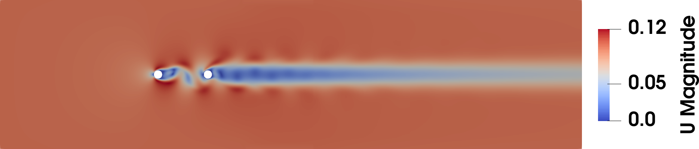
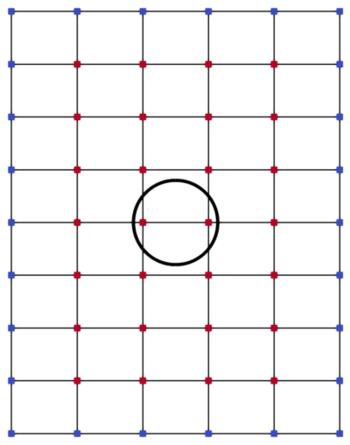
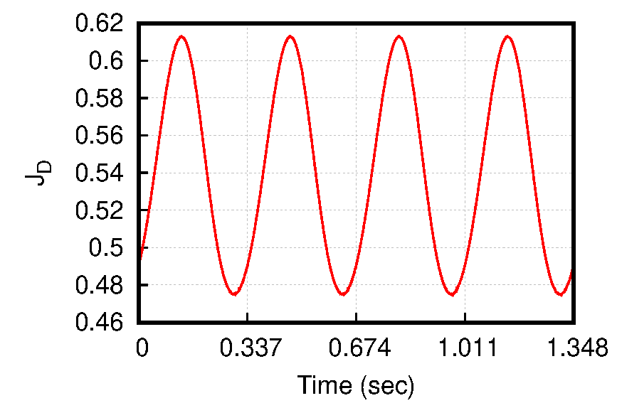

# Two cylinders in line
## Authors
Andreas-Stefanos Margetis, Evangelos Papoutsis-Kiachagias and Kyriakos Giannakoglou 

Parallel CFD & Optimization Unit, National Technical University of Athens (PCOpt/NTUA)

## Copyright
Copyright (c) 2022-2023 PCOpt/NTUA

 This work is licensed under a <a rel="license" href="http://creativecommons.org/licenses/by-sa/4.0/">Creative Commons Attribution-ShareAlike 4.0 International License</a>.

## Introduction
This micro-benchmark case is dealing with the flow around two equal-sized
cylinders in tandem (in-line) arrangement [^Dehkordi2011], [^Mittal1997]. Its
goal is to showcase the memory savings when using a (lossy)
compression scheme for computing sensitivity derivatives for unsteady flows, when 
compared with the full storage of the flow time history.

When used with unsteady flows, the adjoint equations are integrated backwards
in time, requiring the instantaneous flow fields to be available at each
time-step of the adjoint solver, which noticeably increases storage
requirements in large-scale problems. To avoid extreme treatments, such as the
full storage of the computed flow fields or their re-computation from scratch
during the solution of the adjoint equations and to reduce the re-evaluation
overhead incurred by the widely used check-pointing technique [^Griewank2000], lossy
compression techniques are/will be used.  Using lossy compression, the
re-computation cost is expected to be reduced by efficiently compressing the
check-points, so that more can fit within the available memory, or even
eliminate the need of check-pointing (and flow re-computations) altogether, if
the entire compressed flow series can be stored in memory. The compression
strategies will be assessed based on their effectiveness in data reduction,
computational overhead and accuracy of the computed sensitivity derivatives.

## Configuration

Figure: Two cylinders in tandem with an instantaneous depiction of the magnitude of the primal velocity.

A von Karman vortex street appears downstream of the cylinders when the spacing
$`L`$ between them (diacenter) is greater than $`3D`$, where $`D`$ is the cylinder
diameter [^Dehkordi2011]. In this case, $`L = 6D`$ with a flow period for the
initial geometry equal to $`T\approx0.674sec`$. The 2-dimensional rectangular computational grid
consists of about 25000 quadrilateral elements and extends for $`19D`$ upstream of the
first cylinder and $`45D`$ downstream of the second cylinder, whereas the upper
and lower boundaries are located at $`9D`$ from the (horizontal) diacenter of the
cylinders.

## Flow parameters
- Air with a kinematic viscosity: $`\nu=1 \cdot 10^{−5}`$ m²/s.
- Axial inlet velocity: $`U_0=`$  0.1 m/s.
- Reynolds number: $`Re=U_0 D / \nu=`$ 100.
- Fixed reference pressure at the outlet.

# Numerical setup

Figure: Morphing box parameterising the first cylinder. The coordinates of the
red-coloured control points act as the design variables of the optimisation
problem.

- The setup is 2-dimensional.
- The flow is laminar and unsteady (periodic), with the period induced by the flow physics.
- The flow period is $`T\approx0.674sec`$ and the time-step is $`\Delta t= 10^{-3} sec`$ (674 time-steps per period), with two periods being solved in this setup, after starting from a solution that has discarded the transient phase (see also [Validation](#Validation)).
- The first cylinder is parameterised using the morphing box of the above figure. The active and non-active
  control points are colored in red and blue, respectively. The design variables of the optimisation problem
  are the $`x`$ and $`y`$ coordinates of the active control points of the morphing box, denoted as $`b_i, 
  i\in[1,N]`$.
- The objective function is the time-averaged axial force $`J_{D}`$
  exerted on the second (downstream) cylinder; $`J_{D}`$ is integrated during the  second period of the flow solution,
  which is sufficient for $`J_{D}`$ to be considered as statistically converged.

- The solver *adjointOptimisationFoam* is used to compute sensitivity derivatives of $`\delta J_{D}/\delta b_i`$.

## Mesh
The mesh is generated using *blockMesh*. The file with the geometry properties
is located at *system/blockMeshDict*. The cylinder diameters, their distance
and the distance of the farfield boundaries may be varied by altering a few
variables.

The current setup of *blockMesh* yields a mesh of about 25000 cells.

## Boundary conditions
Boundary conditions (BC) for the following quantities need to be set:

|Quantity       |Dimension|Description                   |
|---------------|---------|------------------------------|
|$`\vec U`$     |m/s      |Primal velocity               |
|$`p`$          |m²/s²    |Primal pressure               |
|$`\vec Ua`$    |m/s      |Adjoint velocity              |
|$`pa`$         |m²/s²    |Adjoint pressure              |

### inlet

|Quantity       |BC                    |BC parameter     |
|---------------|----------------------|-----------------|
|$`\vec U`$     |fixedValue            |uniform (0.1 0 0)|
|$`p`$          |zeroGradient          |-                |
|$`\vec Ua`$    |adjointInletVelocity  |uniform (0 0 0)  |
|$`pa`$         |zeroGradient          |-                |

### outlet
|Quantity       |BC                        |BC parameter                      |
|---------------|--------------------------|----------------------------------|
|$`\vec U`$     |zeroGradient              |-                                 |
|$`p`$          |fixedValue                |uniform 0                         |
|$`\vec Ua`$    |adjointOutletVelocity     |uniform (0 0 0)                   |
|$`pa`$         |adjointOutletPressure     |uniform 0                         |

### cylinder 1 and cylinder 2 (Walls)
|Quantity       |BC                  |BC parameter       |
|---------------|--------------------|-------------------|
|$`\vec U`$     |fixedValue          |uniform (0 0 0)    |
|$`p`$          |zeroGradient        |-                  |
|$`\vec Ua`$    |adjointWallVelocity |uniform (0 0 0)    |
|$`pa`$         |zeroGradient        |-                  |

### topBottom (lateral boundaries)
|Quantity       |BC                        |BC parameter                      |
|---------------|--------------------------|----------------------------------|
|$`\vec U`$     |freestream                |freestreamValue uniform (0.1 0 0) |
|$`p`$          |outletInlet               |uniform 0                         |
|$`\vec Ua`$    |adjointFarFieldVelocity   |uniform (0 0 0)                   |
|$`pa`$         |zeroGradient              |-                                 |

# Validation
From the accuracy point of view, the sensitivity derivatives computed using the
*full storage* approach will be used as the reference data against which the
corresponding gradient computed using lossy compression, to be available at
later stages of the project, will be compared to. The CPU time and memory
requirements of the two methods will be compared too, to quantify the gains of
using lossly compressed primal fields for the solution of the adjoint equations.

# Microbenchmark
- Currently, the full storage variant is attached, to be used as the reference case for future validation (see [Validation](#Validation)).
- Should be run with the *adjointOptimisationFoam* solver from the
  'feature-unsteady-adjoint' branch, located in the OpenCFD gitlab
  [repository](https://develop.openfoam.com/Development/openfoam/-/tree/feature-unsteady-adjoint).
  This branch is based on OpenFOAM v2206 and additionally includes unsteady
  adjoint infrastructure. 

## Instructions

The tutorial can be run using two different settings: 

1. Restarting from the files under 0.restart, which correspond to a time-state
   in which the transient phase of the flow has been discarded. The actual part
   of the code to be benchmarked follows after that, with the primal and the
   adjoint equations being solved for $`2T=1.348sec`$.
2. Starting from a uniform initialisation (this can be used to reproduce the
   0.restart folder as well). To produce the files used for the restart, a
   first phase of $`60sec`$ is initially ran with $`nOuterCorrectors=1`$ and
   $`nCorrectors=3`$, followed by a second phase of $`4sec`$ with
   $`nOuterCorrectors=3`$ and $`nCorrectors=6`$. This is the approach to be
   followed if, for instance, the mesh used for the benchmark is refined. 

### Case run
- Run *Allrun*. This script uses the restart files under 0.restart.
- Run *Allrun.fromScratch* to get rid of the transient phase of the flow and subsequently run the part of the code to be benchmarked. 

## Acknowledgment
This application has been developed as part of the exaFOAM Project https://www.exafoam.eu, which has received funding from the European High-Performance Computing Joint Undertaking (JU) under grant agreement No 956416. The JU receives support from the European Union's Horizon 2020 research and innovation programme and France, Germany, Italy, Croatia, Spain, Greece, and Portugal.

# Footnotes
[^Dehkordi2011]: Dehkordi, B., Moghaddam, H., Jafari, H. (2011). Numerical Simulation of Flow Over Two Circular Cylinders in Tandem Arrangement. Journal of Hydrodynamics, Ser. B, Vol. 23(1), pp. 114-126.

[^Mittal1997]: Mittal, S.,  Kumar, V., Raghuvanshi, A. (1997).  Unsteady incompressible flows past two cylinders in tandem and staggered arrangements, International Journal for Numerical Methods in Fluids, Vol. 25, pp.  1315-1344.

[^Griewank2000]: Griewank, A., Walther, A. (2000). Algorithm 799: Revolve: An implementation of checkpointing for the reverse or adjoint mode of computational differentiation, ACM Transactions on Mathematical Software, Vol. 26(1)
