# ERCOFTAC conical diffuser LES
## Authors
Sergey Lesnik and Henrik Rusche, Wikki GmbH, Germany

## Copyright
Copyright (c) 2022-2023 Wikki GmbH

 

This work is licensed under a <a rel="license" href="http://creativecommons.org/licenses/by-sa/4.0/">Creative Commons Attribution-ShareAlike 4.0 International License</a>.

## Introduction
The ERCOFTAC conical diffuser is a challenging case for turbulence modeling since it operates in the flow regime close to separation at the diffuser wall. Depending on the turbulence model the simulation may predict separation producing results, which do not correspond to the experimental ones. This is shown in the description of the RAS microbenchmark based on the low Reynolds k-omega-SST turbulence model. Here, an additional setup and corresponding microbenchmark incorporating an LES model is proposed. The configuration and general numerical setup are the same as for the RAS case and therefore are not repeated here.

# Numerical setup
The differences to the k-omega-SST setup are summarized in the following. The flow is unsteady and thus solver *pimpleFoam* is used. A single outer corrector and two inner corrector loops are needed to keep initial pressure residual at an acceptable level. The time step interval is set to a value such that the maximum Courant number is below 0.5. LES model is Wall-Adapting Local Eddy-viscosity (*WALE*).

Linear solver for the velocity field is *smoothSolver*. For the pressure field *PCG* solver with the *GAMG* preconditioner is used. In the case of the *DIC* preconditioner, which is used in the RAS setup, very large number of iterations for higher core numbers were observed.

The discretization schemes are one of most important aspects of a LES setup. Higher accuracy is needed to enable formation of large eddies. Therefore, numerical dissipation relevant to the first order schemes such as *upwind* is counterproductive. As a consequence second order *linear* scheme is used in most cases. Only the convection term is discretized with *filteredLinear3V 0.1*, which imposes a limiter in order to omit velocity staggering pattern in the inlet pipe. The latter is a typical side effect of a central differencing scheme such as *linear*. The time discretization is set to *backward*.

The meshes are altered in order to achieve y+<1 for all walls. The topology is modified in such a way that no cell size expansion is present in the axial direction.

The boundary conditions for the pressure fields are not altered with the respect to the RAS setup. The walls for the eddy viscosity are set to *nutUSpaldingWallFunction*. The rotation of the inlet pipe is imposed via *codedFixedValue*, so the tool *addSwirlAndRotation* used previously is not needed anymore. No turbulence is introduced at the inlet although different approaches were tested to impose artificial eddies. A complication emerges from the original setup where a honeycomb is placed in the beginning of the inlet section. The diameter of a honeycomb cell is 3.2 mm, which results in a turbulent length scale smaller than 1 mm. Only meshes with largest cell numbers are able to resolve such small scales. Furthermore, synthetic turbulence boundary conditions available in OpenFOAM such as *turbulentDFSEMInlet* and *turbulentDigitalFilterInlet* are not yet comprehensively tested and the scalability is unknown. At the time of preparing of the microbenchmark there are also known issues with both models. The DFSEM model does not nearly reproduce the Reynolds stress from DNS results [^issueDFSEM]. The Digital filter model has problems with cases running in parallel [^issueDigitalFilter1][^issueDigitalFilter2].

# Validation
A case with 145 million cells is evaluated and the results are compared to the ERCOFTAC database[^database].
| Velocity | Pressure | Turbulent Structures |
|--|--|--|
|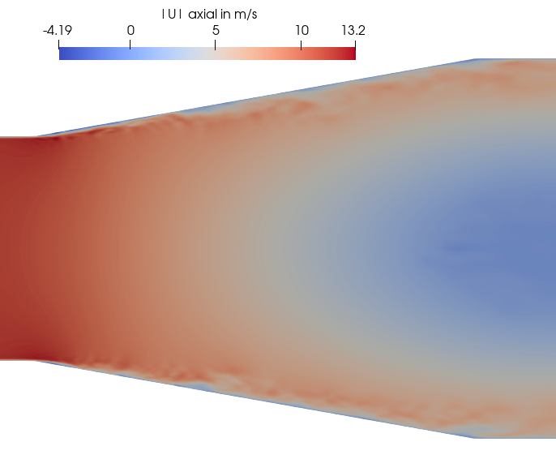|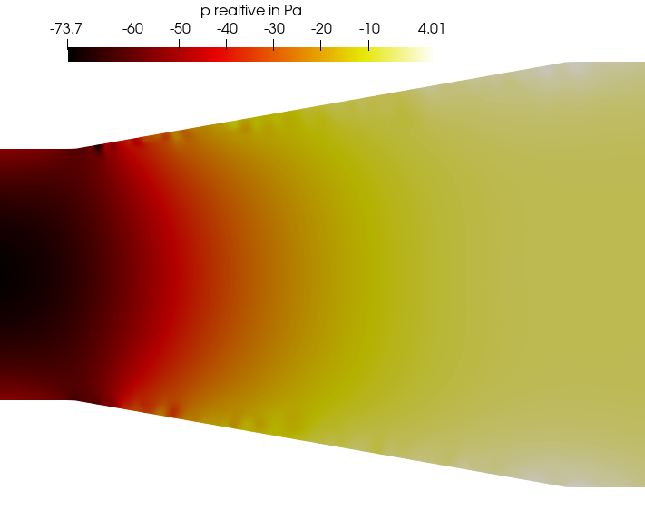|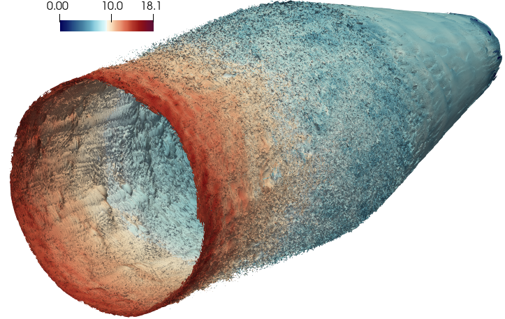|

The figures above demonstrate turbulent structures in the axial cross-section of the conical part. The velocity field forms eddies in the boundary layer, which are also indicated by the fluctuations in the pressure field. There are regions of the flow reversal, which are indicated by a negative axial velocity. Nevertheless no separation is observed.

|Position in mm |Normalized mean velocities $`\overline{U}/U_0`$ (axial) and $`W/U_0`$ (circumferential) |Normalized mean turbulent kinetic energy $`\overline{k}/U_0^2`$ | Mean Reynolds normal stresses normalized by $`U_0^2`$ |
|-|-|-|-|
|$`x=`$ -25|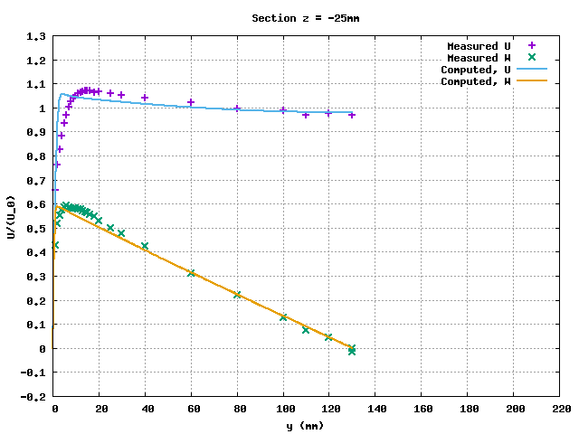|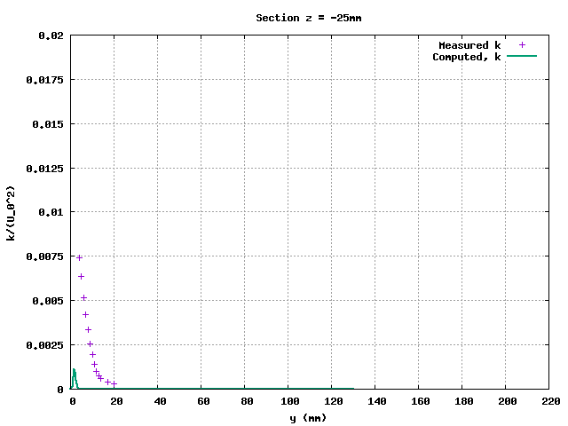|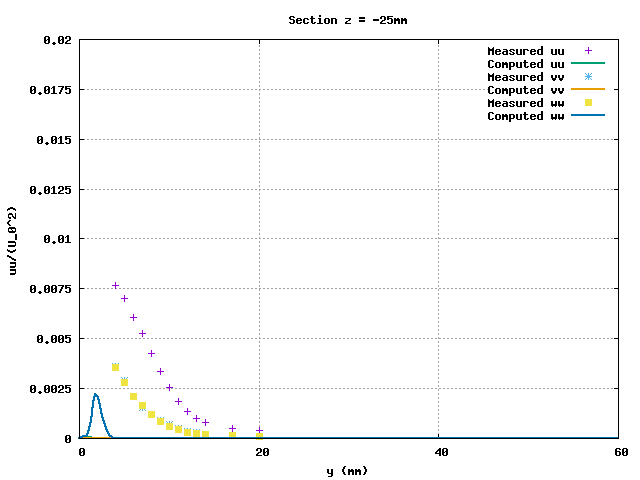|
|$`x=`$ 250|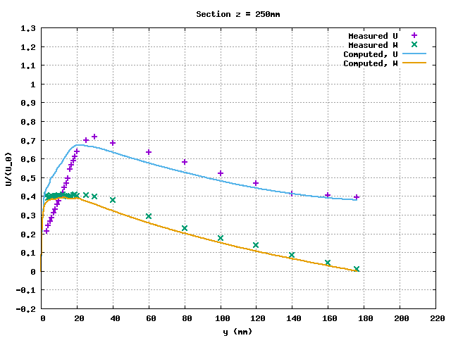|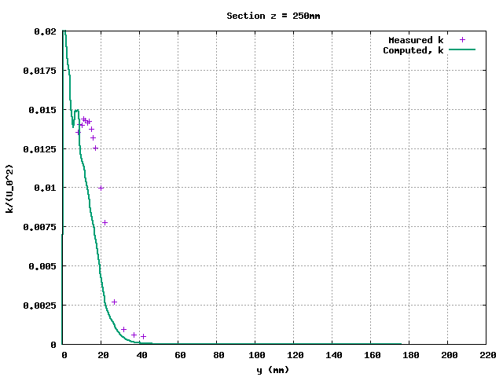|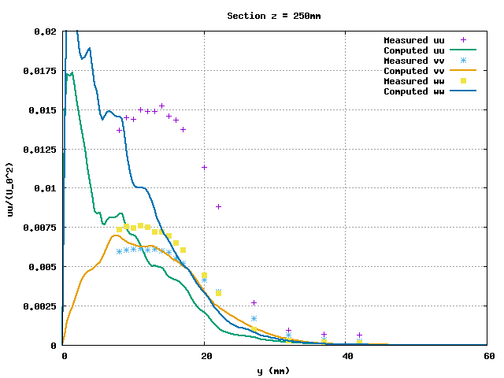|
|$`x=`$ 405|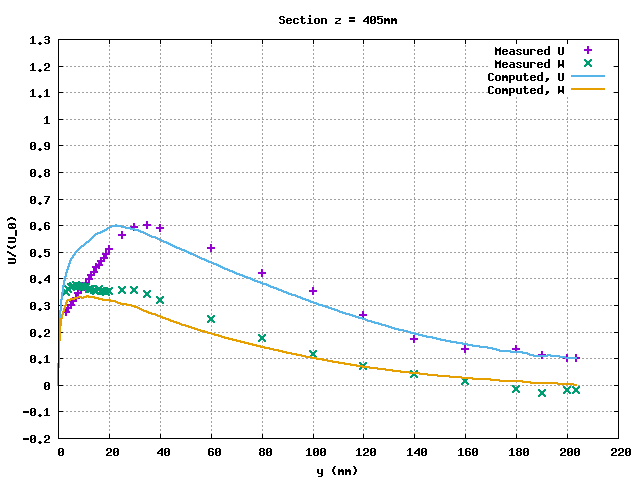|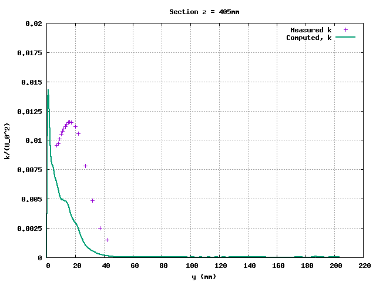|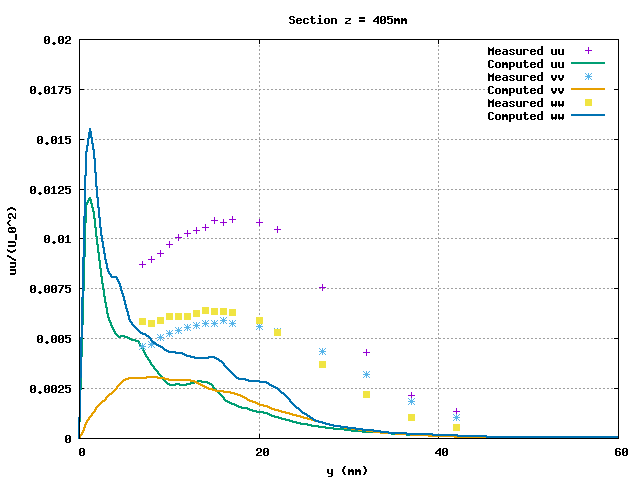|

Mean quantities were obtained by averaging fully-developed flow over 0.5 s (from 1 s to 1.5 s). The turbulence kinetic energy (TKE) in LES consists of two parts: the resolved one defined by the root mean square of Reynolds normal stresses and the modeled one called subgrid-scale TKE. One of the most important findings involves the mean TKE at the first station ($`x=`$ -25 mm), which is situated at the end of the inlet pipe. The calculation predicts no significant turbulence in the boundary layer compared to the experiment. This may be the reason for deviations of the TKE profiles further downstream: The peak values are shifted towards the wall. This also influences the corresponding mean velocity profiles since there is more momentum transfer closer to the wall. The behavior described above is confirmed if Reynolds normal stresses are studied separately, which are shown in the forth column.

An insufficient turbulence formation in a straight pipe is a known issue in the context of turbulence modeling. It is addressed by either introducing a synthetic BC or lengthening the pipe by several diameters. The former approach was shown to be not feasible in section [numerical setup](#numerical-setup). A pipe lengthening would lead to a divergence from the experimental setup since there is a rotating pipe section of fixed length followed by a non-rotating part. Therefore, it is not clear which part should be lengthened. Furthermore, it is assumed that the turbulence profile at x=-25 mm is not fully developed in the experiment because of the honeycomb presence.

# Microbenchmark
- Known to run with OpenFOAM-v2106. The cases (*fixedIter*) require an OpenFOAM installation. For meshing and postprocessing additional software is needed: m4, perl, python3, gnuplot.
- Two cases are provided: 3M, 145M with approx. 3 and 145 million cells.
- Two setups for each mesh size are provided
	- *fixedTol*: the tolerances of the linear solvers are fixed, that is a usual setup for a production run. The execution time fluctuations between the time steps are large and are not only dependent on the mesh size but also on the decomposition (e.g. number of processors). In the context of the microbenchmark it is used to provide mean iteration numbers for the *fixedIter* setup.
	- *fixedIter*: the iteration numbers of the linear solvers are fixed. The execution time fluctuations between the time steps are due to hardware load (e.g. MPI communication). This setup is to be used as for benchmarking.
- Utility *renumberMesh* is used to reduce the bandwidth of the resulting matrix and speed up the sparse matrix-vector multiplication.
- This LES microbenchmark is derived from the RAS microbenchmark. See the corresponding description for more details.

## Instructions
### Restart files
In order to enable restarts the fields from the time step t = 1 s are provided on the e4 platform (see access instructions at https://team.exafoam.eu/projects/exafoam/wiki) under:
/data/exafoam/wp2-validation/microbenchmarks/conicalDiffuserRestartLES

### Preparation
- *fixedIter* run does not need to be executed as a restart. The time step is set to be 1000 times smaller than the numerically and physically reasonable one (compare to *fixedTol* settings). This allows to start from the non-initialized fields ("0_orig" folder). Nevertheless, such a run may fail and restart fields should be used in the "0" folder instead. Iteration numbers are set according to *fixedTol* runs for the two mesh sizes:
	- 3M, run on 28 cores, 1 node;
	- 145M, run on 2880 cores, 30 nodes.
- *fixedTol* setup is needed to determine iteration numbers for the *fixedIter* setup, if the number of cores or mesh size significantly differs from the provided above.
	- Use restart files if only the decomposition is changed (significantly).
	- If a new mesh is generated, the case needs to be run until t = 0.3 s of physical time (one pass through the domain) in order to obtain characteristic iteration numbers.

### Case run
- The setups contain symbolic links to reduce repetitions. Thus, preferably copy cases by using "rsync -L" or "cp -R -L"
- Mesh. There are two alternatives:
	- Choose one of the provided mesh sizes and consider to use restart files (see [Preparation](#preparation)). One of the *fixedIter* setups may be used directly.
	- Prepare a different mesh, e.g., by altering the "lCore" parameter in *system/blockMeshDict.m4*.
- In *system/decomposeParDict*
    - Alter "numberOfSubdomains" to the number of MPI ranks the case is planned to run with.
    - Alter the last entry of the 3-tuple "n" in the subdictionary "simpleCoeffs" such that the multiplication of all three entries equals "numberOfSubdomains". Alternatively, "metis", "scotch" etc. may be set as decomposition "method" in *system/decomposeParDict* but complications may arise (see description of the RAS mircrobenchmark).
- Run *Allpre* bash script, which contains the meshing and decomposing. Be aware that *blockMesh* is single-threaded and will require a substantial amount of memory and time for large meshes.
- Run *Allrun* or setup an HPC job script using the procedure from the script.
- Check the statistics printed at the end of the solver output.

### Postprocessing
An *Allpost* script and a folder with measurements data needed for the evaluation purposes only is provided for the sake of completeness.

# Acknowledgment
This application has been developed as part of the exaFOAM Project https://www.exafoam.eu, which has received funding from the European High-Performance Computing Joint Undertaking (JU) under grant agreement No 956416. The JU receives support from the European Union's Horizon 2020 research and innovation programme and France, Germany, Italy, Croatia, Spain, Greece, and Portugal.

# References
[^issueDFSEM]: https://develop.openfoam.com/Development/openfoam/-/issues/2090
[^issueDigitalFilter1]: https://develop.openfoam.com/Development/openfoam/-/issues/2267
[^issueDigitalFilter2]: https://develop.openfoam.com/Development/openfoam/-/issues/2262
[^database]: http://cfd.mace.manchester.ac.uk/ercoftac/doku.php?id=cases:case060&s[]=conical
