# MB12 Model Wind Farm
## Authors
Flavio Cesar Cunha Galeazzo and Andreas Ruopp, High-Performance Computing Center Stuttgart (HLRS)

## Copyright
Copyright (c) 2022-2023 High-Performance Computing Center Stuttgart (HLRS). All rights reserved.

<a rel="license" href="http://creativecommons.org/licenses/by-sa/4.0/"></a><br />This work is licensed under a <a rel="license" href="http://creativecommons.org/licenses/by-sa/4.0/">Creative Commons Attribution-ShareAlike 4.0 International License</a>.

## Motivation
Large-eddy simulations (LES) are a prominent tool for performing high-fidelity simulations of wind turbine wakes and wind farm flows. LES can capture the three-dimensional unsteady character of the flow around wind turbines and the wake flow interaction that occurs in wind farms. However, the influence of the wind turbines on the flow has to be modelled, as is still not feasible to use body-fitted meshes or immersed boundary methods to fully resolve the blades.
To study the turbine wakes generated by wind turbines, LES simulations using the Actuator Disc Model (ADM) are compared with the wind tunnel experimental data of the Saint Anthony Falls Laboratory at the University of Minnesota.
Two complementary setups are studied: a single wind turbine, described by Chamorro and Porté-Agel 2010 and Wu and Porté-Agel 2011, and a wind farm with 30 wind turbines, described by Chamorro and Porté-Agel 2011 and Wu and Porté-Agel 2013.

## Case setup – single wind turbine
Following Wu and Porté-Agel 2011, the computational domain size is 10.8 m x 1.8 m x 0.87 m in the streamwise, spanwise, and vertical directions. The computational grid employs 648 x 108 x 108 hexahedral elements (approx. 7.5 million), following the values used by Wu and Porté-Agel 2013. The boundary layer thickness is d = 0.46 m and the inflow velocity at hub height is Uhub = 2.2 m/s. The friction velocity and surface roughness value are u* = 0.102 m/s and z0 = 0.03 mm, respectively.
The miniature wind turbine of a three-blade GWS/EP-6030 rotor is attached to a small DC generator motor. The hub height is h = 0.125 m and the rotor diameter is D = 0.150 m. The average turbine angular velocity is 1120 RPM, which corresponds to a tip speed ratio of approximately λ = 4 based on the inflow velocity at the hub height.
The incompressible flow is solved using the pimpleFoam solver, with the LES subgrid-scale turbulence modelled using the WALE approach. The wind turbine rotor is modeled using the rotorDisk model, which implements the ADM and is available through fvOptions. The turbulentDigitalFilterInlet, in its DFM variant, is used to model the turbulent flow structures of the incoming boundary layer. During the preparation of the microbenchmark, some issues regarding this boundary condition have been discovered, and are discussed in the section "Known issues" below. 

## Case setup – wind farm
In the wind farm case, described in Wu and Porté-Agel 2013, the boundary layer depth is d = 0.675 m. The roughness length is still z0 = 0.03 mm. The friction velocity is u* = 0.12 m/s, and the freestream velocity at hub height is Uhub = 2.6 m/s. The wind farm had an aligned configuration and consisted of 30 miniature, horizontal-axis, three-bladed wind turbines arranged in 10 rows and three columns spaced 5D apart in the streamwise direction and 4D apart in the spanwise direction. Each turbine consists of the same three-bladed GWS/EP-6030 rotor with rotor diameter D = 0.15 m and hub height h = 0.125 m. The same models as in the single turbine case are employed.

## Instructions
This setup works with OpenFOAM v2206, and uses its updated synthetic turbulence generator (turbulentDigitalFilterInlet). It is strongly recommended to use this version, as important bugs have been corrected (https://develop.openfoam.com/Development/openfoam/-/issues/2537 and https://develop.openfoam.com/Development/openfoam/-/issues/2267).

First run the windtunnel_rough case, that generates the turbulent initial conditions for the other two test cases:
``` shell
cd windtunnel_rough
./Allrun
```

To run the single wind turbine test case:
``` shell
cd windturbinemodel
./Allrun
```

After preparing the computation grid, the simulation runs for 5s to fill the whole domain with the turbulent flow from the inlet. The simulation is then reset, and run for another 5s to collect the results. Once the simulation is done, the comparison with measurement data can be plotted using:
``` shell
cd validation
./Allvalidate
```

Similarly, to run the wind farm test case:
``` shell
cd windturbinemodel
./Allrun
```

Once done, the comparison with measurement data can also be plotted using:
``` shell
cd validation
./Allvalidate
```

For the profiling activities, the first 5 time steps should be discarded. After these first time steps, the timings are consistent.

## Results
Figure 1 shows the contour plot of the velocity magnitude from the simulation, along with the position of the wind turbine.

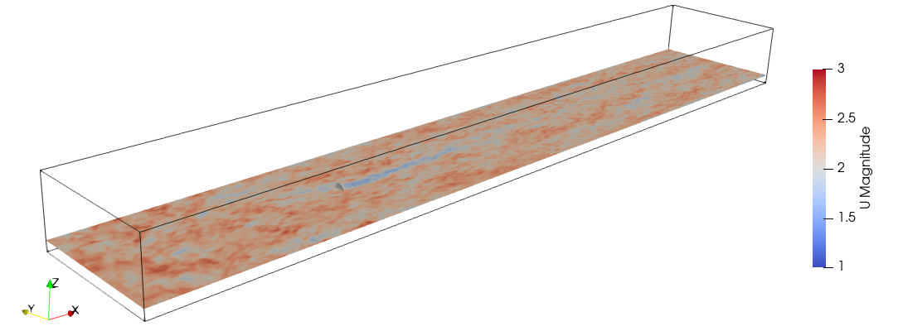
Figure 1. Contour plot of the velocity magnitude, single wind turbine.

Figure 2 shows a similar plot for the wind farm simulation, along with the position of the 30 wind turbines that form the wind farm.

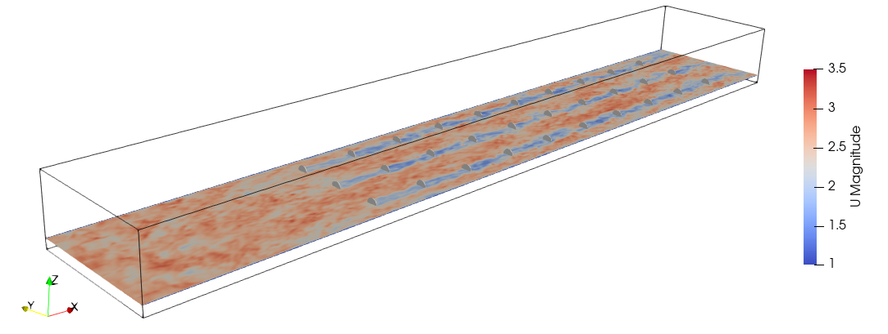
Figure 2. Contour plot of the velocity magnitude, wind farm.

## Validation – single wind turbine
The papers by Wu and Porté-Agel 2011 present measurements of mean velocity and turbulence intensity distributions that are used to validate the simulation results for the single wind turbine, shown in Figure 3 and Figure 4.

|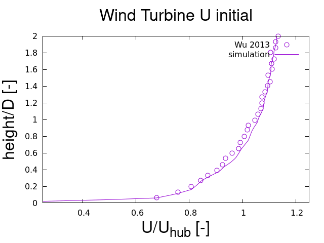|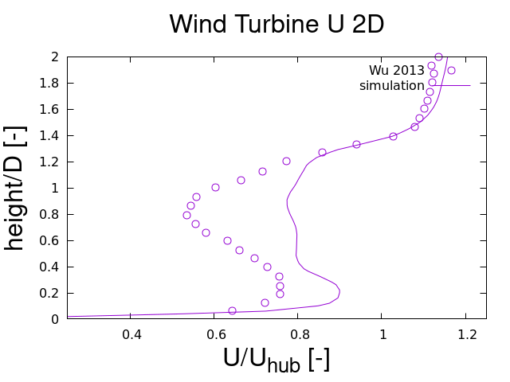||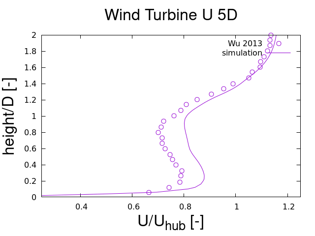| 	 
|-|-|-|-|
|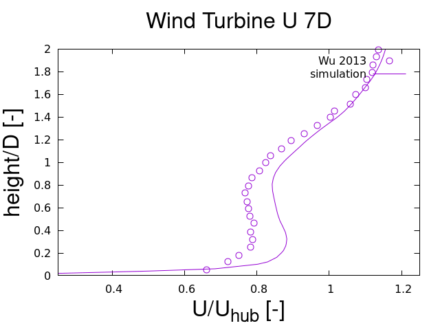|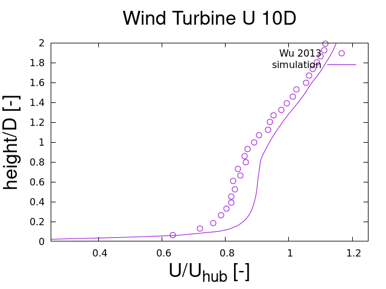||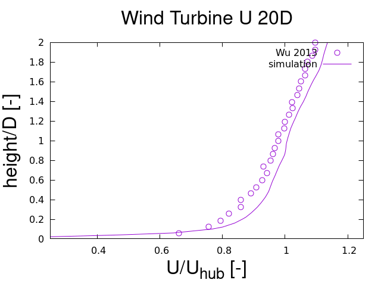|

Figure 3. Vertical streamwise velocity profiles of the flow over a turbine, showing the initial flow upstream the turbine and locations 2D, 3D, 5D, 7D, 10D, 14D and 2D downstream. Line: simulation results; symbols: measurement data taken from Wu and Porté-Agel 2011.
 	 	 	 
|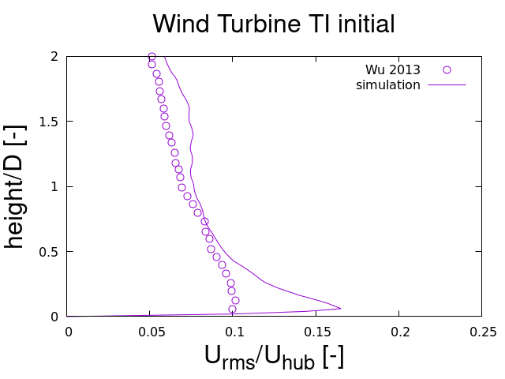|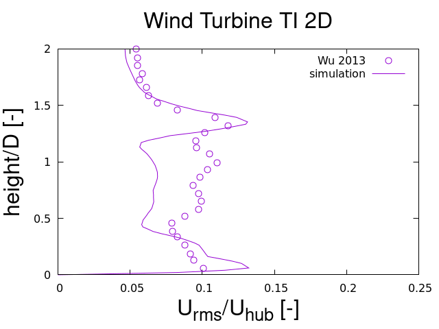||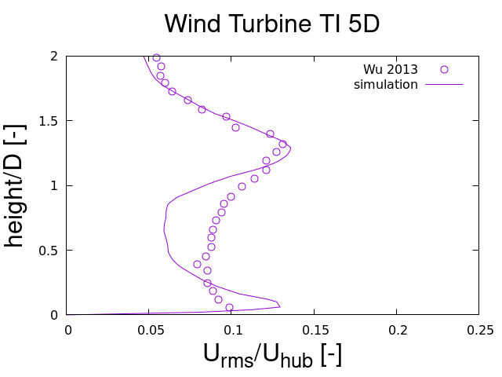|	 	 
|-|-|-|-|
||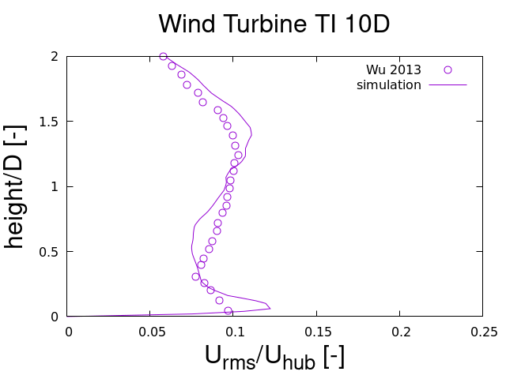|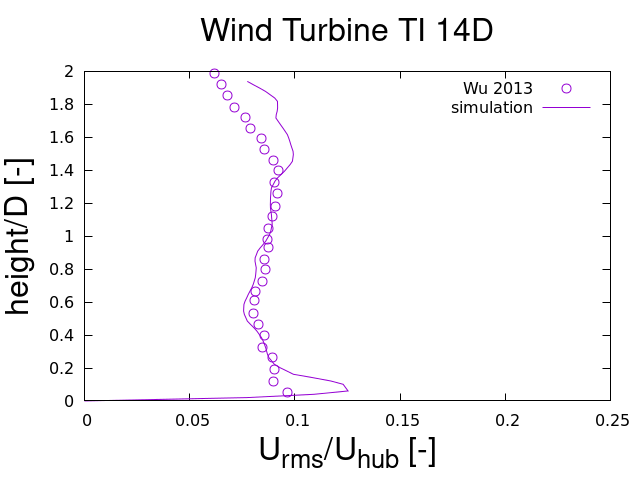|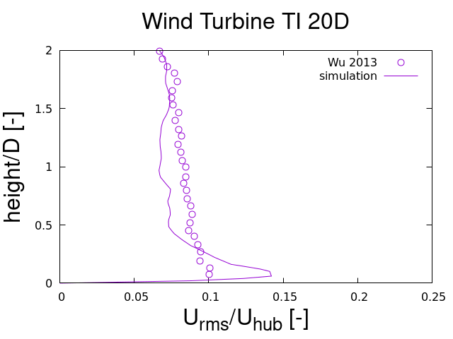|

Figure 4. Vertical streamwise turbulence intensity (Urms/Uhub) profiles of the flow over a turbine, showing the initial flow upstream the turbine and locations 2D, 3D, 5D, 7D, 10D, 14D and 2D downstream. Line: simulation results; symbols: measurement data taken from Wu and Porté-Agel 2011.

## Validation – wind farm
The papers by Wu and Porté-Agel 2013 present measurements of mean velocity and turbulence intensity distributions that are used to validate the simulation results for the wind farm, shown in Figure 5 and Figure 6.
 	 	 	 
|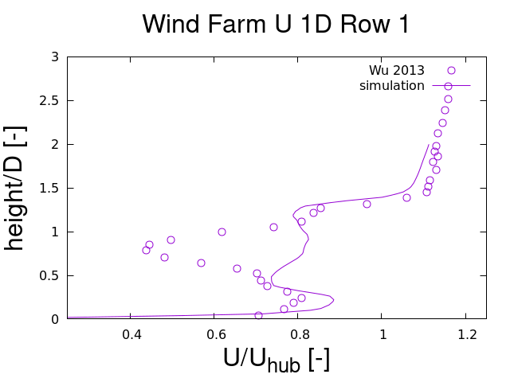|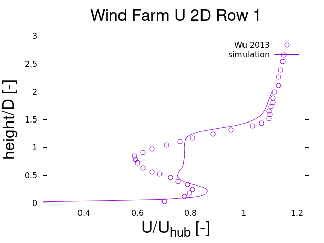|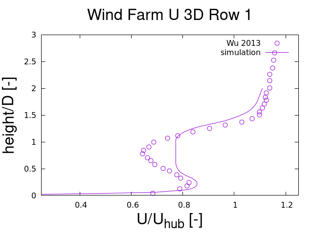|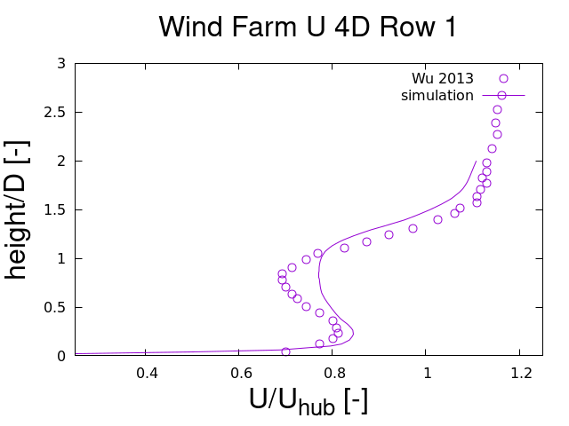| 	 
|-|-|-|-|

Figure 5. Vertical streamwise velocity profiles of the flow over the turbine on the middle column and on the first row, showing locations 1D, 2D, 3D, and 4D downstream. Line: simulation results; symbols: measurement data taken from Wu and Porté-Agel 2013.
 	 	 	 
|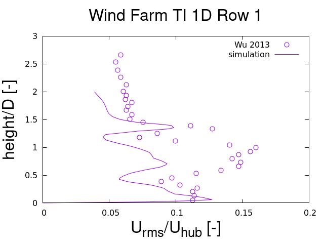|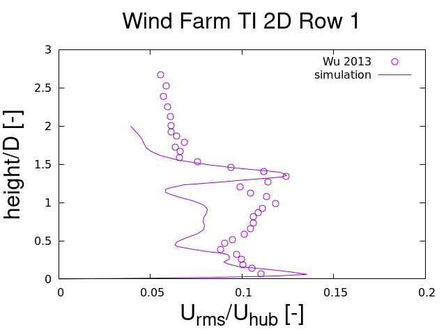|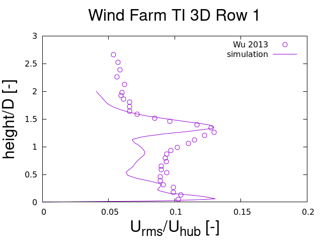|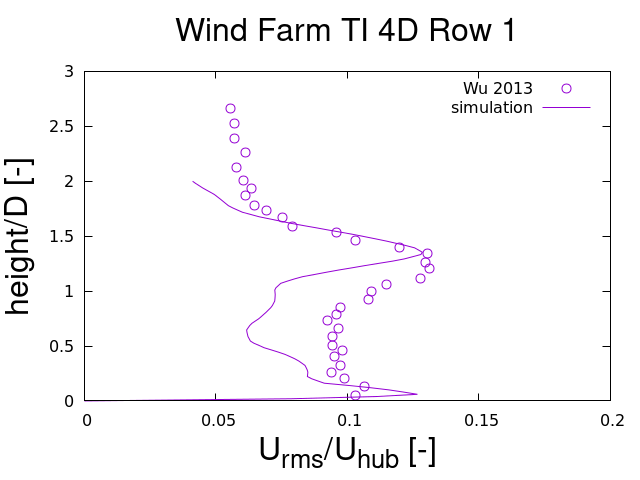| 	 
|-|-|-|-|

Figure 6. Vertical streamwise turbulence intensity (Urms/Uhub) profiles of the flow over the turbine on the middle column and on the first row, showing locations 1D, 2D, 3D, and 4D downstream. Line: simulation results; symbols: measurement data taken from Wu and Porté-Agel 2013.

## Bottlenecks
The bottlenecks to be addressed by the exaFOAM project that will contribute the simulations of wind parks are:
* Scalability of flow solver to a large number of processor cores
* Large number of time steps requires large computational effort
* Checkpoint files needed by the analysis can overwhelm the storage subsystem
Known bottlenecks of this microbenchmark that are out of the scope of the exaFOAM project:
* Scalability of the synthetic turbulence generator (turbulentDigitalFilterInlet)
* Scalability of the wind turbine model (rotorDisk)

## Known issues
None

## Acknowledgment
This application has been developed as part of the exaFOAM Project https://www.exafoam.eu, which has received funding from the European High-Performance Computing Joint Undertaking (JU) under grant agreement No 956416. The JU receives support from the European Union's Horizon 2020 research and innovation programme and France, Germany, Italy, Croatia, Spain, Greece, and Portugal.


## References
* L. P. Chamorro and F. Porté-Agel, Effects of thermal stability and incoming boundary-layer flow characteristics on wind turbine wakes: A wind-tunnel study, Boundary-Layer Meteorol. 136, 515 (2010).
* L. P. Chamorro and F. Porté-Agel, Turbulent flow inside and above a wind farm: a wind-tunnel study, Energies 4, 1916 303 (2011).
* Wu, Y. T., & Porté-Agel, F. (2011). Large-Eddy Simulation of Wind-Turbine Wakes: Evaluation of Turbine Parametrisations. Boundary-Layer Meteorology, 138(3), 345–366.
* Wu, Y.-T., & Porté-Agel, F. (2013). Simulation of Turbulent Flow Inside and Above Wind Farms: Model Validation and Layout Effects. Boundary-Layer Meteorology, 146(2), 181–205.
