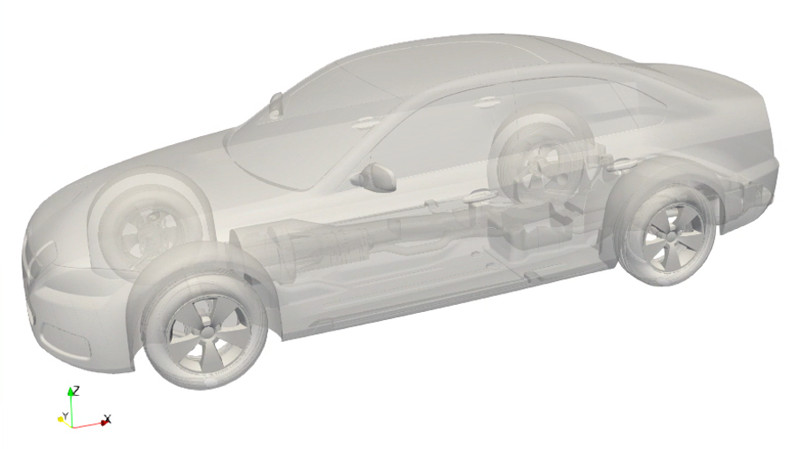
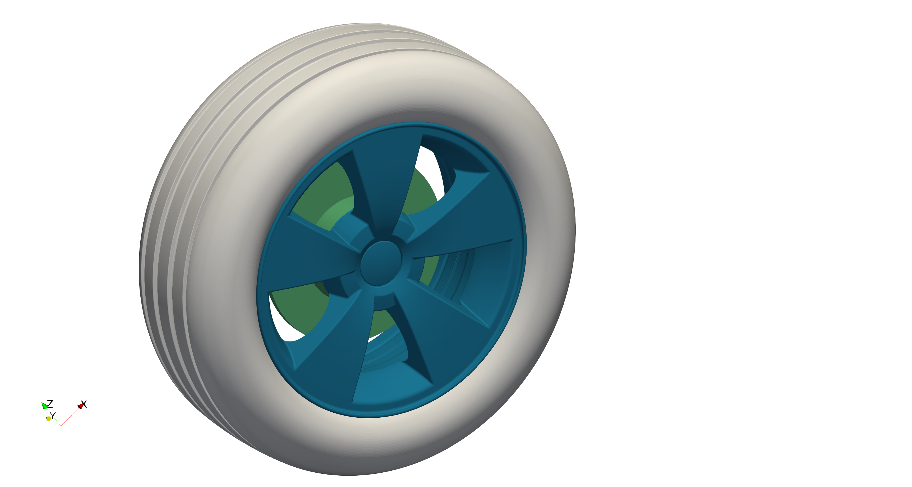
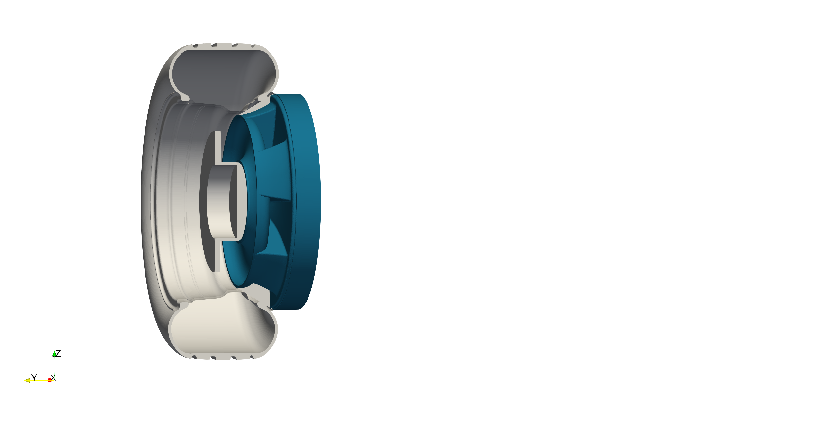
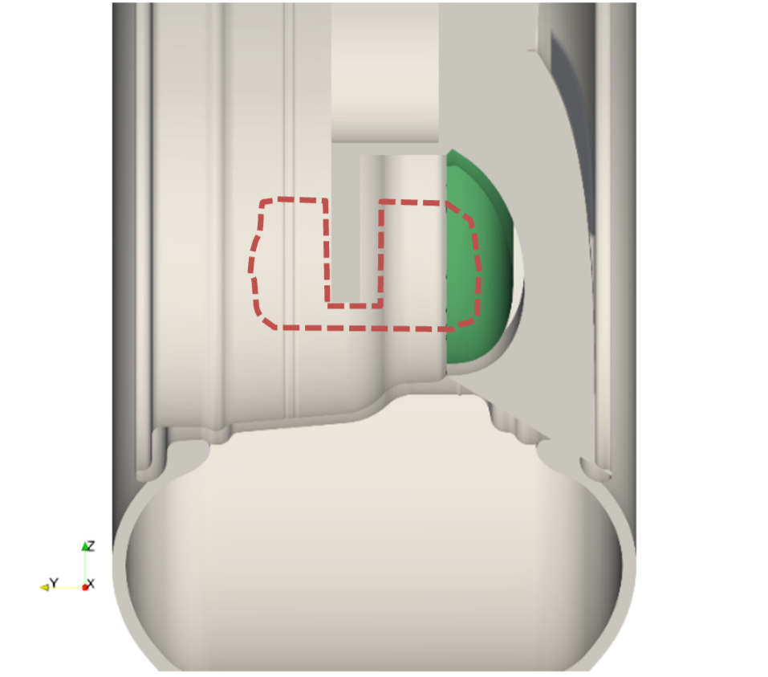
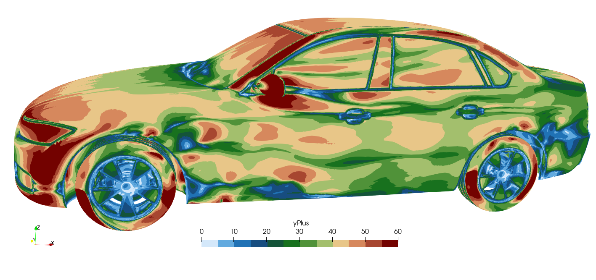
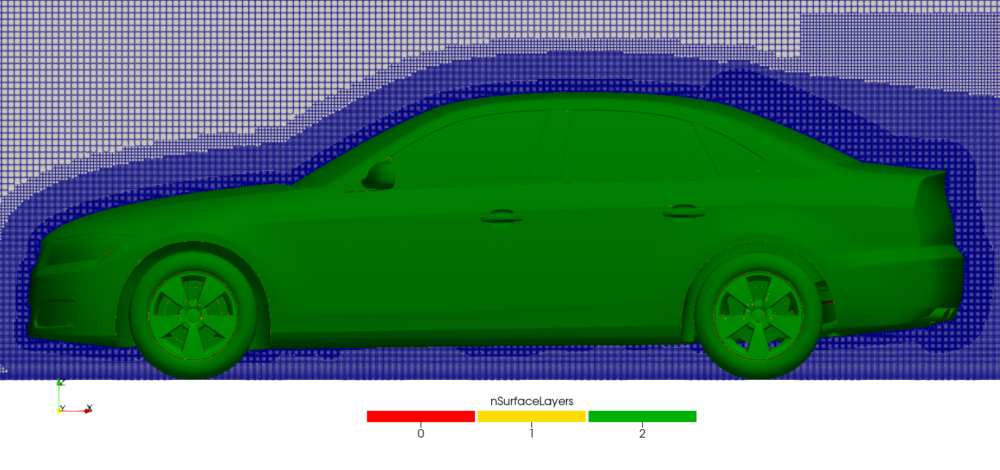
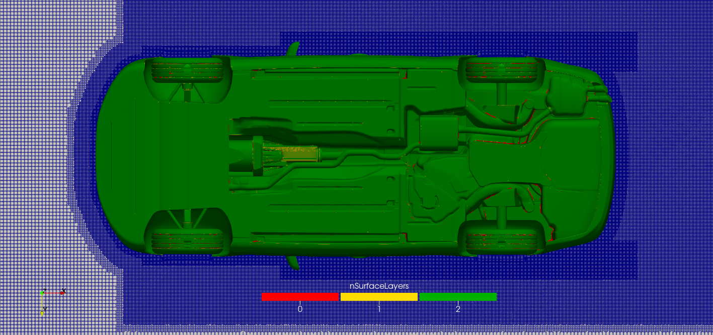
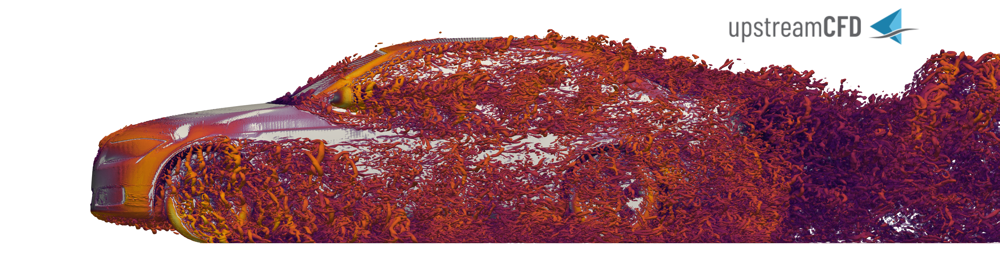

# Open-closed cooling DrivAer variant with rotating mesh
## Authors
Charles Mockett, Hendrik Hetmann and Felix Kramer, Upstream CFD GmbH, 2022-2023

## Copyright
Copyright (c) 2022-2023 Upstream CFD GmbH

 This work is licensed under a <a rel="license" href="http://creativecommons.org/licenses/by-sa/4.0/">Creative Commons Attribution-ShareAlike 4.0 International License</a>.

## Configuration
The open-closed cooling modification of the DrivAer represents a typical industrial application using the arbitrary mesh interface (i.e. ACMI) for rotating wheels in OpenFOAM. The case consists of a full car model with closed coolings and a complex underbody. This variant of the DrivAer was introduced by Ford (Hupertz, et al., 2021[^Hupertz]), see Figure 1, and heavily investigated with closed coolings as case 2 in the 2nd automotive CFD prediction workshop (https://autocfd.eng.ox.ac.uk/#test-cases) 2021 where the STL CAD data file used to mesh this case can be downloaded. For clarity, the name occDrivAer (open-closed-coolings) is used here for this model. The setup of this industrial application is identical to the workshop case but with moving floor and rotating wheels using mesh rotation.

The main purpose of this test case is to demonstrate the bottle-neck caused by the coupling of the rotating and the static parts with a fully realistic case and setup. In general, the domain is decomposed producing similar cell numbers per CPU core. However, those cells where the coupling is active are computationally much more demanding than cells in the rest of the domain. This causes a computational imbalance between the CPU cores and impacts the scaling very unfavourably.

Figure 1: occDrivAer shape.

## Flow Parameters
- Air with a kinematic viscosity: $\nu = 1.507e^{-5}$
- Inlet and moving floor velocity: $U=38.889$ m/s
- Rotating wall velocity: $\omega=122.899552$ rad/s
- Wheelbase: $L_\text{ref}=2.78618$ m
- Reynolds number: $\text{Re}=(U \cdot L_\text{ref}) / \nu=7.1899e^{6}$ with wheelbase $L_\text{ref}$

## Numerical Setup
The coordinate system's origin is located in the middle of the front axle. From there, the computational domain spans 40m upstream and 80m downstream as indicated in Figure 2. The domain's height is 20m where the floor is located at -0.3176m. The width is 44m and spans from -22m to 22m.

Figure 2: Computational domain with grid levels for mesh refinement.

The grid levels in Figure 2 are chosen to resolve the turbulence in the focus regions sufficiently. The first level has a cell size of 1m that is split for each higher level by a factor of two.

To correctly capture the rotational motion of the wheels at minimum computational cost and complexity, the wheel is separated in two areas, each with a different approach for modelling the rotational motion. Rotation on the tire and the brake disc can be realised with a fixed angular velocity boundary condition since the direction of the velocity vector at every point of the surface is always tangential for all rotation phase angles. This is not true for some parts of the rim, in particular the side parts of the spokes. To properly model the rotation of the spokes, a fitting subset of the mesh in their vicinity is rotated instead, with a no slip condition on all walls within the rotating mesh section. The rotating and static parts of the mesh are connected via ACMI. The floor moves at a constant speed matching the inflow velocity and outer wheel velocity.

Figure 3: Left: Isolated wheel. Middle: Cut through wheel parts (grey) and boundaries of rotating mesh part (blue). Right: Positioning of inner ACMI (green) and indicated brake block (red).

Figure 3 shows a cut through the wheel and indicates the rotating mesh area in blue. The inner ACMI (green) is adapted to follow the curve of the spokes and leave space for the brake block (location indicated in red), which is not present in the drivAer CAD data but was considered to account for its impact on the difficulty of the ACMI interface positioning. The solver pimpleFOAM and the kOmegaSSTDDES turbulence model is used.

## Mesh
The mesh is generated using a two-step snappyHexMesh approach and commences from a background blockMesh resolution of cell level $L_0=1$m. The major surface refinement level is $L_9=1.95$mm with the maximum feature refinement level being $L_{10}=0.96$mm and $L_{12}=0.24$mm on the static and rotating part, respectively. There are 2 prism layers with the wall closest cell having a wall-normal size of e.g. 0.8mm on the roof top. The mesh aims to be used with wall functions, and values of $y^+\gt 30$ are achieved for the major parts of the mesh, see Figure 4.

Figure 4: Snapshot of $y^+$ from initial RANS.

After generation of the background mesh, the static and the rotating mesh (area around the spokes) are generated separately by two calls to snappyHexMesh. Finally, both cases are merged via mergeMeshes.

Figure 5: Side view on the mid cut of the mesh.

Figure 6: Underbody view on a plane cutting the front axle.

## Instructions
### Prerequisites and additional information
- Known to run with OpenFOAM-v2012, gcc11, openmpi3 on AMD Epyc architecture
- Mesh generation designed and tested with decomposition for fixed number of 128 processors: 238M cells, takes approx. 4h
- Workflow designed to store mesh entirely in parallel 
- Fixed number of PIMPLE iterations
- Currently predefined partitioner for solving: KaHIP

### Meshing
- Run the meshing script Allrun.pre
- Allrun.pre has four stages that can be activated/deactivated:
  - Generate a new folder using blockMesh.
  - Generate a new folder for the static part.
  - Generate a new folder for the rotating part.
  - Generate a new folder for merging the static and the rotating part
  - The merged folder is named "occDrivAerRotMesh". It is the final mesh.

### Running
- In the script Allrun, check the following switches and adjust them if required:
- "run_initial_RANS=true/false": Solve initial for an initial field
- "run_initial_DDES=true/false": Solve initial transient until t=0.2
- "run_productive_DDES=true/false": Continue with averaging until t=0.5.
- Adjust the variables time frame as desired, keeping in mind that a full revolution of the wheel takes approx. 0.05s. The predefined time settings are not meant for a real statistical average. For meaningful statistics, the transient is longer and the averaging time frame is too short.

## Preliminary Results

Figure 7 shows the Q iso-surfaces (Q=400) of a snapshot at t=0.2.

## Acknowledgment
This application has been developed as part of the exaFOAM Project https://www.exafoam.eu, which has received funding from the European High-Performance Computing Joint Undertaking (JU) under grant agreement No 956416. The JU receives support from the European Union's Horizon 2020 research and innovation programme and France, Germany, Italy, Croatia, Spain, Greece, and Portugal.

## Footnotes
[^Hupertz]: Hupertz, B., Chalupa, K., Krueger, L., Howard, K., Glueck, H.-D., Lewington, N., . . . Shin, Y.-s. (2021). On the Aerodynamics of the Notchback Open Cooling DrivAer: A Detailed Investigation of Wind Tunnel Data for Improved Correlation and Reference. SAE Int. J. Adv. & Curr. Prac. in Mobility, 3(4), 1726-1747. doi:https://doi.org/10.4271/2021-01-0958
[^AutoCFD2]: https://autocfd.eng.ox.ac.uk/#test-cases
