# Isolated rotating wheel using mesh rotation
## Authors
Hendrik Hetmann and Felix Kramer, Upstream CFD GmbH

## Copyright
Copyright (c) 2022-2023 Upstream CFD GmbH

 This work is licensed under a <a rel="license" href="http://creativecommons.org/licenses/by-sa/4.0/">Creative Commons Attribution-ShareAlike 4.0 International License</a>.

## Configuration
This microbenchmark aims to represent an industrial application in small scale using the arbitrary mesh interface (i.e. ACMI) in OpenFOAM. The case consists of a single isolated rotating front left wheel of the DrivAer full scale car model in the variant introduced by Ford (Hupertz, et al., 2021[^Hupertz]), see Figure 1.

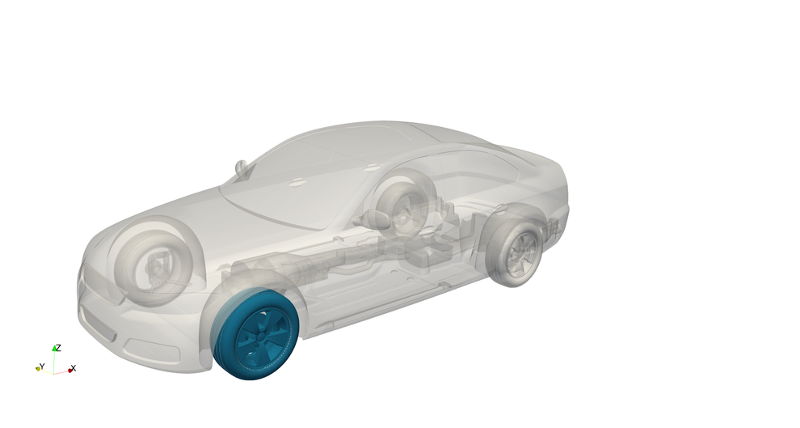

Figure 1: DrivAer geometry with indication of the selected wheel.

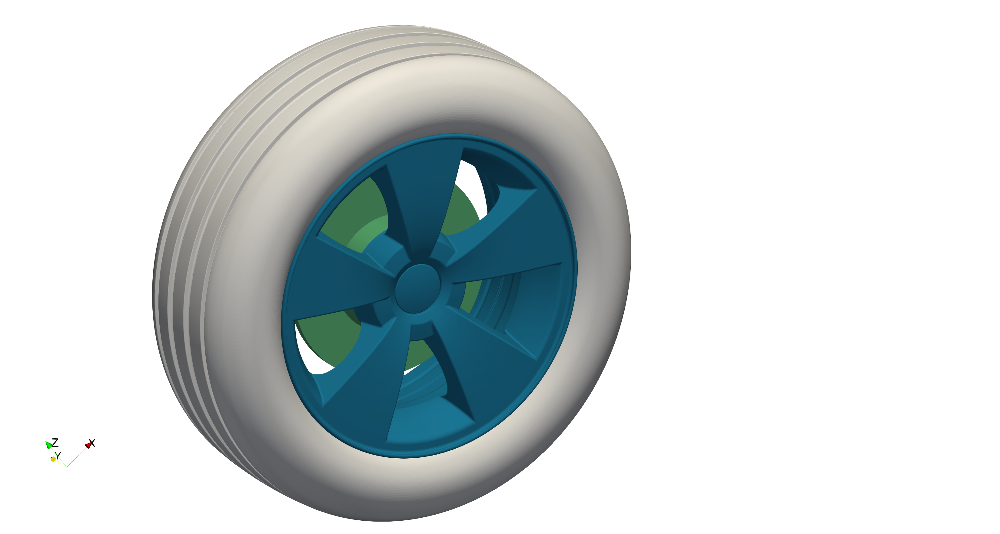

Figure 2: Selected wheel parts: The tire (grey), the rim (blue) and the brake disc (green).

The CAD data was taken from case 2 of the 2nd automotive CFD prediction workshop (https://autocfd.eng.ox.ac.uk/#test-cases) and the parts used for this microbenchmark are shown in Figure 2. The positioning of the wheel axis is inherited from the full-scale case and indicated in Figure 1. The domain inlet is positioned at x=-2500 mm, such that the domain lengths upstream and downstream of the wheel are approx. 3.4D and 9.7D with D being the outer tire diameter. The domain size is chosen arbitrarily but ensures adequate distance to boundaries for numerical stability and resolution of the turbulent flow downstream of the wheel.

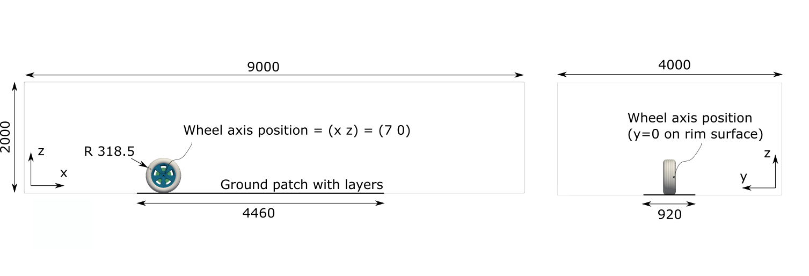

Figure 3: Sketch of the simulation domain and key sizes.

## Flow Parameters
- Air with a kinematic viscosity: $\nu = 1.507e^{-5}$
- Inlet and moving floor velocity: $U=38.889$ m/s
- Rotating wall velocity: $\omega=122.899552$ rad/s
- Reynolds number: $\text{Re}=(U \cdot L_\text{ref}) / \nu=7.1899e^{6}$ with wheelbase $L_\text{ref}$

## Numerical Setup
To correctly capture the rotational motion of the entire wheel geometry at minimum computational cost and complexity, the wheel is separated in two areas, each with a different approach for modelling the rotational motion. Rotation on the tire and the brake disc can be realised with a fixed angular velocity boundary condition since the direction of the velocity vector at every point of the surface is always tangential for all rotation phase angles. This is not true for some parts of the rim, in particular the side parts of the spokes. To properly model the rotation of the spokes, a fitting subset of the mesh in their vicinity is rotated instead, with a no slip condition on all walls within the rotating mesh section. The rotating and static parts of the mesh are connected via ACMI. The floor moves at a constant speed matching the inflow velocity and outer wheel velocity.

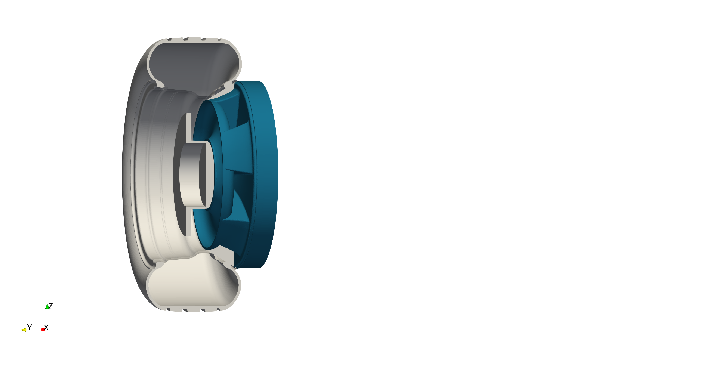
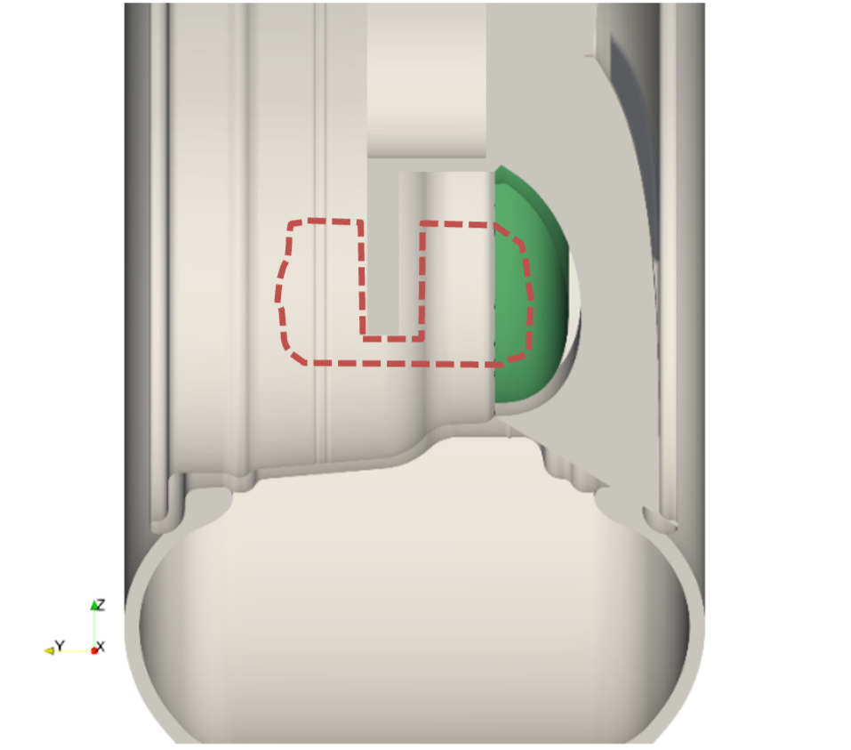

Figure 4: Left: Cut through wheel parts (grey) and boundaries of rotating mesh part (blue). Right: Positioning of inner ACMI (green) and indicated brake block (red).

Figure 4 shows a cut through the wheel and indicates the rotating mesh area in blue. The inner ACMI (green) is adapted to follow the curve of the spokes and leave space for the brake block (location indicated in red), which is not present in the drivAer CAD data but was considered to account for its impact on the difficulty of the ACMI interface positioning. The solver pimpleFOAM and the kOmegaSSTDDES turbulence model is used.

## Mesh
The mesh is generated using a two-step snappyHexMesh approach and commences from a background blockMesh resolution of cell level $L_0=1000$mm. The major surface refinement level is $L_9=1.95$mm with the maximum feature refinement level being $L_{11}=0.4883$mm. There are 5 prism layers with a relative final layer thickness of 0.75 to 0.8 depending on the wall patch and a cell-to-cell expansion ratio of 1.1. This leads to a first layer thickness in the range of 1.06mm to 0.267mm. The mesh aims to be used with wall functions and values of $y^+\gt 30$ are achieved for the major parts of the mesh, see Figure 5.

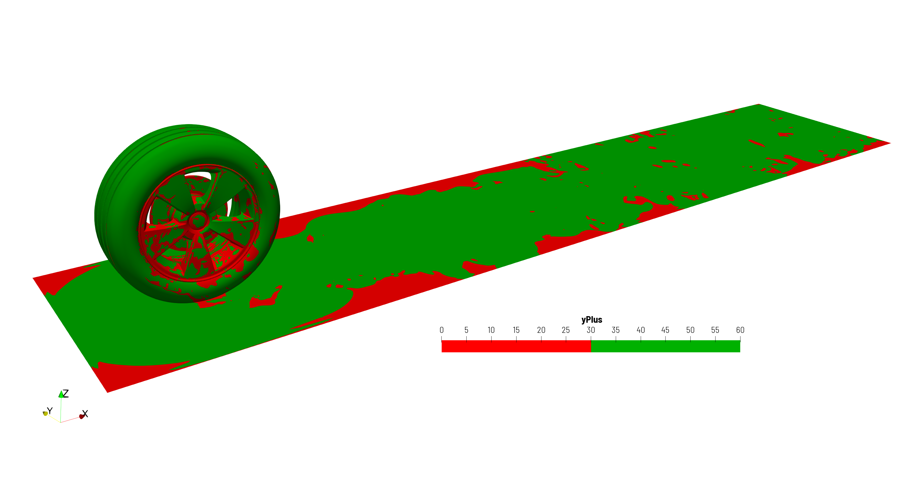

Figure 5: Snapshot of $y^+$ after 10 full rotations (t=0.5s). Visible parts: Wheel and ground with layers.

After generation of the background mesh, the static and the rotating mesh (area around the spokes) are generated separately by two calls to snappyHexMesh. Finally, both cases are merged via mergeMeshes. Figure 6 shows some views of the final mesh, which consists of about 20M cells. 

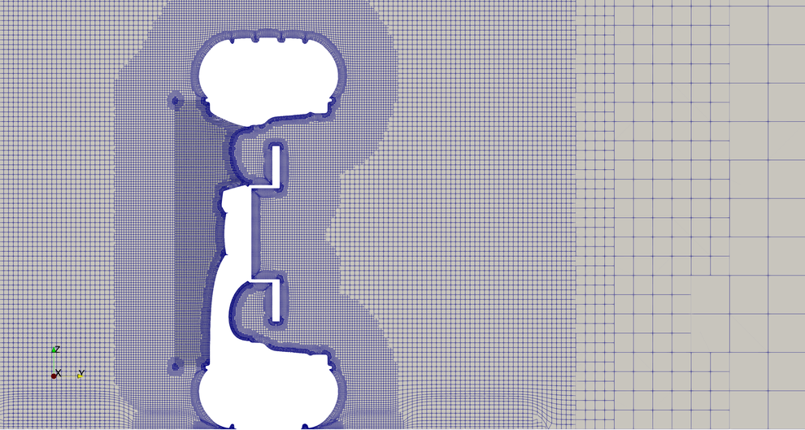
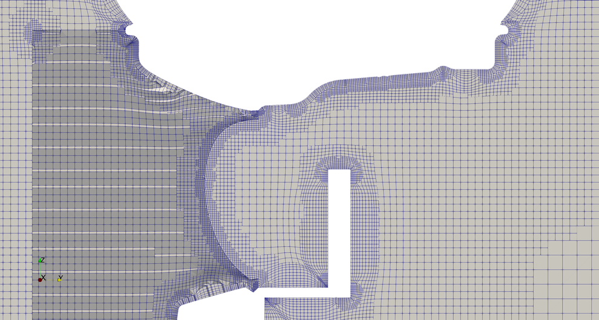

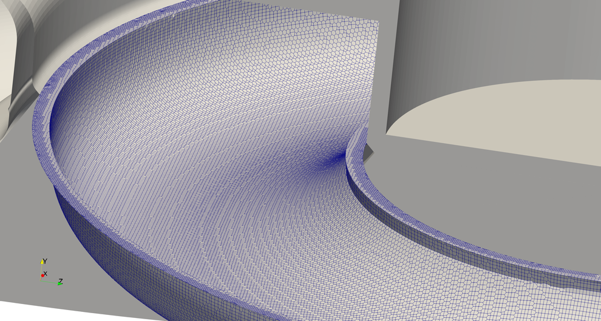
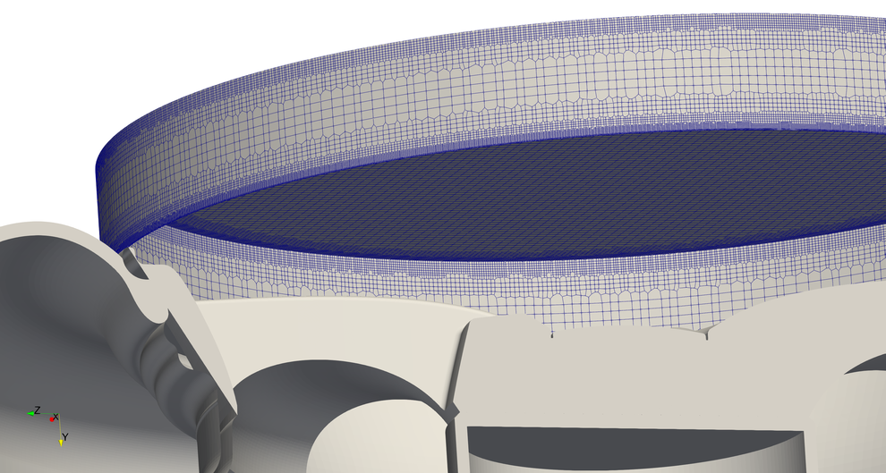

Figure 6: Different views of the final mesh: YZ-cut through the whole domain around the wheel (upper left), details of rotating part and interfaces (upper right), inner ACMI (lower left) and outer ACMI (lower right).

## Instructions
### Prerequisites and additional information
- Known to run with OpenFOAM-v2012, gcc11, openmpi3 on AMD Epyc architecture
- Mesh generation designed and tested with decomposition for fixed number of 18 processors: 20M cells, takes approx. 1h
- Workflow designed to store mesh entirely in parallel 
- Fixed number of PIMPLE iterations
- Currently predefined partitioner for solving: KaHIP

### Meshing
- Run the meshing script Allrun.pre
- Allrun.pre has four stages that can be activated/deactivated:
  - Generate a new folder using blockMesh.
  - Generate a new folder for the static part.
  - Generate a new folder for the rotating part.
  - Generate a new folder for merging the static and the rotating part
  - The merged folder is named "wheelRotMesh". It is the final mesh.
- If less than 18 processors are available: Change to fallback decomposition (4 processors) by commenting/uncommenting lines in system/decomposeParDict.meshing respectively. (Leads to slightly worse mesh!)

### Running
- In the script Allrun, check the following switches and adjust them if required:
- "run_initial_DDES=true/false": Solve initial transient until t=0.2
- "run_productive_DDES=true/false": Start averaging until t=0.5.
- Adjust the variables time frame as desired, keeping in mind that a full revolution of the wheel takes approx. 0.05s. The recommend minimum value for the initial transient is 0.2s followed by 0.3s averaging.

## Known Issues
snappyHexMesh produces meshes with reduced quality when using gcc7 and openmpi1.

## Preliminary Results
Figure 7 show the velocity contours of a snapshot after about 10 full rotations using the flow conditions set out in the workshop description.

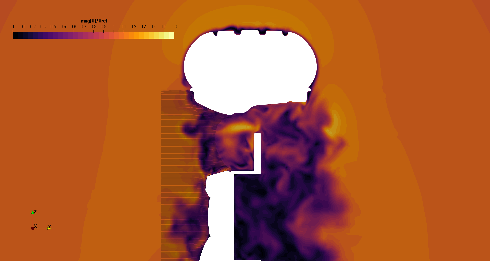
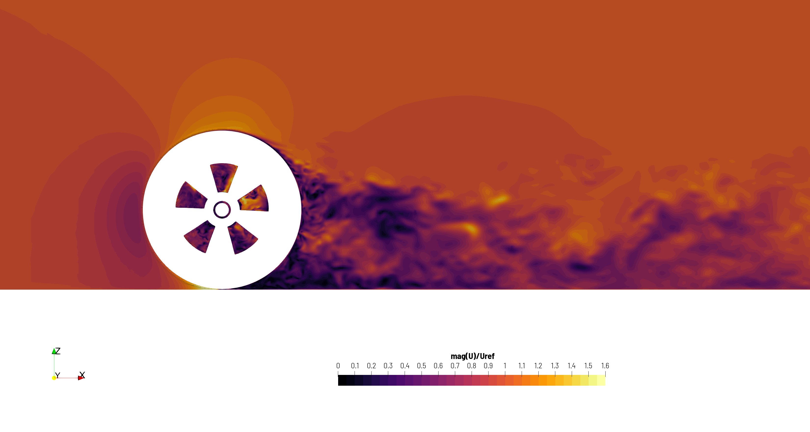

Figure 7: Velocity contours after 10 full rotations.

The performance issue to be addressed is demonstrated by the scalability analysis in Figure 8. The static wheel 1-zone mesh, where the pressure equation is solved by PCG, scales as can be expected. Solving the pressure with GAMG impacts the scalability in a bad way. It must be noted that in absolute numbers and at 72 cores, GAMG is more than two times faster than PCG. However, due to the unfavourable scalability, it is 40% slower than PCG at 2016 cores. The rotating wheel (based on a rotating mesh) achieves a scale up of only 15 compared to ideal 27 at 2016 cores.
To account also for the absolute overhead introduced by the rotating mesh, Figure 8 illustrates the parallel efficiency using the static wheel case as norm. At 72 cores and using PCG, the rotating wheel shows only 62% of the efficiency of the static wheel case and decreases even down to 32% at 2016 cores.

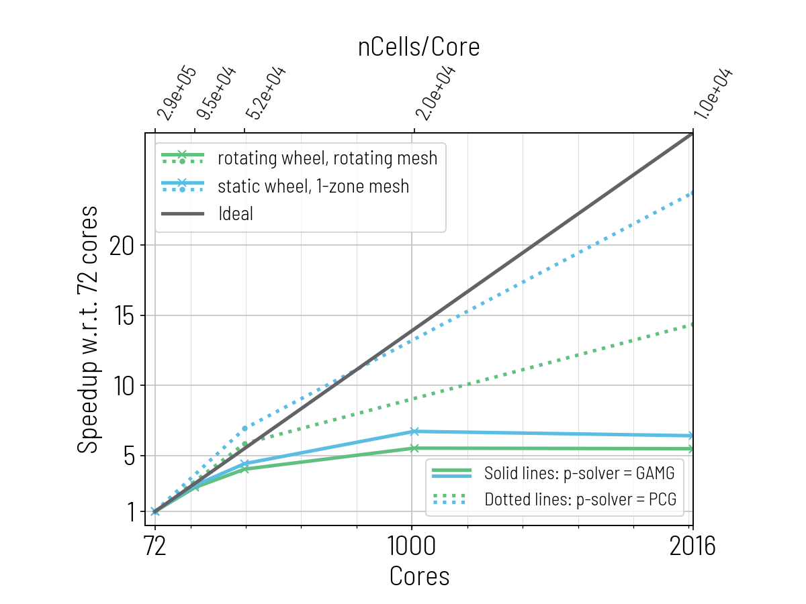
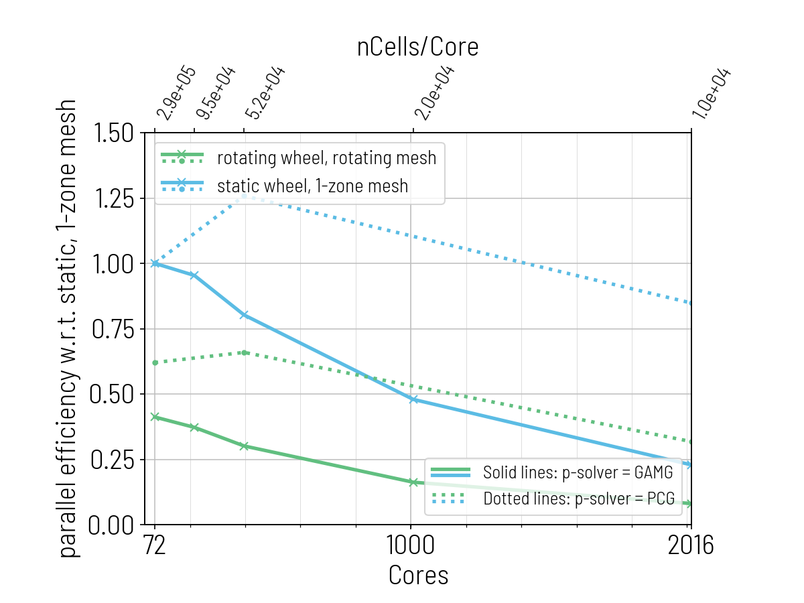

Figure 8: Scalability analysis (left) and parallel efficiency (right).

## Acknowledgment
This application has been developed as part of the exaFOAM Project https://www.exafoam.eu, which has received funding from the European High-Performance Computing Joint Undertaking (JU) under grant agreement No 956416. The JU receives support from the European Union's Horizon 2020 research and innovation programme and France, Germany, Italy, Croatia, Spain, Greece, and Portugal.

## Footnotes
[^Hupertz]: Hupertz, B., Chalupa, K., Krueger, L., Howard, K., Glueck, H.-D., Lewington, N., . . . Shin, Y.-s. (2021). On the Aerodynamics of the Notchback Open Cooling DrivAer: A Detailed Investigation of Wind Tunnel Data for Improved Correlation and Reference. SAE Int. J. Adv. & Curr. Prac. in Mobility, 3(4), 1726-1747. doi:https://doi.org/10.4271/2021-01-0958
[^AutoCFD2]: https://autocfd.eng.ox.ac.uk/#test-cases
