# ERCOFTAC Conical Diffuser
## Authors
Sergey Lesnik and Henrik Rusche, Wikki GmbH, Germany

## Copyright
Copyright (c) 2022-2024 Wikki GmbH

 

Except where otherwise noted, this work is licensed under a <a rel="license" href="http://creativecommons.org/licenses/by-sa/4.0/">Creative Commons Attribution-ShareAlike 4.0 International License</a>.

## Introduction
The case stems originally from the European Research Community on Flow, Turbulence and Combustion (ERCOFTAC). A detailed description is available[^description] and experimental data[^database] as well. The description is summarized in the following.

A diffuser is designed to reduce the flow velocity and therefore increase the fluid pressure without causing significant pressure loss. This is done by increasing the cross-section area, e.g. by introducing a conical segment. The latter is characterized by a so-called divergence angle, which is the angle between the opposite walls in the axial cross-section through the conical part. Due to this geometry the flow tends to separate at the diffuser wall, which is undesirable since it causes losses. However, the behavior can be counteracted by the inclusion of a swirling flow component in the flow entering the diffuser. But if the swirl is too strong a recirculation along the center axis occurs, which reduces the pressure recovery.

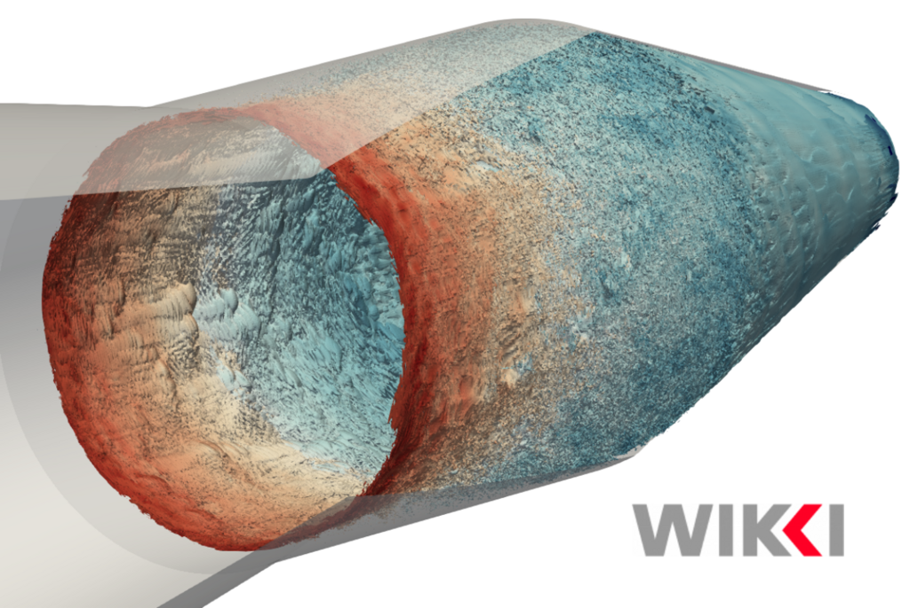

## Configuration
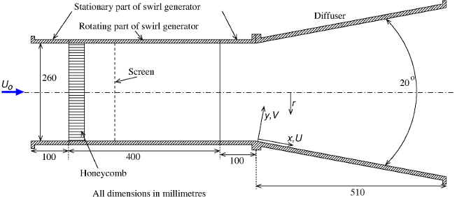

Figure: Diffusor geometry from [Classic Collection Database](http://cfd.mace.manchester.ac.uk/ercoftac/doku.php?id=cases:case060&s[]=conical), used under the [CC BY-NC-SA 4.0 license](https://creativecommons.org/licenses/by-nc-sa/4.0/).

The experiment was setup and performed by Clausen et. al.[^Clausen1993]. The swirl is generated by a rotating part of the cylindrical inlet pipe with the angular velocity of $\Omega=$ 52.646 1/s. Its diameter is $D=$ 260 mm and includes an $l_h=$ 20 mm long aluminium honeycomb with a cell diameter of $d_h=$ 3.2 mm and open area ration of 0.97. At the end of the swirl generator the flow characteristics are close to the solid-body rotation pattern. The two 100 mm long stationary parts of the inlet pipe are placed before and after the swirl generator. The diffuser itself is $L_d=$ 510 mm long and has a 20° divergence angle leading to an area ratio of 2.84. The swirl is strong enough to prevent separation of the boundary layer but weak enough not to cause a recirculation at the center line within the diffuser.

## Measurements
The measurement stations were placed 25 mm upstream of the diffuser inlet and at
x = 25, 60, 100, 175, 250, 330, 405 mm downstream, where x is a coordinate parallel to the wall. The measuring traverses are normal to the diffuser wall. The measured radial profiles of the mean axial and circumferential velocities, Reynolds stresses are available[^database].

## Flow Parameters
- Air with a kinematic viscosity: $\nu=1.5 \cdot 10^{−5}$ m²/s.
- Average axial velocity close to the diffuser inlet (x = −25mm): $U_0=$  11.6 m/s.
- Reynolds number: $Re=U_0 D / \nu=$ 202000.
- Atmospheric pressure at outlet.

# Numerical Setup
The numerical setup is based on the work of Nilsson et. al.[^Nilsson2008] and Bounous[^Bounous2008]. A detailed description is available on openfoamwiki[^openfoamwiki]. Therein, three case geometries are provided, which differ in the treatment of the outlet. This part of the setup needs the most attention since there is a recirculation region along the center axis downstream of the diffuser. Furthermore, the flow is close to stall condition at the diffuser wall. Both factors cause instabilities during the solution process, e.g., flow reversal at the diffuser outlet.

Figure: Numerical setup geometry. The dimensions are given in mm.

The setup is shown in the figure above. The rotating part of the inlet pipe from the experiment is included (A-B). The rotation is applied by setting the corresponding circumferential velocity component at the wall. The honeycomb present in the experiment assists in swirling the flow. Since meshing of the honeycomb is not feasible, a solid-body vortex is imposed at the inlet A. The conical diffuser itself is located between planes D and E. A pipe with a length of 5 times the diffuser outlet diameter is attached to the diffuser outlet E. This includes the complete recirculation region downstream of the diffuser and prohibits instabilities at the outlet F because the flow homogenizes until that point.

- The setup is 3D.
- The flow is stationary.
- The flow is initialized with solver *potentialFoam* as a pre-processing step.
- Solver *simpleFoam* is used.
- The low Reynolds k-$\omega$-SST turbulence model is employed.

## Mesh
The mesh is generated using *m4*, *perl* and *blockMesh*. The file with the geometry properties is located at *system/blockMeshDict.m4*. The lengths, diameters of all parts and the divergence angle may be varied by altering few variables. The two most important input values are the thickness of the 1st cell in radial direction $l_\text{wall}$ and the characteristic cell size in the core region (at the center axis) $l_\text{core}$. *Perl* scripts are introduced to allow for a convenient mesh refinement. Therein, the number of block cells in radial and axial directions is calculated based on the inputs using iterative procedures to produce a good quality mesh without jumps in the cell sizes between the blocks. $l_\text{wall}=$ 0.05 mm is sufficient to obtain a mesh with y+<5. Two meshes are predefined:
- 3 Million cells with
	* $l_\text{wall}=$ 0.05 mm
	* $l_\text{core}=$ 3.15 mm
- 100 Million cells with
	* $l_\text{wall}=$ 0.05 mm
	* $l_\text{core}=$ 0.9 mm

## Boundary Conditions
Boundary conditions (BC) for the following quantities need to be set:
| Quantity | Dimension | Description                    |
| -------- | --------- | ------------------------------ |
| U        | m/s       | Axial velocity                 |
| W        | m/s       | Circumferential velocity       |
| V        | m/s       | Radial velocity                |
| k        | m²/s²     | Turbulent kinetic energy       |
| $\omega$ | 1/s       | Specific turbulent dissipation |
| $\nu_t$  | m²/s      | Turbulent viscosity            |

### Inlet
In contrast to the setups from openfoamwiki[^openfoamwiki] the turbulent length scale at the inlet is set to $l_t=$ 2.24e-4 m, which equals 7% of the honeycomb cell diameter $d_h$. The turbulent intensity is assumed to be $I_t=$ 5%.
| Quantity | Value      | BC                                   |
| -------- | ---------- | ------------------------------------ |
| U        | 11.6       | fixedValue                           |
| W        | nonuniform | tool addSwirlAndRotation             |
| V        | 0          | fixedValue                           |
| k        | 0.5046     | turbulentIntensityKineticEnergyInlet |
| $\omega$ | 3171       | turbulentMixingLengthFrequencyInlet  |
| p        | -          | zeroGradient                         |
| $\nu_t$  | -          | calculated                           |

### Outlet
When the swirl arrives at the outlet, the pressure distribution in radial direction is not homogeneous. The best working BC in this case proved to be *fixedMean*.
| Quantity | BC          | BC parameter               |
| -------- | ----------- | -------------------------- |
| $\vec U$ | inletOutlet | inletValue uniform (0 0 0) |
| k        | inletOutlet | inletValue uniform 0.1     |
| $\omega$ | inletOutlet | inletValue uniform 10      |
| p        | fixedMean   | meanValue uniform 0        |
| $\nu_t$  | calculated  | -                          |

### Walls
| Quantity | BC                   | BC parameter           |
| -------- | -------------------- | ---------------------- |
| $\vec U$ | fixedValue           | uniform (0 0 0)        |
| k        | kLowReWallFunction   | inletValue uniform 0.1 |
| $\omega$ | omegaWallFunction    | blending binomial2     |
| p        | zeroGradient         | -                      |
| $\nu_t$  | nutLowReWallFunction | -                      |

# Validation
The axial pressure gradient is one of major perturbations of the swirling boundary layer in the transition region of the inlet pipe to the conical section. Apart from the low-Re, two high-Re turbulence models with corresponding coarser meshes (y+>30) were employed. Whereas k-$\varepsilon$ turbulence model performed well, the high-Re k-$\omega$-SST always predicted a separation at the diffuser well and proved to be in general very sensitive to the turbulence BC at the inlet. However, the low-Re k-$\omega$-SST setups with the two predefined meshes showed no separation. An overview of the flow in the middle cross-section for 3M case is given in figures below.

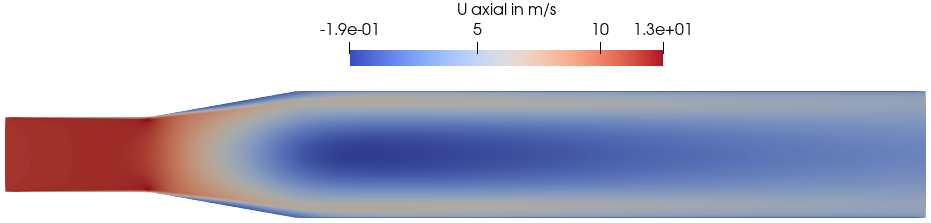
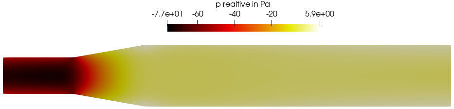
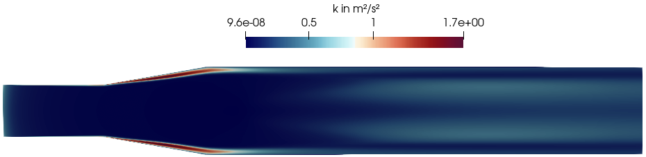

The validation is performed by comparing the results between the data gathered along the traverses during the experiment and the data sampled along the lines constructed accordingly. Here, a few results from the 100 Mio. case are presented. The x-axis is parallel to the wall and the position x = 0 mm corresponds to the beginning of the conical section.

| Position in mm | Normalized Velocities $U/U_0$ (axial) and $W/U_0$ (circumferential) | Normalized turbulent kinetic energy $k/U_0^2$ |
| -------------- | ------------------------------------------------------------------- | --------------------------------------------- |
| x = -25        | 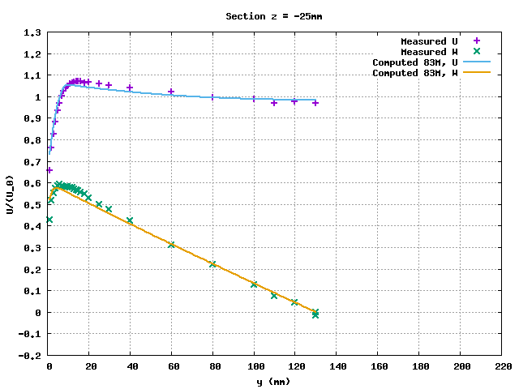                               | 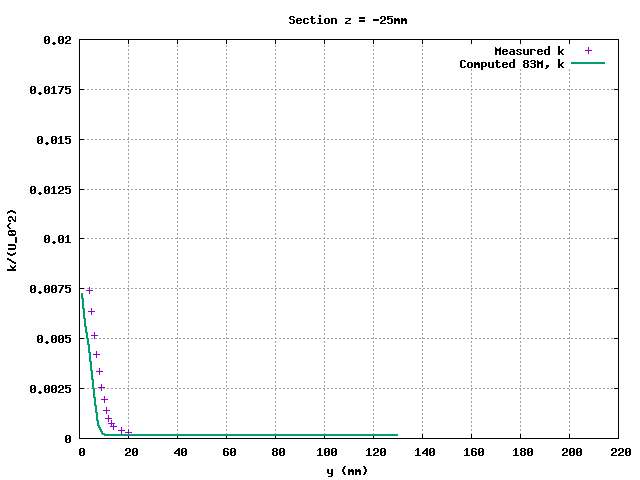          |
| x = 250        | 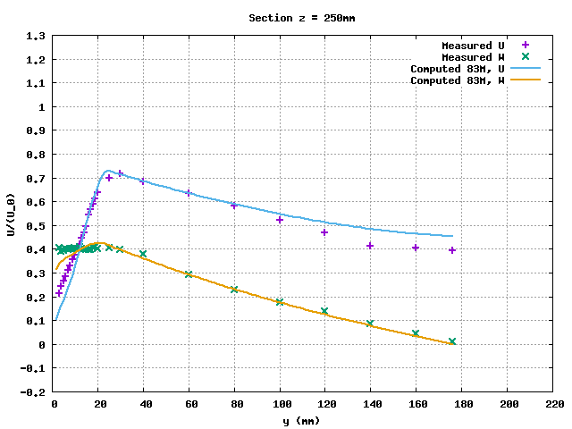                               | 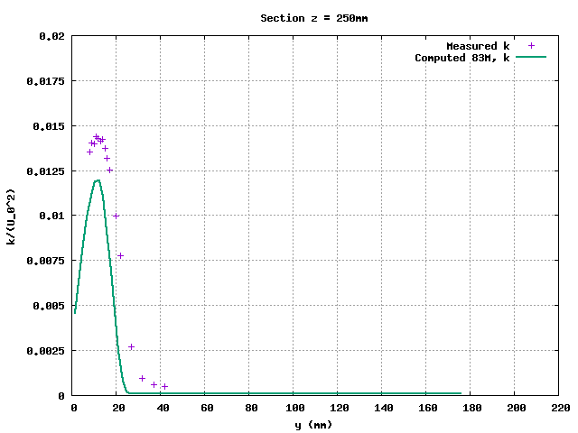          |
| x = 405        | 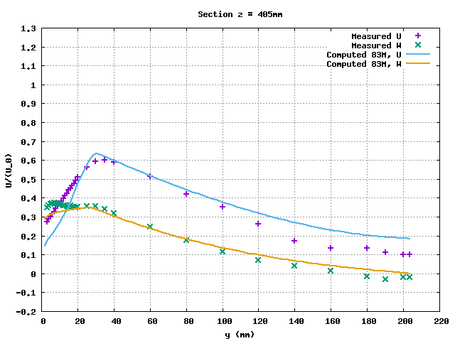                               | 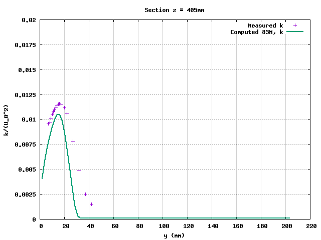          |

# Microbenchmark
- Known to run with OpenFOAM-v2106 compiled with double precision (WM_PRECISION_OPTION=DP).
- Two cases are provided: 3M, 100M. The name provides the number of cells, e.g. "3M" stands for 3 Mio cells.
- A single run consists of 20 time steps.
- The iteration numbers of the linear solvers are fixed.
- Utility *renumberMesh* is used to reduce the bandwidth of the resulting matrix.

## Run Time Statistics
First, runs with fixed relative and absolute tolerances (fixedTol) of the linear solvers were executed. After that, the run histories were analyzed to find out the mean iteration number for each variable a linear solver is utilized. Then, the setups were produced with the fixed iteration numbers (fixedIter) incorporating the values provided by the analysis.

The fixedIter cases were run for 1000 time steps in order to provide a reasonable statistics for determination of the representative number of time steps. The procedure is as follows:
- Analyze the wall clock time per time step $dt$.
- Compute its average $dt_\text{Av}$ and standard deviation $dt_\text{Std}$
- Compute a sample size of time steps needed for 95% confidence level with 1% error and given $dt_\text{Av}$, $dt_\text{Std}$ according to this formula:
  error and given $dt_\text{Av}$, $dt_\text{Std}$ according to this formula:
	$n_{dt} = 1.96^2 dt_\text{Std}^2/(0.01 dt_\text{Av})^2$

The evaluations showed that usually $n_{dt}$ under 20 is sufficient and that is why it is a predefined value. But on several occasions $n_{dt}$ >100 was observed on several HPCs. Thus, a function object named *wallClockTimeStatistics* is implemented which performs wall clock time measurement for each time step and prints it to the prompt. At the end of the run, mean and standard deviation are calculated and also printed. Furthermore, a warning is issued if the number of time steps of the current run is smaller than the one computed based on the statistics.

## Instructions

### Preliminary
- Compile the tool *addSwirlAndRotation*
	- `cd addSwirlAndRotation`
	- `wmake`

### Case Run
- Choose one of the provided mesh sizes (3M or 100M) or produce a case with a different mesh, e.g., by altering the "lCore" parameter in *system/blockMeshDict.m4* (see section [Mesh](#mesh))
- In *system/decomposeParDict*
	- Alter "numberOfSubdomains" to the number of MPI ranks the case is planned to run with.
	- Alter the last entry of the 3-tuple "n" in the subdictionary "simpleCoeffs" such that the multiplication of all three entries equals "numberOfSubdomains".
	- Alternatively to the step above "metis", "scotch" etc. may be set as decomposition "method" in *system/decomposeParDict* but complications may arise (see [Known Issues](#known-issues)).
- Run *Allpre* bash script, which contains the meshing, decomposition and renumbering procedures. Be aware that *blockMesh* is single-threaded and will require a substantial amount of memory and time for large meshes.
- Run *Allrun* or setup an HPC job script using the procedure from the script.
- Check the statistics printed at the end of the solver output (see [above](#run-time-statistics) why it's relevant).

### Postprocessing
An *Allpost* script and a folder with measurements data needed for the evaluation purposes only is provided for the sake of completeness.

# Known Issues
- If decomposed with metis or scotch the case might get unstable resulting in an increase of residuals by several orders of magnitude. It looks like the instability originates from the processor boundaries in the region of the boundary layer. If decomposed with method "simple", some generated partitions may have no cells leading to an error. Therefore, "hierarchical" is used as the decomposition method.

# Acknowledgment
This application has been developed as part of the exaFOAM Project https://www.exafoam.eu, which has received funding from the European High-Performance Computing Joint Undertaking (JU) under grant agreement No 956416. The JU receives support from the European Union's Horizon 2020 research and innovation programme and France, Germany, Italy, Croatia, Spain, Greece, and Portugal.

# References
[^description]: https://www.kbwiki.ercoftac.org/w/index.php?title=UFR_4-06_Description
[^database]: http://cfd.mace.manchester.ac.uk/ercoftac/doku.php?id=cases:case060&s[]=conical
[^Clausen1993]: Clausen, P.D., Koh, S.G., Wood, D.H. (1993). Measurements of a swirling turbulent boundary layer developing in a conical diffuser. Experimental Thermal and Fluid Science, Vol. 6, pp. 39-48.
[^Bounous2008]: O. Bounous. Studies of the ERCOFTAC Conical Diffuser with OpenFOAM. Research Report 2008:05, Applied Mechanics, Chalmers University of Technology, Sweden, 2008. Presented at the Third OpenFOAM Workshop in Milano, July 9-11, 2008.
[^Nilsson2008]: H. Nilsson, M. Page, M. Beaudoin, B. Gschaider and H. Jasak. The openFOAM Turbomachinery Working Group, and Conclusions from the Turbomachinery Session of the Third OpenFOAM Workshop. 24th IAHR Symposium on Hydraulic Machinery and Systems, October 27-31, 2008, Foz Do Iguassu, Brazil.
[^openfoamwiki]: http://openfoamwiki.net/index.php/Sig_Turbomachinery_/_ERCOFTAC_conical_diffuser
