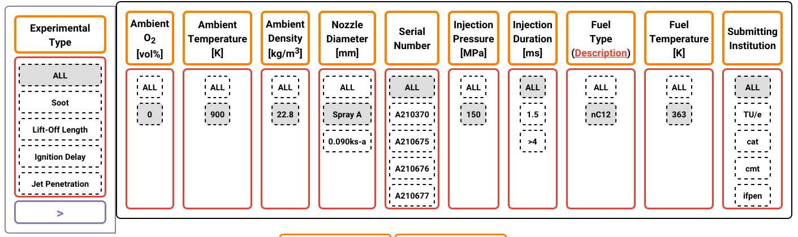
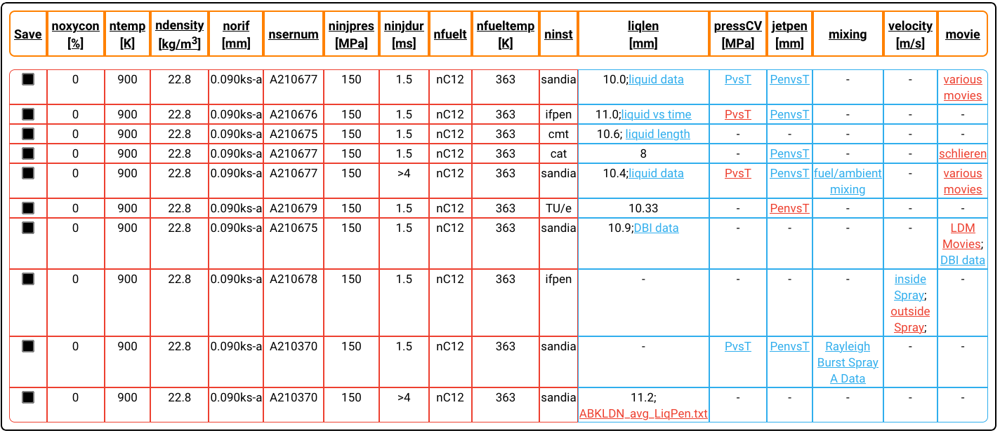
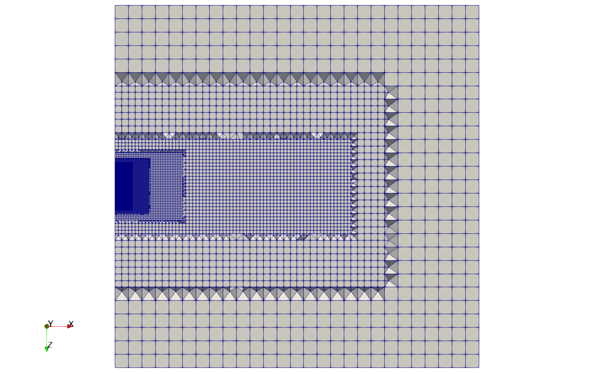
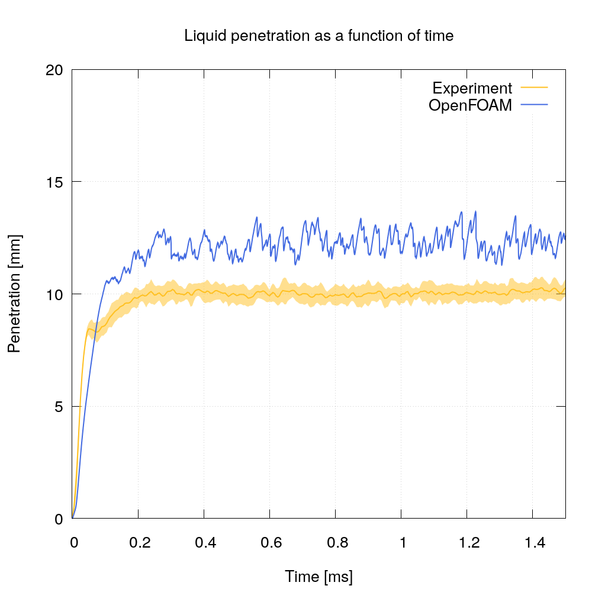
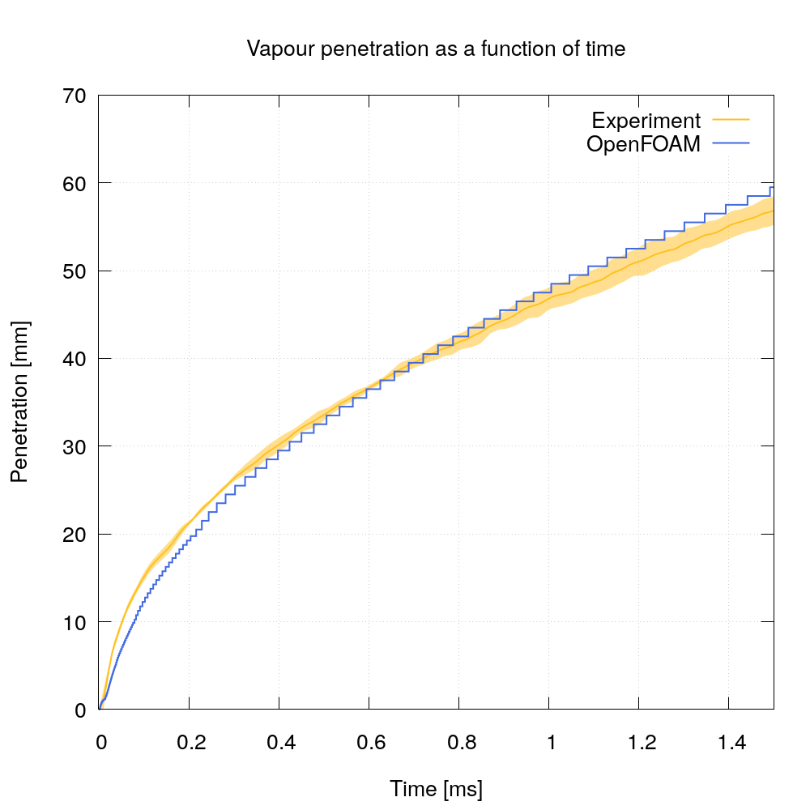

## MB18 GAS / SPRAY PENETRATION


## Authors
ESI-Group, 2023


## Copyright
Copyright (c) 2022-2023 ESI-Group

<a rel="license" href="http://creativecommons.org/licenses/by-sa/4.0/"></a><br />This work is licensed under a <a rel="license" href="http://creativecommons.org/licenses/by-sa/4.0/">Creative Commons Attribution-ShareAlike 4.0 International License</a>.


## Motivation
One of the key stakeholders in this project is FM Global, whose primary concern is fire modelling and suppression. In this micro-benchmark, we deal with the main mechanism for fire suppression, namely via water spray, by which the liquid and evaporated species are mechanisms to reduce the enclosure temperature and/or directly to suppress the fire and source. This case uses the OpenFOAM Lagrangian solver to track the spray droplets trajectory through the mesh, coupled with the flow solver in exchange of mass (phase change), momentum (droplet and continuum fluid drag forces) and energy (needed to evaporate the liquid phase)

- Validation of the following solvers within the Eulerian-Lagrangian framework
in terms of macroscopic and microscopic spray development and vaporisation:
  - [sprayFoam](https://develop.openfoam.com/Development/openfoam/-/tree/master/applications/solvers/lagrangian/sprayFoam/sprayFoam.C)


# Methodology

- The test case is based on the Engine Combustion Network
(ECN) workshop's *Spray-A* experimental configuration. ([ECN(a) (2019)](#ref1)).
- The *Spray-A* case is a basic single-hole non-reacting
spraying-into-a-closed-volume configuration; "well-characterized,
but is likely non-cavitating (and thus, unrealistic)."
([Arienti et al. (2012)](#ref2)).

#### Metrics

- The metrics to quantify the validations are ([Manin et al. (2012)](#ref3)):
  - Macroscropic spray development:
    - Liquid penetration vs time (liquid-length)
    - Vapor-phase penetration vs time
    - Mixture fraction profiles (both axial and radial)
    - Extinction profiles (both axial and radial)
  - Microscopic spray development:
    - Spray penetration and velocity in the near-field
    - Spreading angle
    - Microscopic features (fuel ligaments, droplet formation etc.)

#### Benchmarks

- The database of the experiments can be accessed through the
([ECN search engine](https://ecn.sandia.gov/ecn-data-search/)).
- The experimental configurations that were used in this study:

<p align="center">
  
</p>

- The experimental datasets that were used in this study:

<p align="center">
  
</p>

#### Definitions

**Liquid penetration:**
"Maximum distance from the nozzle outlet to the farthest axial position where
projected liquid volume in the cross-stream direction decreases to a specific
value.
The projected liquid volume is defined as
$`\mathrm{PLV} = \int \, \mathrm{LVF} dy`$, where $`\mathrm{LVF}`$ is liquid
volume fraction and $`\mathrm{PLV}`$ is projected liquid volume.
Two values for $`\mathrm{PLV}`$ are considered:" ([ECN(b) (2019)](#ref6))

```math
\int \mathrm{LVF} \, dy = 0.2\text{e-}3 \,
\text{[} \mathrm{mm}^3 \, \text{liquid} / \mathrm{mm}^2 \text{]}
```

```math
\int \mathrm{LVF} \, dy = 2.0\text{e-}3 \,
\text{[} \mathrm{mm}^3 \, \text{liquid} / \mathrm{mm}^2 \text{]}
```

In some studies, such as in ([Di Ilio et al. (2019)](#ref7), p. 7), the liquid
spray penetration "is defined as the maximum distance from the injector nozzle
to the farthest axial position where 95\% of the liquid mass is found."

**Vapor penetration:**
"Maximum distance from the nozzle outlet to where the fuel mass fraction
(or mixture fraction (author's note: if the system is reacting)) is 0.1\%."
([ECN(b) (2019)](#ref6)).


# Numerics

## Physical domain

- A constant volume vessel of cubic shape.

## Physical modelling

- Reference quantities
([ECN(a) (2019)](#ref1), ([Di Ilio et al. (2019)](#ref7), Table 2)):
  - Ambient conditions (gas):

| Metric                    | Value     |
| ---                       | ---       |
| Composition (by volume)   | $`0.00\%\,\mathrm{O}_2`$, $`6.52\%\,\mathrm{CO}_2`$, $`3.77\%\,\mathrm{H}_2\mathrm{O}`$, $`89.71\%\,\mathrm{N}_2`$ |
| Temperature               | $`\mathrm{T}_{amb} = 900 \text{[} \mathrm{K} \text{]}`$ |
| Pressure                  | $`p_{amb} \approx 6.0 \text{[} \mathrm{MPa} \text{]}`$ |
| Density                   | $`\rho_{amb} = 22.8 \text{[} \mathrm{kg}/\mathrm{m}^3 \text{]}`$ |
| Velocity                  | Near-quiescent, less than $`1 \text{[} \mathrm{m}/\mathrm{s} \text{]}`$ |

  - Injection conditions (liquid):

| Metric                    | Value     |
| ---                       | ---       |
| Fuel type     | n-dodecane ($`n\text{-}\mathrm{C}_{12}\mathrm{H}_{26}`$) |
| Fuel temperature | $`\mathrm{T}_{inj} = 363 \text{[} \mathrm{K} \text{]}`$ |
| Density       |  $`\rho = 713.13 \text{[} \mathrm{kg}/\mathrm{m}^3 \text{]}`$ |
| Injection duration(s) | $`t_{inj} = 1.5 \text{[} \mathrm{ms} \text{]}`$ and $`t_{inj} = 6 \text{[} \mathrm{ms} \text{]}`$ |
| Injection mass | $`m_{inj} = 3.56 \text{[} \mathrm{mg} \text{]}`$ |
| Injection pressure | $`m_{inj} = 150 \text{[} \mathrm{MPa} \text{]}`$ |
| Injection direction | axial |
| Discharge coefficient | $`c_{discharge} = 0.89 \text{[} \text{-} \text{]}`$ |
| Mass flow rate of injection vs time ([CMT-Motores Térmicos (n.d.)](#ref9)) | [1.5 ms](resources/massFlowRateOfInjection_1.5) |

- Derived quantities ([Di Ilio et al. (2019)](#ref7), p. 6):

| Metric                    | Value     |
| ---                       | ---       |
| Turbulent kinetic energy  | $`k = 0.735 \text{[} \mathrm{m}^2/\mathrm{s}^2 \text{]}`$ |
| Turbulent kinetic energy dissipation rate | $`\epsilon = 5.67 \text{[} \mathrm{m}^2/\mathrm{s}^3 \text{]}`$ |

#### Spray models

The officially-recommended baseline spray models
were reported in ([Manin et al. (2012)](#ref3), p. 17;
[D'Errico and Malbec (2012)](#ref5), p. 9):

| Topic                    | Model     |
| ---                      | ---       |
| RANS closure model       | RNG k-epsilon model |
| Injection | Blob injection (i.e. parcels are injected into a domain with uniform size and with a uniform spatial velocity profile whose magnitude depends on the mass flow rate.) ([Reitz and Diwakar (1987)](#ref10), p. 5493) |
| Atomisation and primary/secondary breakups | Kelvin-Helmholtz instability model and Rayleigh-Taylor accelerative instability mode (i.e. KHRT) (suggested: [Beale and Reitz (1999)](#ref11)) |
| Collision | O'Rourke model ([Amsden et al. (1989)](#ref12)) |
| Drag      |  Dynamic model ([Liu et al. (1993)](#ref13)) |
| Evaporation | Frossling model ([Frossling (1956)](#ref15)) |
| Heat transfer | Ranz-Marshall model ([Amsden (1993)](#ref16)) |
| Dispersion | Stochastic model ([Amsden (1993)](#ref16)) |

The spray models being used in this study were listed as follows:

| Topic                    | Model     |
| ---                      | ---       |
| RANS closure model       | RNG k-epsilon model |
| Injection | Injection: `coneNozzleInjection` <ul><li>Cone angle: $`22^\circ`$ ([Di Ilio et al. (2019)](#ref7), p. 4) </li></ul> |
| Atomisation and primary/secondary breakups | `ReitzKHRT`. KHRT model constants ([Di Ilio et al. (2019)](#ref7), Table 3): <ul><li>$`B_0 = 0.61`$</li><li>$`B_1 = 18`$</li><li>$`C_\tau = 1`$</li><li>$`C_{RT} = 0.1`$</li><li>$`C_b = B_1/2 = 9`$</li></ul> |
| Collision | `none` <ul><li>"...no collision model was taken into consideration since it is widely accepted that, for evaporating sprays, collision of droplets has a minor influence." ([D'Errico and Malbec (2012)](#ref5), p. 5). </li></ul> |
| Drag      | `sphereDrag` |
| Evaporation | `liquidEvaporationBoil` |
| Heat transfer | `RanzMarshall` |
| Dispersion | `stochasticDispersionRAS` |
| Size distribution | `RosinRammler` <ul><li>"The primary breakup is considered by sampling computational parcels from the Rosin–Rammler size distribution with Sauter mean diameter of $`d = 6 \mu \mathrm{m}`$." ([Kahila et al. (2019)](#ref14), p. 508).</li><li>$`D_{max} = 18 \text{[} \mu \mathrm{m} \text{]}`$</li><li>$`D_{min} = 1 \text{[} \mu \mathrm{m} \text{]}`$</li><li>$`d = 6 \text{[} \mu \mathrm{m} \text{]}`$</li><li>$`n = 3 \text{[-]}`$ ([Wehrfritz et al. (2013)](#ref17), Table 3)</li></ul> |

## Numerical domain modelling

- Dimensions: $`(\mathrm{x}, \mathrm{y}, \mathrm{z}) = (180, 180, 180) \text{[} \mathrm{mm} \text{]}`$
  - x: Longitudinal direction (mean spray direction)
  - y: Spanwise direction
  - z: Vertical direction
- Injector characteristics:
  - Number of injector holes: 1 (axial)
  - Nominal injector nozzle diameter ([Di Ilio et al. (2019)](#ref7), Table 2):
    $`D = 0.09 \text{[} \mathrm{mm} \text{]}`$

## Numerical domain discretisation

- Spatial domain discretisation: See `system/blockMeshDict`. (nref=1)
  - $`\Delta x_{min} = 0.25 \text{[} \mathrm{mm} \text{]}`$ ([Manin et al. (2012)](#ref3), p. 17) (in spray liquid core region)
  - $`\Delta x_{max} = 4.0 \text{[} \mathrm{mm} \text{]}`$
  - A side-view of the spatial domain discretisation is shown below:

<p align="center">
  
</p>

- Coaxial-cylindrical refinement regions with respect
to the injector nozzle centre (i.e. $`(0 0 0)`$),
progressively finer towards the injection hole (nref=1):

| Refinement level  | Size [mm] | Radius [mm] | Height [mm] |
| ---               | ---       | ---         | ---         |
| 0                 | 4.0       | -           | -           |
| 1                 | 2.0       | 30          | 80          |
| 2                 | 1.0       | 15          | 70          |
| 3                 | 0.5       | 10          | 20          |
| 4                 | 0.25      | 8           | 10          |
| 5                 | 0.125     | 7           | 5           |

- Temporal resolution:
  - $`\Delta t_{min} = 5\text{e-}7 \text{[} \mathrm{s} \text{]}`$ ([Manin et al. (2012)](#ref3), p. 17)
  - $`\Delta t_{min} = 2\text{e-}7 \text{[} \mathrm{s} \text{]}`$ ([Di Ilio et al. (2019)](#ref7), p. 7)

## Equation discretisation

- Spatial derivatives and variables: See `system/fvSchemes`.
- Temporal derivatives and variables: See `system/fvSchemes`.

## Numerical boundary/initial conditions

- Refer to `0.orig`.

## Pressure-velocity coupling algorithm

- PISO.

## Linear solvers

- Refer to `system/fvSolution`.

## Initialisation and sampling

- No initialisation/averaging.
- Refer to `system/controlDict` for function objects being used.

## Instructions to run the case
The setup for nref=1 (baseline) is tested in OpenFOAM v2206.

We have flexibility to scale the mesh simply by changing this (nref) parameter inside file system/parameters, and for each increment, the mesh might scale upto 8^(nref-1) than previous level.

Execution is typically a call to Allrun script with required number of processors as argument. e.g. ./Allrun 16

Selecting both nref and the number of cores gives flexibility to compare scalability. For example, one could use lower nref (1-3) to study scalability with lower core number, and go higher if larger hardware is available.

The case should build automatically according to 'nref' and number of processors requested. Any post-processing (like gnuplot) could be evaluated separately.


#### Illustrations

##### Liquid penetration vs time

<p align="center">
  
</p>

##### Vapor-phase penetration vs time

<p align="center">
  
</p>

Preliminary results are as per plots above. The liquid and vapour penetration into the initially static gas field represent an appropriate baseline validation, against which benchmarking and several refinement studies will be performed.


## Bottlenecks
The bottlenecks to be addressed in exaFOAM using the release code series OpenFOAM-vYYMM are:
  - Scalability of combined flow and lagrangian OpenFOAM solvers
  - Computational load between the continuum and discrete particle solvers (number of particles versus mesh count).
  - Load-balancing and performance benchmarking as the lagrangian particles transport in space ? computationally this will manifest as particle tracks migrating from processor to processor and an associated change in the computational load per processor.

# Discussion

- "... the breakup model constant $`B_1`$ has a significant impact on the spray
modeling, since it controls the diameter reduction of secondary droplets.
Overrated values for $`B_1`$ may lead to a reduction of breakup phenomena
and increased liquid penetration. On the contrary, too low $`B_1`$ values may
result in higher diameter reduction rate, thus leading to increased spray
disintegration and reduced liquid penetration."
([Di Ilio et al. (2019)](#ref7), p. 4)
"Inappropriate choice of this constant can lead to unrealistic prediction
of the liquid phase behavior." ([Di Ilio et al. (2019)](#ref7), p. 6)
- "We emphasize that, in general, given a set of spray model parameters,
the simulation results are not grid independent. This is well documented in
literature, and an insightful discussion is available in first ECN workshop
Proceedings. Several numerical studies have led to the conclusion that both
liquid and vapor penetrations might be significantly affected by the mesh
resolution. To a certain degree, it was also observed that time-step size
might have not negligible effects on the numerical results."
([Di Ilio et al. (2019)](#ref7), p. 6)
- "Note that these gas velocities are small when compared to liquid (high-momentum) spray velocities (~400 to 600 m/s) and therefore, have little effect on the sprays." (https://ecn.sandia.gov/diesel-spray-combustion/sandia-cv/velocity-distribution/)

- "We notice that the effect of URANS turbulence
models on liquid penetration is not pronounced."
([Di Ilio et al. (2019)](#ref7), p. 7)
- "Conversely, there is a significant discrepancy among
the vapor penetration predictions over time."
([Di Ilio et al. (2019)](#ref7), p. 8)
- "The initialization of the turbulence kinetic energy k field may
affect significantly the simulation results. ...
Liquid penetration is however never affected by the choice of
the initial field of turbulent kinetic energy."
([Di Ilio et al. (2019)](#ref7), p. 8)
- Vapour penetration was not affected by changing the `breakupModel` (e.g.
switching from `RietzKHRT` to `RietzDiwakar`) or `breakupModel`'s settings.
It was mostly affected by the `dispersionModel` and `stochasticCollisionModel`.
- Liquid penetration was mostly affected by the `breakupModel`, particularly
by `B1` coefficient.

# References

[1]<a name="ref1"></a>: Spray A&B. (2019). In National Technology and
Engineering Solutions of Sandia, LLC (NTESS). [online] Available at:
https://ecn.sandia.gov/diesel-spray-combustion/target-condition/spray-ab/
[Accessed 6 April 2021].

[2]<a name="ref2"></a>: Arienti, M., Schmidt, D. P., and Powell, C. (2012).
Internal Modeling: Summary of Needs. [online] Available at:
https://ecn.sandia.gov/workshop/ECN2/InternalFlow.pdf [Accessed 6 April 2021].

[3]<a name="ref3"></a>: Manin, J., Habchi, C., and Som, S. (2012).
Guidance on Experiments and Simulations to be Performed [online] Available at:
https://ecn.sandia.gov/workshop/ECN2/SprayDevVap.pdf [Accessed 6 April 2021].

[4]<a name="ref4"></a>: ECN2 Contributions (2019). In National Technology and
Engineering Solutions of Sandia, LLC (NTESS). [online] Available at:
https://ecn.sandia.gov/ecn2-contributions-2/ [Accessed 6 April 2021].

[5]<a name="ref5"></a>: D'Errico, G. and Malbec, L-M., (2012). Mixing and
Velocity:objectives and modellingdata collection for ECN2. [online]
Available at: https://ecn.sandia.gov/workshop/ECN2/MixingVelocity.pdf
[Accessed 6 April 2021].

[6]<a name="ref6"></a>: Modeling standards (2019). In National Technology
and Engineering Solutions of Sandia, LLC (NTESS). [online] Available at:
https://ecn.sandia.gov/diesel-spray-combustion/computational-method/modeling-standards/
[Accessed 6 April 2021].

[7]<a name="ref7"></a>: Di Ilio, G., Krastev, V., Piscaglia, F., Bella, G. (2019).
Hybrid URANS/LES turbulence modeling for spray simulation: A computational study.
SAE Techinical Paper, 2019-01-0270, p. 1-16.
DOI:10.4271/2019-01-0270

[8]<a name="ref8"></a>: Pandal, A., Pastor, J., Payri, R., Kastengren, A.,
Duke, D., Matusik, K., . . . Schmidt, D. (2017).
Computational and experimental investigation of interfacial area in near-field
diesel spray simulation.
SAE International Journal of Fuels and Lubricants, 10(2), 423-431.
DOI:10.4271/2017-01-0859

[9]<a name="ref9"></a>:
CMT-Motores Térmicos (n.d.). Virtual injection rate generator. Universitat
Politècnica de València. [online] Available at:
https://www.cmt.upv.es/ECN03.aspx [Accessed 7 April 2021].

[10]<a name="ref10"></a>:
Reitz, R. D., & Diwakar, R. (1987).
Structure of high-pressure fuel sprays. SAE transactions, 492-509.
SAE:870598. https://www.jstor.org/stable/44718226

[11]<a name="ref11"></a>:
Beale, J. C., & Reitz, R. D. (1999).
Modeling spray atomization with
the Kelvin-Helmholtz/Rayleigh-Taylor hybrid model.
Atomization and sprays, 9(6).

[12]<a name="ref12"></a>:
Amsden, A. A., O'Rourke, P. J., & Butler, T. D. (1989).
KIVA-II: A computer program for chemically reactive flows with sprays.
No. LA-11560-MS. Los Alamos National Lab.(LANL), Los Alamos, NM (United States).
DOI:10.2172/6228444

[13]<a name="ref13"></a>:
Liu, A. B., Mather, D., & Reitz, R. D. (1993).
Modeling the effects of drop drag and breakup on fuel sprays.
SAE Transactions, 83-95.
https://www.jstor.org/stable/44611358

[14]<a name="ref14"></a>:
Kahila, H., Kaario, O., Ahmad, Z., Masouleh, M. G.,
Tekgül, B., Larmi, M., & Vuorinen, V. (2019).
A large-eddy simulation study on the influence of diesel
pilot spray quantity on methane-air flame initiation.
Combustion and Flame, 206, 506-521.
DOI:10.1016/j.combustflame.2019.05.025

[15]<a name="ref15"></a>:
Frossling, N. (1956).
Evaporation, heat transfer, and velocity distribution in two-dimensional
and rotationally symmetrical laminar boundary-layer flow.
NACA, Technical report, ADB1891.

[16]<a name="ref16"></a>:
Amsden, A. A. (1993).
KIVA-3: A KIVA program with block-structured mesh for complex geometries.
No. LA-12503-MS. Los Alamos National Lab., NM (United States).
https://www.osti.gov/biblio/6605386

[17]<a name="ref17"></a>:
Wehrfritz, A., Vuorinen, V., Kaario, O., & Larmi, M. (2013).
Large eddy simulation of high-velocity fuel sprays:
Studying mesh resolution and breakup model effects for spray A.
Atomization and Sprays, 23(5).
DOI:[10.1615/AtomizSpr.2013007342](https://doi.org/10.1615/AtomizSpr.2013007342)


## Acknowledgment
  - B. Tekgül, P. Peltonen, H. Kahila, O. Kaario, V. Vuorinen, DLBFoam: An open-source dynamic load balancing model for fast reacting flow simulations in OpenFOAM, Computer Physics Communications, Volume 267, DOI: [10.1016/j.cpc.2021.108073](https://doi.org/10.1016/j.cpc.2021.108073) (2021).

  - I. Morev, B. Tekgül, M. Gadalla, A. Shahanaghi, J. Kannan, S. Karimkashi, O. Kaario, V. Vuorinen, Fast reactive flow simulations using
analytical Jacobian and dynamic load balancing in OpenFOAM, Physics of Fluids 34, 021801, DOI: [10.1063/5.0077437](https://doi.org/10.1063/5.0077437) (2022).

  - This application has been developed as part of the exaFOAM Project https://www.exafoam.eu, which has received funding from the European High-Performance Computing Joint Undertaking (JU) under grant agreement No 956416. The JU receives support from the European Union's Horizon 2020 research and innovation programme and France, Germany, Italy, Croatia, Spain, Greece, and Portugal.


