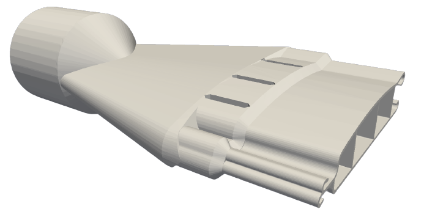
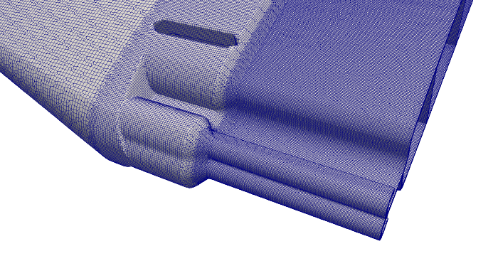
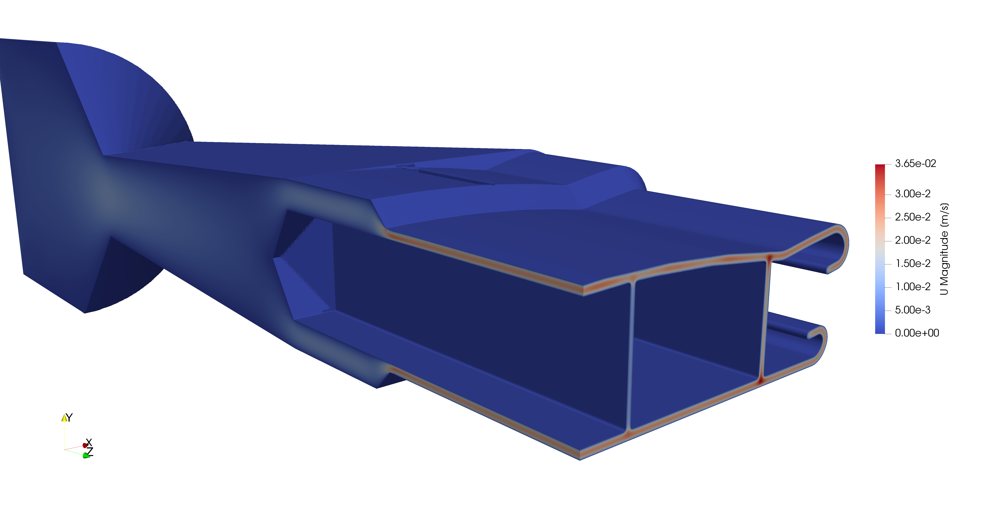
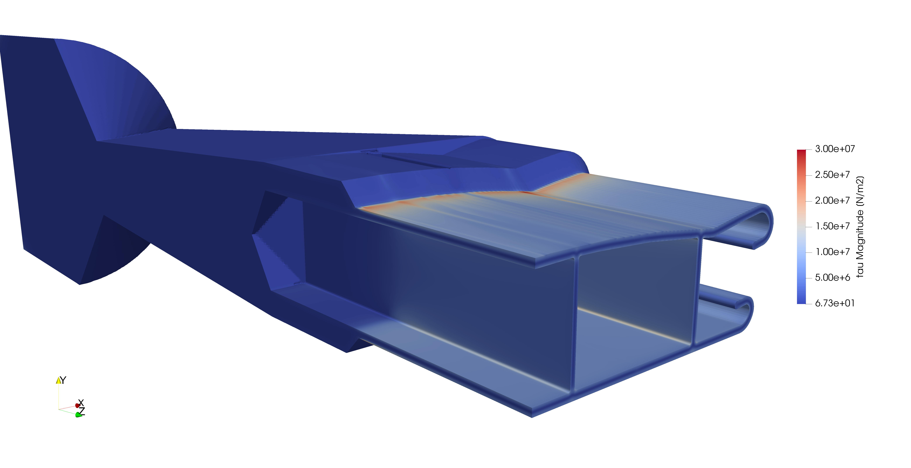

# Viscoelastic Complex Profile Extrusion

## Authors

Author: Ricardo Costa (UMinho)

Reviser: Miguel Nóbrega (UMinho)

## Copyright

Copyright (c) 2022-2023 University of Minho

 This work is licensed under a <a rel="license" href="http://creativecommons.org/licenses/by-sa/4.0/">Creative Commons Attribution-ShareAlike 4.0 International License</a>.

## OpenFOAM branch/version

foam-extend 4.1

## Description

The computational resources required to perform numerical simulations of the thermoplastic profile extrusion process, considering viscoelastic constitutive models for the polymer melt, are incompatible with the current industry demands. Therefore, this benchmark case study aims to assess the viscoelasticFluidFoam solver implemented in foam-extend-4.1 and employed in the numerical simulation of incompressible fluid flows with non-linear viscoelastic constitutive models. A realistic and intricate profile extrusion die geometry provided by the exaFOAM supporter Soprefa properly represents the typical industrial complexity and scale of the process and its numerical simulation with unstructured meshes that can easily comprise up to 40 million cells. Initial exploratory studies for the same solver, considering a simplified geometry and less demanding meshes, can be undertaken with microbenchmark MB19.

## Custom GiesekusIBSD viscoelastic constitutive model

This benchmark requires a custom viscoelastic constitutive model, named GiesekusIBSD,  where a stabilization procedure (improved both sides diffusion) is implemented, which should be compiled before running the case study, as follows:

1. Source a foam-extend 4.1 installation.
2. Change the directory to "src".
2. Execute "./Allwmake".

## Geometry

The geometry for this benchmark study, the flow channel of a profile extrusion die, is illustrated in Figure 1 and comprises an inlet, an outlet, and solid walls. The circular inlet represents the connection with the extruder machine, which pushes the molten polymer. The outlet cross-section has the shape of a pool cover, produced by Soprefa, and represents the end of the flow channel. The middle of the geometry comprises a convergent zone, which performs the transition between the circular inlet and the complex-shaped outlet.

Figure 1. Benchmark geometry.

## Material Properties

The material considered is representative of a thermoplastic polymer modelled with a viscoelastic multimode Giesekus constitutive model with five modes [1,2].

## Boundary Conditions

The initial and boundary conditions considered in this benchmark case study are presented in Table 1.

Table 1. Benchmark initial and boundary conditions.

| | | | Variables | |
|--|--|--|--|--|
| | |Velocity - U [m/s] |Pressure - p [Pa]|Stress - tau [Pa]|
| Initial Conditions | Type | uniform | uniform | uniform |
|  | Value | (0 0 0) | 0 | (0 0 0 0 0 0) |
| Inlet | Type  | fixedValue | zeroGradient  | fixedValue |
|  | Value | uniform (0 0 2.03E-04) | - | uniform (0 0 0 0 0 0) |
| Outlet | Type  | zeroGradient  | fixedValue | zeroGradient  |
|  | Value | - | uniform (0 0 0 ) | - |
| Walls | Type  | fixedValue | zeroGradient | zeroGradient  |
|  | Value | uniform (0 0 0) | - | - |

## Meshes

The geometry is discretized with non-orthogonal unstructured meshes generated with the cfMesh utility [3]. In this benchmark case study, two meshes are considered comprising 20 million and 40 million cells, having three different refinement regions to accommodate better the larger gradients expected as the polymer melt flows through the extrusion die. The coarsest mesh is shown in Figure 2.

Figure 2. Benchmark coarsest mesh.

## Results

The numerical distribution of pressure, velocity and stress are shown in Figure 3. The accuracy of the calculations can be assessed by the distribution of pressure, velocity and stress components along the 3D domain, the velocity and stress distributions at the outlet cross-section and the average pressure at the inlet.

Figure 3. Benchmark numerical solution.

## Files

exaFOAM WP2 repository: https://develop.openfoam.com/exafoam/wp2-validation/-/tree/master/viscoelastic/viscoelasticFluidFoam/complexProfileExtrusion

## Case folders

For a fixed relative/absolute tolerance for residual convergence criteria, the following case folders are included:
* 10M_fixedTol - Mesh with 10 million cells.
* 40M_fixedTol - Mesh with 40 million cells.

For a fixed number of inner iterations for residual convergence criteria, the following case folders are included:
* 10M_fixedIter - Mesh with 10 million cells.
* 40M_fixedIter - Mesh with 40 million cells.

For the *fixedIter* cases, the fixed number of iterations chosen is representative of the solver's behaviour with a more evolved solution and, thus, restarting files should be applied. Suitable restarting files and associated meshes are provided at the DaRUS repository (https://doi.org/10.18419/darus-3797), which were obtained by running the same case with a fixed relative/absolute tolerance for a few seconds of physical time.

## Running the simulations

Check the README.md file inside each case folder.

## Acknowledgment

This application has been developed as part of the exaFOAM Project https://www.exafoam.eu, which has received funding from the European High-Performance Computing Joint Undertaking (JU) under grant agreement No 956416. The JU receives support from the European Union's Horizon 2020 research and innovation programme and France, Germany, Italy, Croatia, Spain, Greece, and Portugal.

## Dissemination Plan

The case can be made available with public access.

## References

[1] J. Azaiez, R. Guénette, A. Ait-Kadi, Entry flow calculations using multi-mode models, Journal of Non-Newtonian Fluid Mechanics, 66(2-3), 271–281, 1996.

[2] H. Giesekus, A simple constitutive equation for polymer fluids based on the concept of deformation dependent tensorial mobility, Journal of Non-Newtonian Fluid Mechanics 11(1-2), 69-109, 1982.

[3] F. Juretić, cfMesh User Guide (v1.1), Zagreb, Croatia, 2015.
