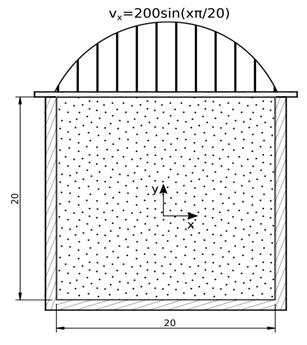
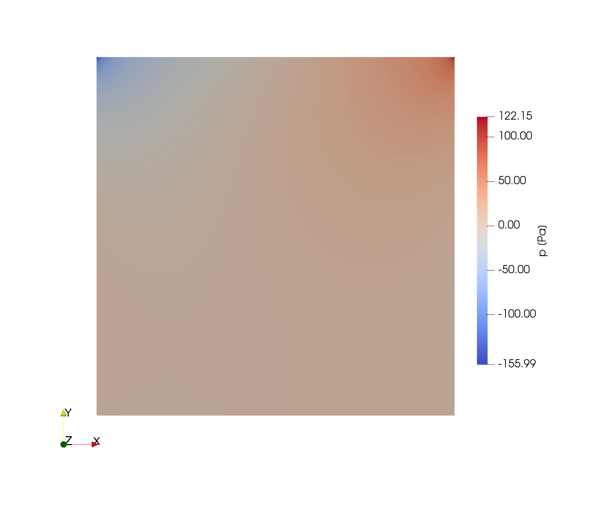
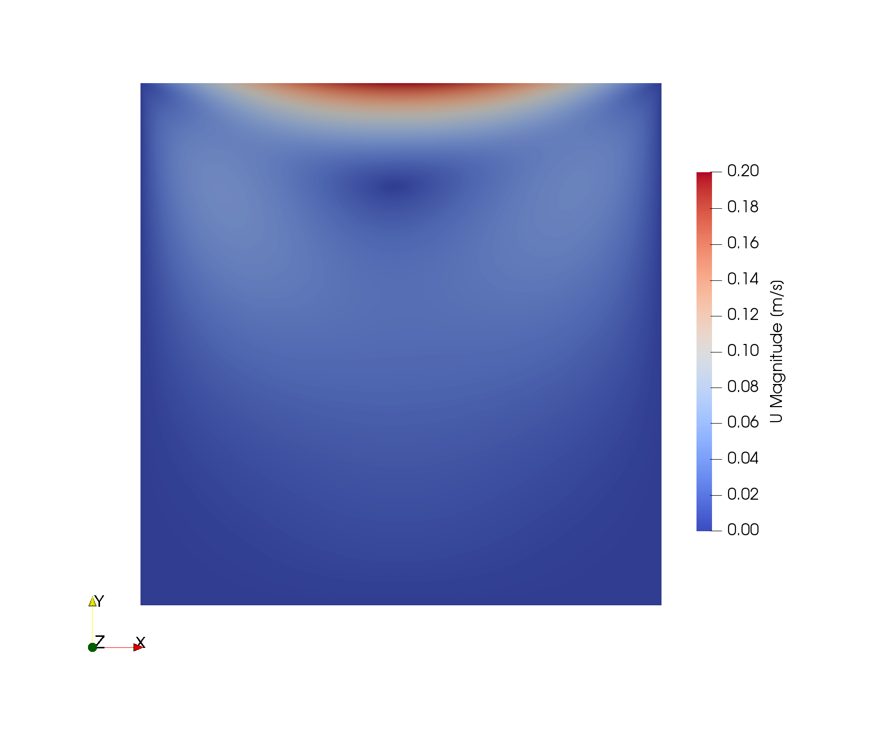
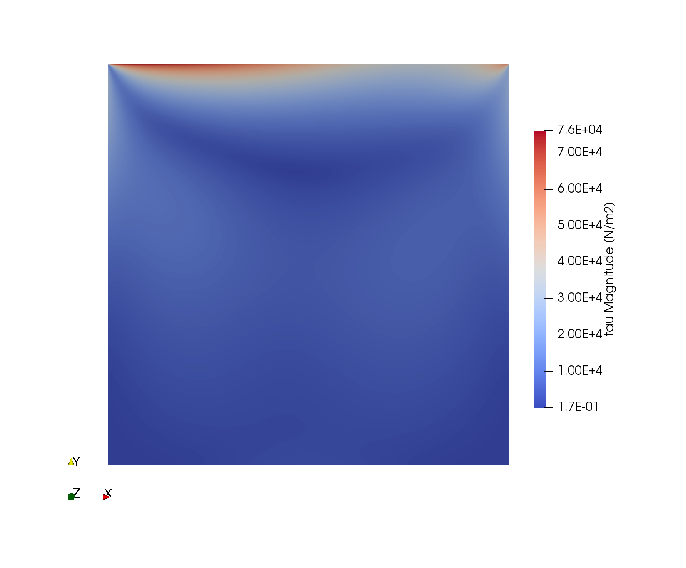

# Viscoelastic Lid-driven Cavity

## Authors

Author: Bruno Martins and Ricardo Costa (UMinho)

Reviser: Miguel Nóbrega (UMinho)

## Copyright

Copyright (c) 2022-2023 University of Minho

 This work is licensed under a <a rel="license" href="http://creativecommons.org/licenses/by-sa/4.0/">Creative Commons Attribution-ShareAlike 4.0 International License</a>.

## OpenFOAM branch/version

foam-extend 4.1

## Description

The lid-driven cavity is a well-known benchmark for assessing computational methods. The interest in using a lid-driven cavity as a microbenchmark to evaluate the solver's computational performance is related to its simple geometry and orthogonal meshes, which will allow the study of the solver's numerical implementation, without having to deal with issues pertaining to non-orthogonal meshes. The well-known singularities in this example can help study the precision of the discretization methods implemented. The problem is modelled considering the isothermal and incompressible 2D flow of a non-linear viscoelastic fluid. The solver employed is the viscoelasticFluidFoam, available in foam-extend 4.1.

## Geometry

The cavity considered is a square of 20mm, which resembles the cross-section of an extruder employed to process thermoplastic polymers. At the top lid, a sinusoidal velocity is applied, with a maximum speed of 200 m/s at the centre, as shown in Figure 1.  

Figure 1. Microbenchmark geometry (dimensions in mm).

## Material Properties

The material considered is representative of a thermoplastic polymer modelled with a viscoelastic multimode Giesekus constitutive model (Azaiez et al. 1996, Giesekus 1982), which comprises six modes.   

## Initial and Boundary Conditions

This microbenchmark has fixed lateral and bottom walls and a top lid with a variable tangential velocity. Table 1 presents the initial and boundary conditions employed in the problem. The sinWallVelocity boundary condition is provided with the case study (see details in the next Point).

| | | | Variables | |
|--|--|--|--|--|
| | |Velocity - U [m/s] |Pressure - p [Pa]|Stress - Tau [Pa]|
| Initial Conditions | Type | uniform | uniform | uniform |
|  | Value | (0 0 0) | 0 | (0 0 0 0 0 0) |
| movingWall  | Type  | sinWallVelocity | zeroGradient  | zeroGradient  |
|  | Value | - | - | - |
| fixedWalls | Type  | fixedValue | zeroGradient | zeroGradient  |
|  | Value | uniform (0 0 0) | - | - |

Table 1. Initial and boundary conditions.

## The custom sinWallVelocity boundary condition

To run the cases a new sinWallVelocity boundary condition is required, and it must be compiled prior to running the case as follows:

1. Source a foam-extend 4.1 installation.
2. Change the directory to "src".
2. Execute "./Allwmake".

## Computational Mesh

Three Cartesian structured meshes were prepared for this case study, comprising 1000x1000 (1M), 2000x2000 (4M) and 4000x4000 (16M) cells, which should be generated using the blockMesh utility.

## Results

The numerical distribution of pressure, velocity and stress are shown in Figure 2. The the accuracy of the calculations can be assessed by the distribution of pressure, velocity and stress components along the lines x=0 and y=0 and the two diagonals.

Figure 2. Microbenchmark numerical solution.

## Files

exaFOAM WP2 repository
https://develop.openfoam.com/exafoam/wp2-validation/-/tree/master/viscoelastic/viscoelasticFluidFoam/lidDrivenCavity

## Case folders

For a fixed relative/absolute tolerance for residual convergence criteria, the following case folders are included:
* 1M_fixedTol - Mesh with 1 million cells.
* 4M_fixedTol - Mesh with 4 million cells.
* 16M_fixedTol - Mesh with 16 million cells.

For a fixed number of inner iterations for residual convergence criteria, the following case folders are included:
* 1M_fixedIter - Mesh with 1 million cells.
* 4M_fixedIter - Mesh with 4 million cells.
* 16M_fixedIter - Mesh with 16 million cells.

For the *fixedIter* cases, the fixed number of iterations chosen is representative of the solver's behaviour with a more evolved solution and, thus, restarting files should be applied. Suitable restarting files and associated meshes are provided at the DaRUS repository (XXXX), which were obtained by running the same case with a fixed relative/absolute tolerance for a few seconds of physical time.

## Running the simulations

Check the README.md file inside each case folder.

## Acknowledgment

This application has been developed as part of the exaFOAM Project https://www.exafoam.eu, which has received funding from the European High-Performance Computing Joint Undertaking (JU) under grant agreement No 956416. The JU receives support from the European Union's Horizon 2020 research and innovation programme and France, Germany, Italy, Croatia, Spain, Greece, and Portugal.

## Dissemination Plan

The case can be made available with public access.

## References

[1] J. Azaiez, R. Guénette, A. Ait-Kadi, Entry flow calculations using multimode models, Journal of Non-Newtonian Fluid Mechanics, 66(2-3), 271–281, 1996.

[2] H. Giesekus, A simple constitutive equation for polymer fluids based on the concept of deformation dependent tensorial mobility, Journal of Non-Newtonian Fluid Mechanics 11(1-2), 69-109, 1982.
