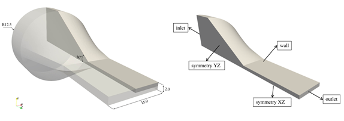
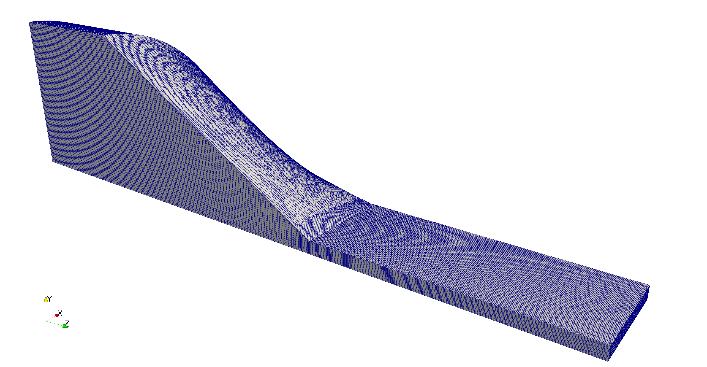
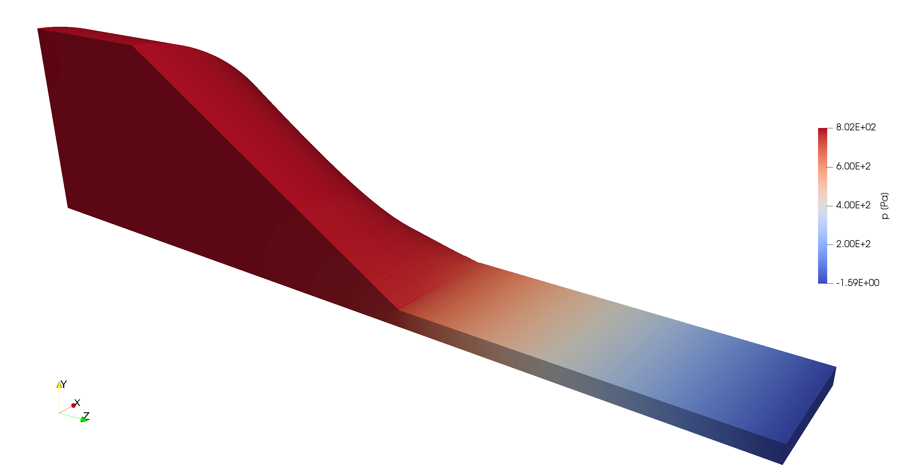
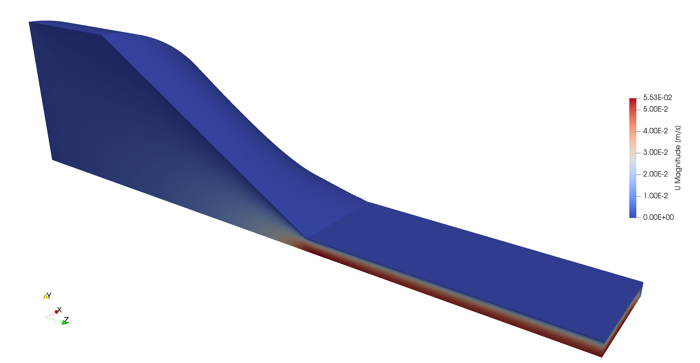
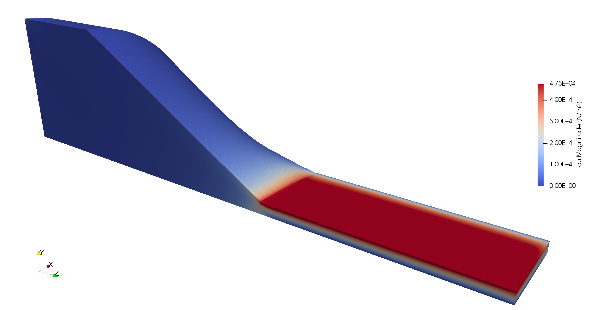

# Viscoelastic Profile Extrusion

## Authors

Author: Gabriel Magalhães, Bruno Martins and Ricardo Costa (UMinho)

Reviser: Miguel Nóbrega (UMinho)

## Copyright

Copyright (c) 2022-2023 University of Minho

 This work is licensed under a <a rel="license" href="http://creativecommons.org/licenses/by-sa/4.0/">Creative Commons Attribution-ShareAlike 4.0 International License</a>.

## OpenFOAM branch/version

foam-extend 5.0

## Description

The computational time required to perform a numerical simulation of profile extrusion forming, considering more realistic (viscoelastic) constitutive models, is incompatible with the industrial requirements. This microbenchmark case study mimics a typical profile extrusion problem and aims at assessing the solvers available in OpenFOAM, namely viscoelasticFluidFoam integrated into foam-extend 5.0. Due to the simplified geometry employed, the computational meshes required to obtain accurate results will be much smaller than those of the associated industrial scale case study. This should allow performing initial exploratory studies. Thus, the results obtained are expected to give insights into improving the viscoelasticFluidFoam solver.   

## Geometry

The geometry proposed in this study resembles a typical profile extrusion die. It has a circular inlet with a radius of 12.5mm, which connects to the extruder, and a rectangular outlet that allows manufacturing a profile with a rectangular cross-section of 15x2 mm. The middle of the channel comprises a convergent zone, which performs the transition between the circular inlet and the rectangular outlet. As illustrated in Figure 1, due to symmetry, just a quarter of the geometry was considered for the numerical studies.

Figure 1. Microbenchmark geometry.

## Material Properties

The material considered is representative of a thermoplastic polymer modelled with a viscoelastic multimode Giesekus constitutive model [1,2], which comprises six modes.

## Initial and Boundary Conditions

The boundary and initial conditions employed in the case study are presented in Table 1. Due to the symmetry of this simplified geometry, appropriate symmetry planes are defined.

Table 1. Microbenchmark initial and boundary conditions.

| | | | Variables | |
|--|--|--|--|--|
| | |Velocity - U [m/s] |Pressure - p [Pa]|Stress - Tau [Pa]|
| Initial Conditions | Type | uniform | uniform | uniform |
|  | Value | (0 0 0) | 0 | (0 0 0 0 0 0) |
| inlet | Type  | fixedValue | zeroGradient  | fixedValue |
|  | Value | uniform (0 0 2.03e-03) | - | uniform (0 0 0 0 0 0) |
| outlet | Type  | zeroGradient  | fixedValue | linearExtrapolation  |
|  | Value | - | uniform (0 0 0 ) | - |
| wall | Type  | fixedValue | zeroGradient | linearExtrapolation  |
|  | Value | uniform (0 0 0) | - | - |
| symmetryXZ | Type  | symmetryPlane | symmetryPlane | symmetryPlane |
|  | Value | - | - | - |
| symmetryYZ | Type  | symmetryPlane | symmetryPlane | symmetryPlane |
|  | Value | - | - | - |

When using the coupled solvers (semi-coupled or fully-coupled) a modification is necessary for the symmetry planes as shown in Table 2.

Table 2. Microbenchmark boundary conditions for symmetry planes when using coupled viscoelastic solvers.

| | | | Variables | |
|--|--|--|--|--|
| | |Velocity - U [m/s] |Pressure - p [Pa]|Stress - Tau [Pa]|
| symmetryXZ | Type  | blockSymmPlane | zeroGradient | linearExtrapolation |
|  | Value | - | - | - |
| symmetryYZ | Type  | blockSymmPlane | zeroGradient | linearExtrapolation |
|  | Value | - | - | - |

Besides the boundary conditions, it is necessary to build the symmetry planes as general patches (type patch) when generating the mesh for the coupled solvers.

NOTE: all the considerations for the particular cases are did in the script [generateCase](../generateCase.sh)

## Computational Mesh

The geometry is discretized with non-orthogonal unstructured meshes generated with the cfMesh utility [3]. In this benchmark case study, two meshes are considered comprising 1 million and 20 million cells, having two different refinement regions to accommodate better the larger gradients expected at the narrower section of the extrusion die. The coarsest mesh is shown in Figure 2.

Figure 2. Microbenchmark coarsest mesh.

## Mesh and Restart Files

In order to enable restarts, meshes and corresponding developed fields are provided on the DaRUS data repository under: https://doi.org/10.18419/darus-3799

## Case folders

For a fixed relative/absolute tolerance for residual convergence criteria, tthe following cases are possible:
* 1M_fixedTol - Mesh with 1 million cells.
* 20M_fixedTol - Mesh with 20 million cells.

For a fixed number of inner iterations for residual convergence criteria, the following cases are possible:
* 1M_fixedIter - Mesh with 1 million cells.
* 20M_fixedIter - Mesh with 20 million cells.

## Running the simulations

1. Change the directory to the desired case folder.
2. Execute "./Allrun.pre".
3. Execute "./Allrun".

### Additional notes:

1. The case is prepared using the script [generateCase](../generateCase.sh). The configurations about number of processes, solution control, solver and mesh are defined in this script. After the execution a new folder is generated for the case using the configuration specified by the user. More details in the [general README](../README.md).

2. All cases have a restart file to start the simulation in a specified timestep, for which the calculation procedure is more stable and thus more representative of the total run time. The complete case study with the calculation files can be obtained at the E4 cluster in folder “/data/exafoam/wp2-validation/macrobenchmarks/viscoelastic/complexProfileExtrusion”.

3. The version of the case study stored in this repository is prepared to generate the mesh, decompose the data and start the simulation from the latest time.

## Results

The numerical distribution of pressure, velocity and stress are shown in Figure 3. The accuracy of the calculations can be assessed by the distribution of pressure, velocity and stress components along the 3D domain, the velocity and stress distributions at the outlet cross-section and the average pressure at the inlet. 

Figure 3. Microbenchmark numerical solution.

## Acknowledgment

This application has been developed as part of the exaFOAM Project https://www.exafoam.eu, which has received funding from the European High-Performance Computing Joint Undertaking (JU) under grant agreement No 956416. The JU receives support from the European Union's Horizon 2020 research and innovation programme and France, Germany, Italy, Croatia, Spain, Greece, and Portugal.

## Dissemination Plan

The case can be made available with public access.

## References

[1] J. Azaiez, R. Guénette, A. Ait-Kadi, Entry flow calculations using multi-mode models, Journal of Non-Newtonian Fluid Mechanics, 66(2-3), 271–281, 1996.

[2] H. Giesekus, A simple constitutive equation for polymer fluids based on the concept of deformation dependent tensorial mobility, Journal of Non-Newtonian Fluid Mechanics 11(1-2), 69-109, 1982.

[3] F. Juretić, cfMesh User Guide (v1.1), Zagreb, Croatia, 2015.
